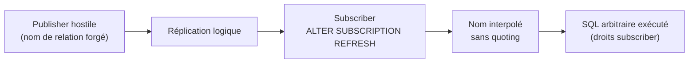
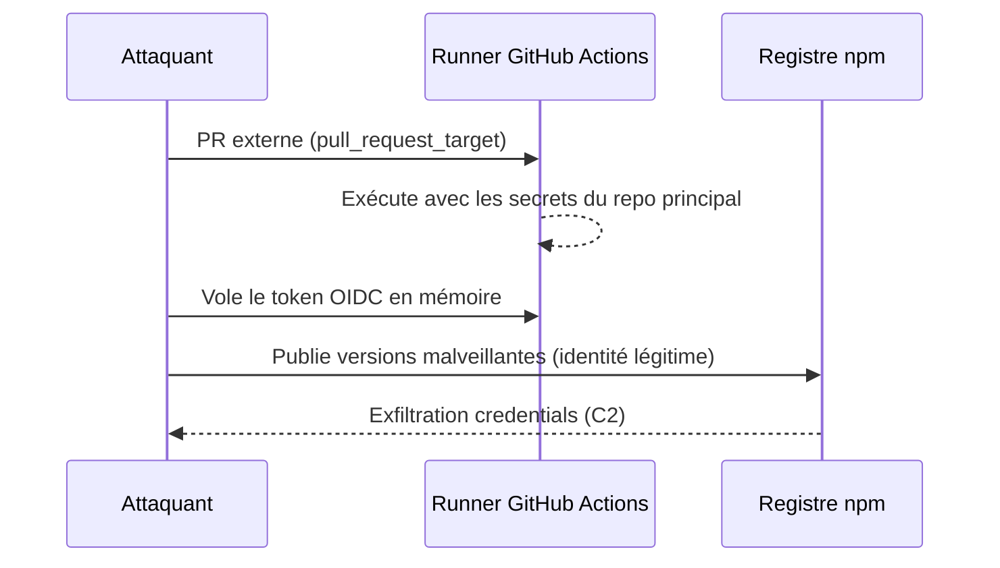
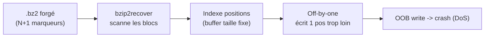
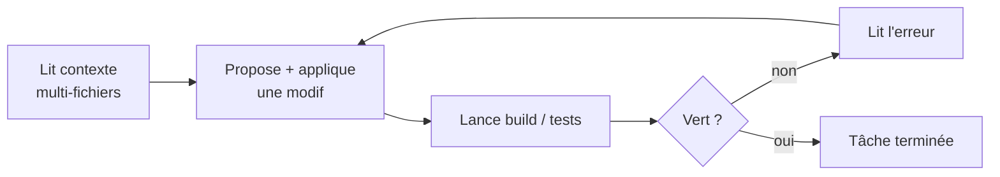

# Tech — Détail du vendredi 29 mai 2026

## 1. PostgreSQL 18.4 — 11 CVE corrigées, dont fuite de timing MD5 et injection SQL logical replication

**Source :** PostgreSQL News — https://www.postgresql.org/about/news/postgresql-184-1710-1614-1518-and-1423-released-3297/
**Date :** 14 mai 2026

### Contexte

Release de routine pour les branches `18`, `17`, `16`, `15`, `14` — mais l'addition de **11 CVE** en une seule release est inhabituelle. Plusieurs touchent des chemins d'authentification ou de réplication qui se retrouvent souvent en bord d'Internet.

À noter aussi : **PostgreSQL 14 perd son support le 12 novembre 2026**. Si tu es encore dessus en prod, c'est ta dernière saison de patches — planifie l'upgrade maintenant.

### Comment ça marche

Deux failles méritent qu'on déroule le mécanisme. Le **timing channel MD5** : la comparaison du hash en authentification n'est pas à temps constant. En mesurant les écarts de réponse, un attaquant reconstitue progressivement assez d'information pour s'authentifier. `scram-sha-256` (défaut depuis longtemps) n'est **pas** affecté.

L'**injection SQL dans `ALTER SUBSCRIPTION ... REFRESH PUBLICATION`** : les noms de schéma et de relation provenant du publisher étaient interpolés sans quoting dans des commandes exécutées côté subscriber. Un publisher hostile injecte du SQL arbitraire qui s'exécute avec les droits du subscriber.



S'ajoutent un **DoS par récursion** dans la négociation SSL/GSS (exploitable via socket AF_UNIX), des **path traversal** dans plusieurs binaires écrivant sans valider le chemin de sortie, des injections SQL secondaires en contrib, et `tzdata 2026b`.

### En pratique — exemple de code

Audite tes rôles MD5 et coupe la primitive d'écriture fichier. La mise à jour est binary-only, sans dump/reload.

```sql
-- 1. Quels rôles utilisent encore MD5 (vulnérable au timing channel) ?
SELECT usename FROM pg_shadow WHERE passwd LIKE 'md5%';

-- 2. Force scram-sha-256 (avoir password_encryption = scram-sha-256 dans postgresql.conf)
ALTER ROLE app_user PASSWORD 'nouveau_mot_de_passe_fort';
-- Le nouveau hash sera SCRAM ; vérifie : SELECT passwd LIKE 'SCRAM-SHA-256%' ...

-- 3. Principe du moindre privilège côté réplication / écriture fichier
REVOKE pg_write_server_files FROM app_user;
```

```bash
# Mise à jour binaire (pas de dump/reload) — exemple Debian/Ubuntu
apt-get update && apt-get install --only-upgrade postgresql-18
systemctl restart postgresql      # branches 18.4 / 17.10 / 16.14 / 15.18 / 14.23
```

### Pourquoi ça compte pour toi

Si tu gères du PostgreSQL en prod, patche immédiatement : c'est binary-only, pas de migration de données. Audite `pg_shadow` pour les rôles `md5%` et force `scram-sha-256`. Si tu fais de la logical replication entre orgs, traite l'injection SQL `REFRESH PUBLICATION` comme une urgence — un publisher tiers compromis exécute du SQL chez toi. Et planifie l'EOL de PostgreSQL 14 (novembre 2026).

### Points de vigilance

Teste l'upgrade en staging avec ta version exacte d'extensions tierces — TimescaleDB, PostGIS, pgvector peuvent imposer leurs propres contraintes de compatibilité. Le DoS SSL/GSS reste exploitable même sans exposition TCP directe via le socket local : il ne suffit pas de fermer le port.

---

## 2. CISA KEV — TanStack, Nx Console et DAEMON Tools confirmés activement exploités

**Source :** CISA — https://www.cisa.gov/news-events/alerts/2026/05/27/cisa-adds-three-known-exploited-vulnerabilities-catalog
**Date :** 27 mai 2026

### Contexte

Le Known Exploited Vulnerabilities catalog (KEV) de la CISA liste les vulnérabilités à exploitation active confirmée. **Trois ajouts d'un coup, tous supply-chain**, c'est très inhabituel — et les trois touchent directement les développeurs.

L'attaque Nx Console avait déjà été analysée dans le digest du 27/05. Aujourd'hui, c'est la confirmation officielle CISA : le statut passe en obligation de patch pour les agences fédérales US et accélère le triage côté privé.

### Comment ça marche

Le cas **TanStack (CVE-2026-45321, CVSS 9.5)** illustre une chaîne d'attaque CI devenue récurrente en 2026 : la compromission via `pull_request_target` mal configuré. Le mécanisme se déroule en quatre temps.

Un attaquant ouvre une **PR externe** sur le repo cible. Le workflow déclenché par `pull_request_target` s'exécute avec les **secrets du repo principal**, mais sur du code venant de la PR. L'attaquant vole alors le **token OIDC** depuis la mémoire du runner. Avec ce token, il publie des versions malveillantes (ici 84) sous l'identité légitime du projet sur npm. Le malware exfiltre ensuite credentials npm, env et AWS vers un C2.



Les deux autres ajouts : **Nx Console** (fausse extension VS Code, déjà couverte) et **DAEMON Tools Lite (CVE-2026-8398)** — code malveillant embarqué dans l'installer Windows distribué officiellement.

### En pratique — exemple de code

Durcis tes workflows et vérifie tes lockfiles. Le défaut `read-all` + `id-token: write` scopé strictement coupe le vecteur OIDC.

```yaml
# Workflow durci : permissions minimales, pas de pull_request_target pour le code externe
on:
  workflow_dispatch:           # préférer à pull_request_target pour les checks risqués
permissions: read-all          # défaut restrictif
jobs:
  publish:
    permissions:
      contents: read
      id-token: write          # uniquement où c'est strictement nécessaire
    steps:
      - run: npm audit signatures   # vérifie la provenance Sigstore
```

```bash
# Triage côté poste/CI
npm audit signatures                      # provenance des packages installés
npm ci --ignore-scripts                   # build sans hooks si build CI douteux
# Nx Console : désinstaller, puis réémettre gh / npm token / azure cli si doute
```

### Pourquoi ça compte pour toi

Action du jour : `npm audit signatures` sur tes lockfiles, recherche des versions TanStack listées dans l'advisory, et `npm ci --ignore-scripts` si tu doutes de tes builds CI. Désinstalle Nx Console et réémets les tokens qui transitaient par ces postes (`gh`, npm, azure cli). C'est aussi l'argument décisif pour imposer un scoping strict de l'audience OIDC dans tous tes workflows GitHub Actions.

### Détails techniques

Le pattern `pull_request_target` est piégeux : il donne au runner les secrets du repo principal tout en exécutant du code d'une PR externe. Mitigation : `permissions: read-all` par défaut, `id-token: write` uniquement où c'est requis, et `workflow_dispatch` plutôt que `pull_request_target` pour les checks à risque sur du code non approuvé.

---

## 3. bzip2 CVE-2026-42250 — Off-by-one dans bzip2recover, OOB write

**Source :** CERT Polska — https://cert.pl/en/posts/2026/05/CVE-2026-42250/
**Date :** 28 mai 2026

### Contexte

`bzip2` reste embarqué partout : paquets `.deb`, archives `.tar.bz2`, drivers kernel, builds système. Le binaire `bzip2recover` extrait des blocs depuis une archive corrompue — typiquement appelé en récupération automatique.

Un **off-by-one** dans son parsing permet à un fichier `.bz2` forgé de déclencher un **OOB write** (CWE-787) sur un buffer global. Conséquence à ce stade : crash du binaire (DoS), pas d'exécution de code arbitraire démontrée. Reporters : Michał Majchrowicz et Marcin Wyczechowski (AFINE Team).

### Comment ça marche

`bzip2recover` scanne l'archive pour repérer les marqueurs de début de bloc compressé, puis indexe leurs positions dans un buffer global de taille fixe. L'erreur off-by-one se situe dans le calcul de borne de cet index.

Un fichier forgé contenant un nombre de marqueurs juste au-delà de la capacité prévue fait écrire un élément **une position trop loin** — au-delà de la fin de l'allocation. C'est l'OOB write. Le binaire corrompt de la mémoire adjacente et plante. Le fix (commit `35d122a3df8b0cc4082a4d89fdc6ee99f375fe67`) corrige la borne ; **toutes les versions < 1.0.9** sont affectées, 1.0.9 contient le correctif.



### En pratique — exemple de code

Patche, et isole le traitement d'archives non fiables — ne pipe jamais de contenu utilisateur dans un binaire obsolète.

```bash
# 1. Suis-je vulnérable ? (< 1.0.9)
bzip2 --version 2>&1 | head -1

# 2. Correctif : forcer 1.0.9 dès que ta distro la publie
apt list --upgradable 2>/dev/null | grep -i bzip2
apt-get update && apt-get install --only-upgrade bzip2   # vise bzip2 >= 1.0.9

# 3. Durcissement : sandbox la récupération d'archives uploadées
#    (limites mémoire + pas de réseau + FS read-only)
systemd-run --scope -p MemoryMax=128M --pty \
  bzip2recover /tmp/untrusted/archive.bz2
```

### Pourquoi ça compte pour toi

Si un service backend pipe du contenu utilisateur dans `bzip2recover` (récupération de backups, parsing d'archives uploadées), traite-le comme une vuln à patcher. Force `bzip2 >= 1.0.9` dans tes images Docker dès publication Debian/Ubuntu, et surveille `apt list --upgradable | grep bzip`. Isole la décompression d'archives non fiables (sandbox, limites mémoire) — c'est une bonne pratique au-delà de cette CVE précise.

### Limites

Impact réel modéré : DoS uniquement à ce stade, pas d'exécution de code démontrée. Mais la fonction touchée est appelée par du tooling automatique (rotation de logs, ingestion de backups), donc le risque opérationnel — interruption de service de récupération — reste concret même sans RCE.

---

## 4. Stack Overflow Developer Survey 2026 — Copilot tombe à 51%, Cursor passe $2B ARR

**Source :** Stack Overflow Developer Survey (récap) — https://pasqualepillitteri.it/en/news/3392/github-copilot-cursor-claude-code-ai-coding-showdown-2026
**Date :** mai 2026

### Contexte

Le Stack Overflow Developer Survey 2026 vient de tomber : premier instantané sérieux sur l'usage réel des assistants IA depuis l'irruption de Cursor et Claude Code. Les chiffres cassent le narratif « Copilot a déjà gagné » qui dominait fin 2025.

**GitHub Copilot** chute à **51 %** d'adoption (vs 67 % en 2025), première baisse en absolu. **Cursor** apparaît à **18 %** en standalone, **Claude Code** à **10 %**. Et l'ARR de Cursor passe de 100M$ (jan 2025) à **2B$ (février 2026)** — record absolu B2B SaaS.

### Comment ça marche

Le différenciateur n'est plus la qualité brute des suggestions ligne à ligne, mais l'**agent mode** : la capacité à raisonner multi-fichiers, exécuter des commandes terminal, et corriger ses erreurs en boucle.

La boucle agentique est la même chez les trois outils. L'assistant lit le contexte (plusieurs fichiers, pas juste le curseur), propose une modification, l'applique, lance build/tests, lit la sortie d'erreur, et itère jusqu'au vert. Copilot a rattrapé cette capacité début 2026 avec son agent mode — première vraie réponse à Cursor et Claude Code côté GitHub.



### En pratique — exemple de code

Le protocole de test honnête : monte la même feature en parallèle sur les trois, sur ton stack réel.

```bash
# Évalue les 3 outils sur TA codebase, pas sur un benchmark synthétique
git worktree add ../feat-copilot   feature/copilot   # agent mode activé
git worktree add ../feat-cursor    feature/cursor
git worktree add ../feat-claude    feature/claude

# Même ticket, 2 jours, mêmes critères :
#  - compréhension multi-fichiers   - exécution terminale autonome
#  - qualité du debug en boucle      - diff final review-able
# Compare les diffs : git diff --stat feature/copilot feature/cursor
```

### Pourquoi ça compte pour toi

Si tu choisis l'outil pour ton équipe, l'argument « Copilot car c'est le standard » ne tient plus seul : l'écart d'adoption se resserre. Le vrai test est sur ton stack réel, agent mode activé, pas sur des suggestions inline. Évalue les trois en parallèle sur une feature concrète pendant deux jours et compare la compréhension multi-fichiers, l'exécution terminale et le debug en boucle.

### Limites

Le Stack Overflow Survey a un biais de sélection : réponses volontaires, surreprésentation des devs web. Les chiffres d'adoption sont donc indicatifs, pas représentatifs de toute la population dev. Et l'ARR Cursor de 2B$ reste à confirmer comme cash receivable vs bookings — c'est un chiffre maison non audité, à prendre avec recul.
