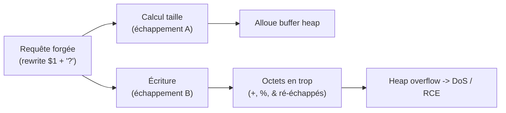
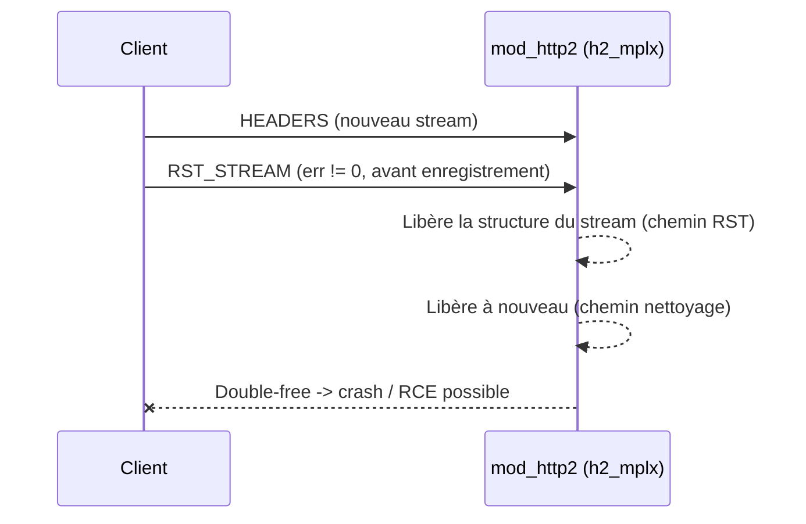
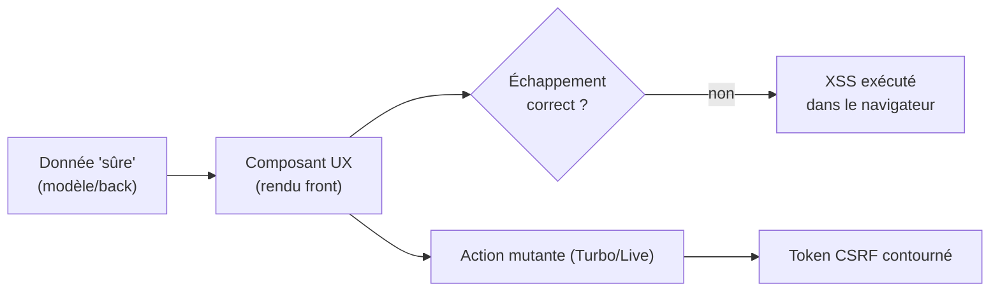
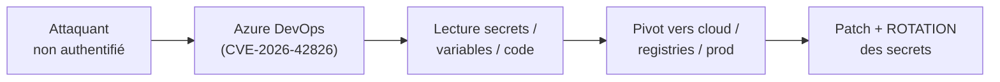

# Tech — Détail du samedi 30 mai 2026

## 1. NGINX Rift (CVE-2026-42945) — heap overflow vieux de 18 ans, exploité

**Source :** Help Net Security — https://www.helpnetsecurity.com/2026/05/18/ngnix-vulnerability-exploited-cve-2026-42945/
**Date :** 13 mai 2026 (exploitation active confirmée le 18 mai)

### Contexte

Une faille **heap-based buffer overflow** dans le module `ngx_http_rewrite_module` de nginx, surnommée **NGINX Rift**, dort dans le code depuis ~18 ans. Elle touche le serveur web le plus déployé d'Internet et est désormais **activement exploitée**.

CVSS **9.2 (Critique)**. Affecte **nginx Open Source 0.6.27 → 1.30.0** et **nginx Plus R32 → R36**. Une seule requête HTTP forgée suffit : DoS du worker, voire **RCE non authentifiée** si l'ASLR est désactivé.

### Comment ça marche

La racine du bug est un **désaccord entre deux fonctions** sur la taille à allouer. Le déclencheur précis : une directive `rewrite` qui utilise une capture PCRE non nommée (`$1`, `$2`) avec un remplacement contenant un `?`, suivie d'une autre directive `rewrite` / `if` / `set`.

nginx calcule la taille du buffer avec une méthode d'échappement, puis écrit dedans avec **une autre méthode**. Certains caractères (`+`, `%`, `&`) se ré-échappent à l'écriture, produisant plus d'octets que prévu à l'allocation. L'écriture déborde de la zone allouée sur le tas — c'est l'overflow. Selon le grooming du tas, ça plante le worker ou détourne l'exécution.



### En pratique — exemple de code

Identifie le pattern déclencheur dans ta config, puis patche ou neutralise la directive.

```bash
# 1. Suis-je dans la plage vulnérable ?
nginx -v   # OSS 0.6.27 -> 1.30.0 ou Plus R32 -> R36 = vulnérable

# 2. Repère le pattern déclencheur : rewrite avec capture $1/$2 ET un '?'
nginx -T | grep -nE 'rewrite\s+.*\$[0-9].*\?'

# 3a. Correctif : passer en 1.30.1 / nginx Plus R36 P1
apt-get update && apt-get install --only-upgrade nginx   # ou image Docker épinglée

# 3b. Mitigation immédiate : réécrire la rewrite incriminée sans capture+? 
#     ou la désactiver le temps du patch, puis recharger
nginx -t && nginx -s reload
```

### Pourquoi ça compte pour toi

Si tu as un nginx en frontal de tes apps .NET/Symfony, c'est priorité absolue. Audite tes blocs `rewrite` utilisant `$1`/`$2` avec un `?` dans le remplacement — c'est le pattern déclencheur exact. Passe en 1.30.1 ou nginx Plus R36 P1 ; à défaut, désactive temporairement les rewrites concernées. Le risque réaliste est un DoS de ta passerelle, le RCE restant conditionnel mais sérieux.

### Points de vigilance

Le WAF en amont ne te protège pas forcément : le payload tient dans une requête HTTP parfaitement valide, sans signature évidente à filtrer. Vérifie aussi tes images Docker basées sur nginx — beaucoup figent une version ancienne dans la plage vulnérable.

---

## 2. Apache HTTP/2 (CVE-2026-23918) — double-free dans mod_http2

**Source :** The Hacker News — https://thehackernews.com/2026/05/critical-apache-http2-flaw-cve-2026.html
**Date :** mai 2026

### Contexte

Faille de type **double-free with possible RCE** dans la gestion du protocole HTTP/2 d'Apache httpd, située dans le chemin de nettoyage de stream de `h2_mplx.c`.

CVSS **8.8**. Affecte **Apache HTTP Server 2.4.66**, corrigé en **2.4.67**. Le double-free ouvre la voie à un crash et potentiellement une exécution de code.

### Comment ça marche

Le bug est une **course dans le cycle de vie d'un stream HTTP/2**. Le multiplexer (`h2_mplx`) suit chaque stream qu'il enregistre, et libère ses ressources une seule fois en fin de vie. Ici, le client provoque deux libérations.

Le client envoie une frame `HEADERS`, immédiatement suivie d'un `RST_STREAM` avec un code d'erreur non nul, **sur le même stream et avant que le multiplexer ne l'ait enregistré**. Le chemin de gestion du RST libère la structure du stream ; puis le chemin de nettoyage normal la libère **à nouveau**. Ce double-free corrompt les métadonnées de l'allocateur — crash, et potentiellement détournement d'exécution.



### En pratique — exemple de code

Patche en priorité ; sinon, retombe en HTTP/1.1 le temps du correctif.

```bash
# 1. Version Apache ? (2.4.66 = vulnérable, 2.4.67 = corrigé)
httpd -v   # ou : apache2 -v

# 2a. Correctif : monter en 2.4.67
apt-get update && apt-get install --only-upgrade apache2   # ou image httpd épinglée

# 2b. Mitigation sans patch : désactiver HTTP/2 (retour HTTP/1.1)
#     supprime la surface d'attaque au prix d'un peu de perf
a2dismod http2 && systemctl reload apache2
# (ou retirer 'h2'/'h2c' de la directive Protocols dans la conf)
```

### Pourquoi ça compte pour toi

Si tu sers du HTTP/2 derrière Apache, monte en 2.4.67 sans attendre. Si tu ne peux pas patcher tout de suite, désactiver `mod_http2` (retour HTTP/1.1) supprime la surface d'attaque pour un coût de perf modéré. Vérifie aussi tes reverse-proxies et tes images Docker basées sur httpd, qui figent souvent une version exposée.

### Limites

L'exploitation en RCE fiable reste non triviale : transformer un double-free en exécution de code demande un contrôle fin du tas et un contournement d'ASLR. Le risque immédiat le plus réaliste est donc le DoS du serveur — déjà suffisant pour justifier un patch rapide sur un frontal en production.

---

## 3. Symfony 8.1 + avalanche d'advisories Symfony UX

**Source :** Symfony Blog — https://symfony.com/blog/
**Date :** 29 mai 2026

### Contexte

Symfony a publié les **nouveautés curées de la 8.1** et, le même jour, **plusieurs advisories de sécurité** visant des composants **Symfony UX** : déni de service, XSS, et contournements de protection CSRF dans divers composants.

Le piège : les paquets `symfony/ux-*` sont versionnés séparément du framework. Bumper Symfony ne suffit pas à corriger les advisories UX.

### Comment ça marche

Le risque vient de la chaîne de confiance entre données serveur et rendu front. Un composant UX rend du contenu côté navigateur (Stimulus/Turbo, Live Components). Si ce contenu n'est pas correctement échappé, une donnée que tu croyais sûre transite et s'exécute — c'est le **XSS UX**.

Le **bypass CSRF** suit une logique voisine : un composant UX émet une action mutante (formulaire Live, requête Turbo) dont la validation du token CSRF peut être contournée. Un attaquant force alors une action au nom de l'utilisateur authentifié. La remédiation passe par la mise à jour ciblée des paquets UX concernés, indépendamment du cœur Symfony.



### En pratique — exemple de code

Cible les paquets UX, pas seulement le framework, et vérifie ton échappement Twig.

```bash
# 1. Quelles versions UX ai-je ? (versionnées SÉPARÉMENT du cœur)
composer outdated 'symfony/ux-*'
composer audit            # liste les advisories applicables à ton lock

# 2. Mets à jour les paquets UX visés (pas juste symfony/*)
composer update 'symfony/ux-*' --with-dependencies
```

```twig
{# Vérifie l'échappement là où tu rends du contenu UX/utilisateur #}
{# Auto-escape Twig actif par défaut : NE PAS contourner avec |raw #}
<div {{ stimulus_controller('comment') }}>
  {{ comment.body }}          {# échappé automatiquement — bien #}
  {# {{ comment.body|raw }}   {# DANGER : réintroduit le XSS — à bannir #}
</div>
```

### Pourquoi ça compte pour toi

Tu fais du Symfony : vérifie immédiatement tes versions `symfony/ux-*` (`composer outdated 'symfony/*'`, `composer audit`) et applique les correctifs ciblés. Les bypass CSRF et XSS sont directement exploitables côté front, sans privilège. Ne te contente pas de bumper le cœur Symfony : les advisories visent les paquets UX, versionnés séparément et souvent oubliés lors des mises à jour.

### Points de vigilance

Audite tes templates Twig qui rendent du contenu UX : un XSS peut transiter par des données que tu croyais sûres (commentaires, champs libres, métadonnées importées). Traque les usages de `|raw` et de rendu HTML non échappé dans les composants Live/Turbo — c'est le point d'entrée typique de ce genre de faille.

---

## 4. Patch Tuesday mai — Azure DevOps (CVSS 10) et Dynamics 365 RCE

**Source :** CrowdStrike — https://www.crowdstrike.com/en-us/blog/patch-tuesday-analysis-may-2026/
**Date :** 12 mai 2026

### Contexte

Le Patch Tuesday de mai a corrigé **132 CVE**. Deux se détachent pour un dev backend de l'écosystème Microsoft.

**CVE-2026-42826** (Azure DevOps) : divulgation d'information, **CVSS 10** — un attaquant non authentifié récupère des informations sensibles à distance, sans interaction. **CVE-2026-42898** (Dynamics 365 on-premises) : **RCE critique CVSS 9.9**, injection de code exploitable par tout attaquant authentifié à distance.

### Comment ça marche

La CVE Azure DevOps mérite qu'on déroule la chaîne d'impact, car un « information disclosure » CVSS 10 est rarement anodin. L'attaquant n'a besoin d'**aucune authentification ni interaction** : il interroge à distance et récupère des données sensibles.

Sur une plateforme CI/CD, ces données incluent typiquement secrets de pipeline, variables d'environnement, voire fragments de code source. Or ces secrets servent souvent à accéder à d'autres systèmes (registries, cloud, prod). Une simple lecture devient donc un pivot : le patch ferme la fuite, mais ne révoque pas ce qui a pu être lu avant. D'où la nécessité de **roter les secrets**, pas juste de patcher.



### En pratique — exemple de code

Au-delà du patch serveur, rote les secrets qui ont pu fuiter via Azure DevOps.

```bash
# 1. Patch serveur Azure DevOps (instances on-prem / Server) — via Microsoft Update.
#    Les instances Azure DevOps Services managées sont corrigées côté Microsoft.

# 2. Rotation des secrets potentiellement exposés (le patch ne révoque pas l'ancien)
az devops security permission list ...           # audit d'accès
az pipelines variable-group list --org "$ORG" --project "$PROJ"  # repère les secrets
# Régénère PAT, service connections, clés cloud référencées dans tes pipelines.

# 3. Dynamics 365 on-prem (CVE-2026-42898) : patcher + restreindre l'accès réseau
#    (segmentation : limiter l'exposition de l'instance aux seuls réseaux requis)
```

### Pourquoi ça compte pour toi

Si ta CI/CD passe par Azure DevOps, la CVE-2026-42826 peut exposer secrets et code source : applique la mise à jour serveur et fais tourner tes secrets par précaution. Pour Dynamics 365 on-prem, patche et restreins l'accès réseau. Les instances cloud managées sont déjà corrigées côté Microsoft, mais un CVSS 10 « information disclosure » non authentifié mérite une rotation de tokens, pas seulement un patch.

### Points de vigilance

Le réflexe « patché = sûr » est faux ici : si la fuite a été exploitée avant ton patch, tes secrets sont compromis et restent valides jusqu'à rotation. Traite la CVE-2026-42826 comme un incident de credentials, pas comme un simple correctif. Inventorie tout ce qui transite en clair dans tes pipelines Azure DevOps.
