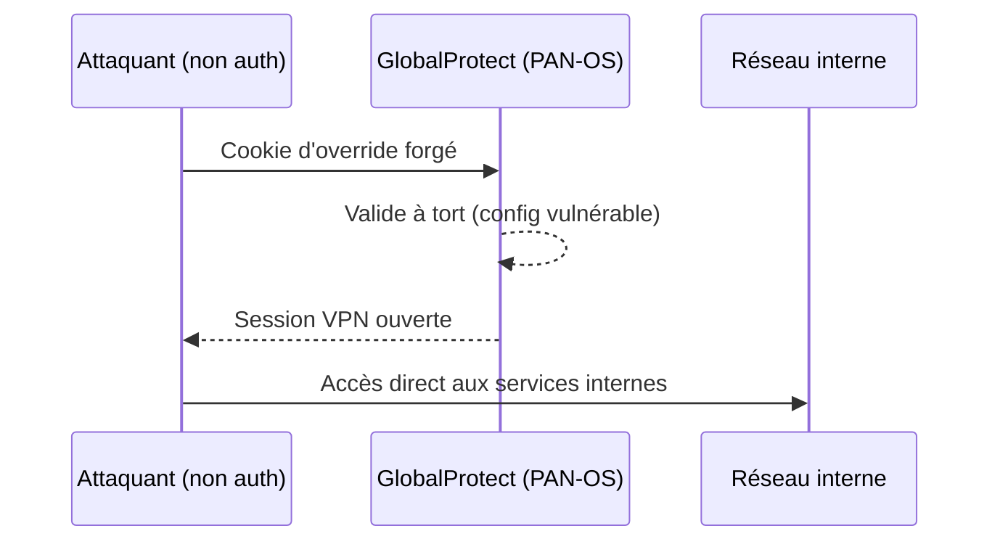
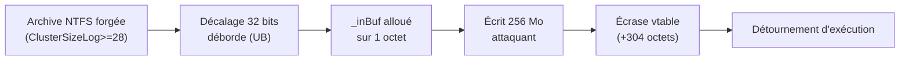
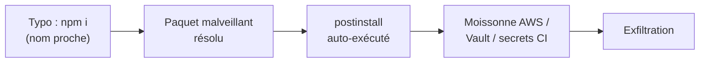

# Tech — Détail du lundi 1er juin 2026

## 1. Palo Alto PAN-OS CVE-2026-0257 — auth bypass GlobalProtect exploité

**Source :** Palo Alto Networks Security Advisory — https://security.paloaltonetworks.com/CVE-2026-0257
**Date :** exploitation active confirmée le 30 mai 2026

### Contexte

`CVE-2026-0257` est un **contournement d'authentification** dans le portail/gateway GlobalProtect de PAN-OS et Prisma Access. Un attaquant non authentifié peut forger un cookie d'override d'authentification et ouvrir une connexion VPN non autorisée.

La faille touche les firewalls avec **override de cookie activé** et une config certificat spécifique. Rapid7 a observé une exploitation dès le 17 mai 2026 (premières vagues depuis des IP Vultr), et la CISA a inscrit la CVE au KEV avec **échéance de remédiation au 1er juin 2026** — aujourd'hui.

### Comment ça marche

GlobalProtect utilise un cookie d'**authentication override** pour éviter de redemander les credentials à chaque reconnexion. Ce cookie est censé être signé/chiffré avec un certificat dédié, de sorte que seul le firewall puisse en produire un valide.

Le défaut : dans la config vulnérable, l'attaquant peut **forger un cookie** que le firewall accepte comme preuve d'authentification. Il présente ce cookie au portail, qui le valide à tort, et ouvre une session VPN. À ce stade, l'attaquant est **à l'intérieur du périmètre réseau**, avec un accès direct aux services internes que le VPN était censé protéger.



### En pratique — exemple de code

Patche, force la ré-authentification, ou applique la mitigation de config si tu ne peux pas patcher tout de suite.

```bash
# 1. Vérifie la version PAN-OS (patches dispo sur toutes les branches)
show system info | match sw-version

# 2. Mitigation immédiate sans patch :
#    désactiver l'authentication override OU dédier un certificat à cette fonction
#    GlobalProtect Portal/Gateway > Agent > ... > "Generate cookie ... " = off

# 3. Après upgrade : le firewall régénère le cookie de façon plus sûre.
#    -> force la ré-authentification de tous les utilisateurs GP
request global-protect-gateway gateway-config refresh   # ré-applique la conf
```

### Pourquoi ça compte pour toi

Si ton infra ou celle d'un client passe par un VPN GlobalProtect, c'est une priorité immédiate, pas un point de backlog. Vérifie la version PAN-OS, applique le correctif et force la ré-authentification. Un bypass VPN non authentifié, c'est une porte d'entrée réseau directe vers tes services internes — base de données, API privées, plans de management. L'échéance CISA est aujourd'hui.

### Points de vigilance

Patcher ne suffit pas si l'exploitation a déjà eu lieu : cherche des sessions GP anormales (IP Vultr ou hébergeurs cloud inhabituels) dans tes logs depuis le 17 mai. Une session ouverte avant ton patch reste un point d'entrée potentiel. Audite les accès internes survenus depuis cette date avant de considérer l'incident clos.

---

## 2. 7-Zip CVE-2026-48095 — heap overflow NTFS, RCE possible

**Source :** SecurityOnline — https://securityonline.info/7-zip-heap-buffer-overflow-cve-2026-48095/
**Date :** vague d'advisories 27-29 mai 2026

### Contexte

`CVE-2026-48095` est un **dépassement de tampon sur le tas** dans le handler d'archives NTFS de 7-Zip (`CInStream::GetCuSize()` dans `NtfsHandler.cpp`). Score CVSS 3.1 de **8.8 (High)**. Toutes les versions jusqu'à **26.00** sont affectées, corrigé dans **7-Zip 26.01** (sorti le 27 avril 2026).

Aggravant : la logique de fallback par signature peut router un fichier `.7z`, `.zip` ou `.rar` piégé vers le parser NTFS. La surface d'attaque s'élargit donc au phishing par pièce jointe.

### Comment ça marche

La racine est un **dépassement d'entier** dans le calcul de taille de buffer. L'expression `(UInt32)1 << (BlockSizeLog + CompressionUnit)` part en comportement indéfini quand `ClusterSizeLog >= 28` et `CompressionUnit == 4` : le décalage 32 bits déborde.

Conséquence en cascade. Sur x86, `_inBuf` n'est alloué que sur **1 octet** au lieu de la taille attendue. La lecture suivante y écrit jusqu'à **256 Mo** de données contrôlées par l'attaquant. Après 304 octets, l'écriture atteint et **écrase le pointeur de vtable** d'un objet adjacent. En détournant ce pointeur, l'attaquant oriente l'exécution vers son code.



### En pratique — exemple de code

Mets à jour, et durcis la chaîne de décompression côté backend.

```bash
# 1. Version 7-Zip ? (jusqu'à 26.00 vulnérable, 26.01+ corrigé)
7z i | head -2     # bannière de version ; vise 7-Zip >= 26.01

# 2. Si un service décompresse des archives uploadées : sandboxer le process
#    pas de réseau, FS dédié read-only, limites mémoire/CPU
firejail --noprofile --net=none --read-only=/ \
  --private=/srv/unzip-sandbox \
  7z x /srv/unzip-sandbox/untrusted.7z -o/srv/unzip-sandbox/out

# 3. N'ouvre JAMAIS une archive non fiable avec un binaire obsolète :
#    épingle la version dans tes images Docker (7z >= 26.01).
```

### Pourquoi ça compte pour toi

Si un service backend décompresse des archives uploadées par des utilisateurs avec 7-Zip ou `7z.exe`, tu as une voie de RCE directe. Mets à jour vers 26.01+ et durcis la chaîne : sandbox la décompression (pas de réseau, FS isolé, limites mémoire), et n'ouvre jamais une archive non fiable avec un binaire obsolète. Le fallback par signature signifie qu'une simple extension `.zip` ne te protège pas.

### Points de vigilance

Ne te fie pas à l'extension du fichier : le routage par signature peut diriger un faux `.zip` ou `.rar` vers le parser NTFS vulnérable. Le vecteur phishing est donc réaliste même hors contexte serveur — un poste qui ouvre une pièce jointe avec un 7-Zip non patché est exposé. Inventorie aussi les 7-Zip embarqués dans tes outils tiers.

---

## 3. npm — paquets typosquattés volant secrets cloud et CI/CD

**Source :** Microsoft Security Blog — https://www.microsoft.com/en-us/security/blog/2026/05/28/typosquatted-npm-packages-used-steal-cloud-ci-cd-secrets/
**Date :** 28 mai 2026

### Contexte

Microsoft a repéré une attaque supply-chain active sur npm. Un acteur sous l'alias `vpmdhaj` a publié **14 paquets malveillants en quatre heures**, typosquattant des libs connues OpenSearch, ElasticSearch, DevOps et de configuration d'environnement.

L'attaque s'inscrit dans une série continue (campagnes Mini Shai-Hulud) : npm reste la surface supply-chain la plus chaude de 2026. Cible explicite : postes de dev et runners CI, là où les secrets transitent en clair.

### Comment ça marche

Le typosquatting mise sur une faute de frappe ou une variante de nom proche d'une lib légitime. Une fois le mauvais paquet résolu, l'exploitation est immédiate : le **script `postinstall`** s'exécute automatiquement pendant `npm install`, avec les droits du user ou du runner.

Le payload moissonne alors les secrets présents sur la machine : credentials **AWS**, tokens **HashiCorp Vault**, secrets de pipeline **CI/CD**. Sur un runner CI, ces secrets transitent souvent en clair en variable d'environnement — cible idéale. Ils sont ensuite exfiltrés. Un seul `npm install` sur un nom mal tapé suffit à compromettre toute la chaîne.



### En pratique — exemple de code

Verrouille les versions, coupe l'exécution des scripts, et minimise la portée des secrets CI.

```bash
# 1. Installe sans exécuter les hooks postinstall (neutralise le vecteur)
npm ci --ignore-scripts

# 2. Vérifie la provenance Sigstore et audite les dépendances
npm audit signatures
npm audit
```

```yaml
# .github/workflows : secrets à portée minimale et durée de vie courte
jobs:
  build:
    permissions:
      contents: read
      id-token: write          # OIDC court-vécu plutôt que clés AWS permanentes
    steps:
      - run: npm ci --ignore-scripts   # lockfile committé + pas de hooks
      # Récupère des credentials AWS temporaires via OIDC (pas de secret statique)
      - uses: aws-actions/configure-aws-credentials@v4
        with:
          role-to-assume: arn:aws:iam::123:role/ci-min
          aws-region: eu-west-1
```

### Pourquoi ça compte pour toi

Tes pipelines Angular/Node sont directement exposés. Verrouille les versions (`package-lock.json` committé), active le scan de dépendances, et bannis l'installation de paquets non épinglés sur tes runners. Passe tes installs en `--ignore-scripts` pour neutraliser le vecteur `postinstall`. Surtout, fais tourner tes builds avec des secrets à portée minimale et durée de vie courte — jamais des credentials cloud permanents en variable d'environnement.

### Points de vigilance

Le typosquatting joue sur l'inattention : une revue de PR rapide laisse passer un nom proche du légitime. Mets un proxy de registry (Verdaccio, Artifactory) qui filtre les paquets récents ou non vérifiés, et préfère l'auth OIDC court-vécue aux clés AWS statiques. Un secret permanent volé reste exploitable indéfiniment ; un token OIDC expire en minutes.
