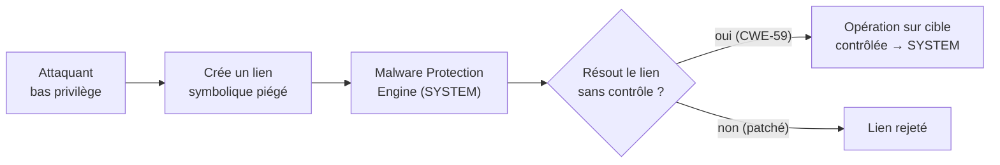
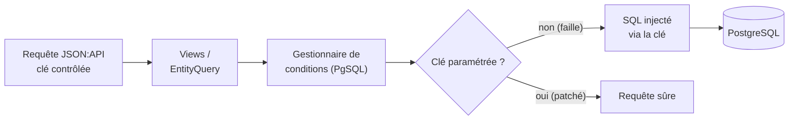

# Tech — Détail du mardi 2 juin 2026

## 1. Microsoft Defender (CVE-2026-41091 & CVE-2026-45498) — CISA KEV, deadline 3 juin

**Source :** Help Net Security — https://www.helpnetsecurity.com/2026/05/21/microsoft-defender-vulnerabilities-cve-2026-41091-cve-2026-45498/
**Date :** ajout au KEV le 20 mai 2026, remédiation exigée le 3 juin 2026

### Contexte

La CISA a ajouté deux failles **Microsoft Defender** activement exploitées à son catalogue des vulnérabilités connues (KEV), avec une échéance de correction au **3 juin 2026** pour les agences fédérales américaines (BOD 22-01). Defender étant déployé sur l'immense majorité des postes et serveurs Windows, le périmètre est très large.

Deux CVE distinctes sont visées. `CVE-2026-41091` (CVSS 7,8) est une élévation de privilèges locale dans le Microsoft Malware Protection Engine. `CVE-2026-45498` (CVSS 4,0) est un déni de service. La première est la plus dangereuse car elle mène à **SYSTEM**.

### Comment ça marche

`CVE-2026-41091` repose sur une **résolution de lien incorrecte** (CWE-59). Le moteur antimalware tourne en tâche de fond avec des privilèges élevés. Lorsqu'il manipule un fichier référencé par un lien symbolique ou une jonction, il ne vérifie pas que la cible finale du lien est bien celle attendue.

Un attaquant local à bas privilège plante un lien pointant vers une ressource sensible. Le moteur, en suivant ce lien sans contrôle, agit sur la cible avec ses droits **SYSTEM**. L'attaquant détourne ainsi une opération privilégiée vers un emplacement qu'il contrôle. Le résultat : écriture ou exécution arbitraire en SYSTEM, donc compromission totale du poste.

Le moteur affecté est `v1.26030.3008`. Le correctif est `v1.1.26040.8`, distribué via la mise à jour automatique du moteur — indépendante du cycle Patch Tuesday classique.



### En pratique — exemple de code

La défense est unique : vérifier la version du moteur. Cible : `1.1.26040.8` ou plus récent.

```powershell
# Audit du Malware Protection Engine sur un hôte Windows
$status = Get-MpComputerStatus
"AMEngineVersion : $($status.AMEngineVersion)"        # version du moteur
"SignatureLastUpdated : $($status.AntivirusSignatureLastUpdated)"

# Compare à la version corrigée
$fixed = [version]"1.1.26040.8"
$cur   = [version]$status.AMEngineVersion
if ($cur -lt $fixed) {
    Write-Warning "VULNÉRABLE — moteur $cur < $fixed. Forcer la mise à jour."
    Update-MpSignature                                # déclenche la MAJ moteur + signatures
} else {
    "OK — moteur à jour ($cur)"
}
```

Sur un parc, pousse cette vérification via ta solution de gestion (Intune, GPO, Ansible) et remonte les machines en retard. Les hôtes isolés ou figés (images CI gelées, serveurs hors réseau) sont les plus à risque.

### Pourquoi ça compte pour toi

Vérifie aujourd'hui la version du moteur sur tes serveurs Windows et tes postes de build/CI : la cible est `1.1.26040.8` ou plus récent. La mise à jour est normalement automatique, mais des machines isolées ou figées restent vulnérables. L'exploit sert d'escalade après une intrusion initiale — ne le néglige pas sous prétexte qu'il est « local » : c'est exactement ce dont un attaquant a besoin après un premier pied dans la place.

---

## 2. Drupal CVE-2026-9082 — SQL injection critique sur les sites PostgreSQL

**Source :** Drupal Security Advisory SA-CORE-2026-004 — https://www.drupal.org/sa-core-2026-004
**Date :** advisory mai 2026, exploitation active confirmée le 22 mai 2026

### Contexte

Drupal a corrigé une injection SQL classée « highly critical » (`CVE-2026-9082`, CVSS 6,5) qui ne touche **que les sites utilisant PostgreSQL**. La faille vient du gestionnaire de conditions EntityQuery côté PostgreSQL.

Imperva a observé **plus de 15 000 tentatives** d'exploitation sur ~6 000 sites dans 65 pays. La faille est inscrite au KEV de la CISA, échéance fédérale au 27 mai (déjà passée). Branches affectées : **11.3, 11.2, 10.6, 10.5**, avec des correctifs incluant des mises à jour Symfony et Twig.

### Comment ça marche

Le point clé est subtil : la plupart des protections SQL nettoient les **valeurs** d'un payload, pas ses **clés**. Or via JSON:API et Views, un attaquant contrôle ici des **clés de tableau** dans les conditions de requête.

Le gestionnaire de conditions EntityQuery, sur le backend PostgreSQL, prend ces clés contrôlées par l'utilisateur et les concatène dans le SQL généré sans les paramétrer correctement. La clé devient alors un fragment de requête injectable. L'attaquant glisse du SQL dans une clé — par exemple un nom de champ ou d'opérateur de filtre — et le préserve intact jusqu'au driver PostgreSQL.



### En pratique — exemple de code

Au-delà de patcher Drupal, la leçon vaut pour **tes propres** APIs. Ne fais jamais confiance à une clé qui finit dans du SQL dynamique. Valide-la contre une liste blanche.

```php
<?php
// Tri/filtre dynamique sûr : la clé NE doit jamais venir brute de l'utilisateur.
$allowedSort = ['created', 'title', 'status'];          // liste blanche stricte
$sortKey = $_GET['sort'] ?? 'created';

if (!in_array($sortKey, $allowedSort, true)) {
    throw new \InvalidArgumentException('Clé de tri invalide.');
}

// Les VALEURS sont paramétrées ; la CLÉ est validée par allow-list, jamais concaténée brute.
$stmt = $pdo->prepare(
    "SELECT id, title FROM node WHERE status = :status ORDER BY $sortKey DESC"
);
$stmt->execute([':status' => (int) ($_GET['status'] ?? 1)]);
```

Le `$sortKey` n'atteint le SQL qu'après être passé par la liste blanche : impossible d'y injecter du SQL arbitraire.

### Pourquoi ça compte pour toi

Si tu opères du Drupal sur PostgreSQL, patche immédiatement — l'exploitation est massive et anonyme. Plus largement, retiens le principe : ne fais jamais confiance aux **clés** d'un payload, pas seulement aux valeurs. Audite tes requêtes dynamiques — filtres, tris, conditions JSON — où une clé issue de l'utilisateur pourrait atterrir dans du SQL. Une allow-list sur les identifiants de colonnes coûte trois lignes et ferme la porte.
