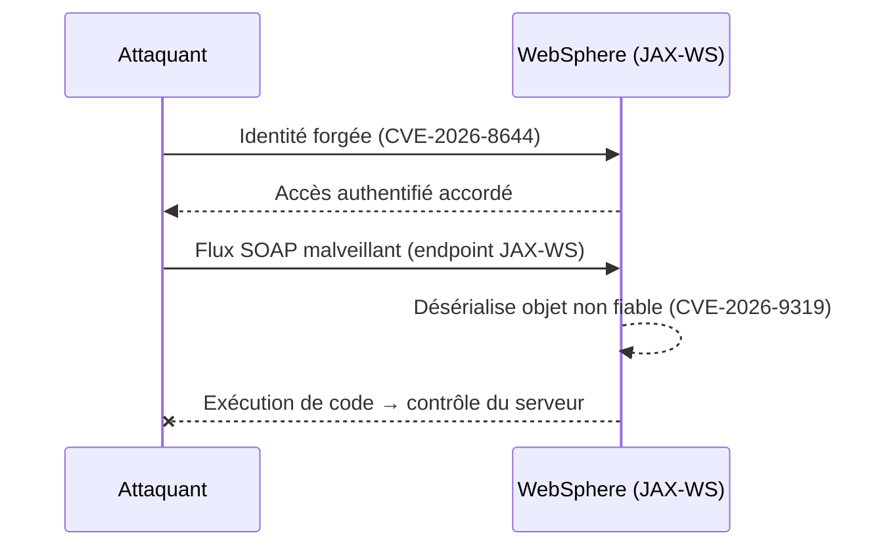
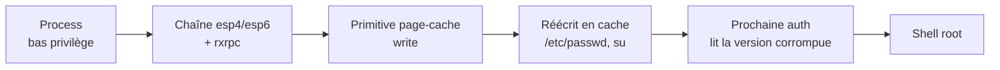
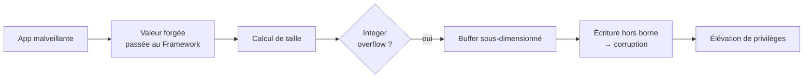

# Tech — Détail du mercredi 3 juin 2026

## 1. IBM WebSphere — trois critiques le même jour (CVE-2026-8644 / 9311 / 9319)

**Source :** Threat-Modeling.com — https://threat-modeling.com/ibm-websphere-spoofing-rce-cve-2026-8644-9311-9319/
**Date :** 1 juin 2026

### Contexte

IBM a publié simultanément trois bulletins critiques pour **WebSphere Application Server 8.5 et 9.0**, le 1er juin. WebSphere reste très présent dans les SI bancaires et assurantiels, souvent exposé derrière des reverse proxies internes — un terrain de choix pour un mouvement latéral.

Les trois failles forment une chaîne d'attaque cohérente. `CVE-2026-8644` (CVSS 9.1) contourne l'authentification par usurpation d'identité. `CVE-2026-9311` (CVSS 9.0) et `CVE-2026-9319` (CVSS 9.0) mènent toutes deux à une RCE. IBM a livré les correctifs pour les trois, à appliquer dans une **même fenêtre de maintenance**.

### Comment ça marche

L'intérêt pédagogique est la **composition** : aucune des trois failles ne suffit seule, mais enchaînées elles donnent le serveur.

1. **Entrée** — `CVE-2026-8644` permet l'*identity spoofing* : l'attaquant forge une identité que WebSphere accepte comme authentifiée, contournant les contrôles d'accès.
2. **Exécution** — une fois « dedans », il déclenche `CVE-2026-9311` (bypass des contrôles de sécurité existants) ou `CVE-2026-9319`.
3. **Le vecteur le plus probable** est `CVE-2026-9319` : une **désérialisation de données non fiables** sur les endpoints JAX-WS. Java désérialise un flux d'octets en objet ; si le flux est contrôlé par l'attaquant, des gadgets de désérialisation exécutent du code arbitraire pendant la reconstruction de l'objet.



### En pratique — exemple de code

Sans toucher à WebSphere lui-même, vérifie qu'aucun endpoint JAX-WS n'est joignable depuis tes réseaux applicatifs. Sonde la surface exposée.

```bash
# Recense les services WebSphere joignables depuis le réseau applicatif
WS_HOST="websphere.intranet"

# 1. Les ports JAX-WS / SOAP sont-ils ouverts depuis ce segment ?
nmap -p 9080,9443 -sV "$WS_HOST"

# 2. Un WSDL exposé trahit un endpoint SOAP atteignable
curl -ks "https://$WS_HOST:9443/services/MyService?wsdl" -o /dev/null -w "%{http_code}\n"
# 200 => endpoint joignable : à cloisonner (ACL / firewall) en plus du patch IBM

# 3. Vérifie le fix pack appliqué côté serveur
# /opt/IBM/WebSphere/AppServer/bin/versionInfo.sh | grep -i "fix pack"
```

Un endpoint qui répond `200` doit être cloisonné par ACL en complément du correctif IBM : défense en profondeur.

### Pourquoi ça compte pour toi

Si tu intègres des services .NET ou Symfony avec un back-office WebSphere hérité, tu hérites de son périmètre d'exposition. Vérifie qu'aucun endpoint JAX-WS n'est joignable depuis tes réseaux applicatifs, et planifie le patch combiné cette semaine. La désérialisation JAX-WS est le vecteur le plus probable d'exploitation rapide : un seul flux SOAP forgé suffit à passer en exécution de code.

---

## 2. Dirty Frag (CVE-2026-43284 / 43500) — LPE noyau Linux, exploit public et exploitation in-the-wild

**Source :** SecurityWeek — https://www.securityweek.com/new-dirty-frag-linux-vulnerability-possibly-exploited-in-attacks/
**Date :** mise à jour 1–2 juin 2026

### Contexte

**Dirty Frag** est une élévation de privilèges locale (LPE) dans le noyau Linux, divulguée par Hyunwoo Kim sur oss-security le 7 mai avant la fin de l'embargo. Microsoft Defender confirme désormais une **activité limitée in-the-wild**, ce qui fait repasser le sujet en priorité opérationnelle.

Il s'agit de **deux failles chaînées** (`CVE-2026-43284` et `CVE-2026-43500`) dans les composants réseau `esp4`, `esp6` et `rxrpc`. Les bugs sont anciens : xfrm-ESP présent depuis 2017, RxRPC depuis 2023. Un **exploit fonctionnel est public** (PoC `V4bel/dirtyfrag` sur GitHub). Des patches existent pour Ubuntu, Red Hat (RHSB-2026-003), AlmaLinux et CloudLinux.

### Comment ça marche

La technique centrale est le **page-cache write**. Le noyau garde en mémoire (page cache) le contenu des fichiers lus récemment. Normalement, modifier une page cachée d'un fichier protégé est interdit aux process non privilégiés.

Les deux bugs `esp`/`rxrpc` corrompent cette frontière. En chaînant les failles, l'attaquant obtient une primitive d'écriture dans les pages cache de **fichiers sensibles** comme `/etc/passwd` ou `/usr/bin/su`. Il réécrit par exemple la ligne root de `/etc/passwd` ou détourne le binaire `su`. La prochaine authentification utilise la version corrompue en cache : l'attaquant passe **root**. Le fichier sur disque n'a pas besoin d'être touché — c'est la copie en mémoire qui fait foi.



### En pratique — exemple de code

La seule défense fiable est de patcher le noyau. Vérifie ta version et applique la mise à jour distribution.

```bash
# 1. Version noyau courante
uname -r

# 2. Le module ESP/xfrm est-il chargé (surface d'attaque) ?
lsmod | grep -E 'esp4|esp6|rxrpc'

# 3a. Debian / Ubuntu : applique le noyau corrigé puis planifie le reboot
apt-get update && apt-get install --only-upgrade linux-image-generic
# 3b. RHEL / Alma / CloudLinux
# dnf update kernel   # voir RHSB-2026-003

# 4. Reboot requis pour charger le nouveau noyau
needs-restarting -r || echo "Reboot nécessaire pour activer le patch"
```

Tant que le reboot n'est pas fait, l'ancien noyau vulnérable reste en mémoire : le patch sans redémarrage ne protège pas.

### Pourquoi ça compte pour toi

Tes serveurs PostgreSQL et tes runners CI Linux sont des cibles directes après un premier accès bas-privilège. Le scénario typique : un web shell ou un compte applicatif compromis qui escalade en root grâce à un exploit déjà public. Patche le noyau sur tout host exposé ou multi-tenant **maintenant**, sans attendre la prochaine fenêtre planifiée — et reboote pour activer le correctif.

---

## 3. Android — zero-day CVE-2025-48595 exploité, bulletin de juin corrige 124 failles

**Source :** BleepingComputer — https://www.bleepingcomputer.com/news/security/google-fixes-one-actively-exploited-android-zero-day-124-flaws/
**Date :** 1–2 juin 2026

### Contexte

Le Bulletin de sécurité Android de juin 2026 (publié le 1er juin) corrige **124 vulnérabilités**, dont un zero-day activement exploité dans l'Android Framework. Google indique une **exploitation ciblée et limitée**.

La faille `CVE-2025-48595` est un **integer overflow** dans l'Android Framework menant à une élévation de privilèges locale, sans interaction utilisateur ni privilège supplémentaire requis. Versions touchées : Android 14, 15, 16 et 16-qpr2. Protection complète à partir du **patch level 2026-06-05**.

### Comment ça marche

Un **integer overflow** survient quand un calcul dépasse la valeur maximale d'un type entier et « boucle » vers une petite valeur. Dans l'Android Framework, ce calcul sert typiquement à dimensionner un buffer ou à valider une borne.

Le scénario classique : le Framework calcule une taille d'allocation à partir d'une valeur fournie par une app malveillante. L'overflow produit une taille **anormalement petite**. Le buffer alloué est trop court, mais le code croit disposer de la taille demandée. L'écriture déborde alors hors du buffer — corruption mémoire dans un composant privilégié. L'attaquant exploite cette corruption pour exécuter du code avec les droits du Framework. Comme tout se passe via une app locale sans interaction, l'utilisateur ne voit rien.



### En pratique — exemple de code

Côté flotte, la défense est d'imposer un patch level minimal. Tu peux le vérifier en CI ou via MDM.

```bash
# Vérifie le niveau de correctif de sécurité d'un appareil via adb
PATCH=$(adb shell getprop ro.build.version.security_patch)   # ex. 2026-06-05
MIN="2026-06-05"

# Comparaison lexicographique correcte car format YYYY-MM-DD
if [[ "$PATCH" < "$MIN" ]]; then
  echo "NON CONFORME : patch level $PATCH < $MIN — CVE-2025-48595 exploitable"
  exit 1
fi
echo "Conforme : $PATCH"
```

Le format `YYYY-MM-DD` se compare directement comme chaîne, ce qui simplifie la règle de conformité.

### Pourquoi ça compte pour toi

Moins central pour ton stack backend, mais à relayer si tu livres une app mobile ou un MDM en entreprise. Pousse la consigne « niveau de correctif ≥ 2026-06-05 » dans ta politique de conformité d'appareils. Si tu signes des builds Android dans ta CI, vérifie que tes images d'émulateur ne servent pas de surface d'attaque oubliée — une image figée sur un vieux Framework reste exploitable.
