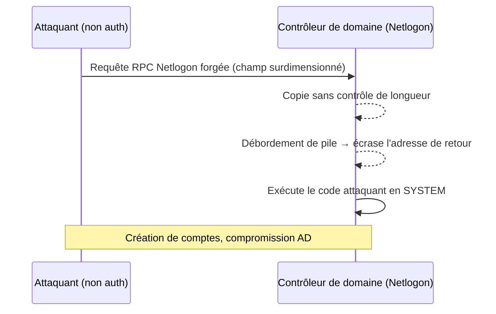
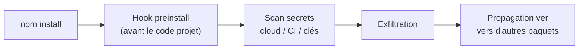
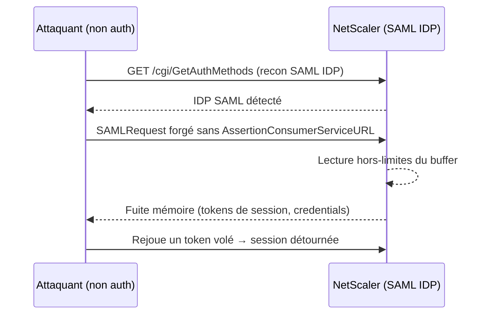

# Tech — Détail du jeudi 4 juin 2026

## 1. Windows Netlogon CVE-2026-41089 — RCE non authentifiée sur les contrôleurs de domaine, exploitée

**Source :** Help Net Security — https://www.helpnetsecurity.com/2026/06/01/windows-netlogon-rce-exploited-cve-2026-41089/
**Date :** 1 juin 2026

### Contexte

`CVE-2026-41089` est un **dépassement de tampon (stack-based buffer overflow) dans Netlogon**, le service qui gère l'authentification au sein d'un domaine Windows. Microsoft l'a corrigé au Patch Tuesday de mai (12 mai), mais sans le classer « exploitation probable ».

L'exploitation in-the-wild a été confirmée le 29 mai, avec une alerte publique du Centre belge pour la cybersécurité (CCB). Aucune authentification n'est requise : une simple requête forgée mène à une exécution de code **SYSTEM directement sur le contrôleur de domaine**. Tous les Windows Server supportés sont touchés, de 2012 à **Windows Server 2025**.

### Comment ça marche

Netlogon écoute les requêtes RPC liées à l'authentification de domaine. Une de ces routines copie des données issues de la requête dans un **tampon de pile** de taille fixe sans valider la longueur entrante.

Un attaquant non authentifié envoie une requête Netlogon dont un champ dépasse la taille du tampon. La copie déborde sur la pile, écrasant les structures voisines — notamment l'adresse de retour de la fonction. En contrôlant ce qui écrase la pile, l'attaquant détourne le flux d'exécution vers son propre code. Le service tournant en **SYSTEM sur le DC**, il obtient le contrôle total : création de comptes privilégiés, mouvement latéral vers tout ce qui s'authentifie contre ce contrôleur.



### En pratique — exemple de code

Pas de contournement fiable : il faut patcher **tous** les DC dans la même fenêtre. Vérifie la couverture et inspecte les logs Netlogon.

```powershell
# 1. Le KB du Patch Tuesday de mai est-il présent sur CHAQUE contrôleur de domaine ?
$dcs = (Get-ADDomainController -Filter *).HostName
foreach ($dc in $dcs) {
    $hotfix = Get-HotFix -ComputerName $dc -ErrorAction SilentlyContinue |
              Where-Object InstalledOn -ge '2026-05-12'
    if (-not $hotfix) {
        Write-Warning "$dc : correctif Netlogon ABSENT — porte d'entrée ouverte"
    } else {
        "$dc : OK"
    }
}

# 2. Recherche de requêtes Netlogon anormales avant le patch
Get-WinEvent -ComputerName $dcs[0] -FilterHashtable @{LogName='System'; ProviderName='NETLOGON'} |
    Select-Object TimeCreated, Id, Message -First 20
```

Un seul DC non corrigé suffit à tomber le domaine : le patching partiel est explicitement décrit comme un « état indéfendable ».

### Pourquoi ça compte pour toi

Si tu opères un domaine Windows, c'est la priorité absolue. Patche **tous tes DC dans la même fenêtre de maintenance** : un patching partiel laisse les contrôleurs non corrigés comme porte d'entrée, et un seul DC compromis suffit à tomber le domaine. Vérifie aussi tes logs Netlogon pour des requêtes anormales antérieures au patch. Segmenter l'accès réseau aux DC réduit la surface mais ne remplace pas le correctif.

---

## 2. Miasma — attaque supply-chain npm sur 32 paquets Red Hat, vol de credentials

**Source :** Wiz Blog — https://www.wiz.io/blog/miasma-supply-chain-attack-targeting-redhat-npm-packages
**Date :** 1 juin 2026

### Contexte

Le 1er juin, après la compromission du compte GitHub d'un employé Red Hat, un attaquant a injecté du code malveillant dans des paquets npm officiels. La société Aikido a détecté l'incident le jour même. Le malware, surnommé **Miasma** (« The Spreading Blight »), est un ver voleur de credentials proche de la famille Shai-Hulud.

Bilan : **32 paquets, 96 versions** compromis, totalisant ≈ 116 991 téléchargements hebdomadaires. Dépôts touchés : `RedHatInsights` (frontend-components, javascript-clients, platform-frontend-ai-toolkit). Le vecteur combine des **workflows GitHub Actions malveillants** et un script `preinstall` piégé.

### Comment ça marche

Le cœur de l'attaque est le hook **`preinstall`** de npm. Quand tu lances `npm install`, npm exécute les scripts de cycle de vie déclarés dans le `package.json` de chaque dépendance — `preinstall` s'exécute **avant** la résolution et l'exécution du code applicatif.

Le payload se lance donc automatiquement, sans alerte visible, dès l'installation. Il balaie l'environnement à la recherche de secrets typiques d'un poste dev ou d'un runner CI/CD : tokens cloud, clés d'API, credentials. Il les exfiltre, puis adopte un **comportement de ver** : il cherche d'autres paquets que la victime peut publier et s'y propage, à la manière de Mini Shai-Hulud. C'est l'exécution avant le code projet qui rend l'infection invisible.



### En pratique — exemple de code

Deux défenses : neutraliser les scripts d'install et épingler les versions. En CI, installe sans exécuter les hooks.

```bash
# 1. Installation déterministe SANS scripts de cycle de vie (bloque preinstall malveillant)
npm ci --ignore-scripts

# 2. Si un build a tourné depuis le 1er juin, audite les paquets Red Hat installés
npm ls --all 2>/dev/null | grep -E '@redhat|RedHatInsights' || echo "Aucun paquet Red Hat"

# 3. Désactive globalement les scripts par défaut (réactive ponctuellement si besoin)
npm config set ignore-scripts true

# 4. Rotation préventive des secrets potentiellement exposés
#    => révoque et régénère tokens cloud / CI utilisés sur les runners concernés
```

`npm ci --ignore-scripts` casse l'automatisme `preinstall` : le payload ne s'exécute jamais, même si la version piégée est résolue.

### Pourquoi ça compte pour toi

Un `npm install` sur une version piégée suffit à exfiltrer tes secrets CI/CD. Épingle tes dépendances (lockfile + versions exactes), désactive les scripts d'install non essentiels (`npm ci --ignore-scripts`) et scanne tes builds récents. Si tu consommes des paquets `@redhat*`, vérifie les versions installées depuis le 1er juin et fais tourner tes credentials par précaution. Le hook `preinstall` est le maillon à neutraliser.

---

## 3. Citrix NetScaler CVE-2026-3055 — fuite mémoire SAML IDP, exploitation à grande échelle

**Source :** Rapid7 — https://www.rapid7.com/blog/post/etr-cve-2026-3055-citrix-netscaler-adc-and-netscaler-gateway-out-of-bounds-read/
**Date :** exploitation à grande échelle confirmée, juin 2026

### Contexte

`CVE-2026-3055` (CVSS 9.3) est une **lecture hors-limites (out-of-bounds read)** dans NetScaler ADC et Gateway. Citrix a publié l'avis le 23 mars, la faille est au catalogue CISA KEV depuis le 30 mars, et Fortinet confirme désormais une **exploitation à grande échelle**.

L'exploitation exige que l'appliance soit configurée en **SAML Identity Provider (IDP)**. La reconnaissance observée sonde `/cgi/GetAuthMethods` pour repérer les cibles. Si tu n'utilises pas le rôle SAML IDP, le risque est nul — mais confirme ta configuration.

### Comment ça marche

Une **lecture hors-limites** survient quand le code lit au-delà de la zone mémoire allouée pour une donnée. Ici, le déclencheur est un **SAMLRequest forgé** envoyé à `/saml/login` en **omettant** le champ `AssertionConsumerServiceURL`.

Le parseur SAML attend ce champ. Son absence le fait lire à un offset mémoire incorrect, au-delà de la structure de requête. L'appliance renvoie alors dans sa réponse le contenu de la **mémoire adjacente** : tokens de session actifs, credentials en transit d'autres utilisateurs. L'attaquant répète la requête pour égrener la mémoire et collecter des jetons valides, qu'il rejoue ensuite pour détourner des sessions authentifiées — le tout sans aucune authentification préalable.



### En pratique — exemple de code

Au-delà du firmware corrigé, détecte les requêtes suspectes et révoque les sessions après patch.

```bash
# 1. Recon attaquant : sondage de l'endpoint de découverte SAML
grep "GetAuthMethods" /var/log/ns.log

# 2. Exploitation : SAMLRequest sans AssertionConsumerServiceURL
#    (les requêtes /saml/login sans ce champ sont suspectes)
grep "/saml/login" /var/log/httpaccess.log | grep -v "AssertionConsumerServiceURL"

# 3. APRÈS le patch firmware : invalider les sessions potentiellement volées
#    Forcer la réauthentification — les jetons fuités restent valides sinon.
#    (CLI NetScaler)
#    > kill aaa session -all
```

Les sessions volées **avant** le patch restent exploitables : la réauthentification forcée est indispensable, le correctif seul ne suffit pas.

### Pourquoi ça compte pour toi

Si une NetScaler sert d'IDP SAML dans ton infra, un attaquant non authentifié peut lire des jetons de session en mémoire et détourner des comptes valides. Applique le firmware corrigé sans attendre, révoque les sessions actives après patch, et inspecte tes logs pour des requêtes `/saml/login` sans `AssertionConsumerServiceURL`. Si tu n'utilises pas le rôle SAML IDP, le risque est nul — mais vérifie-le explicitement.
