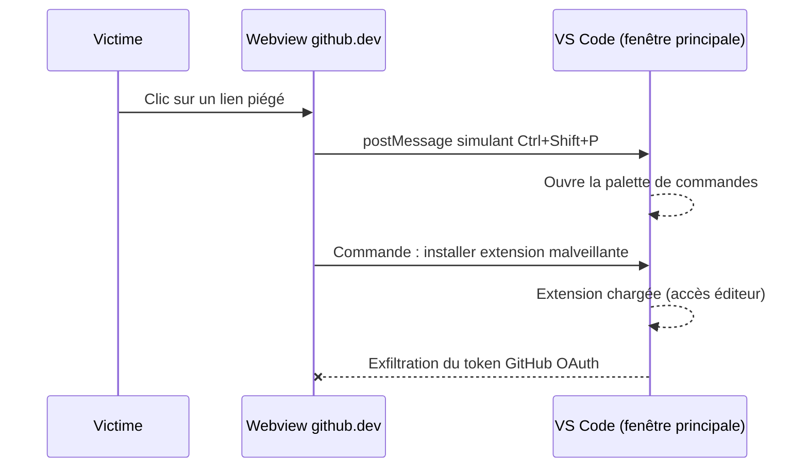
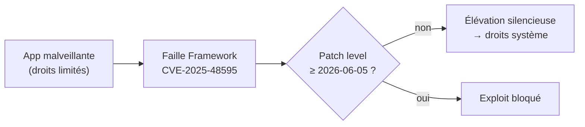

# Tech — Détail du vendredi 5 juin 2026

## 1. VS Code github.dev zero-day — vol de tokens GitHub OAuth en un seul clic

**Source :** Bleeping Computer — https://www.bleepingcomputer.com/news/security/vs-code-zero-day-lets-hackers-steal-github-tokens-in-one-click/
**Date :** 4 juin 2026

### Contexte

Le chercheur Ammar Askar a divulgué le 2 juin une vulnérabilité dans le mécanisme de passage de messages entre la fenêtre principale de VS Code et ses **webviews**, tel qu'utilisé par `github.dev`. La divulgation a été publiée une heure seulement après la notification à GitHub — contournant la fenêtre de responsible disclosure standard, suite à une perte de confiance déclarée dans le processus Microsoft.

Microsoft a néanmoins livré un **correctif d'urgence côté service le 3 juin** pour le vecteur `github.dev`, sans action utilisateur requise. Le vecteur VS Code Desktop reste partiellement exposé.

### Comment ça marche

VS Code isole les contenus tiers dans des **webviews** (iframes sandboxées). La communication entre une webview et la fenêtre principale passe par l'API `postMessage`. La faille : la fenêtre principale ne valide pas suffisamment l'**origine** des messages reçus de la webview.

Sur `github.dev` dans le navigateur, l'attaque tient en un clic. La victime clique un lien piégé. Un script dans la webview envoie des messages simulant des **frappes clavier** (`Ctrl+Shift+P`), ce qui ouvre la palette de commandes. Le script y enchaîne l'installation d'une **extension contrôlée par l'attaquant**, qui dispose alors d'un accès privilégié au contexte de l'éditeur — et **exfiltre le token GitHub OAuth**. Avec ce token : lecture et écriture sur **tous les dépôts privés** de la victime.



### En pratique — exemple de code

Si tu as utilisé `github.dev` récemment, révoque les sessions suspectes et réduis la portée des tokens.

```bash
# 1. Liste les autorisations OAuth / sessions actives (via gh CLI)
gh auth status
gh api /user/installations --jq '.installations[].app_slug'   # apps autorisées

# 2. En CI/CD : générer des tokens à portée MINIMALE (principe du moindre privilège)
#    Mauvais : scope 'repo' complet (lecture/écriture tous repos privés)
#    Bon : permissions granulaires d'un fine-grained token
cat <<'YAML'
permissions:
  contents: read        # au lieu de 'repo' complet
  pull-requests: read
YAML

# 3. Révoquer un token compromis : Settings > Developer settings > Tokens (web)
#    ou rotation via l'API d'administration de l'organisation
```

Un token scoppé `contents:read` qui fuit reste lecture seule : la réduction de portée limite l'impact d'un vol.

### Pourquoi ça compte pour toi

Si tu travailles sur `github.dev` (prévisualisation de PR, édition légère dans le navigateur) et que tu as cliqué sur des liens non vérifiés récemment, inspecte tes sessions GitHub actives (Settings → Sessions) et révoque les tokens suspects. En CI/CD, assure-toi que les tokens ont une portée minimale (`contents:read` plutôt que `repo` complet). Ne jamais ouvrir de notebooks Jupyter provenant de dépôts non fiables dans VS Code Desktop — le vecteur y reste partiellement exposé.

---

## 2. Android juin 2026 : Google patche 124 failles, CVE-2025-48595 activement exploitée

**Source :** The Hacker News — https://thehackernews.com/2026/06/google-june-2026-android-update-patches.html
**Date :** 2 juin 2026

### Contexte

Google a publié le Patch Tuesday Android de juin 2026, couvrant **124 CVEs**. La faille `CVE-2025-48595` est confirmée activement exploitée et ajoutée au catalogue CISA KEV, avec une deadline de remédiation au **5 juin 2026** pour les agences fédérales américaines. Le bulletin est parmi les plus volumineux de l'année.

Deux correctifs dominent. `CVE-2025-48595` (CVSS 8.4, composant Framework) est une escalade de privilèges **sans interaction utilisateur**. `CVE-2025-65018` est une vulnérabilité Framework critique permettant une **élévation de privilèges distante** sans interaction — le correctif le plus sévère du bulletin.

### Comment ça marche

Android publie ses correctifs en **niveaux de patch** (`security_patch`) : `2026-06-01` regroupe les correctifs du framework de base, `2026-06-05` ajoute les correctifs des composants — Framework, System, Media, et puces fabricants (Qualcomm, MediaTek).

L'élévation de privilèges du Framework est le scénario le plus discret. Une app malveillante exploite la faille Framework pour passer de ses permissions limitées à des droits système, **sans aucune interaction** : pas de pop-up, pas de geste utilisateur. En contexte BYOD, une app latente installée des semaines plus tôt peut donc s'élever silencieusement quand l'attaquant le décide. La distribution OTA arrive immédiatement sur Pixel, mais le délai fabricant (4 à 8 semaines) laisse une large fenêtre d'exposition sur le reste du parc.



### En pratique — exemple de code

Côté flotte, impose un patch level minimal et bloque l'accès aux ressources internes en dessous.

```kotlin
// Contrôle d'attestation côté backend : refuse les appareils sous-patchés
import java.time.LocalDate

fun isDevicePatched(securityPatch: String): Boolean {
    val minPatch = LocalDate.parse("2026-06-05")
    val devicePatch = LocalDate.parse(securityPatch)   // Build.VERSION.SECURITY_PATCH
    return !devicePatch.isBefore(minPatch)
}

// Côté app : exposer Build.VERSION.SECURITY_PATCH au backend (ou via Play Integrity)
// puis : if (!isDevicePatched(patch)) denyAccessToInternalResources()
```

Couplé à Play Integrity ou à ton MDM, ce contrôle empêche un appareil vulnérable d'atteindre tes APIs internes.

### Pourquoi ça compte pour toi

Si tu gères une flotte Android en entreprise (MDM, BYOD), priorise la mise à jour sur les appareils accédant aux ressources internes. `CVE-2025-48595` sans interaction signifie qu'une app latente peut élever ses droits sans alerte utilisateur — vecteur discret et dangereux en BYOD. Pour les apps publiées via Capacitor ou MAUI, vérifie que tes bibliothèques WebView sont à jour et que le `minSdkVersion` cible une version patchée. Sans MDM, communique le bulletin et fixe une deadline interne.
