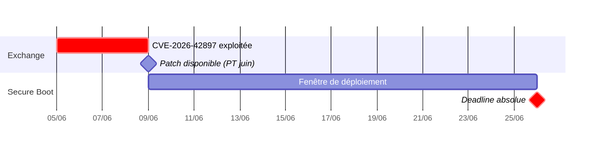

# Tech — Détail du samedi 6 juin 2026

## 1. Cisco SD-WAN CVE-2026-20245 — 7e zero-day SD-WAN 2026, exploitation active, aucun patch disponible

**Source :** Help Net Security — https://www.helpnetsecurity.com/2026/06/05/cisco-sd-wan-cve-2026-20245-0-day-exploited/
**Date :** 5 juin 2026

### Contexte

Depuis le début de 2026, la série **Cisco Catalyst SD-WAN Manager** est touchée par une cascade de vulnérabilités. `CVE-2026-20245` est la 7e faille zero-day divulguée cette année sur ce produit. Le schéma se répète : exploitation confirmée avant tout patch, divulguée par Mandiant (Google Cloud) lors d'une investigation d'incident.

C'est une **command injection** dans la CLI du Manager (CVSS 7.8). Un attaquant disposant de **privilèges netadmin** uploade un fichier crafté qui exécute des commandes arbitraires en **root**. Les acteurs obtiennent ces credentials en chaînant les failles précédentes (`CVE-2026-20182`, `CVE-2026-20127`) ou via des credentials compromis. Périmètre : **toutes les topologies** (on-prem, Cloud-Pro, Cisco Managed Cloud, FedRAMP).

### Comment ça marche

La leçon est la **chaîne de compromission** : aucune étape n'est isolée. L'attaquant capitalise sur le travail des failles antérieures.

1. **Obtention des credentials netadmin** — via une faille précédente de la série (`CVE-2026-20182` ou `CVE-2026-20127`) ou un credential déjà fuité.
2. **Command injection** — `CVE-2026-20245` permet d'uploader un fichier dont le contenu est interprété comme des commandes. La CLI ne valide pas suffisamment l'entrée : un paramètre du fichier crafté est concaténé dans une commande shell exécutée côté serveur.
3. **Escalade vers root** — la commande s'exécute avec les privilèges du process Manager, donc **root**, bien au-delà des droits netadmin de départ.
4. **Impact réseau** — dans les incidents documentés, des **changements de configuration** ont été poussés sur des équipements edge. Aucun patch ni workaround officiel n'existe à la divulgation.


### En pratique — exemple de code

Sans patch, la mitigation passe par le durcissement des accès et la collecte forensique. Audite les comptes netadmin et fige les logs avant rotation.

```bash
# 1. Recense les comptes à privilèges netadmin sur le Manager
#    (CLI Cisco Catalyst SD-WAN Manager)
show users
show running-config | include netadmin

# 2. Repère une activité CLI inhabituelle / uploads récents
show logging | include "file upload"
show audit-log | include netadmin

# 3. AVANT toute rotation : exporte les logs pour investigation forensique
#    (les supprimer effacerait les IoC publiés par Mandiant)
admin tech-support               # collecte un bundle de diagnostic complet

# 4. Durcis l'accès CLI : restreint la source des connexions d'admin (ACL de management)
```

Collecte les logs **avant** la rotation des credentials : sinon tu effaces les indices de compromission que les bulletins Mandiant/CISA permettront de corréler.

### Pourquoi ça compte pour toi

Si ton infrastructure (ou celle de tes clients) inclut des équipements SD-WAN Cisco, c'est une action immédiate : audite qui possède des privilèges netadmin sur le Manager, vérifie les activités CLI récentes inhabituelles, et collecte les logs avant rotation. Sans patch, la mitigation passe par le durcissement du contrôle d'accès. Attention : une organisation qui a patché les CVE précédentes **mais dont les credentials ont fuité** reste exposée — surveille les IoC publiés par Mandiant via CISA/Cisco Talos.

---

## 2. Patch Tuesday juin 2026 — Deadline Secure Boot 26 juin + Exchange CVE-2026-42897 en exploitation

**Source :** Help Net Security — https://www.helpnetsecurity.com/2026/06/05/june-2026-patch-tuesday-forecast/
**Date :** 5 juin 2026

### Contexte

Le Patch Tuesday de juin 2026 est prévu le **9 juin**. Le forecast de Help Net Security met en évidence deux tensions. D'abord la **deadline absolue Secure Boot du 26 juin**, pour les organisations qui n'ont pas finalisé le déploiement des certificats Secure Boot en mai. Ensuite un **Exchange Server RCE** (`CVE-2026-42897`) déjà exploité avant que le patch ne soit disponible.

Le bulletin couvre environ 291 CVEs au total, dont 268 sont des republications Edge/Chromium déjà couvertes par les updates navigateur. Les 23 CVEs « genuinement nouvelles » incluent Exchange, Windows et des composants cloud.

### Comment ça marche

Deux échéances structurent la semaine, et elles tirent dans des directions opposées.

Côté **Exchange**, `CVE-2026-42897` est une RCE déjà exploitée in-the-wild **avant** la disponibilité du correctif. Le patch arrive le 9 juin : il doit être déployé en priorité absolue, hors des cycles de test habituels, car la fenêtre d'exposition est déjà ouverte. Les Exchange on-premise (encore nombreux en mid-market) sont directement visés.

Côté **Secure Boot**, le mécanisme repose sur une chaîne de confiance UEFI : seuls les binaires signés par un certificat de confiance démarrent. Ces certificats expirent et doivent être renouvelés. Le **26 juin** est la date limite absolue de déploiement des nouveaux certificats. Le Patch Tuesday du 9 juin est la **dernière occasion** d'installer les mises à jour préparatoires avant la deadline — soit 17 jours, week-end inclus, pour tester et valider.



### En pratique — exemple de code

Vérifie l'état Secure Boot et la version Exchange pour prioriser après le 9 juin.

```powershell
# 1. Secure Boot : état et certificats UEFI à renouveler avant le 26 juin
Confirm-SecureBootUEFI                                   # True si Secure Boot actif
Get-SecureBootUEFI -Name dbx | Select-Object -Expand Time

# 2. Exchange on-prem : version courante pour cibler le correctif CVE-2026-42897
Get-ExchangeServer | Select-Object Name, AdminDisplayVersion, Edition

# 3. Après le 9 juin : applique le CU/SU Exchange en priorité absolue
#    puis revalide le service avant remise en production
Get-HotFix | Where-Object InstalledOn -ge '2026-06-09'
```

L'Exchange RCE ne peut pas attendre tes cycles de test habituels : une faille exploitée en amont impose un déploiement accéléré dès disponibilité.

### Pourquoi ça compte pour toi

Si tu gères ou supervises des serveurs Exchange on-prem, applique le patch `CVE-2026-42897` immédiatement après le 9 juin — une RCE exploitée en amont ne peut pas attendre. Sur le Secure Boot : si ton organisation n'a pas encore déployé les certificats, c'est l'action numéro 1 de la semaine prochaine. Le 26 juin ne laisse que 17 jours, week-end compris, pour tester et valider. Anticipe aussi les erreurs d'installation de KB5089549 sur Windows 11.
