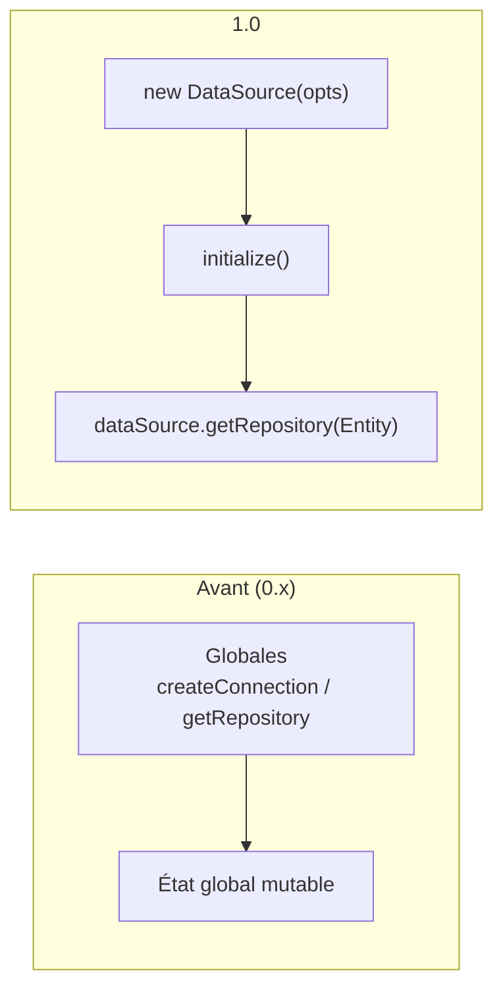

# Tech — Détail du lundi 8 juin 2026

## 1. TypeORM 1.0 — fin de dix ans de pré-1.0, API nettoyée

**Source :** InfoQ — https://www.infoq.com/news/2026/06/typeorm-1-released/
**Date :** juin 2026 (release 1.0.0 le 19 mai 2026)

### Contexte

TypeORM, l'ORM TypeScript/JavaScript créé en 2016, était resté en `0.x` pendant toute son existence. La **1.0.0** signale une reprise de maintenance et modernise la plateforme : ECMAScript 2023, abandon des Node anciens. C'est une étape de stabilité que beaucoup attendaient avant de s'engager sérieusement en production.

Au-delà du numéro, la release est surtout un grand ménage : suppression d'APIs globales legacy, durcissement sécurité sur tous les drivers, et un codemod pour absorber la migration.

### Comment ça marche

Le changement structurant est le passage de `Connection` à **`DataSource`**. Historiquement, TypeORM exposait des globales (`createConnection`, `getConnection`, `getRepository`, `getManager`) qui masquaient un état global mutable, source de bugs en test et en multi-tenant. La 1.0 supprime ces globales : tu instancies un `DataSource` explicite et tu en dérives tes repositories. L'état devient local et injectable.

En parallèle, plusieurs APIs sont retirées (`findByIds`, `findOneById`, `Repository.exist()`, `AbstractRepository`, `@EntityRepository`, `getCustomRepository`, `@RelationCount`). Côté sécurité, l'introspection et le DDL utilisent désormais des **requêtes paramétrées et des identifiants échappés sur tous les drivers**, et les `orderBy` sont validés au runtime — une protection directe contre l'injection via colonne de tri dynamique.



Le **codemod** met à jour imports, renommages et syntaxe d'options avec une preview avant application.

### En pratique — exemple de code

La migration `Connection` → `DataSource`, avant/après.

```ts
// AVANT (TypeORM 0.x) — globales, état implicite
import { createConnection, getRepository } from "typeorm";
await createConnection();                       // connexion globale
const users = await getRepository(User).find(); // repository via global

// APRÈS (TypeORM 1.0) — DataSource explicite et injectable
import { DataSource } from "typeorm";

const dataSource = new DataSource({
  type: "postgres",
  url: process.env.PG_DSN,
  entities: [User],
});
await dataSource.initialize();

const users = await dataSource.getRepository(User).find();

// Nouveauté : INSERT ... SELECT et returning sur update/upsert
await dataSource.getRepository(Archive)
  .createQueryBuilder()
  .insert()
  .values(() => dataSource.getRepository(User).createQueryBuilder("u").select("u.id"))
  .execute();
```

Node 20 est le minimum (16 et 18 abandonnés) : vérifie ton runtime CI avant de lancer le codemod.

### Pourquoi ça compte pour toi

Si tu maintiens du Node/PostgreSQL avec TypeORM, c'est ta fenêtre pour migrer : lance le codemod sur une branche, gère le passage à `DataSource`, et profite des `orderBy` validés et des identifiants échappés — un vrai gain anti-injection. Vérifie d'abord que tes dépendances tierces (NestJS, plugins) suivent la 1.0.

### Points de vigilance

Le passage à `DataSource` casse tout code reposant sur l'état global (helpers, repositories custom via `@EntityRepository`). Audite tes tests : ceux qui s'appuyaient sur une connexion implicite devront injecter le `DataSource`.

---

## 2. Next.js 16.2 — Turbopack et serveur de dev ~400 % plus rapide

**Source :** Next.js Blog — https://nextjs.org/blog/next-16-2-turbopack
**Date :** juin 2026

### Contexte

Turbopack est devenu le bundler par défaut en Next.js 16. La **16.2** capitalise dessus avec plus de 200 correctifs et un focus net sur la vitesse de la boucle de dev et l'outillage pour agents de code.

L'enjeu : sur un gros monorepo, le temps de démarrage et de refresh du serveur de dev est un coût caché majeur de productivité. La 16.2 attaque exactement ce point.

### Comment ça marche

Le gain vient surtout du **Server Fast Refresh par défaut**. Auparavant, modifier un module côté serveur invalidait toute la chaîne d'imports : Next purgeait et recompilait l'arbre dépendant. Désormais, seul le module modifié est rechargé, en s'appuyant sur le graphe de dépendances de Turbopack pour cibler précisément l'invalidation.

Résultat : démarrage du serveur de dev **~400 % plus rapide** (≈87 % de mieux que la 16.1) et refresh applicatif 67–100 % plus rapide. Turbopack ajoute aussi le Subresource Integrity sur le JS émis, le tree shaking des imports dynamiques déstructurés, et le support `postcss.config.ts`. Côté agents, `create-next-app` génère un **`AGENTS.md`**, la doc Markdown version-matchée est bundlée, et les erreurs navigateur peuvent être renvoyées au terminal.


### En pratique — exemple de code

Activer le renvoi des erreurs navigateur vers le terminal — précieux quand un agent de code pilote la boucle de dev sans œil humain sur l'onglet.

```ts
// next.config.ts — Next.js 16.2
import type { NextConfig } from "next";

const config: NextConfig = {
  logging: {
    // Remonte les erreurs runtime du navigateur dans le terminal du dev server
    browserToTerminal: true,
  },
  experimental: {
    // Turbopack lit aussi un postcss.config.ts désormais
  },
};

export default config;
```

```bash
# Le serveur de dev démarre ~400 % plus vite ; Server Fast Refresh actif par défaut
next dev
# create-next-app génère désormais un AGENTS.md pour cadrer les agents de code
npx create-next-app@latest mon-app
```

### Pourquoi ça compte pour toi

Tu es plutôt back/Angular, mais si tu touches un front Next.js (ou supervises une équipe qui le fait), la boucle de dev devient quasi instantanée — moins d'attente sur les gros monorepos. Le `AGENTS.md` standardise le contexte fourni aux agents de code, un pattern qui se généralise bien au-delà de Next.

### Limites

Les gains sont mesurés sur l'app par défaut : ton ressenti dépend de la taille du projet et des plugins. Un pipeline lourd en transformeurs custom ou en CSS-in-JS peut diluer le bénéfice du Server Fast Refresh.
