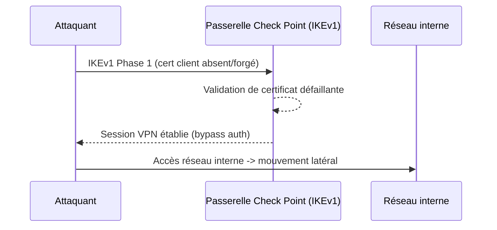
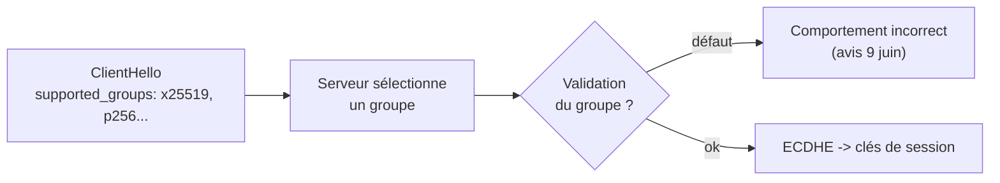

# Tech — Détail du mardi 9 juin 2026

## 1. Check Point CVE-2026-50751 — auth bypass VPN IKEv1 exploité par Qilin

**Source :** Check Point Blog — https://blog.checkpoint.com/security/check-point-releases-important-hotfix-for-vulnerabilities-in-deprecated-ikev1-vpn-protocol/
**Date :** 8 juin 2026

### Contexte

Check Point confirme l'exploitation active de **CVE-2026-50751** (CVSS 9.3), un contournement d'authentification sur Remote Access VPN et Mobile Access. La faille touche uniquement les déploiements utilisant le protocole d'échange de clés **IKEv1 (déprécié)** sans exiger de certificat machine.

Les premières traces d'exploitation remontent au **7 mai 2026**, avec un pic début juin et « quelques dizaines » d'organisations touchées. Au moins un incident est lié au **ransomware Qilin** (confiance moyenne) ; l'infrastructure attaquante exploite aussi des failles Palo Alto, Fortinet et F5.

### Comment ça marche

IKEv1 négocie une session VPN en deux phases. La phase 1 authentifie les deux pairs, souvent via certificat ou clé pré-partagée ; la phase 2 établit les tunnels IPsec. La faille est une **erreur logique dans la validation de certificat** côté phase 1 : le code accepte d'établir la session alors que la preuve d'identité du client n'est pas réellement vérifiée.

Concrètement, un attaquant distant non authentifié engage la négociation IKEv1 et obtient une session VPN **sans mot de passe ni certificat valide**. Une fois dans le tunnel, il dispose d'un accès réseau interne — exactement l'accès initial que recherche un gang ransomware avant de se déplacer latéralement. Une seconde faille, **CVE-2026-50752** (MITM site-to-site sur IKEv1), a été corrigée dans la foulée.



### En pratique — exemple de code

L'action prioritaire est d'appliquer le hotfix et de couper IKEv1. Vérifie d'abord son activation, puis chasse les sessions frauduleuses rétroactivement.

```bash
# 1. IKEv1 est-il encore actif sur la passerelle ? (seul vecteur)
cpstat vpn -f ike_summary           # résumé des négociations IKE
fw tab -t userc_users -s            # sessions Remote Access actives

# 2. Appliquer le hotfix Check Point puis désactiver IKEv1 dans la politique
#    (SmartConsole : Gateway > VPN > IKE > décocher "Support IKEv1")
#    Exiger un certificat machine et migrer vers IKEv2.

# 3. Chasse rétroactive : sessions VPN sans authentification certificat
grep -iE 'IKEv1|Main Mode|Aggressive Mode' /var/log/messages \
  | grep -iv 'certificate verified'
```

L'exploitation précède le patch d'un mois : traite les logs antérieurs au correctif comme potentiellement compromis.

### Pourquoi ça compte pour toi

Si une passerelle Check Point protège ton infra, vérifie aujourd'hui si IKEv1 est encore activé : c'est le seul vecteur. Applique le hotfix, exige un certificat machine, et migre vers IKEv2. Un bypass d'auth VPN exploité par un gang ransomware est un accès initial direct à ton réseau — priorité immédiate.

### Points de vigilance

L'exploitation précède le patch d'un mois (zero-day). Chasse les indicateurs de compromission rétroactivement : une session VPN frauduleuse a pu passer avant le correctif. Croise avec tes logs d'authentification AD et tes alertes de mouvement latéral.

---

## 2. OpenSSL — release de sécurité du 9 juin, migrer vers 3.6.2 / 3.5.x

**Source :** OpenSSL Library — https://openssl-library.org/news/vulnerabilities/
**Date :** 9 juin 2026 (pré-annoncée)

### Contexte

OpenSSL avait pré-annoncé une mise à jour de sécurité pour aujourd'hui, **9 juin 2026**. L'avis pointe notamment un problème de **négociation des groupes d'accord de clés en TLS 1.3** affectant les branches 3.6 et 3.5, avec une montée conseillée vers **OpenSSL 3.6.2** dès sa publication.

OpenSSL est une dépendance transitive de presque toute la stack serveur : son cycle de patch impacte web servers, runtimes et images de base. D'où l'intérêt de comprendre où il se cache avant de réagir.

### Comment ça marche

En TLS 1.3, le handshake commence par un échange de clés éphémère (ECDHE). Le client propose une liste de **groupes** (courbes elliptiques ou groupes finis : `x25519`, `secp256r1`, etc.) ; le serveur en choisit un. Cette **négociation de groupe** est l'étape ciblée par l'avis : un défaut dans la sélection ou la validation du groupe peut provoquer un comportement incorrect côté serveur.

L'avis du jour finalise la liste CVE exacte et les sévérités. Le rappel utile concerne la série 3.6 récente, qui a déjà corrigé des défauts mémoire sérieux : overflow dans `BIO_f_linebuffer`, type confusion `ASN1_TYPE`, écriture hors bornes dans `PKCS12_get_friendlyname()`. Ces classes de bugs (mémoire + parsing) sont exactement celles qui transforment une lib crypto en surface d'attaque.



### En pratique — exemple de code

Inventorier ce qui linke OpenSSL puis vérifier les versions exposées avant de planifier la fenêtre de patch.

```bash
# 1. Version OpenSSL système et runtimes
openssl version -a                    # branche 3.6.x / 3.5.x ?

# 2. Inventaire : quels binaires linkent libssl ? (Debian/Ubuntu)
for bin in $(which nginx node php postgres 2>/dev/null); do
  echo "== $bin =="; ldd "$bin" | grep -i ssl
done

# 3. Images Docker : beaucoup figent une version d'OpenSSL
docker image ls --format '{{.Repository}}:{{.Tag}}' \
  | xargs -I{} sh -c 'echo "== {} =="; docker run --rm {} openssl version 2>/dev/null'

# 4. Correctif TLS 1.3 : monter vers 3.6.2 (ou patch 3.5.x) dès publication
apt-get update && apt-get install --only-upgrade openssl libssl3
```

### Pourquoi ça compte pour toi

OpenSSL est une dépendance transitive de presque toute ta stack : serveurs web, runtimes, conteneurs de base. Planifie une fenêtre de patch et inventorie ce qui linke OpenSSL (images Docker, paquets système, bindings .NET/PHP/Node). Pour TLS 1.3, la mise à jour vers 3.6.2/3.5.x est l'action concrète. Lis l'avis officiel publié aujourd'hui pour les CVE exactes avant de prioriser.

### Limites

Au moment de rédiger, la liste CVE détaillée n'était pas encore en ligne. Ne te base que sur l'avis officiel `openssl-library.org` pour les numéros et sévérités définitifs, pas sur des relais tiers qui peuvent extrapoler la criticité.
