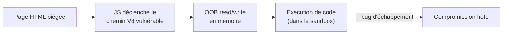
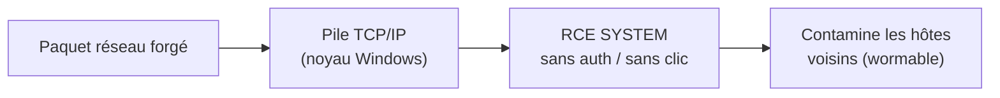
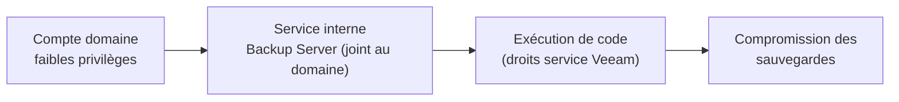

# Tech — Détail du mercredi 10 juin 2026

## 1. Chrome V8 — zero-day CVE-2026-11645 exploité dans la nature

**Source :** The Hacker News — https://thehackernews.com/2026/06/chrome-v8-zero-day-cve-2026-11645.html
**Date :** 9 juin 2026

### Contexte

V8 est le moteur JavaScript et WebAssembly de Chrome. Une faille mémoire y est particulièrement dangereuse : une simple page HTML piégée suffit à déclencher l'exploitation, sans téléchargement ni clic supplémentaire. C'est le cinquième zero-day Chrome corrigé en 2026.

La faille, **CVE-2026-11645** (CVSS 8.8), a été signalée le 27 avril avec une prime de 55 000 $. Google **confirme un exploit actif** dans la nature, ce qui fait passer la mise à jour de « recommandée » à « urgente ».

### Comment ça marche

L'origine est un **out-of-bounds read/write** dans V8 : le moteur accède à de la mémoire hors des limites d'un tampon. Ce type de bug naît typiquement d'une optimisation JIT qui se trompe sur la taille ou le type réel d'un objet, et laisse un script lire ou écrire au-delà des bornes prévues.

L'enchaînement : une page HTML conçue exécute du JavaScript qui déclenche le chemin vulnérable, obtient une primitive de lecture/écriture mémoire, puis l'utilise pour exécuter du code arbitraire. Point crucial : cette exécution reste **confinée au bac à sable** du navigateur. Elle ne devient une compromission complète de la machine que combinée à un second bug d'échappement du sandbox — d'où l'importance de ne pas accumuler les versions en retard.



### En pratique — exemple de code

L'action est de forcer la version corrigée, y compris sur les navigateurs Chromium headless de ta CI.

```bash
# Versions corrigées : 149.0.7827.102/.103 (Win/macOS), .102 (Linux) — publiées le 8 juin
# 1. Vérifier la version locale (Linux)
google-chrome --version            # doit être >= 149.0.7827.103

# 2. CI/CD : Puppeteer/Playwright figent souvent un Chromium embarqué
npx playwright --version
npx playwright install chromium    # re-télécharge le build à jour

# 3. Forcer la maj côté poste de dev puis RELANCER le navigateur
#    (le déploiement auto peut prendre plusieurs jours)
sudo apt-get update && sudo apt-get install --only-upgrade google-chrome-stable
```

Les images de test E2E embarquent une version figée de Chromium : rebumpe-les explicitement, sinon ta CI reste vulnérable même après la maj des postes.

### Pourquoi ça compte pour toi

Si tu utilises Chrome ou un navigateur Chromium (Edge, Brave) comme poste de dev, force la mise à jour vers ≥ 149.0.7827.103 et relance le navigateur — le déploiement auto peut prendre des jours. Pense aussi à tes images CI/CD headless basées sur Chromium (Puppeteer, Playwright) : elles embarquent souvent une version figée à rebumper.

### Points de vigilance

L'exécution reste confinée au sandbox, mais combinée à un échappement elle devient critique. Vérifie les versions Chromium de tes conteneurs de test E2E et épingle-les dans le `Dockerfile` pour éviter une dérive silencieuse.

---

## 2. Microsoft Patch Tuesday juin 2026 — record de ~208 CVE et 3 zero-days

**Source :** BleepingComputer — https://www.bleepingcomputer.com/news/microsoft/microsoft-june-2026-patch-tuesday-fixes-3-zero-day-200-flaws/
**Date :** 9 juin 2026

### Contexte

Le Patch Tuesday de juin est l'un des plus volumineux jamais publiés par Microsoft, avec **≈ 208 CVE** corrigées. Le volume seul complique la priorisation : il faut isoler ce qui est exploité ou critiquement exposé du reste du lot.

Deux entrées dominent la priorité : une EoP Defender déjà exploitée et une RCE noyau réseau au profil wormable.

### Comment ça marche

Deux failles méritent un traitement séparé. **CVE-2026-41091** (CVSS 7.8) est une **élévation de privilèges** dans Microsoft Defender, **activement exploitée** (correctif sorti en out-of-band le 19 mai, intégré ici). Une EoP suppose un accès initial, mais sert de second étage classique pour passer d'un compte standard à SYSTEM.

**CVE-2026-45657** (CVSS 9.8) est la plus dangereuse : une **RCE noyau Windows via la pile TCP/IP**, exécutable en SYSTEM **sans authentification ni interaction**. Ce trio de propriétés (réseau, sans auth, sans clic) est la définition d'une faille « wormable » : un hôte compromis peut contaminer ses voisins automatiquement. Selon la Zero Day Initiative, un bug est exploité et trois autres sont publiquement connus à la sortie.



### En pratique — exemple de code

En attendant le déploiement complet, réduis l'exposition réseau des hôtes Windows et vérifie l'état de patch.

```powershell
# 1. Le correctif de juin est-il appliqué ? (remplace KBxxxxxxx par le KB du mois)
Get-HotFix | Where-Object { $_.HotFixID -eq "KB5099999" }

# 2. Réduire la surface TCP/IP exposée le temps du déploiement :
#    restreindre l'accès entrant aux seuls sous-réseaux d'admin
New-NetFirewallRule -DisplayName "Restrict-TCPIP-Mgmt" -Direction Inbound `
  -Action Allow -RemoteAddress 10.0.10.0/24 -Profile Domain

# 3. Forcer la recherche/installation des mises à jour
Install-Module PSWindowsUpdate -Force
Get-WindowsUpdate -Install -AcceptAll -AutoReboot
```

### Pourquoi ça compte pour toi

CVE-2026-45657 est du type « wormable » : RCE noyau réseau, sans auth ni clic. Si tu exposes des serveurs Windows (même internes), planifie le patch en urgence et restreins l'exposition TCP/IP entre-temps. L'EoP Defender exploitée mérite aussi une priorité haute sur tes postes et serveurs. Traite ces deux-là avant le reste du lot.

### Limites

Le chiffre exact de CVE varie légèrement selon les décomptes (Microsoft vs. tiers). L'essentiel : deux entrées à patcher immédiatement, le reste selon ton exposition réelle.

---

## 3. Veeam Backup & Replication — RCE critique CVE-2026-44963

**Source :** BleepingComputer — https://www.bleepingcomputer.com/news/security/new-veeam-vulnerability-exposes-backup-servers-to-rce-attacks/
**Date :** 9 juin 2026

### Contexte

Les serveurs de sauvegarde sont une cible de choix des rançongiciels : compromettre le backup, c'est supprimer le filet de sécurité avant de chiffrer. Veeam B&R revient régulièrement dans les advisories pour cette raison.

**CVE-2026-44963** (CVSS v4 9.4) est une RCE sur le Backup Server, exploitable par **tout utilisateur de domaine à faibles privilèges**. Elle n'affecte que les installations **jointes à un domaine**.

### Comment ça marche

Le Backup Server expose des services internes accessibles aux comptes du domaine. La faille permet à un compte standard — sans aucun privilège d'administration backup — d'atteindre un de ces services et d'y faire exécuter du code, aboutissant à une RCE avec les droits du service Veeam.

Le pré-requis « joint au domaine » est central : c'est l'appartenance au domaine qui rend la surface d'attaque atteignable depuis un compte utilisateur banal. Les versions touchées sont les **12.3.2.4465 et antérieures** de la branche 12, corrigées en **12.3.2.4854**. Les builds **13.x ne sont pas affectés** grâce à des changements d'architecture qui suppriment la classe de vulnérabilité.



### En pratique — exemple de code

Vérifier la build et, mieux, isoler le serveur de sauvegarde du domaine — la recommandation Veeam de longue date.

```powershell
# 1. Build installée ? (vulnérable si <= 12.3.2.4465 ; corrigé en 12.3.2.4854)
(Get-ItemProperty "HKLM:\SOFTWARE\Veeam\Veeam Backup and Replication").CorePackageVersion

# 2. Le serveur est-il joint au domaine ? (seul cas affecté)
(Get-CimInstance Win32_ComputerSystem).PartOfDomain    # True => exposé

# 3. Meilleure pratique : sortir le Backup Server du domaine -> workgroup isolé
#    (réduit la surface bien au-delà de cette seule CVE)
Remove-Computer -WorkgroupName "BACKUP-ISO" -Force -Restart
```

### Pourquoi ça compte pour toi

Si tu administres un Backup Server Veeam joint au domaine, c'est une cible directe : un compte utilisateur banal suffit pour du RCE. Mets à jour vers 12.3.2.4854 immédiatement, ou — meilleure pratique Veeam de longue date — sors le Backup Server du domaine et place-le dans un workgroup isolé. Vérifie aussi tes accès et journaux récents par précaution.

### Points de vigilance

Le pré-requis « joint au domaine » réduit la surface mais reste la config la plus répandue en entreprise. Migrer vers la branche 13.x élimine la classe de vulnérabilité plutôt que de la corriger ponctuellement.
