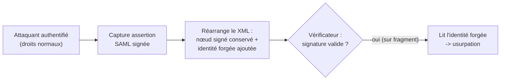
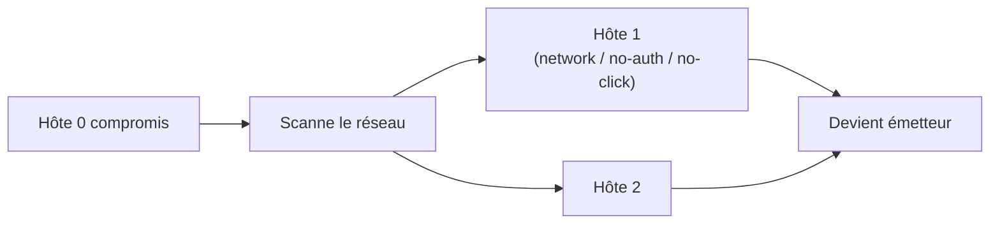

# Tech — Détail du jeudi 11 juin 2026

## 1. SAP CVE-2026-44748 — XML Signature Wrapping sur SAML NetWeaver (CVSS 9.9)

**Source :** SecurityWeek — https://www.securityweek.com/sap-patches-critical-netweaver-commerce-vulnerabilities/
**Date :** 9 juin 2026 (SAP Security Patch Day)

### Contexte

Le Patch Day SAP de juin 2026 corrige une faille critique notée **9.9** dans l'authentification SAML de SAP NetWeaver AS ABAP et ABAP Platform. La note SAP `3746332` couvre une vulnérabilité de type **XML Signature Wrapping** : une classe d'attaque connue depuis quinze ans mais qui ressurgit dès qu'un vérificateur valide mal la portée d'une signature XML.

La surface est très large : `SAP_BASIS` versions **702 à 919**. La mitigation temporaire (désactiver SAML) casse le SSO et ne couvre pas tous les usages de XML signé.

### Comment ça marche

Une signature XML (XML-DSig) ne signe pas forcément tout le document : elle référence un nœud par son `Id` via un élément `<Reference URI="#...">`. Le vérificateur valide cryptographiquement le nœud référencé. Le piège : si après validation il **lit l'identité ailleurs dans le document** que dans le nœud signé, l'attaquant peut dissocier les deux.

Le scénario : un attaquant **déjà authentifié** avec des droits normaux récupère une assertion SAML signée valide. Il **réarrange la structure XML** — déplace ou duplique des nœuds — pour insérer une identité forgée à l'endroit que le code applicatif lit réellement, tout en gardant le nœud signé d'origine pour que la signature passe. Le vérificateur confirme « signature valide » et accepte l'identité falsifiée.



### En pratique — exemple de code

La défense est de valider la signature sur **le document complet** et de refuser les références hors du périmètre signé. Exemple .NET avec `SignedXml`.

```csharp
// Vérification SAML durcie contre le XML Signature Wrapping (.NET)
var signedXml = new SignedXml(xmlDoc);
var sig = (XmlElement)xmlDoc.GetElementsByTagName(
    "Signature", "http://www.w3.org/2000/09/xmldsig#")[0];
signedXml.LoadXml(sig);

// 1. Exiger qu'il n'y ait qu'UNE référence et qu'elle couvre l'élément attendu
if (signedXml.SignedInfo.References.Count != 1)
    throw new SecurityException("Nombre de références inattendu (wrapping ?)");

var reference = (Reference)signedXml.SignedInfo.References[0];
var signedId = reference.Uri.TrimStart('#');

// 2. Vérifier que l'identité lue provient bien du nœud signé, pas d'un autre
var assertion = xmlDoc.GetElementById(signedId)
    ?? throw new SecurityException("Référence vers un nœud absent/déplacé");

// 3. Valider la signature (sans suivre les transforms non sûrs)
if (!signedXml.CheckSignature(cert, verifySignatureOnly: false))
    throw new SecurityException("Signature invalide");

// 4. N'extraire l'identité QUE de l'élément validé
var subject = assertion.SelectSingleNode(".//*[local-name()='NameID']")?.InnerText;
```

La règle d'or : ne lire les données de confiance que dans le sous-arbre effectivement signé.

### Pourquoi ça compte pour toi

Si tu intègres du SSO SAML ou que tu signes des assertions XML côté .NET/Symfony, tu dois vérifier que ta lib valide la signature sur **le document complet**, pas sur un fragment référencé. Le XML Signature Wrapping touche tout vérificateur laxiste, pas seulement SAP. Audite tes `SignedXml` (.NET) et tes flux SAML applicatifs.

### Points de vigilance

La faille exige un compte valide : ce n'est pas une RCE non authentifiée, mais l'escalade vers une identité arbitraire franchit les frontières de confiance. Patche en priorité les systèmes exposés à des utilisateurs internes peu fiables.

---

## 2. CVE-2026-45657 — faille Windows « wormable » du Patch Tuesday de juin

**Source :** Zero Day Initiative — https://www.zerodayinitiative.com/blog/2026/6/9/the-june-2026-security-update-review
**Date :** 9 juin 2026 (Patch Tuesday)

### Contexte

Le Patch Tuesday de juin 2026 a établi un record (~208 CVE, 38 critiques). Au-delà du volume, un correctif se distingue : **CVE-2026-45657**, qui affecte Windows 11 et Windows Server avec un profil **wormable**.

Microsoft la classe parmi les correctifs prioritaires du mois, distincte des trois zero-days déjà exploités couverts par ailleurs.

### Comment ça marche

Le vecteur CVSS confirme les trois propriétés qui rendent une faille auto-propageable : **Attack Vector: Network**, **Authentication: None**, **User Interaction: None**. Réunies, elles signifient qu'un paquet réseau suffit, sans qu'aucun identifiant ni geste de la victime ne soit requis.

La conséquence opérationnelle est la propagation en chaîne : un hôte compromis devient lui-même émetteur, scanne ses voisins et les contamine de la même manière. C'est le mécanisme qui a permis aux vers réseau historiques de se répandre à l'échelle d'un parc en minutes. Pas besoin d'un opérateur derrière chaque infection — la faille se rejoue toute seule d'hôte en hôte.



### En pratique — exemple de code

Au-delà du patch, la défense en profondeur est la segmentation réseau pour briser la propagation latérale.

```powershell
# 1. Statut du correctif de juin sur l'hôte (remplace par le KB du mois)
Get-HotFix | Where-Object HotFixID -eq "KB5099999"

# 2. Casser la propagation : bloquer le trafic latéral entre postes,
#    n'autoriser que les segments d'administration légitimes
New-NetFirewallRule -DisplayName "Block-Lateral-East-West" -Direction Inbound `
  -Action Block -RemoteAddress LocalSubnet -Profile Domain `
  -Protocol TCP -LocalPort 135,139,445

# 3. Inventaire des hôtes non patchés via WSUS/Intune avant la fenêtre habituelle
Get-WindowsUpdate -MicrosoftUpdate | Where-Object Title -match "2026-06"
```

### Pourquoi ça compte pour toi

Une faille wormable sur Windows Server vise directement tes machines d'hébergement .NET et tes contrôleurs internes. Déploie le correctif de juin sans attendre ta fenêtre de patch habituelle, et segmente le réseau pour limiter la propagation latérale si un hôte tombe. La combinaison « réseau + sans auth + sans interaction » est exactement le profil exploité en masse.

### Limites

Aucune exploitation publique active n'est confirmée à ce jour pour cette CVE précise, mais le profil wormable rend la fenêtre avant arme courte. Traite-la comme urgente et ne te repose pas sur l'absence actuelle d'exploit.
