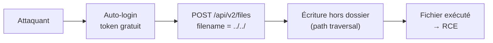
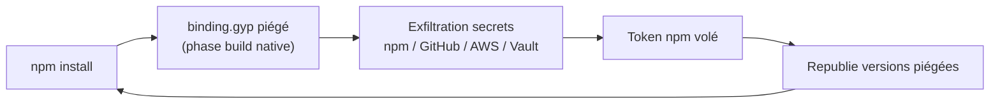
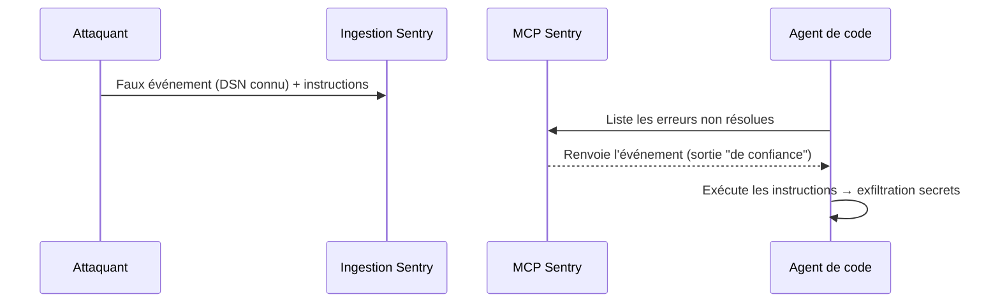

# Tech — Détail du dimanche 14 juin 2026

## 1. Langflow CVE-2026-5027 — RCE non authentifiée sur la plateforme IA, exploitée et non patchée

**Source :** The Hacker News — https://thehackernews.com/2026/06/unpatched-langflow-flaw-cve-2026-5027.html
**Date :** 10 juin 2026

### Contexte

Langflow est une plateforme open-source de construction d'apps LLM via des flows visuels. Elle est sous **exploitation active** depuis début juin. VulnCheck a ajouté `CVE-2026-5027` à sa liste KEV le 8 juin, après détection in-the-wild par ses capteurs Canary.

Le problème dépasse la seule faille. Langflow active par défaut un **auto-login non authentifié** : n'importe qui obtient un token de session valide en une requête. Combine ça à un path traversal et tu obtiens une RCE sans le moindre credential. Avec ~7 000 instances exposées sur Internet (requête Censys de VulnCheck), la surface est massive.

### Comment ça marche

La chaîne d'attaque est courte et brutale. L'endpoint `POST /api/v2/files` accepte un upload multipart. Le paramètre `filename` n'est **pas assaini** : un attaquant y glisse une séquence de path traversal (`../../`) pour écrire un fichier **hors du dossier d'upload prévu**.

En écrivant un fichier Python dans un emplacement importé par le runtime, ou un script lancé par un worker, « écrire un fichier » devient « exécuter du code ». L'auto-login fournit le token requis pour atteindre l'endpoint sans authentification réelle. Les attaques observées écrivent d'abord des fichiers de test — précurseur classique avant un payload destructeur.



La cause racine est un classique : on fait confiance à une entrée utilisateur (`filename`) pour construire un chemin de système de fichiers.

### En pratique — exemple de code

Pas de correctif au 10 juin : la mitigation est **réseau**, pas applicative. Sors Langflow d'Internet et coupe l'auto-login. Vérifie ensuite côté reverse-proxy et applicatif.

```bash
# 1. Couper l'auto-login Langflow (variable d'environnement)
export LANGFLOW_AUTO_LOGIN=false
export LANGFLOW_SUPERUSER=admin
export LANGFLOW_SUPERUSER_PASSWORD='<motdepasse-fort>'

# 2. Restreindre l'accès réseau au front (allow-list / VPN) côté NGINX
#    Refuse tout sauf le subnet d'admin avant même d'atteindre Langflow.
#    location / { allow 10.8.0.0/24; deny all; proxy_pass http://langflow_up; }

# 3. Chasse aux fichiers écrits récemment dans/hors le dossier d'upload
find / -newermt '2026-06-01' -type f -name '*.py' 2>/dev/null | grep -vi site-packages
```

Si des fichiers suspects existent, considère l'instance compromise et reconstruis-la proprement.

### Pourquoi ça compte pour toi

Si une équipe a déployé Langflow pour prototyper des chaînes LLM, considère-le comme compromis jusqu'à preuve du contraire. Sors-le d'Internet, coupe l'auto-login, audite les fichiers récents. Le pattern « outil IA exposé + défaut non authentifié » se répète : applique le même réflexe à tout dashboard d'IA interne.

### Points de vigilance

Au 10 juin, **pas de correctif disponible** : ne compte que sur la défense réseau ([BleepingComputer](https://www.bleepingcomputer.com/news/security/path-traversal-flaw-in-ai-dev-platform-langflow-exploited-in-attacks/)).

---

## 2. Node-gyp — attaque supply-chain npm via `binding.gyp` exécuté à l'installation

**Source :** Snyk — https://snyk.io/blog/node-gyp-supply-chain-compromise-self-propagating-npm-worm-binding-gyp/
**Date :** juin 2026

### Contexte

Snyk suit une compromission supply-chain visant l'écosystème `node-gyp` : **57 paquets** affectés, des centaines de versions malveillantes. Elle s'ajoute à la vague npm de juin, après Miasma/Red Hat début juin.

La nouveauté inquiétante : la charge est **auto-propagatrice** (worm). Un poste de dev infecté republie automatiquement des versions piégées des paquets dont le développeur a les droits de publication. La compromission se diffuse donc d'elle-même dans le registre npm.

### Comment ça marche

`node-gyp` compile les addons natifs Node à partir d'un fichier `binding.gyp`. Ce fichier décrit la build native et est lu **pendant `npm install`**, en phase de build, avant même que tu lances ton application.

Un `binding.gyp` piégé déclenche l'exécution de code attaquant à ce moment précis. Le payload moissonne les credentials de dev **et** de CI/CD : tokens npm et GitHub, clés AWS, GCP, Azure, secrets HashiCorp Vault, kubeconfig. Avec un token npm volé, le worm republie des paquets et boucle.



Le build natif est un angle mort par conception : il exécute du code arbitraire.

### En pratique — exemple de code

Coupe l'exécution des scripts d'install par défaut et fige tes dépendances. C'est la défense la plus efficace contre ce vecteur.

```bash
# 1. Désactiver l'exécution des scripts lifecycle par défaut (global)
npm config set ignore-scripts true

# 2. En CI : install reproductible depuis le lockfile, sans scripts
npm ci --ignore-scripts

# 3. Si un addon natif légitime exige sa build, l'autoriser ciblé seulement
npm rebuild sharp        # build explicite, paquet par paquet, après revue
```

```json
// .npmrc projet — verrouille le comportement pour toute l'équipe et la CI
{
  "ignore-scripts": true,
  "audit-level": "high"
}
```

### Pourquoi ça compte pour toi

C'est l'attaque la plus directe pour toi cette semaine. Tout `npm install`, local ou en pipeline, peut exfiltrer tes secrets cloud et tes tokens. Active `--ignore-scripts` par défaut, épingle tes versions (lockfile + `npm ci`), et fais tourner tes builds dans des conteneurs éphémères sans secrets longue durée. Vérifie qu'aucun token npm/GitHub n'a fuité côté CI.

### Pour aller plus loin

Si tu as installé des paquets suspects récemment, la **rotation des credentials** AWS/Azure/Vault est ta première action, avant même le nettoyage des postes.

---

## 3. Agentjacking — un faux bug Sentry détourne ton agent de code (injection MCP)

**Source :** The Hacker News — https://thehackernews.com/2026/06/agentjacking-attack-tricks-ai-coding.html
**Date :** 12 juin 2026

### Contexte

Tenet Security décrit **Agentjacking**, une nouvelle classe d'attaque. Un **faux rapport d'erreur Sentry** suffit à faire exécuter du code arbitraire par un agent de code IA sur la machine du dev. Les chiffres font mal : **2 388 organisations** identifiées avec des DSN injectables, et **85 %** de réussite sur 100+ organisations testées.

### Comment ça marche

La faille est architecturale, à l'intersection de deux composants de confiance. D'abord, **l'ingestion Sentry** : elle accepte des événements de quiconque connaît le DSN, sans authentification forte. Ensuite, le **serveur MCP Sentry** : il renvoie ces événements à l'agent comme une sortie système digne de confiance.

Quand l'agent interroge Sentry pour lister les erreurs non résolues, il **ne distingue pas** un vrai crash d'un événement injecté. Un attaquant pousse donc un faux rapport contenant des instructions — une injection de prompt indirecte. L'agent les exécute : exfiltration de variables d'env, clés AWS, tokens OAuth GitHub/GitLab, tokens npm, config Docker, kubeconfig, secrets CI/CD.



### En pratique — exemple de code

Tu ne corriges pas Sentry : tu cloisonnes l'agent. Traite toute sortie MCP comme une **entrée utilisateur non fiable** et exige une validation humaine avant exécution.

```yaml
# Politique MCP : tout outil avalant du contenu externe est "non fiable"
mcp_servers:
  sentry:
    trust: untrusted          # contenu injectable → jamais auto-exécuté
    auto_run_commands: false   # confirmation humaine obligatoire
    allowed_tools: [list_issues, get_issue]   # lecture seule, pas d'exec
agent:
  require_human_approval_for: [shell, file_write, network]
```

Côté Sentry, restreins qui peut soumettre des événements et fais tourner les DSN exposés publiquement.

### Pourquoi ça compte pour toi

Tu utilises sûrement MCP et un agent de code. Le danger : tout contenu externe avalé par un serveur MCP (tickets, erreurs, issues) devient une **surface d'injection de prompt** que l'agent traite comme fiable. Traite les sorties MCP comme des entrées non fiables, restreins les DSN Sentry, et n'autorise pas l'agent à exécuter des commandes sans validation humaine.

### Limites

L'attaque **contourne EDR, WAF, IAM, VPN et firewall** : chaque action est techniquement autorisée. La défense est architecturale (cloisonnement des outils MCP), pas périmétrique ([Tenet Security](https://tenetsecurity.ai/blog/agentjacking-coding-agents-with-fake-sentry-errors/)).
