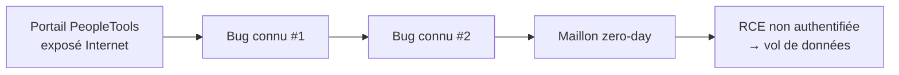
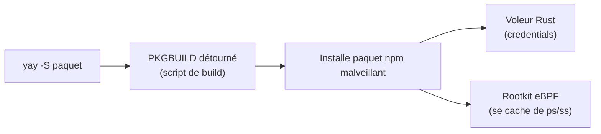

# Tech — Détail du lundi 15 juin 2026

## 1. Oracle PeopleSoft CVE-2026-35273 — zero-day RCE exploité par ShinyHunters

**Source :** BleepingComputer — https://www.bleepingcomputer.com/news/security/oracle-mitigates-peoplesoft-zero-day-exploited-in-data-theft-attacks/
**Date :** 11 juin 2026

### Contexte

Oracle a publié une alerte de sécurité hors-cycle pour `CVE-2026-35273`, une faille critique de PeopleTools **8.61** et **8.62**. Le groupe d'extorsion ShinyHunters l'exploite comme zero-day depuis le 27 mai. Google/Mandiant a confirmé l'activité le 10 juin.

L'ampleur est sérieuse : plus de **300 instances** touchées dans **100+ organisations**, le secteur de l'éducation en première ligne. Des données volées sont déjà publiées sur le Data Leak Site de ShinyHunters depuis le 9 juin. La note CVSS atteint **9.8** pour une RCE non authentifiée à distance.

### Comment ça marche

L'intérêt technique ici n'est pas une CVE isolée mais une **gadget chain** : l'attaquant enchaîne plusieurs failles connues de PeopleTools avec une partie zero-day. Aucune des briques ne suffit seule ; assemblées, elles franchissent l'authentification et atteignent l'exécution de code.

C'est précisément ce qui rend la défense « une CVE = un patch » inopérante. Un correctif qui ne couvre qu'un maillon de la chaîne laisse le chemin global ouvert. Les portails PeopleTools exposés sur Internet sont la porte d'entrée.



### En pratique — exemple de code

Au-delà des mitigations Oracle hors-cycle (à appliquer immédiatement), retire les portails d'Internet et chasse les indicateurs de compromission dans les logs d'accès.

```bash
# 1. Lister les portails PeopleTools exposés publiquement (audit de surface)
ss -ltnp | grep -E ':(8000|8443|443)\b'        # ports web PIA typiques

# 2. Chasse IoC : requêtes anormales vers les servlets PeopleTools depuis le net
grep -E 'psc/|psp/|/PSIGW/' /var/log/nginx/access.log \
  | awk '$1 !~ /^10\.|^192\.168\./ {print}' \
  | sort | uniq -c | sort -rn | head

# 3. Restreindre l'accès admin au VPN avant même le patch (pare-feu)
iptables -A INPUT -p tcp --dport 8443 ! -s 10.8.0.0/24 -j DROP
```

### Pourquoi ça compte pour toi

Si tu opères ou héberges du PeopleSoft, traite ça comme une urgence : applique les mitigations Oracle, sors les portails PeopleTools d'Internet, chasse les IoC. Même sans PeopleSoft, retiens le pattern : les ERP exposés restent des cibles de choix, et une chaîne « vieux bug + zero-day » contourne les défenses qui ne couvrent qu'une CVE isolée.

---

## 2. « Atomic Arch » — 1 500+ paquets AUR piégés (voleur Rust + rootkit eBPF)

**Source :** The Hacker News — https://thehackernews.com/2026/06/over-400-arch-linux-aur-packages.html
**Date :** 11–12 juin 2026

### Contexte

Depuis le 11 juin, une campagne baptisée « Atomic Arch » détourne des paquets de l'Arch User Repository (AUR). Les attaquants adoptent des **paquets orphelins** — abandonnés par leur mainteneur — via le processus officiel d'adoption, puis modifient le `PKGBUILD`.

La progression est rapide : 1ʳᵉ vague de **408 paquets** (Sonatype), puis 2ᵉ vague le 12 juin avec **1 500+** paquets. Paquets cités : `atomic-lockfile`, `js-digest`, `lockfile-js`. Les dépôts officiels Arch ne sont **pas** affectés. Symptômes côté poste infecté : connexions réseau et CPU anormaux au repos.

### Comment ça marche

L'AUR n'est pas un dépôt de binaires : c'est une collection de recettes de build. Chaque paquet fournit un `PKGBUILD`, un script shell exécuté localement par ton helper AUR (`yay`, `paru`) au moment de la compilation. La confiance est totale et implicite.

Ici, le `PKGBUILD` détourné installe un **paquet npm malveillant** pendant la compilation. La charge utile combine un **voleur de credentials écrit en Rust** et un **rootkit eBPF**. Le rootkit eBPF s'attache au noyau et masque ses processus et connexions aux outils d'inspection standards (`ps`, `ss`, `top`), ce qui rend la détection difficile.



### En pratique — exemple de code

La parade tient en un réflexe : **lire le `PKGBUILD` avant chaque build**, surtout sur un paquet récemment adopté.

```bash
# 1. Forcer l'inspection du PKGBUILD avant compilation (paru)
paru --review atomic-lockfile     # ouvre PKGBUILD + .install pour relecture

# 2. Signaux d'alerte à chercher dans un PKGBUILD :
#    - source=() pointant vers un registre npm ou une URL inattendue
#    - npm install / curl | sh dans build() ou package()
grep -nE 'npm (install|i)|curl .*\| ?(ba)?sh|wget .*\| ?(ba)?sh' PKGBUILD

# 3. Détecter une activité eBPF suspecte sur le poste
bpftool prog show          # liste les programmes eBPF chargés
ss -tnp                     # peut être masqué par le rootkit → recouper
```

### Pourquoi ça compte pour toi

L'AUR n'est pas audité : chaque `yay -S` exécute du code arbitraire. Si tu développes sous Arch, inspecte tout `PKGBUILD` avant build, méfie-toi des paquets récemment « adoptés », et audite tes credentials (npm, GitHub, cloud) au moindre doute. Le pattern « paquet abandonné repris en douce » s'applique aussi à npm et PyPI : la confiance par défaut dans les écosystèmes communautaires est le vrai trou.
