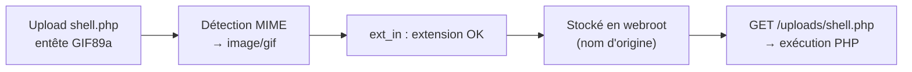
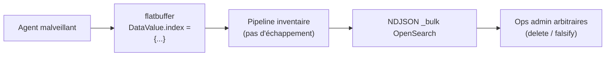
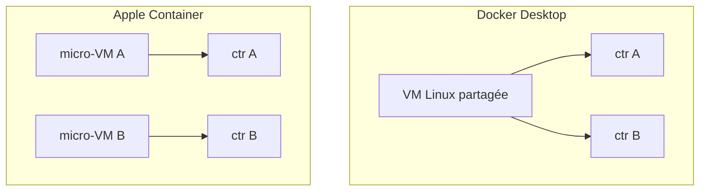
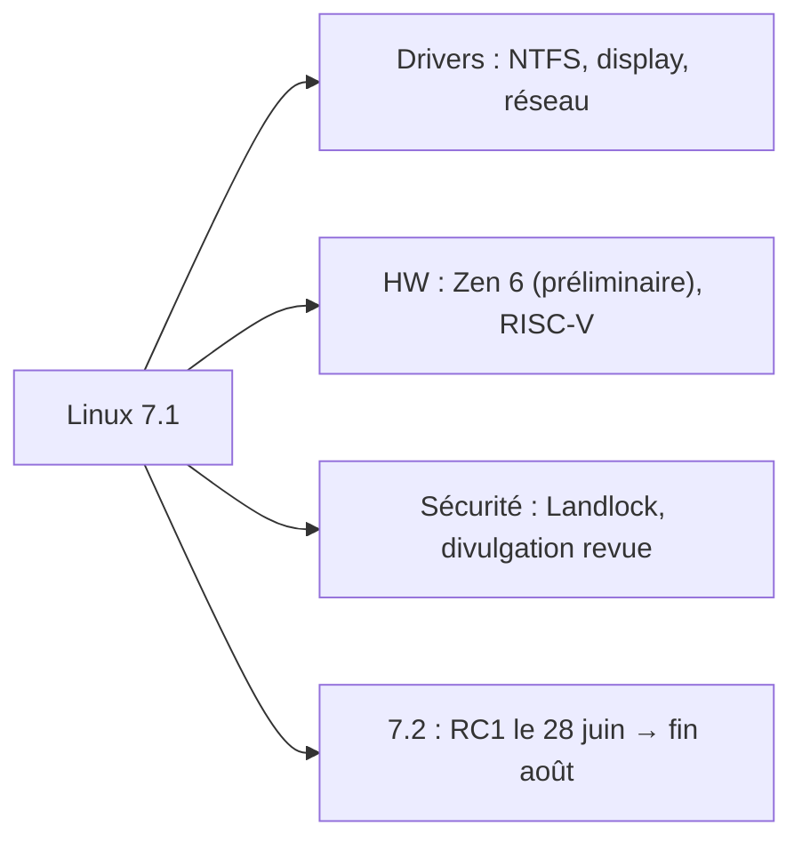

# Tech — Détail du mardi 16 juin 2026

## 1. CodeIgniter CVE-2026-48062 — RCE via bypass du contrôle d'upload (CVSS 9.8)

**Source :** Daily CyberSecurity — https://securityonline.info/codeigniter-cve-2026-48062/
**Date :** 15 juin 2026

### Contexte

CodeIgniter est l'un des frameworks PHP les plus déployés. La faille `CVE-2026-48062` (CVSS **9.8**) touche sa validation des fichiers uploadés et ouvre la porte à une exécution de code arbitraire. Vu la base installée, le rayon d'impact est large.

L'install par défaut n'expose aucun endpoint d'upload : tout le monde n'est pas exposé. Mais dès que ton appli accepte des fichiers utilisateur et s'appuie sur la règle native pour les valider, le risque est réel. Correctif : **CodeIgniter v4.7.3**.

### Comment ça marche

La règle de validation `ext_in` est censée n'autoriser que certaines extensions. Le bug : elle faisait confiance à l'extension **dérivée du type MIME** plutôt qu'au vrai nom de fichier. Or le type MIME est calculé à partir du contenu, et un contenu peut être maquillé.

Un attaquant forge un fichier `shell.php` dont les premiers octets imitent un GIF (`GIF89a...`). La détection MIME le classe `image/gif`, l'extension dérivée passe le filtre `ext_in`, et le fichier est accepté. Si l'appli le stocke sous son **nom d'origine** dans un dossier public servi par PHP, une requête vers `shell.php` l'exécute.



Trois conditions doivent s'aligner : uploads acceptés, validation par `ext_in`, stockage public sous nom d'origine.

### En pratique — exemple de code

Au-delà du passage en 4.7.3, applique les défenses de fond : renomme, valide la vraie extension, stocke hors webroot et coupe l'exécution PHP côté serveur.

```php
<?php
// Validation d'upload robuste — ne jamais se fier au MIME seul
$file = $this->request->getFile('document');

$allowed = ['pdf', 'png', 'jpg'];
$realExt = strtolower($file->getClientExtension());      // extension déclarée
if (!$file->isValid() || !in_array($realExt, $allowed, true)) {
    throw new \RuntimeException('Type de fichier refusé.');
}

// Nom aléatoire + stockage HORS webroot
$newName = $file->getRandomName();
$file->move(WRITEPATH . 'uploads', $newName);            // pas dans public/
```

```nginx
# Coupe l'exécution de tout script dans le dossier d'upload (défense en profondeur)
location ^~ /uploads/ {
    location ~ \.php$ { deny all; return 403; }
}
```

### Pourquoi ça compte pour toi

Tu fais du PHP/Symfony : le motif est universel. Audite tes routes d'upload, ne fais jamais confiance à l'extension MIME, renomme avec un `getRandomName()`, stocke hors webroot et coupe l'exécution de scripts dans les dossiers d'upload. Passe en revue les fichiers déjà déposés.

---

## 2. Wazuh 5.0 — injection CVSS 10 dans le pipeline d'inventaire (OpenSearch bulk)

**Source :** Daily CyberSecurity — https://securityonline.info/wazuh-cvss-10-vulnerability/
**Date :** 15 juin 2026

### Contexte

Wazuh est un SIEM/XDR open source très répandu. Une faille **CVSS 10** vient d'être documentée avec PoC public, ciblant le pipeline de télémétrie d'inventaire de la branche **5.0**.

Le détail des versions est important pour la priorisation. Sont affectés les `wazuh-manager` ≥ `5.0.0-beta1`. Les branches **4.x ne sont pas concernées** : le chemin de synchronisation d'inventaire n'existe pas. Correctif : **5.0.0-beta3**, advisory `GHSA-ff9g-85jq-r3g3`.

### Comment ça marche

Le pipeline d'inventaire de Wazuh 5.0 reçoit des données d'agents sous forme flatbuffer. Il transfère un champ fourni par l'agent (`DataValue.index`) **directement** dans un corps NDJSON `OpenSearch_bulk`, **sans échappement**.

L'API `_bulk` d'OpenSearch utilise le **saut de ligne comme délimiteur** entre métadonnées et documents. Un agent malveillant injecte donc des `\n` et des lignes d'action forgées dans `DataValue.index`. Ces opérations bulk arbitraires s'exécutent sous les **credentials admin** du manager (keystore local, rôles all-access par défaut). Résultat : suppression de documents, falsification d'alertes, payloads persistants dans les dashboards — destruction de preuves forensiques en plein incident.



### En pratique — exemple de code

Le correctif amont est le passage en `5.0.0-beta3`. Le principe défensif réutilisable : **toute donnée venant d'un agent est non fiable** et doit être sérialisée proprement, jamais concaténée dans du NDJSON.

```python
# Construire un corps _bulk SÛR : on sérialise chaque ligne, on n'interpole jamais
import json

def bulk_body(index_name: str, docs: list[dict]) -> str:
    # index_name vient d'une source de confiance, PAS de l'agent
    lines = []
    for doc in docs:
        lines.append(json.dumps({"index": {"_index": index_name}}))  # action
        lines.append(json.dumps(doc))                                # source
    return "\n".join(lines) + "\n"   # json.dumps neutralise tout \n injecté
```

### Pourquoi ça compte pour toi

Si tu testes Wazuh 5.0 beta sur un lab ou un POC, monte tout de suite en `5.0.0-beta3` avant de brancher des agents non maîtrisés. Ta prod en 4.x reste sûre sur ce point : pas d'urgence de migration vers la 5.0 motivée par ce CVE.

---

## 3. Apple Container 1.0.0 — VM Linux légères natives sur Apple Silicon

**Source :** Daily CyberSecurity — https://securityonline.info/apple-container-1-0-apple-silicon-linux-vms/
**Date :** 13 juin 2026

### Contexte

Apple a publié sur GitHub (`apple/container`) la version **1.0.0** de son outil CLI open source écrit en Swift, présenté en preview à la WWDC 2025. Objectif : exécuter des conteneurs Linux nativement sur les Mac Apple Silicon.

Prérequis : Apple Silicon, idéalement **macOS 26 Tahoe** ou plus récent. Sur macOS 15 Sequoia, les fonctionnalités sont limitées (pas de réseau inter-conteneurs, gestion mémoire imparfaite). L'outil est compatible **OCI** : pull, build et push vers des registries standard.

### Comment ça marche

Le modèle d'isolation tranche avec Docker Desktop. Docker Desktop fait tourner **une grosse VM Linux partagée** dans laquelle vivent tous les conteneurs. Apple Container, lui, place **chaque conteneur dans sa propre micro-VM** (paquet Swift `Containerization`), avec un montage minimal des données hôte.

L'isolation est donc plus forte : une évasion de conteneur ne donne accès qu'à une micro-VM jetable, pas à un noyau Linux mutualisé avec tous tes autres conteneurs. Quatre apports notables en 1.0 : persistance d'état d'une « Container Machine » (stop/restart en conservant le filesystem), configuration en **TOML**, copie de fichiers hôte ↔ conteneur, et sortie structurée pour l'automatisation CI/CD.



### En pratique — exemple de code

Le workflow reste familier pour qui vient de Docker, avec une config déclarative TOML en plus.

```bash
# Démarrer le service, lancer un conteneur, monter un dossier hôte
container system start
container run --rm -it --volume "$PWD:/app" alpine:3.20 sh

# Build OCI puis push vers un registry standard
container build -t registry.example.com/api:1.0 .
container push registry.example.com/api:1.0
```

```toml
# container.toml — config déclarative d'une Container Machine (persistance d'état)
[machine]
name = "dev"
cpus = 4
memory = "8GB"          # surveille la mémoire : point faible actuel sur Sequoia
```

### Pourquoi ça compte pour toi

Si tu développes sur Mac, c'est une alternative crédible à Docker Desktop : meilleure isolation par conteneur et perfs natives Apple Silicon. Évalue-la sur un service jetable, mais garde en tête les limites mémoire actuelles avant d'y lancer plusieurs conteneurs lourds en continu.

---

## 4. Linux Kernel 7.1 — stabilité, nouveau driver NTFS, AMD Zen 6

**Source :** Daily CyberSecurity — https://securityonline.info/linux-kernel-7-1-release/
**Date :** 15 juin 2026

### Contexte

Le noyau **Linux 7.1** est sorti : c'est la première mise à jour mineure de la série 7.x. Elle est centrée sur la stabilité et la correction de drivers récalcitrants plutôt que sur de grosses nouveautés.

Calendrier de la suite : la merge window de 7.2 ouvre bientôt, **RC1 le 28 juin**, sortie 7.2 visée fin août. Si tu vises de la prod sereine sur du matériel très récent, ce jalon compte.

### Comment ça marche

Une release mineure du noyau agrège surtout des correctifs ciblés. Ici : drivers display, réseau et audio corrigés, corrections mémoire et synchronisation d'horloge. Un **nouveau driver NTFS kernel-level** améliore compatibilité et performances sur partitions Windows.

Côté matériel, 7.1 apporte un support **préliminaire AMD Zen 6**, des optimisations Intel récentes et une compatibilité RISC-V élargie. Deux points structurants : la politique de divulgation de sécurité a été revue pour absorber l'**afflux de rapports de bugs générés par IA**, et **Landlock** (le LSM de sandboxing non privilégié) reçoit des raffinements. Landlock permet à un process de **restreindre lui-même** ses accès fichiers, utile pour durcir un service applicatif.



### En pratique — exemple de code

Pour un serveur, l'enjeu concret est de durcir tes services. Landlock laisse un process s'auto-restreindre aux seuls chemins dont il a besoin.

```bash
# 1. Vérifier la version et la dispo de Landlock après upgrade
uname -r                                  # attendu : 7.1.x
grep -i landlock /boot/config-$(uname -r) # CONFIG_SECURITY_LANDLOCK=y

# 2. Valider en staging les drivers sensibles avant prod (réseau notamment)
ethtool -i eth0        # driver/firmware réseau effectivement chargé
dmesg --level=err,warn | grep -iE 'ntfs|amd|landlock'
```

### Pourquoi ça compte pour toi

Côté desktop, l'upgrade 7.0.x → 7.1 est sans histoire. Côté serveurs (PostgreSQL, conteneurs), valide en staging avant la prod : surveille surtout les drivers réseau et le comportement Landlock. Si tu provisionnes du matériel Zen 6 ou RISC-V, 7.1 améliore la prise en charge, mais attends la 7.2 pour de la prod sereine.
