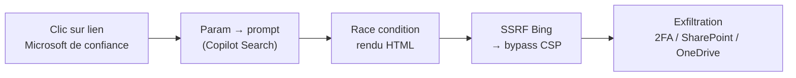
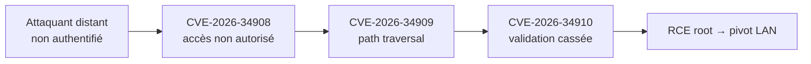
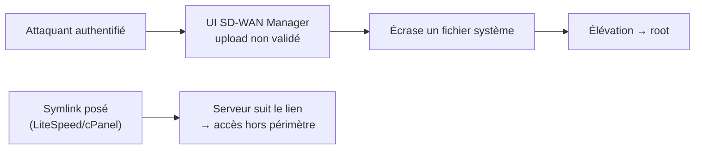

# Tech — Détail du mercredi 17 juin 2026

## 1. Microsoft 365 Copilot « SearchLeak » (CVE-2026-42824) — exfiltration en un clic

**Source :** The Hacker News — https://thehackernews.com/2026/06/one-click-microsoft-365-copilot-flaw.html
**Date :** 15 juin 2026

### Contexte

Varonis a divulgué « SearchLeak », une faille de M365 Copilot Enterprise permettant de voler des données via un seul clic sur un lien Microsoft de confiance. C'est la troisième chaîne d'exfiltration Copilot de Varonis, après Reprompt (janvier 2026) et l'EchoLeak zero-click d'Aim Security (2025).

Microsoft indique avoir corrigé côté service : aucune action client requise. Mais la faille est déjà patchée n'efface pas la leçon — le pattern se généralisera à tous les assistants IA branchés sur des données privées.

### Comment ça marche

La chaîne combine trois étages, chacun anodin seul, dévastateur ensemble. D'abord une **injection de prompt via paramètre** (parameter-to-prompt) dans Copilot Search : un paramètre d'URL contrôlé par l'attaquant se retrouve interprété comme instruction par le LLM. Ensuite une **race condition de rendu HTML** : la sortie du modèle est rendue avant que les protections s'appliquent. Enfin un **bypass de CSP** rendu possible par une **SSRF côté Bing**, qui permet d'exfiltrer vers un domaine contrôlé.

Données atteignables : codes 2FA, e-mails, détails de réunions, fichiers SharePoint et OneDrive accessibles à la victime. Un clic sur un lien Microsoft légitime suffisait. Le point clé : Copilot hérite des **droits de l'utilisateur**, donc l'injection accède à tout ce que la victime peut voir.



### En pratique — exemple de code

Tu ne corriges pas Copilot, mais tu construis sûrement des intégrations LLM analogues. Traite toute sortie LLM rendue en HTML comme hostile : CSP stricte, pas de SSRF, échappement systématique.

```ts
// Rendu sûr d'une réponse LLM : on échappe, on n'injecte jamais de HTML brut
import DOMPurify from 'dompurify';

function renderLlmOutput(raw: string): string {
  // 1. Aucune balise active : pas de , pas de <a> exfiltrant
  return DOMPurify.sanitize(raw, { ALLOWED_TAGS: ['p', 'code', 'pre', 'strong'] });
}
```

```nginx
# 2. CSP stricte côté service : interdit l'appel sortant vers un domaine tiers
add_header Content-Security-Policy
  "default-src 'self'; img-src 'self'; connect-src 'self'; frame-ancestors 'none'";
```

### Pourquoi ça compte pour toi

Même si c'est une faille SaaS déjà patchée, la leçon te concerne directement : tout assistant IA branché sur tes données (Copilot, RAG interne, agent maison) hérite des droits de l'utilisateur. Traite les sorties LLM rendues en HTML comme du contenu hostile, applique une CSP stricte et bloque toute SSRF dans tes intégrations. L'injection indirecte de prompt est la nouvelle XSS.

### Points de vigilance

Le pattern « lien de confiance + rendu + SSRF » se généralisera. Audite tes propres surfaces Copilot/agents pour des sorties auto-rendues.

---

## 2. Ubiquiti UniFi OS — triple faille CVSS 10, RCE root non authentifiée

**Source :** BleepingComputer — https://www.bleepingcomputer.com/news/security/ubiquiti-patches-three-max-severity-unifi-os-vulnerabilities/
**Date :** semaine du 15 juin 2026

### Contexte

Ubiquiti a publié des correctifs d'urgence pour trois vulnérabilités de sévérité maximale (CVSS **10**) dans UniFi OS, le système qui pilote contrôleurs réseau, caméras et passerelles UniFi. Censys recense près de **100 000** endpoints UniFi OS exposés sur Internet, dont ~50 000 aux États-Unis.

Les correctifs sont disponibles, mais la fenêtre d'exploitation de masse est ouverte vu l'exposition. C'est exactement le profil qui finit scanné en masse en quelques jours.

### Comment ça marche

Trois CVE chaînables, toutes exploitables par un attaquant distant **non authentifié** :

- **CVE-2026-34908** : contrôle d'accès incorrect (atteindre une fonction normalement protégée) ;
- **CVE-2026-34909** : path traversal (lire/écrire hors des chemins prévus) ;
- **CVE-2026-34910** : validation d'entrée incorrecte.

Enchaînées, elles donnent une **exécution de code à distance avec privilèges root**, sans authentification. Le contrôle d'accès cassé ouvre la porte, le path traversal place un fichier au bon endroit, la validation défaillante déclenche l'exécution. Un contrôleur compromis devient un pivot vers tout le LAN.



### En pratique — exemple de code

Patche maintenant, puis vérifie que l'UI d'admin n'est pas exposée — l'erreur la plus courante.

```bash
# 1. L'UI UniFi OS répond-elle depuis l'extérieur ? (à exécuter HORS de ton LAN)
curl -sk -o /dev/null -w '%{http_code}\n' https://<ip-publique>:443

# 2. Bloquer l'accès admin depuis Internet au niveau du pare-feu amont
#    Autorise uniquement le subnet d'admin / VPN.
iptables -A INPUT -p tcp --dport 443 ! -s 10.8.0.0/24 -j DROP
iptables -A INPUT -p tcp --dport 8443 ! -s 10.8.0.0/24 -j DROP

# 3. Vérifier la version après mise à jour UniFi OS
#    (Console > Settings > System > Updates, ou via SSH : info)
```

### Pourquoi ça compte pour toi

Si tu as du matériel UniFi (au bureau, en home-lab, chez un client), mets à jour UniFi OS **maintenant** et sors les interfaces d'admin d'Internet. Un contrôleur compromis = pivot dans tout le LAN. Vérifie aussi que ton contrôleur n'expose pas son UI publiquement — c'est l'erreur la plus courante.

### Points de vigilance

~100 000 instances exposées : c'est exactement le profil qui finit scanné en masse en quelques jours. N'attends pas l'ajout au CISA KEV.

---

## 3. Cisco SD-WAN Manager + LiteSpeed cPanel ajoutés au CISA KEV

**Source :** CISA — https://www.cisa.gov/news-events/alerts/2026/06/15/cisa-adds-two-known-exploited-vulnerabilities-catalog
**Date :** 15-16 juin 2026

### Contexte

La CISA a ajouté deux failles activement exploitées à son catalogue KEV. La plus notable, **CVE-2026-20262**, touche Cisco Catalyst SD-WAN Manager — c'est la **deuxième faille SD-WAN exploitée en deux semaines** chez Cisco, après CVE-2026-20245.

Le KEV n'oblige légalement que le fédéral US, mais c'est ton meilleur signal de priorisation : ces deux failles sont exploitées **maintenant**.

### Comment ça marche

`CVE-2026-20262` (CVSS 6.5) est une **écriture de fichier arbitraire** dans l'UI web de SD-WAN Manager. L'interface ne valide pas les uploads. Un attaquant **authentifié** envoie une requête HTTP forgée, écrase des fichiers, puis **élève vers root**. La note CVSS modérée trompe : couplée à un compte compromis, la chaîne vers root est courte. Exploitation « limitée et ciblée », signe d'un acteur sophistiqué. Deadline fédérale : **29 juin**.

`CVE-2026-54420` vise le plugin LiteSpeed pour cPanel via **symlink following** : le serveur suit un lien symbolique posé par l'attaquant pour accéder à des fichiers hors de son périmètre. Trivial à exploiter en hébergement mutualisé. Deadline fédérale urgente : **18 juin**.



### En pratique — exemple de code

Patche, puis restreins l'accès à l'UI de gestion et durcis le suivi de symlinks côté hébergement.

```bash
# 1. Restreindre l'UI SD-WAN Manager à une bastion / VPN (pare-feu amont)
iptables -A INPUT -p tcp --dport 443 ! -s 10.20.0.0/24 -j DROP

# 2. cPanel/LiteSpeed : désactiver le suivi de symlinks hors propriétaire
#    Apache/LiteSpeed : SymLinksIfOwnerMatch au lieu de FollowSymLinks
#    (WHM > Apache Configuration > Symlink Race Condition Protection)
grep -RnE 'FollowSymLinks' /etc/apache2/ /usr/local/apache/conf/ 2>/dev/null
```

### Pourquoi ça compte pour toi

Si tu opères du Cisco SD-WAN, patche et restreins l'accès à l'UI de gestion : même « authentifié », le chemin vers root est court une fois un compte compromis. Côté hébergement, si tes serveurs tournent sous cPanel + LiteSpeed, applique le correctif du plugin sans attendre — le symlink following est trivial à exploiter en mutualisé.

### Points de vigilance

Le KEV n'oblige légalement que le fédéral US, mais c'est ton meilleur signal de priorisation : ces deux failles sont exploitées maintenant.
