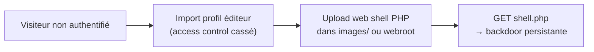
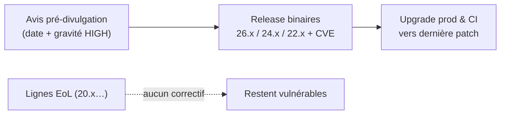

# Tech — Détail du jeudi 18 juin 2026

## 1. Joomla JCE CVE-2026-48907 — RCE non authentifiée (CVSS 10.0) au CISA KEV

**Source :** The Hacker News — https://thehackernews.com/2026/06/cisa-warns-of-actively-exploited-joomla.html
**Date :** 17 juin 2026

### Contexte

Joomla Content Editor (JCE), de Widget Factory, est l'éditeur WYSIWYG le plus installé de l'écosystème Joomla. Une faille d'`improper access control` y permet à un visiteur non authentifié de se créer un profil d'éditeur, puis d'uploader et d'exécuter du PHP. Le 16 juin, CISA l'a ajoutée à son catalogue Known Exploited Vulnerabilities (KEV).

Les faits : CVE-2026-48907, CVSS **10.0**, exploitation active confirmée. Versions vulnérables JCE **1.0.0 → 2.9.99.4**, corrigé en **2.9.99.5** (3 juin 2026). L'exploit est public et les attaques sont **automatisées** : « un site sans inscription publique n'est pas à l'abri » (Joomla). Cible privilégiée : serveurs web **Linux** hébergeant Joomla. CISA impose une remédiation prioritaire au fédéral US (BOD 26-04).

### Comment ça marche

Le contrôle d'accès défaillant laisse un visiteur **non authentifié** importer un profil d'éditeur malveillant — une opération normalement réservée à un compte privilégié. Ce profil débloque les fonctions d'upload de JCE.

L'attaquant dépose alors un **web shell** PHP, généralement dans un dossier servi par le serveur web (`images/` ou le webroot). Une simple requête HTTP vers ce fichier exécute le code : la backdoor est persistante. La chaîne complète a été révélée par Phil E. Taylor (mySites.guru). Comme tout est automatisé, l'absence d'inscription ouverte ne protège pas.



### En pratique — exemple de code

Au-delà du passage en `2.9.99.5`, chasse les web shells et les profils créés récemment. Un patch ne supprime jamais une backdoor déjà posée.

```bash
# 1. Version JCE installée (chercher l'XML du manifest)
grep -R '<version>' /var/www/joomla/components/com_jce/ 2>/dev/null | head

# 2. Chasse aux web shells : .php inattendus sous images/ et le webroot
find /var/www/joomla/images -type f -name '*.php' -newermt '2026-06-01'
grep -RlE 'eval\(|base64_decode\(|assert\(|\$_(GET|POST|REQUEST)\[' \
  /var/www/joomla/images /var/www/joomla 2>/dev/null

# 3. IoC dans les logs : uploads et appels directs aux fichiers déposés
grep -E 'POST .*com_jce|GET .*/images/.*\.php' /var/log/apache2/access.log
```

### Pourquoi ça compte pour toi

Si tu héberges ou administres un site Joomla — ou si un client en a un — patche JCE en `2.9.99.5` sans attendre. Vérifie les profils d'éditeur créés récemment et cherche des `.php` inattendus dans `images/` et le webroot. L'exploitation étant automatisée, l'absence d'inscription ouverte ne protège pas.

### Points de vigilance

Un patch ne supprime pas une backdoor déjà posée. Si le serveur a pu être exposé avant correction, considère-le compromis : audite les logs d'upload, fais la chasse aux web shells, et reconstruis proprement en cas de doute.

---

## 2. Node.js — releases de sécurité du 17 juin 2026 (26.x, 24.x, 22.x)

**Source :** Node.js — https://nodejs.org/en/blog/vulnerability/june-2026-security-releases
**Date :** 17 juin 2026

### Contexte

Le projet Node.js publie ses correctifs de sécurité par fenêtres coordonnées. Une nouvelle salve est sortie le mercredi **17 juin 2026** sur les trois lignes maintenues : **26.x** (Current), **24.x** (LTS) et **22.x**.

La gravité maximale annoncée est **HIGH** sur chacune des trois lignes. L'avis pré-divulgation ne détaillait pas encore les CVE : le détail accompagne la sortie des binaires. Rappel du projet : **toute version EoL est affectée** dès qu'une release de sécurité paraît, sans correctif disponible.

### Comment ça marche

Le processus suit un rythme prévisible. Un **avis pré-divulgation** annonce d'abord la date et la gravité sans révéler les CVE — fenêtre pour planifier la fenêtre de maintenance. Puis les **binaires patchés** sortent simultanément sur les lignes maintenues, accompagnés des numéros de CVE et des notes de version. Les lignes EoL (20.x et antérieures) ne reçoivent rien : elles restent vulnérables.

L'action attendue est simple : monter vers la dernière patch de **ta** ligne dès publication. Le piège classique est le tag Docker flottant (`node:24`) qui peut ne pas pointer immédiatement vers la patch corrigée, ou figer une ancienne sans que tu le saches.



### En pratique — exemple de code

Mets à jour runtimes et images, et **épingle des tags patchés explicites** plutôt qu'un tag flottant pour garantir la reproductibilité.

```bash
# 1. Quelle ligne suis-je en train de faire tourner ? (prod + CI)
node -v                       # ex. v24.x.y → monter vers la dernière 24.x

# 2. Surveiller les annonces officielles de CVE Node.js
#    Liste nodejs-sec + notes de version dès publication des binaires.
```

```dockerfile
# Épingle un tag patché explicite, pas un node:24 flottant
FROM node:24.13.1-bookworm-slim   # version corrigée précise → build reproductible
# Évite : FROM node:24  (peut figer une patch antérieure ou bouger sous toi)
```

### Pourquoi ça compte pour toi

Mets à jour tes runtimes Node en prod et en CI vers la dernière patch de ta ligne (24.x si tu es en LTS). Si tu traînes une 20.x ou plus ancienne en fin de vie, elle reste vulnérable sans correctif : planifie la montée vers 24.x. Pense aussi à tes images Docker `node:*` et aux runners de tes pipelines.

### Détails techniques

Surveille la liste `nodejs-sec` et les notes des nouvelles versions pour le détail des CVE une fois publié. Épingle des tags patchés explicites dans tes `Dockerfile` plutôt qu'un `node:24` flottant, pour garantir la reproductibilité du correctif.
