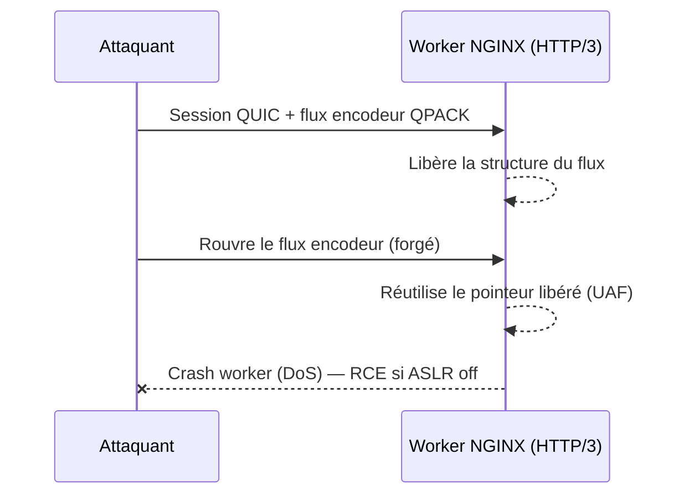
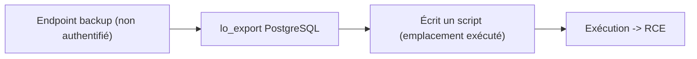

# Tech — Détail du samedi 20 juin 2026

## 1. NGINX HTTP/3 — CVE-2026-42530 : use-after-free corrigé en urgence par F5

**Source :** The Hacker News — https://thehackernews.com/2026/06/f5-patches-two-critical-nginx-open.html
**Date :** 18 juin 2026

### Contexte

F5 a publié des correctifs hors-cycle (out-of-band) pour deux failles critiques de NGINX Open Source : `CVE-2026-42530` et `CVE-2026-42055`. La première touche le module HTTP/3 `ngx_http_v3_module`, actif dès que tu sers du QUIC. NGINX patche rarement en urgence hors de son cycle habituel — c'est un signal à prendre au sérieux.

### Comment ça marche

Pour comprendre l'urgence, il faut voir d'où vient le *use-after-free* (UAF). HTTP/3 transporte ses en-têtes compressés avec **QPACK**, qui maintient un « flux d'encodeur » dédié par session. Le bug : une session HTTP/3 forgée **rouvre** ce flux après sa libération. NGINX continue d'utiliser un pointeur vers une structure déjà libérée → lecture/écriture dans de la mémoire recyclée.

- **Conséquence la plus probable** : le worker plante et redémarre → déni de service.
- **Pire cas** : si l'attaquant réussit à re-remplir la zone libérée avec des données contrôlées (*heap grooming*), il oriente l'exécution → **RCE** si l'ASLR est désactivé ou contournable.



### En pratique — exemple de code

Diagnostiquer puis corriger en deux minutes :

```bash
# 1. Suis-je vulnérable ? (1.31.0–1.31.1 AVEC HTTP/3 actif)
nginx -v                              # version
nginx -T | grep -i 'listen.*quic'     # HTTP/3 activé quelque part ?

# 2a. Correctif définitif : passer en 1.31.2+
apt-get update && apt-get install --only-upgrade nginx   # ou image Docker nginx:1.31.2

# 2b. Mitigation immédiate si tu ne peux pas patcher tout de suite :
#     retirer 'quic' des directives listen, puis recharger
#     listen 443 quic reuseport;  ->  listen 443 ssl;
nginx -s reload
```

### Pourquoi ça compte pour toi

Si tu exposes une API ou un front derrière NGINX avec HTTP/3, tu es directement concerné. Vérifie ta version et tes `listen ... quic`, puis passe en 1.31.2+ ou coupe QUIC le temps du patch. Le risque réaliste est un DoS de ta passerelle ; le RCE reste conditionnel mais sérieux.

### Pour aller plus loin | Pièges

HTTP/3 est souvent activé sans qu'on s'en souvienne (templates, reverse-proxy managé). Audite aussi tes images Docker NGINX : beaucoup figent une version. Référence éditeur : [F5 K000161616](https://my.f5.com/manage/s/article/K000161616).

---

## 2. Splunk CVE-2026-20253 — RCE pré-auth via le sidecar PostgreSQL, déjà exploitée

**Source :** BleepingComputer — https://www.bleepingcomputer.com/news/security/cisa-splunk-enterprise-flaw-actively-exploited-patch-by-sunday/
**Date :** 18 juin 2026

### Contexte

Splunk a divulgué `CVE-2026-20253` (avis SVD-2026-0603) le 10 juin. La faille vise le **sidecar PostgreSQL** embarqué dans Splunk Enterprise. Depuis : PoC public watchTowr le 12, exploitation observée dès le 15, **ajout au catalogue CISA KEV le 18** avec une échéance de remédiation ce dimanche.

### Comment ça marche

C'est la leçon la plus utile de la semaine, car elle dépasse Splunk : **comment une simple écriture de fichier devient une RCE via PostgreSQL.**

1. Des endpoints de backup/restore sont exposés **sans authentification**.
2. PostgreSQL gère des *large objects* avec `lo_import` / `lo_export`. `lo_export` écrit le contenu d'un large object **vers un fichier du serveur**, avec les droits du process postgres.
3. En écrivant un script à un emplacement exécuté (cron, hook, page servie), l'attaquant transforme « écrire un fichier » en « exécuter du code ». S'ajoutent du path traversal et un traitement non sûr de paramètres.



### En pratique — exemple de code

Au-delà de patcher Splunk (10.2.4 / 10.0.7), vérifie que **tes** rôles PostgreSQL applicatifs ne peuvent pas faire la même chose :

```csharp
// Audit Npgsql : le rôle applicatif est-il superuser / trop privilégié ?
await using var conn = new NpgsqlConnection(connectionString);
await conn.OpenAsync();
await using var cmd = new NpgsqlCommand(
    "SELECT rolsuper, rolbypassrls FROM pg_roles WHERE rolname = current_user", conn);
await using var r = await cmd.ExecuteReaderAsync();
if (await r.ReadAsync() && (r.GetBoolean(0) || r.GetBoolean(1)))
    throw new InvalidOperationException(
        "Rôle applicatif trop privilégié : lo_export/lo_import exploitables.");
```

```sql
-- Principe du moindre privilège : un rôle applicatif ne doit pas pouvoir écrire des fichiers serveur.
REVOKE pg_write_server_files FROM app_role;
```

### Pourquoi ça compte pour toi

Deux raisons. Si tu opères un Splunk, patche **maintenant** : exploitation active, échéance CISA ce week-end. Plus largement, en tant qu'utilisateur PostgreSQL : `lo_export` + large objects transforment une écriture en RCE. Assure-toi que tes rôles applicatifs ne sont ni superuser ni membres de `pg_write_server_files`.

### Pour aller plus loin

La primitive d'écriture seule suffit à compromettre la config. Voir l'analyse [watchTowr / Orca Security](https://orca.security/resources/blog/cve-2026-20253-splunk-enterprise-rce-unauthenticated-file-operations/) et l'entrée [CISA KEV](https://www.cisa.gov/known-exploited-vulnerabilities-catalog).
