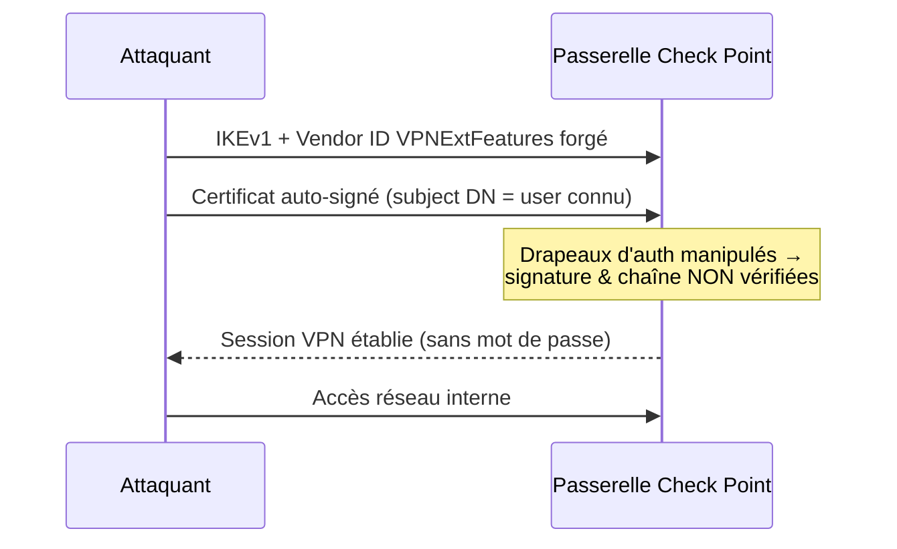

# Tech — Détail du dimanche 21 juin 2026

## 1. Check Point Remote Access VPN — CVE-2026-50751 : bypass d'authentification IKEv1

**Source :** Check Point Blog — https://blog.checkpoint.com/security/check-point-releases-important-hotfix-for-vulnerabilities-in-deprecated-ikev1-vpn-protocol/
**Date :** juin 2026 (exploitation observée depuis le 7 mai 2026)

### Contexte

Beaucoup de passerelles Check Point acceptent encore l'**IKEv1**, le vieux protocole d'échange de clés, pour ne pas casser de clients VPN legacy. `CVE-2026-50751` (CVSS 9.3) transforme ce compromis en porte d'entrée : un attaquant ouvre une session **Remote Access VPN sans mot de passe ni certificat valide**. La faille est activement exploitée — un affilié du ransomware **Qilin** s'en est servi pour du post-compromis — et une **PoC publique** circule. Trois pré-requis côté cible : clients legacy acceptés, IKEv1 autorisé (pas IKEv2-only), authentification par certificat machine non obligatoire.

### Comment ça marche

Pendant la négociation IKEv1, le client envoie des **Vendor ID payloads** qui annoncent des capacités. Le bug : un payload `VPNExtFeatures` forgé permet de **manipuler les drapeaux d'authentification**. Le code vulnérable, en validant le certificat présenté, **saute la vérification de signature et de la chaîne de confiance** — il se contente de vérifier que le *subject DN* du certificat correspond à un utilisateur provisionné. Autrement dit : présente un certificat auto-signé dont le DN cite un utilisateur connu, et la passerelle t'ouvre la session.



C'est un cas d'école de **validation de confiance incomplète** : vérifier l'identité affichée sans vérifier la preuve cryptographique.

### En pratique — durcir la configuration

Le hotfix corrige le code, mais tu dois aussi fermer la surface. Côté Global Properties / Remote Access :

```text
# Mitigations (en plus du hotfix Check Point)
1. Authentification Remote Access VPN : IKEv2 uniquement
   Global Properties > Remote Access > VPN Authentication = IKEv2 only
2. Retirer le support du client Remote Access legacy (désactive IKEv1)
3. Rendre l'authentification par certificat machine OBLIGATOIRE
   (un certificat valide signé par ta CA, pas un simple DN qui "résout")
4. Restreindre l'exposition de l'interface d'admin par IP source
```

Vérifie ensuite tes logs de session VPN : connexions avec un certificat dont l'émetteur est inconnu = signal d'alerte.

### Pourquoi ça compte pour toi

Si tu opères ou dépends d'un accès Check Point, c'est une urgence : un attaquant entre sur le réseau interne **sans credential**, et Qilin l'utilise déjà comme tête de pont ransomware. Même si tu ne gères pas le VPN, c'est le rappel que tout protocole **déprécié mais laissé actif** (IKEv1, TLS 1.0, SMBv1) reste une dette de sécurité exploitable. Audite ce que tu actives « au cas où ».

### Limites

L'exploitation suppose IKEv1 réellement autorisé : un déploiement IKEv2-only avec certificat machine obligatoire n'est pas vulnérable. Mais beaucoup de configs laissent le legacy ouvert par défaut.

---

## 2. Chrome / V8 — CVE-2026-11645 : zero-day mémoire exploité dans la nature

**Source :** Help Net Security — https://www.helpnetsecurity.com/2026/06/09/google-chrome-zero-day-cve-2026-11645/
**Date :** correctif Stable du 8 juin 2026

### Contexte

`CVE-2026-11645` (CVSS 8.8) est un **out-of-bounds memory access** dans **V8**, le moteur JavaScript et WebAssembly de Chrome. Google a reconnu qu'« un exploit existe dans la nature » — c'est le **5ᵉ zero-day Chrome de 2026**. La faille a été rapportée le 27 avril par un chercheur (pseudo « 303f06e3 »), récompensé 55 000 $, puis corrigée dans la Stable du 8 juin (74 correctifs au total). Versions sûres : **149.0.7827.102/.103** (Windows/macOS) et **.102** (Linux).

### Comment ça marche

V8 compile le JavaScript en code natif via JIT. Un **accès hors-bornes** survient quand le moteur lit ou écrit au-delà des limites d'un tampon — typiquement un `TypedArray` dont la longueur supposée par le code optimisé diverge de la longueur réelle après une optimisation spéculative. L'attaquant fabrique une **page HTML piégée** qui déclenche ce décalage, corrompt la mémoire du tas V8, puis enchaîne vers de l'**exécution de code dans le bac à sable** du *renderer*. Sans seconde faille d'évasion de sandbox, l'impact reste confiné au processus de rendu — mais c'est déjà suffisant pour voler des données de session.

### En pratique — forcer la mise à jour du parc

Tu ne « patches » pas V8 à la main : tu forces Chrome à jour. Vérifie et impose la version minimale.

```bash
# Linux : vérifier la version installée
google-chrome --version            # doit être >= 149.0.7827.102

# Forcer une mise à jour côté Debian/Ubuntu
sudo apt-get update && sudo apt-get install --only-upgrade google-chrome-stable
```

```json
// Chrome Enterprise (policy) : exiger une version mini et relancer
{
  "BrowserVersionMinimum": "149.0.7827.102",
  "RelaunchNotification": 2,            // 2 = relance forcée après délai
  "RelaunchNotificationPeriod": 86400000 // 24 h en ms
}
```

Déploie cette policy via GPO (Windows) ou le fichier de policies JSON (Linux/macOS) pour ne pas dépendre du bon vouloir des utilisateurs.

### Pourquoi ça compte pour toi

Ton navigateur est la surface d'attaque la plus exposée de ton poste de dev : extensions, onglets, previews d'apps. Un zero-day V8 exploité signifie qu'une simple page suffit. Pousse la mise à jour sur tes machines et celles de l'équipe aujourd'hui, et active la relance forcée. Pense aussi aux navigateurs Chromium dérivés (Edge, Brave) qui embarquent le même V8.

### Limites

L'exécution reste *a priori* contenue dans la sandbox du renderer sans chaîne d'évasion ; le risque réel dépend des secondes failles disponibles. Mais « exploité dans la nature » + détails non publiés par Google = ne pas temporiser.
