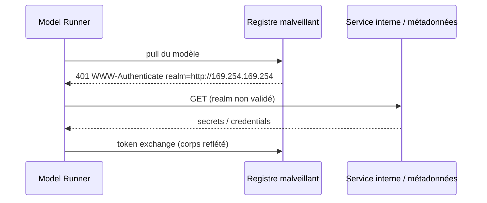
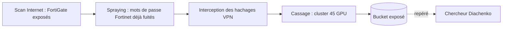
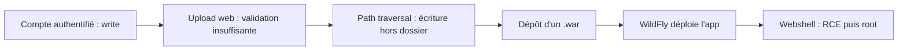

# Tech — Détail du lundi 22 juin 2026

## 1. Docker Model Runner — SSRF via le client OCI (CVE-2026-33990)

**Source :** GitHub Security Advisory (GHSA-x2f5-332j-9xwq) — https://github.com/docker/model-runner/security/advisories/GHSA-x2f5-332j-9xwq
**Date :** juin 2026

### Contexte

Docker Model Runner est la brique récente qui télécharge et exécute des modèles d'IA empaquetés comme artefacts OCI, directement depuis Docker Desktop. Une faille **SSRF (Server-Side Request Forgery)** y a été corrigée. Le problème : lors de l'authentification à un registre OCI, le client suit aveuglément l'URL fournie par le registre, sans la valider. Un registre malveillant peut donc faire émettre au runner des requêtes vers le réseau interne de ta machine.

C'est typique des nouvelles surfaces d'attaque amenées par l'IA : un composant pensé pour « juste tirer un modèle » devient un proxy vers tes services internes et tes credentials cloud.

### Comment ça marche

Le flux OCI commence par un défi d'authentification. Le registre renvoie un en-tête `WWW-Authenticate` contenant un champ `realm` : l'URL où aller chercher un token. Le bug est que Model Runner **ne valide ni le schéma, ni l'hôte, ni la plage d'IP** de ce `realm`.

Un attaquant héberge un registre piégé. Quand tu fais `docker model pull` chez lui, il répond avec un `realm` pointant vers `http://127.0.0.1` ou vers l'endpoint de métadonnées cloud (`169.254.169.254`). Le runner, qui tourne sur ton hôte, émet la requête GET et **renvoie le corps de la réponse** au registre via l'échange de token. L'attaquant lit ainsi des services internes et exfiltre des secrets.



### En pratique — exemple de code

La correction est une montée de version. En attendant, l'isolation renforcée bloque l'accès au runner.

```bash
# Vulnérable : Model Runner < 1.1.25 (Docker Desktop < 4.67.0)
docker version --format '{{.Server.Version}}'

# Correctif : mettre à jour Docker Desktop >= 4.67.0 (Model Runner 1.1.25+)
#   puis vérifier
docker model version

# Mitigation immédiate : activer Enhanced Container Isolation (ECI)
#   -> bloque l'accès des conteneurs au Model Runner
```

### Pourquoi ça compte pour toi

Si tu testes des modèles via Docker Model Runner sur ton poste ou en CI, tu exposes potentiellement ton réseau interne et tes clés cloud à n'importe quel registre tiers. Mets Docker Desktop à jour (≥ 4.67.0) et n'« pull » des modèles que depuis des registres de confiance. En CI cloud, l'endpoint de métadonnées est la cible juteuse : restreins-y l'accès (IMDSv2, hop limit).

---

## 2. FortiBleed — 74 000 identifiants VPN Fortinet exposés sans 0-day

**Source :** Help Net Security — https://www.helpnetsecurity.com/2026/06/18/fortinet-fortibleed-data-leak/
**Date :** 18 juin 2026

### Contexte

Près de **74 000 pare-feu et passerelles VPN Fortinet** ont vu leurs identifiants exposés dans une fuite baptisée **FortiBleed**. Fait notable : aucune nouvelle vulnérabilité n'a été utilisée. Les opérateurs ont industrialisé une attaque par **credential spraying** ciblée, puis ont laissé fuiter leur propre butin sur un bucket cloud non sécurisé, repéré par le chercheur Volodymyr « Bob » Diachenko. La CISA a publié une alerte de durcissement le même jour.

L'ampleur est massive : environ la moitié des FortiGate accessibles sur Internet seraient concernés, dans 194 pays, avec des noms comme Oracle, Siemens, FedEx ou un sous-traitant de l'OTAN.

### Comment ça marche

L'attaque est méthodique, pas magique. Les opérateurs ont d'abord scanné Internet pour lister les équipements Fortinet. Ils ont ensuite testé contre chacun une **liste curée** de mots de passe déjà connus, spécifiquement issus de fuites Fortinet antérieures — donc des mots de passe qui avaient déjà fonctionné ailleurs. Chaque login réussi était enregistré.

En parallèle, ils ont intercepté des hachages d'authentification VPN et les ont cassés sur un **cluster dédié de 45 GPU**, dépassant le milliard de tentatives. La leçon est dure : la réutilisation de mots de passe et l'absence de MFA transforment une vieille fuite en accès réseau actuel.



### En pratique — exemple de code

Le durcissement FortiGate tient en quelques directives : MFA obligatoire, admin hors WAN, hôtes de confiance.

```bash
# FortiOS CLI : restreindre l'admin et forcer la MFA
config system admin
  edit "admin"
    set trusthost1 10.0.0.0 255.255.255.0   # n'autoriser que le LAN d'admin
    set two-factor fortitoken                # MFA obligatoire
  next
end

# Désactiver l'accès admin HTTPS/SSH sur l'interface WAN
config system interface
  edit "wan1"
    unset allowaccess                        # plus de gestion exposée
  next
end
```

### Pourquoi ça compte pour toi

Tu n'as pas besoin d'un FortiGate pour être concerné : c'est le rappel que la réutilisation de mots de passe tue. Impose la MFA partout où tu exposes une admin, force la rotation après toute fuite, et ne laisse jamais une interface de gestion sur le WAN. Vérifie aussi tes buckets : ici, ce sont les attaquants qui ont fuité, mais le même angle mort te guette.

---

## 3. Cisco Catalyst SD-WAN Manager — écriture de fichier vers root (CVE-2026-20262)

**Source :** Help Net Security — https://www.helpnetsecurity.com/2026/06/16/cisco-sd-wan-cve-2026-20262-exploited/
**Date :** 16 juin 2026

### Contexte

Cisco a corrigé **CVE-2026-20262**, une faille de Catalyst SD-WAN Manager (ex-vManage) déjà **exploitée en attaques ciblées**. C'est le deuxième zero-day SD-WAN de Cisco en deux semaines, signe d'un acteur déterminé sur cette surface critique d'administration réseau. La faille demande un compte authentifié avec un minimum de droits d'écriture, mais ouvre ensuite un chemin direct vers root.

### Comment ça marche

Le défaut est une **validation insuffisante des entrées lors d'un upload de fichier** dans l'interface web. Avec un compte disposant d'un accès en écriture, l'attaquant forge des requêtes HTTP pour écrire un fichier hors du répertoire prévu — un *path traversal*.

L'astuce d'exploitation observée : déposer un fichier `.war`. Le serveur d'applications **WildFly** embarqué dans vManage le déploie automatiquement comme application web Java. L'attaquant interagit alors avec son webshell via des requêtes POST, et exécute des commandes avec les privilèges du serveur, jusqu'à l'escalade root.



### En pratique — exemple de code

Cisco fournit des IoC : surveille les logs pour des dépôts de `index.jsp` ou `.war`. La remédiation est une montée de version.

```bash
# Chercher les indicateurs de compromission dans les logs vManage
grep -E "index\.jsp|\.war" \
  /var/log/nms/vmanage-server.log \
  /var/log/nms/vmanage-appserver.log \
  /var/log/nms/serviceproxy-access.log

# AVANT (vulnérable) -> APRÈS (corrigé), exemples de mapping Cisco
#   20.15.4.4 et antérieurs  -> 20.15.4.5
#   20.15.5.2 et antérieurs  -> 20.15.5.3
#   20.18.3                  -> 20.18.3.1
#   26.1.1.1 et antérieurs   -> 26.1.1.2
```

### Pourquoi ça compte pour toi

Une console d'administration réseau compromise, c'est tout ton plan de contrôle qui tombe. La leçon transverse vaut pour tes propres apps : un upload mal validé + un conteneur d'applications qui auto-déploie = RCE. Si tu exposes un upload, valide chemin *et* type, et n'autorise jamais d'auto-déploiement d'artefacts exécutables. Applique le patch Cisco sans attendre et chasse les IoC.
