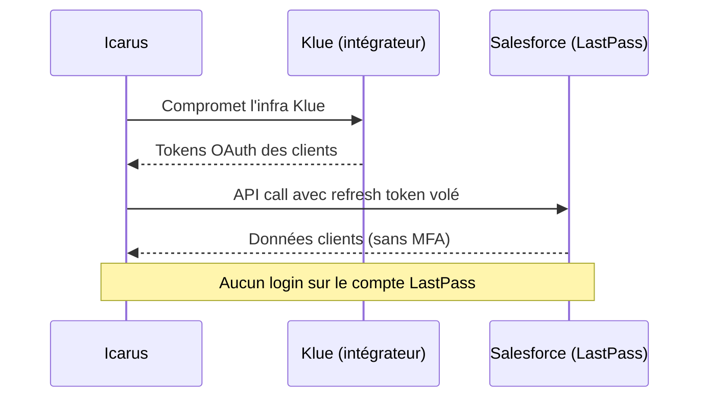

# Tech — Détail du mercredi 24 juin 2026

## 1. Brèche Klue → LastPass — vol de tokens OAuth et attaque sur la chaîne Salesforce

**Source :** BleepingComputer — https://www.bleepingcomputer.com/news/security/lastpass-confirms-data-breach-in-klue-supply-chain-attack/
**Date :** 22–24 juin 2026

### Contexte

Tes données ne fuient pas toujours par *ton* serveur. De plus en plus, elles fuient par un **SaaS tiers** auquel tu as branché ton Salesforce, ton Gong ou ton CRM. C'est exactement ce qui vient de toucher **LastPass** : ni ses produits, ni ses coffres n'ont été compromis, mais ses **données clients dans Salesforce** ont été aspirées via un intégrateur.

Le maillon faible est **Klue** (klue.com), une plateforme d'intelligence marché qui s'intègre à Salesforce et Gong. Le groupe d'extorsion **Icarus** a compromis l'infrastructure de Klue et volé les **tokens OAuth** reliant les Salesforce de ses clients. Avec ces jetons, l'attaquant a lu les données LastPass : noms, téléphones, e-mails, adresses postales et contenu des interactions de support. Mêmes victimes via Klue : HackerOne, Snyk, Tanium, Jamf, OneTrust, Recorded Future, Sprout Social, Huntress.

### Comment ça marche

Quand tu autorises une appli tierce (Klue) à accéder à ton Salesforce, tu ne lui donnes pas ton mot de passe : OAuth émet un **access token** court et un **refresh token** long, stockés côté tierce partie. Ce jeton porte des *scopes* (ex. lire les Contacts) et **contourne le MFA** une fois émis — c'est un porteur, pas une identité à re-vérifier.

Conséquence : compromettre Klue, c'est récupérer d'un coup les refresh tokens de **tous** ses clients. L'attaquant appelle l'API Salesforce « au nom de Klue », sans jamais toucher au compte LastPass, ni déclencher de MFA, ni d'alerte de login suspect. Le rayon de souffle n'est pas un client, mais tout le portefeuille de l'intégrateur.



### En pratique — exemple de code

Côté attaquant, un jeton volé suffit à parler à l'API. Côté défense, la seule vraie parade est de **révoquer le connected app** et invalider tous ses jetons.

```bash
# Ce que fait l'attaquant : rejouer le refresh token pour obtenir un access token...
curl -s https://login.salesforce.com/services/oauth2/token \
  -d grant_type=refresh_token \
  -d client_id=$KLUE_APP -d refresh_token=$STOLEN_TOKEN
# ...puis lire les données, "au nom de Klue", sans MFA
curl -s "https://acme.my.salesforce.com/services/data/v61.0/query?q=SELECT+Name,Phone,Email+FROM+Contact" \
  -H "Authorization: Bearer $ACCESS_TOKEN"

# Remédiation : révoquer l'appli connectée -> tous ses tokens meurent d'un coup
sf org list connected-apps --target-org acme
sf org revoke connected-app --name "Klue" --target-org acme   # rotation forcée
```

LastPass a justement désactivé l'accès Klue, **fait tourner les tokens OAuth/API exposés** et prévenu les autorités.

### Pourquoi ça compte pour toi

Audite tes intégrations SaaS-to-SaaS comme du code en prod. Liste les *connected apps* de ton Salesforce/Google Workspace, vérifie leurs scopes, supprime celles qui dorment. Applique le moindre privilège : une appli d'intelligence marché n'a pas besoin de lire tous tes Contacts. Et garde un runbook de **révocation + rotation de tokens** : le jour où un fournisseur se fait pirater, ta seule manette, c'est de tuer ses jetons vite.

### Points de vigilance

Un refresh token volé reste valide tant qu'il n'est pas révoqué : surveille les pics d'appels API d'une intégration et les requêtes depuis des IP inhabituelles côté fournisseur.
