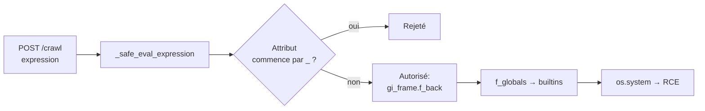
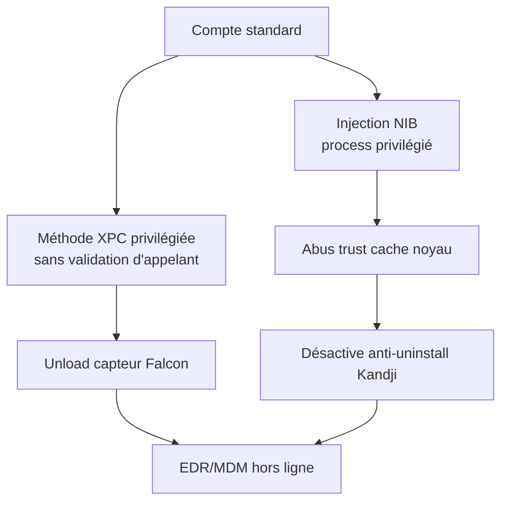

# Tech — Détail du jeudi 25 juin 2026

## 1. Crawl4AI CVE-2026-53753 — évasion de sandbox AST → RCE pré-auth dans le serveur Docker

**Source :** GitLab Advisory Database — https://advisories.gitlab.com/pypi/crawl4ai/CVE-2026-53753/
**Date :** 24 juin 2026

### Contexte

`crawl4ai` est un crawler open source très utilisé pour alimenter des pipelines RAG et des agents : il récupère des pages, les nettoie et les transforme en Markdown. Son serveur Docker expose une API REST. Pour permettre des extractions dynamiques, il évalue des expressions Python dans un « bac à sable » maison construit sur le module `ast`. Le 24 juin, la base d'avis GitLab publie **CVE-2026-53753** (CVSS 9.8), accompagnée de deux failles SSRF sœurs. Verdict : exécution de code à distance **sans authentification** sur tout serveur Docker exposé, avant la version 0.8.7.

### Comment ça marche

Le cœur du bug est la fonction `_safe_eval_expression()`. Elle parse la chaîne en AST, puis parcourt l'arbre et rejette ce qu'elle juge dangereux. Sa règle de filtrage : bloquer tout attribut dont le nom **commence par un underscore** (`__globals__`, `__builtins__`, `__class__`…). L'idée est d'empêcher la remontée classique vers les fonctions intégrées de Python.

Le défaut est conceptuel : Python expose quantité d'attributs sensibles qui **ne commencent pas** par underscore. Les objets générateurs et frames en regorgent : `gi_frame`, `f_back`, `f_globals`, `f_builtins`. Le validateur les laisse passer. Un attaquant construit donc une expression qui part d'un générateur anodin, remonte la pile d'appels via `gi_frame.f_back`, atteint `f_globals`, et de là les builtins puis `os.system`. Comme l'endpoint Docker n'exige aucun jeton, c'est une RCE pré-auth.



### En pratique — exemple de code

Le filtre par nom d'attribut est l'anti-pattern. Voici la logique vulnérable, le principe d'évasion (sans charge utile complète) et le bon réflexe.

```python
# Vulnérable — un déni par préfixe "_" ne sécurise rien
def _is_safe(node: ast.AST) -> bool:
    if isinstance(node, ast.Attribute) and node.attr.startswith("_"):
        return False          # bloque __globals__, mais PAS gi_frame / f_back
    return True

# Évasion (concept) : aucun underscore initial, donc validé
PAYLOAD = "(x for x in []).gi_frame.f_back.f_globals"
#          ^ générateur     ^ frame    ^ frame appelant ^ globals -> builtins

# Correct — n'évalue jamais d'entrée non fiable. Liste blanche stricte,
# ou un évaluateur dédié (asteval/simpleeval) avec opérateurs autorisés explicites.
import simpleeval
simpleeval.simple_eval("2 + price * qty", names={"price": 3.0, "qty": 2})
```

### Pourquoi ça compte pour toi

Tu branches sans doute un crawler sur tes ingestions RAG. Un serveur `crawl4ai` Docker exposé, c'est une RCE pré-auth offerte. Passe en **0.8.7+**, ne l'expose jamais sur Internet, et retiens la leçon transverse : un bac à sable bâti sur une **denylist de noms d'attributs** est cassé par construction. Pour évaluer une formule utilisateur, utilise une allowlist d'opérateurs explicite, jamais `eval`/`Function`/`ast` brut.

### Pour aller plus loin

Les sœurs **CVE-2026-53754** (SSRF via formes de transition IPv6 : NAT64, 6to4, IPv4-mapped — https://advisories.gitlab.com/pypi/crawl4ai/CVE-2026-53754/) et **CVE-2026-53755** (SSRF via les réglages de proxy — https://advisories.gitlab.com/pypi/crawl4ai/CVE-2026-53755/) montrent que le filtrage d'URL « maison » souffre des mêmes maux que le filtrage d'AST : les cas limites te trahissent.

---

## 2. macOS CVE-2026-39118 — un utilisateur standard désactive l'EDR/MDM sans admin ni noyau

**Source :** SecurityWeek — https://www.securityweek.com/macos-weaknesses-chained-to-silently-disable-endpoint-security-agents/
**Date :** 24 juin 2026

### Contexte

Les chercheurs de **XM Cyber** ont enchaîné des comportements **légitimes** de macOS pour qu'un compte **standard** (sans droits admin) désactive silencieusement des agents de sécurité d'entreprise : le capteur **CrowdStrike Falcon** et l'agent **Kandji** (MDM). Pas d'exploit noyau, pas de contournement de SIP. La divulgation tombe le 24 juin 2026 ; Kandji a publié un correctif et assigné **CVE-2026-39118**, CrowdStrike a payé un bug bounty et ajouté des détections.

### Comment ça marche

Les EDR/MDM tournent avec un helper privilégié qui expose des méthodes via **XPC**, l'IPC de macOS. Le maillon faible : une de ces méthodes privilégiées **ne valide pas correctement l'identité de l'appelant**. Un processus utilisateur standard appelle donc la méthode et demande le déchargement (« unload ») du capteur Falcon. La protection anti-désinstallation de Kandji tombe via une chaîne XPC distincte. Les chercheurs ajoutent deux primitives : injection d'une charge dans un **fichier NIB** (archive d'UI) chargé par un process privilégié, et abus du **trust cache** de signature de code du noyau pour faire « confiance » au binaire. Résultat : la protection endpoint est neutralisée depuis un compte ordinaire.



### En pratique — exemple de code

Le correctif tient à une chose : un listener XPC doit **vérifier la signature de code du pair** avant d'exécuter une action sensible. Avant/après côté serveur XPC (Swift).

```swift
// Avant — accepte n'importe quel client local : tout process peut appeler
func listener(_ l: NSXPCListener, shouldAcceptNewConnection c: NSXPCConnection) -> Bool {
    c.exportedInterface = NSXPCInterface(with: AgentControl.self)
    c.exportedObject = AgentControlImpl()
    c.resume()
    return true            // <- aucune vérif d'identité
}

// Après — exige une équipe/identifiant signés et durcis (hardened runtime)
func listener(_ l: NSXPCListener, shouldAcceptNewConnection c: NSXPCConnection) -> Bool {
    let req = "anchor apple generic and certificate leaf[subject.OU] = \"TEAMID123\""
    c.setCodeSigningRequirement(req)   // rejette les appelants non conformes
    c.exportedInterface = NSXPCInterface(with: AgentControl.self)
    c.exportedObject = AgentControlImpl()
    c.resume()
    return true
}
```

### Pourquoi ça compte pour toi

Si tu opères une flotte macOS, retiens que l'EDR **n'est pas inviolable** : un compte standard a suffi. Et si tu écris un jour un helper privilégié (agent, updater, service), tout listener XPC doit valider la **signature de code** de l'appelant via `setCodeSigningRequirement` ou le token d'audit. Sinon, n'importe quel process local pilote ton service. La confiance par « c'est local » est une faille.
