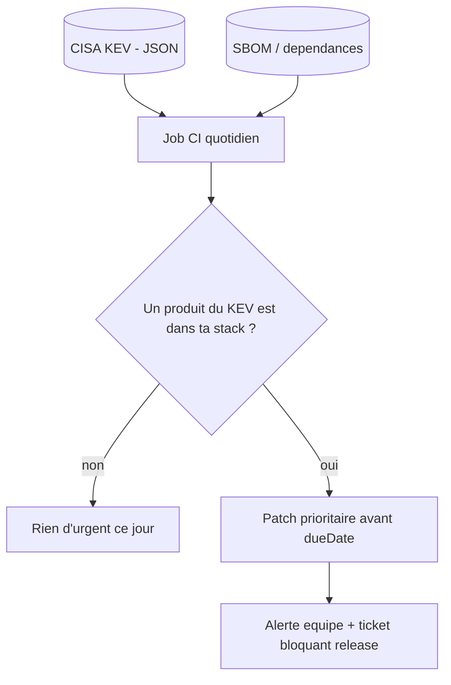

# Tech — Détail du samedi 27 juin 2026

## 1. CVE-2026-12569 entre au CISA KEV — automatiser la priorisation des patchs

**Source :** CISA — https://www.cisa.gov/known-exploited-vulnerabilities-catalog
**Date :** 26 juin 2026

### Contexte

Le 26 juin, la CISA a inscrit **CVE-2026-12569** à son catalogue **Known Exploited Vulnerabilities (KEV)**. Il s'agit d'une **RCE** (CVSS 9.3) dans **PTC Windchill PDMLink / FlexPLM** : une validation d'entrée défaillante laisse exécuter du code via une requête malveillante. PTC Windchill est un outil PLM, sans doute absent de ta stack. Mais le vrai sujet pour un dev senior n'est pas ce produit : c'est **comment exploiter le signal KEV**. Le KEV ne liste que des failles dont l'exploitation est **observée dans la nature** — il sépare le « patche maintenant » du bruit des milliers de CVE annuelles.

### Comment ça marche

Le KEV découle de la directive **BOD 22-01** : les agences fédérales US doivent corriger chaque entrée avant une **`dueDate`**. Pour toi, l'intérêt est ailleurs : c'est un **flux de priorisation gratuit et fiable**. Un score CVSS dit « à quel point c'est grave en théorie » ; la présence au KEV dit « c'est attaqué, maintenant ». Tu inverses donc ta logique de patch : au lieu de courir après tous les CVSS ≥ 9, tu traites d'abord l'intersection entre le KEV et **ta** surface réelle (ton SBOM, tes dépendances, tes vendors).

Le mécanisme d'intégration tient en un job planifié : tu tires le **catalogue JSON**, tu le croises avec la liste de tes produits, et toute intersection déclenche une alerte bloquante. Le complément naturel est l'**EPSS** (probabilité d'exploitation) pour trier ce qui n'est pas encore au KEV.



### En pratique — exemple de code

Ce snippet C# tire le flux KEV officiel et ne garde que les CVE touchant tes vendors. À planifier dans un job CI quotidien :

```csharp
// Croise le flux CISA KEV avec TES produits pour repérer l'urgent
using System.Net.Http.Json;

record KevCatalog(List<KevVuln> vulnerabilities);
record KevVuln(string cveID, string vendorProject, string product, string dueDate);

using var http = new HttpClient();
const string url =
    "https://www.cisa.gov/sites/default/files/feeds/known_exploited_vulnerabilities.json";
var kev = await http.GetFromJsonAsync<KevCatalog>(url);

// Ta surface réelle : vendors présents dans ton SBOM
string[] maStack = ["Microsoft", "PostgreSQL", "nginx", "Cisco"];

var urgent = kev!.vulnerabilities
    .Where(v => maStack.Contains(v.vendorProject))   // filtre sur ce que tu exploites
    .OrderBy(v => v.dueDate);                          // échéance KEV = priorité

foreach (var v in urgent)
    Console.WriteLine($"{v.cveID}  {v.vendorProject}/{v.product}  -> patch <= {v.dueDate}");
```

Renvoie un **code de sortie non nul** quand `urgent` n'est pas vide : le job casse la pipeline et force l'arbitrage avant le prochain déploiement.

### Pourquoi ça compte pour toi

Tu gères une CI/CD qui déclenche test et prod. Brancher un diff KEV quotidien transforme ta veille sécu en garde-fou automatique : plus besoin de lire chaque bulletin. Tu patches sur preuve d'exploitation, pas sur l'angoisse d'un CVSS élevé. Et tu obtiens une `dueDate` concrète pour arbitrer entre « bloquer la release » et « planifier ». C'est de la priorisation par le risque réel.

### Pour aller plus loin

Le flux complet est à `https://www.cisa.gov/sites/default/files/feeds/known_exploited_vulnerabilities.json`. Couple-le à l'EPSS pour estimer les failles pas encore exploitées, et à ton SBOM (CycloneDX/SPDX) pour un matching par CPE plutôt que par nom de vendor.
