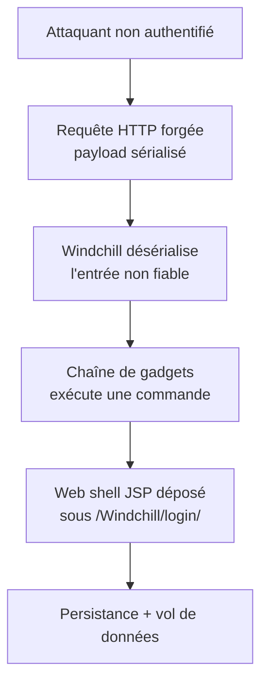
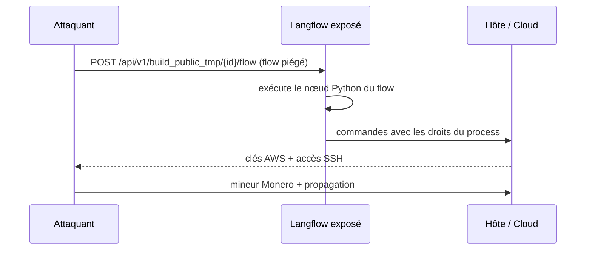
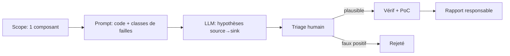

# Tech — Détail du lundi 29 juin 2026

## 1. PTC Windchill / FlexPLM CVE-2026-12569 — RCE par désérialisation, ajouté au CISA KEV

**Source :** PTC Trust Center — https://www.ptc.com/en/about/trust-center/advisory-center/active-advisories/windchill-flexplm-rce-vulnerability
**Date :** ajout au CISA KEV fin juin 2026, échéance fédérale 28 juin 2026

### Contexte

**Windchill** et **FlexPLM** sont les plateformes PLM de PTC : elles pilotent le cycle de vie produit (CAO, nomenclatures, conformité) de grands industriels. Beaucoup d'instances sont exposées sur Internet pour les partenaires. **CVE-2026-12569** (CVSS **9.3**) est une **RCE non authentifiée** par **désérialisation de données non fiables**. CISA l'a ajoutée à son catalogue **Known Exploited Vulnerabilities** avec exploitation active confirmée — PTC a observé le dépôt de **web shells JSP** sous `/Windchill/login/`.

### Comment ça marche

La désérialisation transforme des octets reçus en objets mémoire. Le piège : si l'application **reconstruit des objets arbitraires** depuis une entrée contrôlée par l'attaquant, celui-ci enchaîne des « gadgets » (des classes déjà présentes dont les méthodes, appelées pendant la désérialisation, finissent par exécuter une commande). Aucune authentification n'est requise ici : une requête forgée vers un endpoint vulnérable suffit. Une fois le code exécuté, l'attaquant écrit un web shell — un script serveur (`.jsp`) qui rejoue des commandes — pour garder l'accès et voler des données.



### En pratique — exemple de code

Pas d'exploit ici : la bonne posture est de **patcher et de chasser** le web shell. Voici la logique côté défense, et le réflexe de code qui évite cette classe de faille.

```bash
# 1) Détecter : version vulnérable ? (corrigé à partir de 11.0 M030)
#    Chasser des .jsp inattendus déposés récemment dans l'arbo de login
find /opt/ptc -path '*/Windchill/login/*.jsp' -mtime -30 -print

# 2) Repérer un web shell : un .jsp qui exécute des commandes système
grep -rIl --include='*.jsp' -E 'Runtime\.getRuntime|ProcessBuilder' /opt/ptc
```

```csharp
// Réflexe transposable en .NET : ne JAMAIS désérialiser une entrée non fiable
// avec un binder permissif. BinaryFormatter est banni depuis .NET 9.
var opts = new JsonSerializerOptions { /* pas de $type/polymorphisme ouvert */ };
var dto = JsonSerializer.Deserialize<MonDtoStrict>(input, opts); // type fermé, sûr
```

### Pourquoi ça compte pour toi

Même sans Windchill, la leçon est universelle : **toute désérialisation d'une entrée externe est une RCE potentielle**. En .NET, reste sur `System.Text.Json` avec des types fermés, fuis `BinaryFormatter` et le polymorphisme `$type` non contrôlé. Et applique aux failles du **KEV** un SLA de patch serré : une entrée au catalogue = exploitation réelle, pas théorique.

### Points de vigilance

Corrige vers **Windchill/FlexPLM ≥ 11.0 M030**, puis assume la compromission : audite `/Windchill/login/`, les comptes, et les connexions sortantes des serveurs PLM.

---

## 2. Langflow CVE-2026-33017 — RCE non authentifiée détournée en cryptomineur Monero

**Source :** Sysdig Threat Research — https://www.sysdig.com/blog/cve-2026-33017-how-attackers-compromised-langflow-ai-pipelines-in-20-hours
**Date :** exploitation in-the-wild dès le 27 juin 2026 (20 h après la divulgation)

### Contexte

**Langflow** est un constructeur visuel de pipelines LLM/agents, en Python, très utilisé en self-hosted. **CVE-2026-33017** est une **RCE non authentifiée** sur l'endpoint `POST /api/v1/build_public_tmp/{flow_id}/flow` : il accepte des données de « flow » publiques et **exécute le code Python** qu'elles contiennent. Sysdig a vu les premières attaques **20 heures** après l'advisory. Charge utile : un **mineur Monero**, plus du vol de clés AWS et une propagation par clés SSH réutilisées. (À distinguer de la CVE-2026-5027 Langflow déjà traitée mi-juin : même produit, faille différente.)

### Comment ça marche

Le drame tient en une requête. L'endpoint « public tmp » est pensé pour prévisualiser un flow sans login. Or un flow Langflow contient des **nœuds qui exécutent du Python**. En POST-ant un flow piégé, l'attaquant fait tourner son code **avec les droits du process Langflow** — sans session, sans token, sans CSRF. À partir de là : désactivation des protections hôte, déploiement du mineur, exfiltration des secrets d'environnement (clés cloud), puis rebond via les clés SSH trouvées.



### En pratique — exemple de code

L'important n'est pas le payload mais la **remédiation** et la **détection**.

```bash
# 1) Corriger : 1.9.0 retire le paramètre de données de l'endpoint vulnérable
pip install --upgrade "langflow>=1.9.0"

# 2) Ne jamais exposer Langflow nu sur Internet : binder en local + reverse proxy authentifié
#    Détecter l'abus dans les logs : hits sur l'endpoint public de build
grep -E 'POST /api/v1/build_public_tmp/.*/flow' access.log

# 3) Chasser le mineur : process CPU + connexions vers un pool de minage
ps aux --sort=-%cpu | head ; ss -tnp | grep -Ei 'xmr|pool|monero'
```

### Pourquoi ça compte pour toi

Tu fais sûrement tourner des outils IA en self-hosted (Langflow, n8n, notebooks). Ce sont des **surfaces RCE** : ils exécutent du code par conception. Ne les expose jamais sans authentification ni segmentation réseau, donne-leur des identifiants cloud à portée minimale, et patche au rythme des advisories — 20 h suffisent aux attaquants.

### Limites

JFrog note que certaines versions « corrigées » restaient exploitables selon la config : ne te repose pas sur la seule mise à jour, ajoute du cloisonnement réseau et du moindre privilège.

---

## 3. Auditer ton code Symfony/Twig avec un LLM — la méthode, et ses pièges

**Source :** Symfony Blog — https://symfony.com/blog/claude-mythos-audited-symfony-and-found-19-vulnerabilities
**Date :** SymfonyOnline juin 2026

### Contexte

À SymfonyOnline (juin 2026), un retour d'expérience a marqué : un modèle frontier (Claude Mythos, en préversion) a **audité Symfony et Twig** et remonté **19 vulnérabilités réelles**, toutes confirmées. Le signal n'est pas « l'IA remplace l'auditeur » mais « un LLM est devenu un **premier passage** crédible » sur une base mature. La technique est reproductible sur ton propre code — à condition de cadrer la méthode et de **vérifier chaque finding**.

### Comment ça marche

Un LLM excelle à suivre des **flux de teinte** (taint flow) : il relie une **source** (entrée utilisateur : requête, header, param) à un **sink** dangereux (requête SQL, `system()`, désérialisation, rendu Twig brut) en traversant le code. Il ne lance rien, donc il ne **prouve** rien : il propose des hypothèses. La boucle utile : tu **scopes** un composant, tu fournis le code + le contexte, tu demandes des classes de failles précises, puis tu **tries** et tu **vérifies** par un PoC.



### En pratique — exemple de code

Un prompt cadré donne des résultats exploitables. Demande un **format structuré** pour trier vite.

```text
Rôle : auditeur sécurité AppSec.
Cible : ce contrôleur Symfony + le repository appelé (code ci-dessous).
Cherche UNIQUEMENT : injection SQL, SSRF, désérialisation,
  path traversal, SSTI Twig, contournement d'auth.
Pour chaque finding, renvoie un JSON :
  { "classe", "fichier:ligne", "source", "sink", "flux", "confiance": "haute|moyenne|faible", "PoC_suggere" }
Si un flux n'est pas exploitable, ne l'invente pas : dis "aucun".
```

```bash
# Sur du code privé : utilise un modèle local/entreprise, jamais un endpoint public
# et n'envoie jamais de secrets (.env, clés) dans le contexte.
git diff main... | sed '/SYMFONY_SECRET\|DATABASE_URL/d' > revue.diff
```

### Pourquoi ça compte pour toi

Tu peux passer ce filet sur tes contrôleurs Symfony, tes requêtes Doctrine ou tes templates Twig **avant** la revue humaine, pour un coût marginal. C'est un détecteur de fumée, pas un certificat : il rate des choses et en hallucine d'autres. Garde tes secrets hors du prompt, préfère un modèle privé pour du code fermé, et **vérifie chaque finding** par un PoC avant d'agir.

### Limites

Faux positifs fréquents, fenêtre de contexte limitée (découpe par composant), aucune exécution réelle. À combiner avec SAST, tests et revue humaine — pas à substituer.
