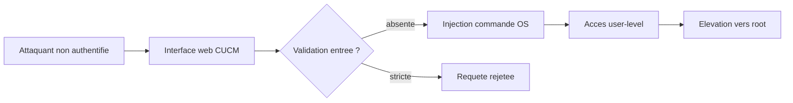

# Tech — Détail du mardi 30 juin 2026

## 1. Cisco Unified Communications — RCE non authentifiée → root (advisory cisco-sa-voice-rce)

**Source :** Cisco Security Advisory — https://sec.cloudapps.cisco.com/security/center/content/CiscoSecurityAdvisory/cisco-sa-voice-rce-mORhqY4b
**Date :** Fin juin 2026 — Cisco CUCM sous surveillance CISA KEV, exploitation active rapportée

### Contexte

Cisco **Unified Communications Manager** (CUCM, ex-CallManager) est l'autocommutateur IP qui gère voix, visio et présence dans une large part des entreprises. Il expose une **interface web d'administration** : une surface qu'on ne publie jamais volontairement sur Internet, mais qui reste souvent joignable depuis le LAN ou via des VPN mal segmentés.

L'advisory Cisco décrit une faille **critique** : un attaquant **non authentifié** peut, via des requêtes HTTP forgées vers cette interface, exécuter des commandes sur le système d'exploitation, puis **élever ses privilèges jusqu'à root**. Sont touchés Unified CM, Unified CM SME, IM&P, Unity Connection et Webex Calling Dedicated Instance. Cisco a publié des correctifs ; **aucun contournement** n'existe. Le sujet est brûlant en cette fin juin : CISA a inscrit Cisco CUCM à son catalogue **Known Exploited Vulnerabilities**, signe d'une exploitation observée dans la nature. À distinguer de la SSRF CUCM (CVE-2026-20230) traitée le 07/06 : ici, mécanisme et advisory sont différents.

### Comment ça marche

Le cœur du problème est une **validation insuffisante des entrées** dans des paramètres de requêtes HTTP traités par l'interface de management. Le déroulé typique d'une telle chaîne :

1. L'attaquant atteint l'interface web, sans authentification.
2. Il envoie une **séquence** de requêtes HTTP dont un champ porte une charge injectée.
3. Ce champ est concaténé sans contrôle dans un appel système → **exécution de commande** avec les droits du service web.
4. Une seconde primitive (service privilégié, binaire setuid) permet l'**escalade vers root**.



Le point pédagogique : la faille ne vient pas d'un protocole exotique mais d'un **paramètre HTTP qui finit dans un shell**. C'est la même famille de bugs que l'injection de commande applicative — sauf qu'ici elle est pré-auth et mène directement à root.

### En pratique — exemple de code

Le motif vulnérable, illustré puis corrigé côté serveur. La règle : **ne jamais** passer une entrée utilisateur à un shell.

```csharp
// ❌ Avant — paramètre HTTP concaténé dans une commande shell (injection possible)
[HttpGet("/diag/ping")]
public IActionResult Ping(string host)
{
    // host = "8.8.8.8; rm -rf / ; #"  -> interprété par /bin/sh
    var psi = new ProcessStartInfo("/bin/sh", $"-c \"ping -c1 {host}\"");
    Process.Start(psi);
    return Ok();
}

// ✅ Après — pas de shell, argument passé en liste + validation stricte (allow-list)
[HttpGet("/diag/ping")]
public IActionResult Ping(string host)
{
    if (!IPAddress.TryParse(host, out var ip))   // n'accepte qu'une IP valide
        return BadRequest("host invalide");
    var psi = new ProcessStartInfo("ping") { ArgumentList = { "-c1", ip.ToString() } };
    psi.UseShellExecute = false;                 // jamais de /bin/sh
    Process.Start(psi);
    return Ok();
}
```

Et la vérification d'exposition côté ops, à adapter à ton parc :

```bash
# Voir ce qui écoute, puis restreindre l'admin web à un réseau de gestion
ss -tlnp | grep -E ':(443|8443|80)\b'
sudo iptables -A INPUT -p tcp --dport 8443 ! -s 10.0.0.0/24 -j DROP
```

### Pourquoi ça compte pour toi

Tu n'administres peut-être pas CUCM, mais tu écris des handlers qui reçoivent des entrées : la leçon est directe. N'injecte **jamais** un paramètre dans un shell, préfère `ArgumentList` à une chaîne interpolée, valide en allow-list (ici, une IP) et coupe `UseShellExecute`. Côté infra : segmente les interfaces d'admin, ne les expose pas, et patche dès qu'un produit entre au CISA KEV — c'est le signal qu'on t'attaque déjà.

### Pour aller plus loin

- Catalogue CISA KEV (pour prioriser tes patchs) : https://www.cisa.gov/known-exploited-vulnerabilities-catalog
- Correctifs Cisco : aucun workaround, la mise à jour est la seule option.
