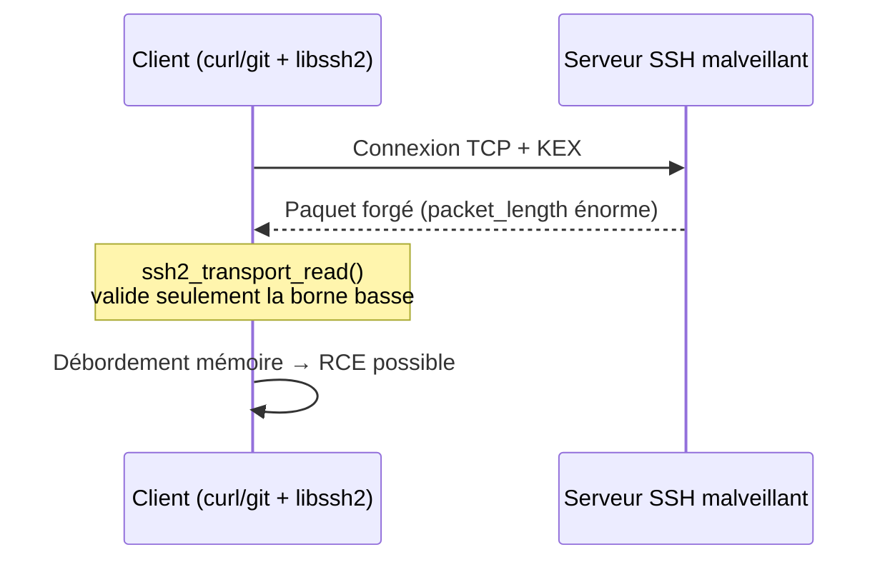
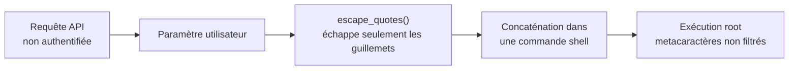
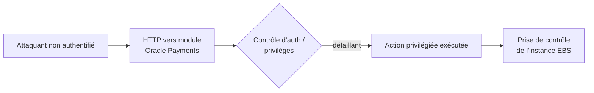

# Tech — Détail du mercredi 1er juillet 2026

## 1. libssh2 CVE-2026-55200 — un serveur SSH malveillant corrompt la mémoire du client

**Source :** The Hacker News — https://thehackernews.com/2026/06/public-poc-released-for-critical.html
**Date :** 29 juin 2026

### Contexte

Un **PoC public** est sorti le 29 juin pour **CVE-2026-55200**, une faille critique (**CVSS 4.0 : 9,2**) dans **libssh2**. Particularité qui renverse l'intuition : libssh2 est une bibliothèque **cliente**, pas un serveur. C'est donc un **serveur SSH malveillant ou compromis** qui déclenche une corruption mémoire chez le **client qui se connecte** — sans identifiants, sans interaction.

libssh2 est embarqué partout : `curl`, `git`, PHP, agents de sauvegarde, updaters de firmware, appliances. Toutes les versions **jusqu'à 1.11.1 incluse** sont touchées.

### Comment ça marche

Le bug vit dans `ssh2_transport_read()` (fichier `transport.c`), la fonction qui parse les paquets entrants pendant le **handshake**, avant toute authentification. Elle lit le champ `packet_length` **contrôlé par l'attaquant** et ne rejette que les valeurs trop **basses** — jamais les valeurs trop hautes. Un `packet_length` géant fait déborder les calculs de buffer → lecture/écriture hors limites → exécution de code potentielle.



Le piège aggravant : beaucoup de binaires **lient libssh2 en statique**. Une mise à jour de paquet distro (`apt upgrade`) ne touchera pas ces copies embarquées, et tu ne sais pas toujours qu'elles sont là.

### En pratique — exemple de code

Le correctif conceptuel : borner le champ **par le haut** avant tout calcul.

```c
/* Avant — seule la borne basse est vérifiée */
if (packet_length < 1) return LIBSSH2_ERROR_PROTO;
buf = malloc(packet_length);              /* packet_length géant => débordement */

/* Après — on plafonne aussi la valeur (borne haute) */
if (packet_length < 1 || packet_length > LIBSSH2_PACKET_MAXPAYLOAD)
    return LIBSSH2_ERROR_PROTO;           /* rejette le paquet forgé */
buf = malloc(packet_length);
```

Côté ops, traque les copies **statiques** que le gestionnaire de paquets ignore :

```bash
# Repère les binaires embarquant leur propre libssh2
grep -rIl "libssh2_" /usr/bin /usr/local/bin /opt 2>/dev/null
# Et les liens dynamiques restants à mettre à jour
ldd $(which curl git) | grep -i ssh2
```

### Pourquoi ça compte pour toi

Tu fais du `git clone`, du `curl`, des sauvegardes ou du déploiement vers des hôtes SSH ? Un endpoint SSH piégé (repo miroir, bastion compromis, MITM) peut viser **ta machine ou ta CI**. Mets à jour libssh2 au-delà de 1.11.1, puis **reconstruis** les outils qui l'embarquent en statique — un simple `apt upgrade` ne suffira pas. Inventorie tes images CI en priorité.

---

## 2. Progress Kemp LoadMaster CVE-2026-8037 — root pré-auth via une injection shell

**Source :** The Hacker News — https://thehackernews.com/2026/06/progress-kemp-loadmaster-flaw-could-let.html
**Date :** 30 juin 2026

### Contexte

**CVE-2026-8037** (**CVSS 9,8**) permet à un attaquant **non authentifié** d'exécuter des commandes **en root** sur un **Progress Kemp LoadMaster** en envoyant une simple requête forgée à son **API**. Progress a publié l'avis le 4 juin ; le 29 juin, **watchTowr Labs** a détaillé toute la chaîne d'exploitation. Un correctif existe.

Un LoadMaster est un ADC / répartiteur de charge posé **en bordure de réseau**. Toute faille pré-auth y est donc particulièrement grave.

### Comment ça marche

La vulnérabilité est un cas d'école d'**injection de commande OS**. Une fonction nommée `escape_quotes()` est censée assainir l'entrée utilisateur avant qu'elle ne soit passée à un **shell**. Elle échappe les guillemets… mais laisse passer d'autres métacaractères shell (`;`, `` ` ``, `$(...)`, `|`). L'attaquant glisse sa commande dans un paramètre d'API ; le shell l'exécute avec les privilèges du service : **root**.



La leçon : **échapper des caractères n'est pas assainir**. Une liste noire de guillemets laisse toujours une porte ouverte.

### En pratique — exemple de code

Le seul remède fiable : **ne pas construire de commande shell** par concaténation. Passe les arguments en tableau, sans shell intermédiaire.

```python
import subprocess

# Avant — vulnérable : la chaîne part dans un shell, metacaractères actifs
cmd = f"ping -c1 {user_input}"          # user_input = "8.8.8.8; id"
subprocess.run(cmd, shell=True)          # exécute aussi `id`

# Après — argv en liste, shell=False : l'entrée reste une donnée, jamais du code
subprocess.run(["ping", "-c1", user_input], shell=False, check=True)
```

### Pourquoi ça compte pour toi

Si un LoadMaster protège tes apps, patche-le sans attendre et restreins l'accès à son **API de management** (VLAN d'admin, pas d'exposition Internet). Au-delà de l'appliance, c'est un rappel pour **ton propre code** : dès que tu touches un shell (scripts d'ops, jobs, wrappers), passe par `argv` en tableau et bannis `shell=True`. L'échappement maison de métacaractères finit toujours par se faire contourner.

---

## 3. Oracle E-Business Suite CVE-2026-46817 — prise de contrôle non authentifiée, exploitée

**Source :** The Hacker News — https://thehackernews.com/2026/06/oracle-e-business-suite-flaw-cve-2026.html
**Date :** 30 juin 2026

### Contexte

**CVE-2026-46817** (**CVSS 9,8**) frappe **Oracle E-Business Suite**, précisément le module **Oracle Payments**. C'est une faille de **gestion de privilèges et d'authentification** : un attaquant **non authentifié**, via un simple accès **HTTP**, peut compromettre et **prendre le contrôle** de l'instance. Versions touchées : **12.2.3 à 12.2.15**.

Le correctif faisait partie du dernier **Critical Patch Update** trimestriel d'Oracle. Mais Defused Cyber a observé, ce week-end, une **exploitation active** dans la nature — d'où l'urgence.

### Comment ça marche

Oracle EBS est un ERP tentaculaire ; ses modules exposent des endpoints HTTP. Ici, le module Payments **ne vérifie pas correctement** l'identité et les privilèges de l'appelant avant d'exécuter une action sensible. L'attaquant atteint donc une fonctionnalité privilégiée **sans passer par l'authentification**, puis enchaîne jusqu'à la prise de contrôle.



Le schéma est classique des ERP exposés : surface d'attaque énorme, endpoints hérités, et un seul contrôle d'accès manquant suffit à tout ouvrir.

### En pratique — exemple de code

Pas de bidouille applicative : la seule réponse est **patcher** et **vérifier** ton exposition. Commence par confirmer ta version et fermer l'accès public.

```bash
# 1. Confirme la version EBS (touchée si 12.2.3 -> 12.2.15)
grep -i "RELEASE" $INST_TOP/appl/admin/*_env 2>/dev/null | head

# 2. Vérifie qu'aucun endpoint EBS ne répond depuis l'extérieur
curl -sk -o /dev/null -w "%{http_code}\n" https://ton-ebs.exemple.com/OA_HTML/

# 3. Cherche des accès suspects récents (POST anormaux vers /OA_HTML/)
grep "OA_HTML" access_log | awk '$9!=200{print $1,$7,$9}' | sort | uniq -c | sort -rn
```

Applique le CPU Oracle, puis place EBS derrière un VPN / WAF et coupe tout accès Internet direct.

### Pourquoi ça compte pour toi

Un ERP comme EBS concentre données financières et clients : une prise de contrôle non authentifiée est un scénario de brèche majeure. Si ton organisation exploite EBS, traite ce patch en **P1** et considère l'exposition publique comme un incident. Même sans Oracle chez toi, retiens le motif : **tout endpoint privilégié doit revérifier l'identité et les droits**, jamais présumer qu'une couche amont l'a fait.

### Pour aller plus loin

Catalogue CISA KEV (exploitations activement suivies) : https://www.cisa.gov/known-exploited-vulnerabilities-catalog
