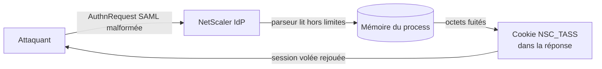
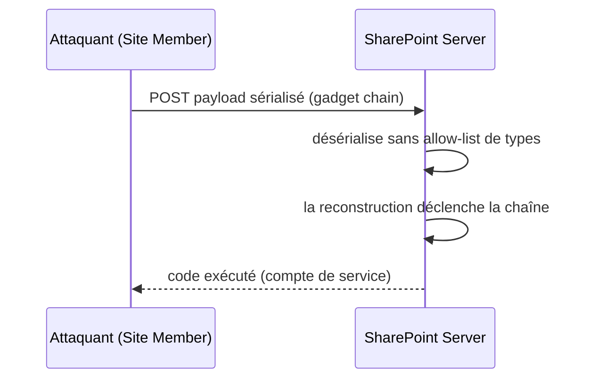

# Tech — Détail du vendredi 3 juillet 2026

## 1. CVE-2026-8451 « CitrixBleed » — memory overread pré-auth sur NetScaler, exploité en < 24 h

**Source :** watchTowr Labs — https://labs.watchtowr.com/citrixbleed-to-infinity-and-beyond-citrix-netscaler-pre-auth-memory-overread-cve-2026-8451/
**Date :** 30 juin 2026

### Contexte

Citrix a corrigé six bugs NetScaler le 30 juin, dont **CVE-2026-8451** (CVSS 8,8). La faille rejoint la famille « CitrixBleed » : une **lecture mémoire hors limites** sur un NetScaler ADC/Gateway configuré en **IdP SAML**. Les attaquants l'exploitaient **moins de 24 h après divulgation**. Elle rappelle le pattern déjà vu début juin (CVE-2026-3055), mais c'est une nouvelle faille, dans un nouveau bulletin.

### Comment ça marche

Le cœur du bug est un **parseur XML permissif**. Quand NetScaler agit en IdP SAML, il lit une requête `AuthnRequest` fournie par le client. Le parseur attend des valeurs d'attribut entre guillemets. Or il **ne termine pas correctement une valeur non quotée suivie d'un saut de ligne**. Il continue alors de lire au-delà du tampon prévu : c'est l'*out-of-bounds read*.

Ces octets lus « en trop » proviennent de la mémoire adjacente du processus. Ils peuvent contenir des fragments de sessions, de jetons ou de secrets d'autres utilisateurs. Le piège : ce contenu fuité est **renvoyé à l'attaquant dans le cookie `NSC_TASS`** de la réponse. En rejouant la requête en boucle, l'attaquant récolte assez de mémoire pour **voler une session valide** et contourner l'authentification — sans exécuter de code, juste en lisant.



### En pratique — exemple de code

Pas d'exploit ici : le geste utile est de **vérifier ta version** et de patcher. Les builds corrigés sont `14.1-72.61` et `13.1-63.18` (plus variantes FIPS/NDcPP).

```bash
# Sur la CLI NetScaler : identifier la version en place
show version
# Vulnérable si < 14.1-72.61 (branche 14.1) ou < 13.1-63.18 (branche 13.1)

# Après upgrade, invalider les sessions potentiellement volées
kill icaconnection -all      # coupe les sessions ICA actives
# Puis : forcer la rotation des certificats/secrets SAML IdP côté console
```

Le principe de la faille, en pseudo-code, tient à un test manquant :

```c
// Avant (vulnérable) : une valeur non quotée + '\n' n'arrête pas la lecture
while (buf[i] != '"') i++;         // dépasse la fin du buffer -> OOB read
// Après (corrigé) : borne stricte + fin de ligne traitée comme terminateur
while (i < len && buf[i] != '"' && buf[i] != '\n') i++;
```

### Pourquoi ça compte pour toi

Si tu exposes un NetScaler en IdP SAML, patche **immédiatement** puis invalide les sessions et fais tourner les secrets. Une fuite mémoire vole des identifiants **sans RCE**, donc les logs d'exécution ne montrent rien d'évident. Retiens aussi la leçon générique : un parseur qui « lit jusqu'au délimiteur » sans borner la longueur est une porte ouverte à l'*out-of-bounds read*.

---

## 2. SharePoint CVE-2026-45659 entre au CISA KEV — RCE par désérialisation, exploité, deadline 4 juillet

**Source :** The Hacker News — https://thehackernews.com/2026/07/sharepoint-rce-cve-2026-45659-added-to.html
**Date :** 2 juillet 2026

### Contexte

La **CISA** a ajouté **CVE-2026-45659** à son catalogue KEV (*Known Exploited Vulnerabilities*) après confirmation d'exploitation active. C'est une **RCE dans SharePoint on-premises** (CVSS 8,8), corrigée par Microsoft le 26 mai. Un attaquant **authentifié** avec de simples droits *Site Member* suffit, sans interaction. Les agences fédérales US ont jusqu'au **4 juillet** pour patcher.

### Comment ça marche

La cause racine est une **désérialisation de données non fiables**. Sérialiser, c'est transformer un objet en octets ; désérialiser, c'est reconstruire l'objet. Le danger : si le flux inclut le **type** à instancier et que le code l'accepte sans contrôle, un attaquant fournit un **gadget** — un objet dont la simple reconstruction déclenche du code.

Concrètement, l'attaquant forge une charge sérialisée qui, une fois désérialisée par SharePoint, enchaîne des appels (une *gadget chain*) jusqu'à exécuter une commande. Le code s'exécute alors avec le **compte de service** SharePoint, souvent très privilégié. C'est le même schéma que les vieilles failles `BinaryFormatter` ou `TypeNameHandling.All` de l'écosystème .NET : le bug n'est pas la donnée, c'est le fait d'**instancier un type dicté par l'attaquant**.



### En pratique — exemple de code

La leçon est directement réutilisable dans **tes** apps .NET. Ne désérialise jamais un flux non fiable en laissant le type libre.

```csharp
// AVANT — dangereux : le JSON porte le type à instancier
var settings = new JsonSerializerSettings {
    TypeNameHandling = TypeNameHandling.All   // un attaquant choisit la classe -> gadget
};
var obj = JsonConvert.DeserializeObject<Payload>(untrusted, settings);

// APRÈS — sûr : pas de type dans le flux, ou allow-list stricte
var safe = new JsonSerializerSettings {
    TypeNameHandling = TypeNameHandling.None,          // ignore $type
    SerializationBinder = new AllowListBinder()         // n'autorise que tes types connus
};
var ok = JsonConvert.DeserializeObject<Payload>(untrusted, safe);
```

### Pourquoi ça compte pour toi

Si tu opères un SharePoint on-prem, applique les KB (`KB5002863` / `KB5002870` / `KB5002868`) sans attendre : l'exploitation est réelle. Au-delà, audite ton propre code .NET : bannis `BinaryFormatter`, force `TypeNameHandling.None`, et impose un `SerializationBinder` en allow-list. La désérialisation de données utilisateur est l'un des vecteurs de RCE les plus sous-estimés côté backend.
