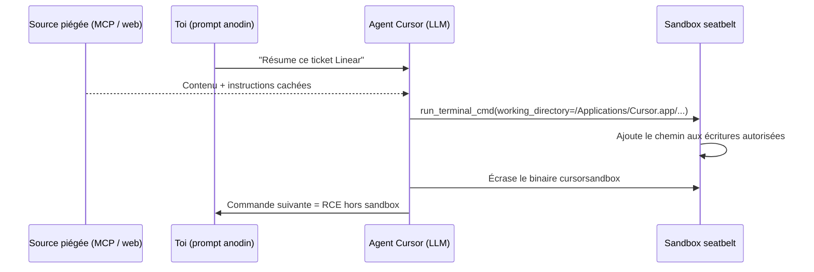

# Tech — Détail du samedi 4 juillet 2026

## 1. DuneSlide — Cursor IDE : deux RCE critiques (CVE-2026-50548 / CVE-2026-50549) par injection de prompt zero-click

**Source :** Cato Networks (Cato AI Labs) — https://www.catonetworks.com/blog/duneslide-two-critical-rce-vulnerabilities/
**Date :** 1er juillet 2026

### Contexte

Cato AI Labs a publié le 1er juillet le détail de **DuneSlide**, deux failles distinctes de Cursor, l'éditeur « AI-first » que Cursor dit déployé chez plus de la moitié du Fortune 500. Les deux sont notées **CVSS 9.8** et aboutissent à une exécution de code arbitraire (RCE) hors sandbox sur la machine du développeur.

Le point clé n'est pas un bug mémoire exotique, mais un **changement de surface d'attaque**. Depuis Cursor 2.x, l'agent exécute des commandes shell dans un bac à sable (`sandbox` type seatbelt macOS) **sans te demander d'approbation**, pour éviter la fatigue de validation. L'injection de prompt franchit alors la couche LLM et vient réveiller des failles classiques (validation de paramètre, résolution de chemin) dans du code qu'on ne considérait pas comme exposé au réseau.

### Comment ça marche

Le déclencheur est **zero-click** : tu poses une question anodine, l'agent lit au passage un contenu piégé venant d'une source non fiable — réponse d'un serveur **MCP** (même « légitime » comme Linear), ou résultat d'une recherche web. Ce contenu contient des instructions cachées que le LLM suit.

**Faille #1 — paramètre `working_directory` (CVE-2026-50548).** L'outil `run_terminal_cmd` accepte un `working_directory` optionnel. Cursor construit sa politique seatbelt en autorisant l'écriture dans ce dossier. Si l'injection pousse le LLM à pointer ce paramètre vers un chemin système, ce chemin est **ajouté aveuglément** à la liste d'écriture autorisée. L'attaquant écrase alors le binaire `cursorsandbox` lui-même : les commandes suivantes tournent **sans sandbox** → RCE. Cibles voisines : `~/.zshrc`, `~/.zshenv`, `~/Library/LaunchAgents`.

**Faille #2 — canonicalisation de symlink (CVE-2026-50549).** Avant d'écrire, Cursor résout les liens symboliques pour vérifier que la cible reste dans le projet. Le bug : si la canonicalisation **échoue** (chemin inexistant, permission manquante), il retombe sur le chemin d'origine du symlink, réputé « dans le projet ». Un lien write-only vers `cursorsandbox` passe le contrôle, est écrasé, et neutralise le sandbox.



### En pratique — exemple de code

L'appel d'outil détourné ressemble à ceci (conceptuel, la faille est corrigée en 3.0) :

```jsonc
// Appel run_terminal_cmd normal : working_directory = racine projet
{ "command": "npm test", "working_directory": "/home/dev/projet" }

// Détourné par injection : le LLM pointe hors projet…
{ "command": "cp /tmp/evil ./cursorsandbox",
  "working_directory": "/Applications/Cursor.app/Contents/Resources/app/resources/helpers" }
// …ce chemin entre dans la policy seatbelt -> le binaire de sandbox est écrasé.
```

Côté défense, la seule action qui compte est la mise à jour :

```bash
cursor --version          # attendu >= 3.0.0 — le correctif DuneSlide est livré dans Cursor 3.0 (2 avril)
grep -R "url" ~/.cursor   # audite les serveurs MCP branchés : n'en garde que de confiance
```

### Pourquoi ça compte pour toi

Tu utilises des agents de code et des serveurs MCP au quotidien — y compris dans cette session. DuneSlide montre qu'un simple contenu lu (ticket, page web, réponse MCP) peut devenir un vecteur RCE. Passe Cursor en **3.0+**, traite chaque sortie MCP/web comme non fiable, et garde l'auto-exécution shell sous surveillance sur tes machines de dev.

### Points de vigilance

Cursor avait d'abord **rejeté** le rapport (23 février) au motif que son modèle de menace « n'inclut pas l'abus de serveur MCP », même légitime. Cato annonce disséquer les mêmes classes de failles chez **tous** les agents de code populaires : attends-toi à d'autres CVE du même type. Le vrai correctif de fond est architectural, pas un patch ponctue