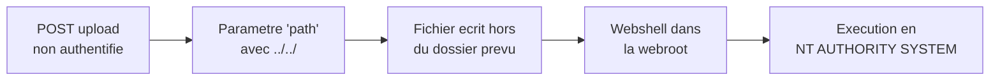
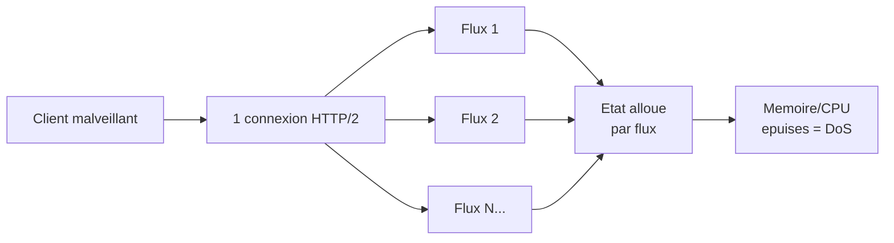

# Tech — Détail du lundi 6 juillet 2026

## 1. Adobe ColdFusion — 7 failles CVSS 10.0, CVE-2026-48282 exploitée en quelques heures

**Source :** The Hacker News — https://thehackernews.com/2026/07/adobe-patches-7-cvss-100-flaws-in.html
**Date :** 1er juillet 2026 (mise à jour 3 juillet)

### Contexte

Adobe a corrigé **sept failles de score maximal (CVSS 10.0)** dans **ColdFusion** (+ une dans Campaign Classic). Le lot mène à l'**exécution de code arbitraire**, à l'élévation de privilèges et à la lecture de fichiers. En vedette : **CVE-2026-48282**, un *path traversal* qui a été **exploité dans les heures suivant la divulgation** — une tentative depuis l'IP `103.207.14.220` cherchant à lire `C:\Windows\win.ini`. Correctifs dans **ColdFusion 2023 Update 21** et **2025 Update 10**. Le reste du lot : uploads de fichiers dangereux (CVE-2026-48276/48283), validation d'entrée défaillante (48277/48281/48316), lecture de fichiers (48313).

### Comment ça marche

Le scénario est un classique de l'appsec, en trois temps. D'abord, un **endpoint d'upload**. Chez ColdFusion, l'upload est désactivé par défaut — mais **une fois activé, il est atteignable sans authentification**. Ensuite, le **path traversal** : le client contrôle un paramètre `path` et y glisse des `../../`. Le serveur, qui fait confiance à ce chemin, écrit le fichier **hors du dossier prévu**, par exemple dans la *webroot*.

Enfin, l'**exécution**. Le fichier déposé est un *webshell* (`.jsp`, `.cfml`…) servi par le moteur : l'attaquant l'appelle par HTTP et son code tourne — et ici, **en `NT AUTHORITY\SYSTEM`**. On passe d'un simple « écrire un fichier » à « exécuter n'importe quoi en administrateur ». Le correctif d'Adobe interdit de nouvelles extensions (`jspf`, `cfmail`, `war`) et ajoute un bloc `<cfscript>` anti-traversal — une approche **denylist**, par nature fragile.



### En pratique — exemple de code

Le bug n'est pas propre à ColdFusion : tout handler d'upload qui fait confiance au chemin client est vulnérable. Voici le motif fautif puis le motif durci (en C#/.NET).

```csharp
// AVANT (vulnerable) : on concatene un chemin fourni par le client
var dest = Path.Combine(uploadDir, form["path"]); // "..\\..\\webroot\\x.jsp"
File.WriteAllBytes(dest, bytes);   // ecrit hors du dossier -> webshell
```

```csharp
// APRES (durci) : extension en allowlist, nom genere, chemin verrouille
var ext = Path.GetExtension(fileName).ToLowerInvariant();
if (!Allowed.Contains(ext)) throw new InvalidOperationException("extension refusee");
var full = Path.GetFullPath(Path.Combine(uploadDir, $"{Guid.NewGuid()}{ext}"));
var root = Path.GetFullPath(uploadDir) + Path.DirectorySeparatorChar;
if (!full.StartsWith(root)) throw new InvalidOperationException("hors du dossier");
File.WriteAllBytes(full, bytes);   // + servir depuis un dossier NON executable
```

### Pourquoi ça compte pour toi

Tu écris des handlers d'upload en .NET ou Symfony : c'est exactement ce motif. Trois réflexes te protègent, quel que soit le framework : **allowlist** d'extensions (jamais denylist), **nom de fichier généré** (pas celui du client), et **canonicalisation du chemin** avec vérification qu'il reste sous la racine. Bonus : stocke les uploads dans un dossier **non exécutable** et hors webroot. Un `Path.GetFullPath` + `StartsWith` bien placé tue le path traversal.

### Pour aller plus loin

watchTowr a analysé CVE-2026-48282 comme une **écriture** de fichier arbitraire (et 48313 comme une **lecture**), les correctifs éliminant aussi des primitives de déplacement/suppression. Adobe passe par ailleurs à des bulletins **bi-mensuels** dès le 14 juillet : la fenêtre divulgation → exploitation se compte désormais en heures.

---

## 2. Citrix NetScaler (CTX696604) — « HTTP/2 Bomb » (DoS) et lecture de fichiers non authentifiée

**Source :** The Hacker News — https://thehackernews.com/2026/07/citrix-patches-six-netscaler-flaws.html
**Date :** 1er juillet 2026

### Contexte

Citrix a publié le bulletin **CTX696604** couvrant **six CVE** (CVSS 6.9 à 8.8) sur **NetScaler ADC et Gateway**. L'une d'elles, **CVE-2026-8451** (memory overread via SAML IdP, la « CitrixBleed » de la semaine dernière), a déjà été traitée ici le 3 juillet. Deux autres méritent le focus aujourd'hui : **CVE-2026-8452**, un débordement mémoire menant à un **déni de service**, baptisé « **HTTP/2 Bomb** » par SecurityWeek ; et **CVE-2026-10816**, une **lecture de fichiers arbitraire non authentifiée** quand la NSIP/SNIP a l'accès management activé. Aucune exploitation confirmée par l'éditeur, mais des honeypots ont capté de l'activité **sous 24 h**.

### Comment ça marche

HTTP/2 **multiplexe** plusieurs requêtes (« streams ») dans une seule connexion TCP. Pour chaque stream ouvert, le serveur **alloue de l'état** (buffers, fenêtres de flux, tables d'en-têtes). C'est le levier des DoS HTTP/2 : un client hostile ouvre — ou manipule — un grand nombre de streams, ou envoie des frames forgées, et fait exploser mémoire/CPU côté serveur. La lignée est connue : *Rapid Reset* (2023) créait puis annulait des streams en boucle pour saturer sans coût côté client.

Ici, CVE-2026-8452 est un **débordement mémoire** sur les configurations Gateway/AAA : le trafic HTTP/2 forgé corrompt l'état interne, d'où un comportement imprévisible et un DoS de l'appliance de bordure — celle qui garde ton accès distant. En parallèle, CVE-2026-10816 laisse **lire des fichiers sans s'authentifier** si l'interface de management est exposée : de quoi récupérer configs et secrets.



### En pratique — exemple de code

Tu n'administres peut-être pas NetScaler, mais tes propres endpoints HTTP/2 (Kestrel, reverse proxy) subissent la même classe d'attaque. Borne explicitement les ressources par connexion.

```csharp
// Kestrel (.NET) : plafonne les flux HTTP/2 et coupe les clients trop lents
builder.WebHost.ConfigureKestrel(o =>
{
    o.Limits.Http2.MaxStreamsPerConnection = 100;   // borne les streams concurrents
    o.Limits.Http2.MaxFrameSize = 16 * 1024;        // limite la taille de frame
    o.Limits.MinRequestBodyDataRate =               // anti "slow stream"
        new MinDataRate(bytesPerSecond: 240, gracePeriod: TimeSpan.FromSeconds(5));
});
// + patcher NetScaler en 14.1-72.61 / 13.1-63.18, et ne JAMAIS exposer la NSIP
```

### Pourquoi ça compte pour toi

Deux leçons. Côté infra : les **appliances de bordure** (VPN, ADC) sont des cibles prioritaires — patche NetScaler sans attendre et **n'expose jamais** l'IP de management sur Internet. Côté code : tes services HTTP/2 doivent **borner les streams**, la taille des frames et le débit minimal, sinon une seule connexion peut les mettre à genoux. Les honeypots touchés en 24 h rappellent que le délai de grâce est nul.

### Limites

CVE-2026-8451 (CitrixBleed) étant déjà couverte, ce sujet se concentre sur le DoS HTTP/2 et la lecture de fichiers ; consulte le bulletin CTX696604 pour les versions FIPS et les CVE restantes (8655, 10817, 13474).
