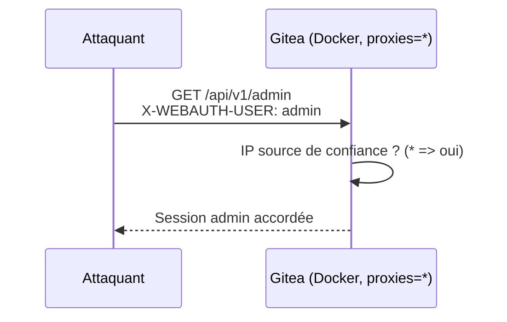
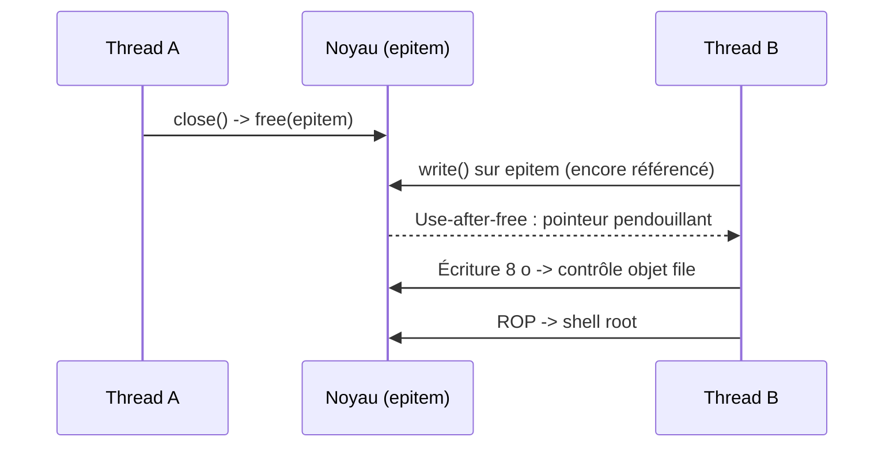

# Tech — Détail du mardi 7 juillet 2026

## 1. Gitea CVE-2026-20896 — un seul en-tête HTTP pour devenir admin (CVSS 9.8)

**Source :** The Hacker News — https://thehackernews.com/2026/07/threat-actors-probe-gitea-docker-flaw.html
**Date :** 6 juillet 2026

### Contexte

Gitea propose une authentification par **reverse proxy** : le proxy authentifie l'utilisateur, puis passe son identité à Gitea via l'en-tête `X-WEBAUTH-USER`. Pratique derrière un SSO. Problème : les **images Docker officielles** livraient un `app.ini` avec `REVERSE_PROXY_TRUSTED_PROXIES = *`. Traduction : Gitea faisait confiance à cet en-tête **depuis n'importe quelle IP**. N'importe quel client capable d'atteindre le port Gitea pouvait donc s'auto-déclarer `admin`. Sysdig a détecté les premières sondes d'exploitation 13 jours après la divulgation ; ~6 200 instances sont exposées sur Internet.

### Comment ça marche

En temps normal, Gitea compare l'**IP source** de la requête à la liste `REVERSE_PROXY_TRUSTED_PROXIES`. Si elle correspond, il accepte `X-WEBAUTH-USER` comme identité prouvée par le proxy. Sinon, il l'ignore. Le wildcard `*` fait matcher **toutes** les IP : le garde-fou saute. L'attaquant forge alors la requête avec l'en-tête de son choix ; Gitea le croit sur parole et ouvre une session privilégiée.

Le piège, c'est que cet en-tête est **trivialement falsifiable** : ce n'est qu'une chaîne de texte dans la requête HTTP, sous contrôle total du client. Aucune fuite de mot de passe, aucun 0-day mémoire — juste une **confiance mal placée** dans une donnée que l'attaquant écrit lui-même. Le défaut a survécu parce qu'il « marchait » en dev derrière un proxy, masquant le risque en prod.



### En pratique — exemple de code

La requête d'exploitation tient en une ligne ; le correctif tient dans la config.

```bash
# Exploitation : on se fait passer pour "admin" via l'en-tête de confiance
curl -H "X-WEBAUTH-USER: admin" https://gitea.exemple.tld/api/v1/user
```

```ini
# app.ini — AVANT (défaut Docker vulnérable)
[security]
REVERSE_PROXY_AUTHENTICATION_USER = X-WEBAUTH-USER
REVERSE_PROXY_TRUSTED_PROXIES = *          ; confiance à TOUTES les IP

# app.ini — APRÈS (n'autorise que ton proxy interne)
[security]
REVERSE_PROXY_TRUSTED_PROXIES = 10.0.0.5   ; IP unique du reverse proxy
```

### Pourquoi ça compte pour toi

Si tu héberges Gitea (ou tout service en reverse-proxy auth) en conteneur, vérifie **ce soir** ta valeur de `REVERSE_PROXY_TRUSTED_PROXIES`. Passe en **1.26.3+** et restreins la confiance à l'IP de ton proxy. La leçon est générale : ne fais jamais confiance à un en-tête d'identité (`X-Forwarded-*`, `X-WEBAUTH-*`) sans valider l'IP source. Un défaut de config vaut un RCE.

### Pour aller plus loin

Notes de version du correctif : https://blog.gitea.com/release-of-1.26.3-and-1.26.4/

---

## 2. Bad Epoll (CVE-2026-46242) — un use-after-free dans `epoll` donne le root local

**Source :** The Hacker News — https://thehackernews.com/2026/07/new-bad-epoll-linux-kernel-flaw-lets.html
**Date :** 4 juillet 2026

### Contexte

`epoll` est le mécanisme Linux qui permet à un programme de surveiller des milliers de descripteurs (sockets, fichiers) efficacement — serveurs web, bases, navigateurs s'appuient dessus. **Bad Epoll** est une **race condition use-after-free** dans ce sous-système : deux chemins du noyau libèrent le même objet interne pendant qu'un autre écrit encore dedans. Résultat : un utilisateur **sans aucun privilège** obtient le **root**, avec ~99 % de réussite. Trouvée par Jaeyoung Chung (soumission 0-day à Google kernelCTF), elle touche serveurs, desktops et **Android**. Write-up et exploit sont publics.

### Comment ça marche

Un `epitem` (l'objet qui lie un epoll à un fd surveillé) est libéré par un thread pendant qu'un second thread l'utilise encore : le pointeur devient **pendouillant** (dangling). La fenêtre de course est minuscule, mais un attaquant la répète des milliers de fois jusqu'à gagner. L'exploit chaîne **quatre epoll** : deux paires déclenchent la race en boucle, les autres servent de victimes.

Une fois la mémoire libérée réallouée avec des données choisies, une écriture corrompue de 8 octets devient un contrôle sur un objet `file`, puis une lecture arbitraire de mémoire noyau via `/proc/self/fdinfo`, et enfin une chaîne **ROP** qui ouvre un shell root. Le bug dormait depuis trois ans dans le noyau ; il a été primé (~71 000 $) au programme kernelCTF de Google.



### En pratique — exemple de code

Le bug vit dans le cycle de vie de l'objet epoll ; voici le schéma minimal côté utilisateur (conceptuel).

```c
// Conceptuel : la course exploitée par Bad Epoll
int ep = epoll_create1(0);
struct epoll_event ev = { .events = EPOLLIN };
epoll_ctl(ep, EPOLL_CTL_ADD, target_fd, &ev);   // crée l'epitem

// Thread 1 : ferme -> libère l'epitem
close(ep);
// Thread 2 (course) : agit sur l'epitem juste libéré -> use-after-free
epoll_ctl(ep, EPOLL_CTL_MOD, target_fd, &ev);   // écrit dans la mémoire freeée
```

```bash
# Défense : appliquer le kernel patché puis vérifier la version en cours
sudo apt update && sudo apt full-upgrade   # inclut le fix (commit a6dc643c6931)
uname -r                                    # confirme le noyau redémarré
```

### Pourquoi ça compte pour toi

Une faille de **privilege escalation** transforme un simple RCE web (ton appli .NET/Symfony compromise) en prise de contrôle totale de l'hôte. Sur un serveur mutualisé ou un nœud Kubernetes, un pod attaquant peut viser le root du nœud. Priorise le patch kernel sur tes hôtes exposés et tes images de base de conteneurs. Le PoC étant public, la fenêtre avant exploitation de masse est courte.

### Limites

L'attaque est **locale** : il faut déjà exécuter du code sur la machine. Elle sert de second étage, pas d'entrée initiale — mais c'est précisément ce qui rend un RCE « moyen » soudain critique.
