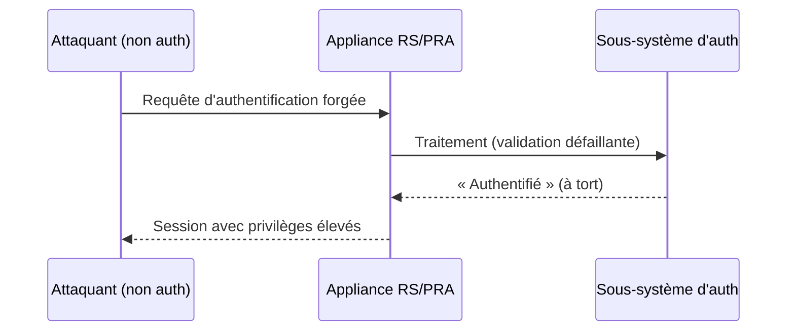
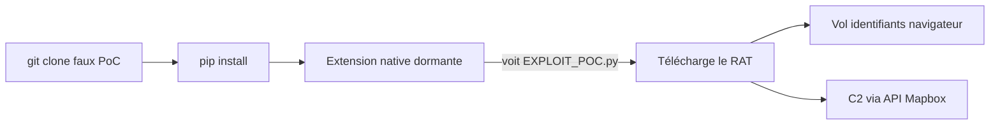

# Tech — Détail du mercredi 8 juillet 2026

## 1. BeyondTrust RS/PRA — CVE-2026-40138 & CVE-2026-40139, bypass d'authentification pré-auth (CVSS 9.2)

**Source :** The Hacker News — https://thehackernews.com/2026/07/beyondtrust-patches-critical-auth.html
**Date :** 7 juillet 2026

### Contexte

**BeyondTrust Remote Support (RS)** et **Privileged Remote Access (PRA)** sont des appliances d'accès distant privilégié, déployées dans les grandes entreprises : support IT à distance, accès des prestataires, coffre d'identifiants. Autrement dit, un point d'entrée qui, compromis, ouvre tout le reste. BeyondTrust vient de corriger **deux failles pré-authentification** (CVSS 9.2) dans le sous-système d'authentification de ces produits.

Le contexte aggrave l'enjeu : ces mêmes outils ont servi de porte d'entrée à une intrusion étatique majeure fin 2024. Ils restent une cible de choix. BeyondTrust dit ne pas avoir observé d'exploitation *in the wild* pour ces CVE, mais l'historique invite à patcher sans traîner.

### Comment ça marche

Les deux failles vivent dans le traitement des requêtes d'authentification. **CVE-2026-40139** : un traitement incorrect des requêtes d'auth permet à un attaquant **non authentifié** de contourner les contrôles et d'obtenir un accès, y compris à des comptes privilégiés. **CVE-2026-40138** : une validation incorrecte des données d'auth permet à un attaquant « positionné sur le réseau » le même contournement.

Les deux ne sont exploitables que si une **configuration d'authentification précise** est activée sur l'appliance — configuration que BeyondTrust n'a pas divulguée, par précaution, pour limiter le renseignement offensif avant la vague de patchs. Le schéma d'attaque logique :



### En pratique — remédiation

Ici, pas de code applicatif : c'est une appliance. L'action utile est de **repérer l'exposition et couper la surface** :

```bash
# 1) Identifier la version des appliances RS/PRA exposées (toute version <= 25.3.2 = vulnérable)
curl -sk https://ton-appliance.example.com/api/version | grep -i version

# 2) En attendant/au-delà du patch : n'exposer l'admin qu'au réseau de confiance
#    (exemple pare-feu : bloquer le 443 sauf depuis le sous-réseau d'administration)
iptables -A INPUT -p tcp --dport 443 ! -s 10.0.0.0/24 -j DROP
```

La correction définitive : passer en **RS 25.3.3 / PRA 25.3.3** ou ultérieur. Les instances *cloud* gérées par BeyondTrust ont déjà été patchées (21 avril) ; l'urgence porte sur les déploiements **on-premise**.

### Pourquoi ça compte pour toi

Une appliance d'accès distant, c'est la clé du royaume : si elle tombe, l'attaquant hérite de sessions privilégiées sur tout ton SI. Patche RS/PRA en **25.3.3** sans attendre, restreins l'accès admin au réseau de confiance, et audite les connexions récentes à la recherche d'anomalies. Sur ce type d'équipement, « exposé à Internet » et « à jour » ne sont pas négociables.

---

## 2. ChocoPoC — un RAT caché dans de faux dépôts de PoC vise chercheurs et devs

**Source :** The Hacker News — https://thehackernews.com/2026/07/new-chocopoc-rat-targets-vulnerability.html
**Date :** 1ᵉʳ juillet 2026 (divulgation YesWeHack & Sekoia, relayée cette semaine)

### Contexte

YesWeHack et Sekoia ont révélé la campagne **ChocoPoC** : de faux dépôts GitHub de *proof-of-concept* qui prétendent exploiter des CVE récentes et populaires. La cible : les chercheurs en sécurité et les développeurs qui testent ces PoC. L'astuce est vicieuse — le malware n'est **pas** dans le code PoC visible, celui qu'un dev prudent lit d'abord. Il est planqué dans la **chaîne de dépendances Python**.

### Comment ça marche

Le déroulé est conçu pour tromper l'humain *et* les bacs à sable. (1) Le `requirements.txt` du dépôt inclut des paquets malveillants (repérés : `frint`, `skytext`). (2) Au `pip install`, une **extension native Python compilée** est chargée. (3) Elle reste **dormante** jusqu'à détecter un fichier comme `EXPLOIT_POC.py` — une détection anti-sandbox : un environnement d'analyse qui installe le paquet et observe ne voit *rien*, car le déclencheur n'existe que dans le vrai dossier de travail de la cible. (4) Alors seulement, elle télécharge et exécute le **RAT**. (5) Le RAT siphonne mots de passe, cookies, autofill et historique (Chrome, Brave, Edge, Firefox), fichiers, historique shell, config réseau, processus. (6) Le C2 se fait via l'**API Mapbox Datasets** — un service légitime détourné en boîte aux lettres morte.



### En pratique — comment t'en prémunir

Le réflexe salvateur : lire les **dépendances**, pas seulement le code, et exécuter dans un environnement jetable.

```bash
# 1) Avant de lancer un PoC inconnu : inspecte SES dépendances
cat requirements.txt        # méfie-toi des paquets jamais vus (ex. frint, skytext)
pip download -d /tmp/audit -r requirements.txt   # récupère SANS installer/exécuter

# 2) Exécute l'analyse dans un conteneur jetable, sans réseau ni secrets montés
docker run --rm -it --network none -v "$PWD":/poc:ro python:3.12 bash
```

### Pourquoi ça compte pour toi

Tu `pip install` des PoC ? Le danger n'est pas le code que tu lis, c'est `requirements.txt`. Isole toute exécution non fiable dans un conteneur sans réseau ou une VM jetable, ne monte jamais tes secrets ni tes profils navigateur, et méfie-toi des dépôts fraîchement créés qui « exploitent » la CVE du jour. Un PoC est du code d'attaquant : traite-le comme tel.
