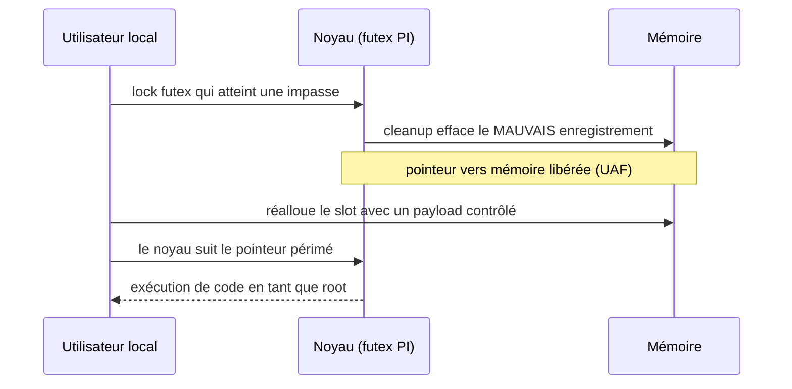
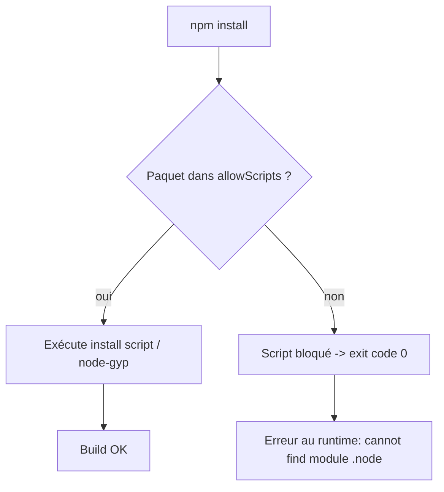

# Tech — Détail du jeudi 9 juillet 2026

## 1. GhostLock (CVE-2026-43499) — un use-after-free de 15 ans dans les futex donne root et casse les conteneurs

**Source :** The Hacker News — https://thehackernews.com/2026/07/15-year-old-ghostlock-flaw-enables-root.html
**Date :** 8 juillet 2026

### Contexte

Un `futex` (fast userspace mutex) est la primitive de synchronisation de bas niveau du noyau Linux : c'est ce qui se cache derrière tes mutex, tes sémaphores, tes verrous de threads. Pour éviter qu'une tâche urgente reste bloquée derrière une tâche triviale qui tient un verrou, le noyau implémente l'**héritage de priorité** (priority inheritance) : la tâche qui détient le verrou hérite temporairement de la priorité de celle qui l'attend. Ce mécanisme date de 2011.

Les chercheurs de Nebula Security ont trouvé GhostLock (CVE-2026-43499) dans ce code, avec leur outil de fuzzing VEGA. La faille a shippé par défaut dans quasiment toutes les distributions grand public depuis quinze ans. Elle ne demande **aucune permission spéciale, aucun réglage inhabituel, aucun accès réseau** : de simples appels de threading depuis n'importe quel programme local suffisent.

### Comment ça marche

Le cœur du bug est un **use-after-free** dans l'étape de nettoyage de l'héritage de priorité.

Déroulé pas à pas :

1. Le noyau maintient une structure qui suit quelle tâche attend quel verrou, pour propager les priorités.
2. Quand une tâche cesse d'attendre, une étape de nettoyage vient ranger cette structure. En temps normal, tout va bien.
3. Mais dans un cas rare — une opération de lock qui **atteint une impasse et doit faire marche arrière** — le nettoyage s'exécute au mauvais moment et efface l'enregistrement de la **mauvaise** tâche.
4. Le noyau conserve alors un pointeur vers un fragment de mémoire déjà libéré et réalloué. Faire confiance à ce pointeur périmé, c'est tout le bug.

À partir de là, l'équipe enchaîne quelques étapes pour transformer cette petite erreur en contrôle total : elle réalloue la mémoire libérée avec des données qu'elle contrôle, puis trompe le noyau pour lui faire exécuter son propre code en tant que root. Sur leur machine de test : **~5 secondes**, 97 % de fiabilité. Et comme le bug est dans le noyau partagé, l'exploit **s'échappe des conteneurs** — le noyau est le même pour l'hôte et le conteneur.



### En pratique — vérifier et patcher

Il n'y a **pas de contournement complet** : les opérations qui déclenchent le bug sont routinières pour n'importe quel process. La seule vraie réponse, c'est le noyau à jour. Attention au piège : le premier correctif (`3bfdc63936dd`) a introduit un **bug de crash séparé** (CVE-2026-53166), dont le fix se stabilisait encore début juillet.

```bash
# 1) Version courante du noyau
uname -r

# 2) Debian/Ubuntu : la version corrigée est-elle disponible ?
apt-get update && apt-cache policy linux-image-$(uname -r | sed 's/-generic//')-generic
#    -> installe le noyau COURANT, pas le premier build patché (cf. CVE-2026-53166)

sudo apt-get install --only-upgrade linux-image-generic && sudo reboot

# 3) Durcissement partiel en attendant (mitigation, PAS un fix) :
#    ces options rendent l'exploit plus difficile, sans le bloquer.
grep -E 'RANDOMIZE_KSTACK_OFFSET|STATIC_USERMODE_HELPER' /boot/config-$(uname -r)
```

### Pourquoi ça compte pour toi

Tes runners CI, tes hôtes Docker/Kubernetes et tes VM mutualisées sont exactement le terrain de jeu de GhostLock : ce sont des endroits où un attaquant obtient facilement le « foothold » local dont la faille a besoin, et l'évasion de conteneur transforme un job CI compromis en compromission de l'hôte. Patch ces machines en premier, avant tes postes de travail. Et retiens le principe : une faille « local only » devient une compromission distante dès qu'on la chaîne à un bug navigateur.

### Limites

CVSS 7.8 (high, pas critical) parce qu'il faut déjà être connecté. Disponibilité inégale des patchs : début juillet, Ubuntu listait encore 24.04, 22.04 et 20.04 LTS comme vulnérables ou en cours. Confirme la version de paquet corrigée, ne suppose pas qu'un patch t'attend.

---

## 2. npm v12 — `allowScripts` par défaut à off : la fin d'un défaut vieux de 16 ans

**Source :** Tech Times — https://www.techtimes.com/articles/319890/20260708/npm-v12-ships-this-month-blocking-install-scripts-that-enabled-year-supply-chain-attacks.htm
**Date :** 8 juillet 2026

### Contexte

Depuis plus d'une décennie, lancer `npm install` accorde à **chaque paquet** de l'arbre de dépendances — y compris ceux enfouis plusieurs niveaux plus bas que tu n'as jamais choisis — le droit d'exécuter des commandes shell arbitraires sur ta machine, via les scripts de cycle de vie `preinstall`/`install`/`postinstall`. Un projet npm moyen tire 79 dépendances transitives. Seuls ~2 % des paquets ont réellement besoin d'un install script ; les 98 % restants portent le droit d'exécuter du code sans en avoir l'usage.

Cette surface a été le vecteur de toutes les grandes attaques supply-chain de 2025-2026 : le ver **Shai-Hulud**, la compromission d'**Axios** (100 M de downloads/semaine) par un acteur nord-coréen via un `postinstall`, et **Miasma** qui contournait déjà les scanners. npm v12, attendu avant fin juillet 2026, retourne le défaut : `allowScripts` passe à **off**.

### Comment ça marche

Le modèle bascule de « tout paquet publié est implicitement autorisé à exécuter du code » vers « seuls les paquets de ta allowlist versionnée peuvent s'exécuter à l'installation ».

Mécanisme, étape par étape :

1. À `npm install`, npm lit un champ **allowlist** dans `package.json` *avant* d'exécuter le moindre script. Les paquets absents ont leurs scripts **silencieusement bloqués**.
2. L'allowlist n'est pas un flag de session : elle est écrite dans `package.json`, committée, diffable en pull request, auditée comme n'importe quelle décision de dépendance.
3. v12 ferme aussi deux vecteurs que `--ignore-scripts` ne couvrait pas. **Dépendances Git** : un dépôt Git malveillant peut embarquer un `.npmrc` qui réécrit le chemin du binaire `git` — bloqué par défaut, `--allow-git` requis. **Phantom Gyp** : tout paquet contenant un `binding.gyp` déclenche un rebuild `node-gyp` automatique, sans entrée de script — désormais traité comme un install script et bloqué hors allowlist.
4. Troisième blocage : les tarballs HTTPS et sources hors-registre (`--allow-remote` à `none`).

Le piège vicieux, c'est l'**échec silencieux**. Un addon natif bloqué → `npm install` se termine en **code de sortie 0**, sans message. Le binaire n'est jamais compilé. L'erreur surgit plus tard, au runtime, en `cannot find module X.node`.



### En pratique — migrer avant que ça casse en prod

N'attends pas v12. Le mode advisory existe déjà en npm 11.16.0 : les scripts tournent encore, mais chaque paquet que v12 bloquerait est signalé.

```bash
# 1) Passe en mode advisory (n'impose aucun blocage)
npm install -g npm@11.16.0

# 2) Génère la liste des paquets que v12 bloquerait (souvent 3 à 8)
npm approve-scripts --allow-scripts-pending

# 3) Révise paquet par paquet. Approuve ceux qui ont vraiment besoin
#    d'exécuter du code à l'install (addons natifs), refuse les autres.
npm approve-scripts sharp bcrypt
npm deny-scripts some-suspicious-pkg

# 4) Committe l'allowlist -> elle doit être versionnée pour valoir en CI
git add package.json && git commit -m "chore: npm v12 allowScripts allowlist"

# 5) Puppeteer/Playwright/Cypress : appelle l'install explicitement
#    (le postinstall qui téléchargeait le navigateur est bloqué)
npx playwright install
```

En CI, ajoute `--strict-allow-scripts` et écris un smoke test qui `require()` réellement tes modules natifs après install — ne te fie pas au code de sortie.

### Pourquoi ça compte pour toi

Si tu as des pipelines Node en CI/CD avec `sharp`, `bcrypt`, `esbuild` ou Playwright, tu vas te manger des builds qui « passent » mais déploient une app qui crash au premier appel. Fais la migration maintenant, en mode advisory, pendant que tu contrôles le timing — pas dans l'urgence quand v12 devient le défaut. Et surveille le réflexe dangereux : `npm approve-scripts --all` pour faire taire les warnings recrée exactement le modèle de confiance que v12 supprime.

### Limites

v12 ne protège pas contre le code malveillant dans les **fonctions runtime** d'un paquet (exécuté à l'import, pas à l'install), ni contre le **compte mainteneur compromis** qui publie une release signée légitime. Typosquatting et dependency confusion restent hors périmètre. pnpm applique cette politique depuis janvier 2025 ; npm était le dernier grand package manager à accorder l'exécution implicite.
