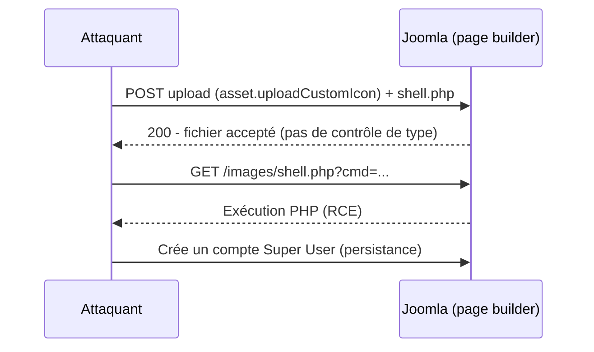

# Tech — Détail du samedi 11 juillet 2026

## 1. Joomla Page Builders au CISA KEV — upload non authentifié → web shell (CVSS 10.0)

**Source :** The Hacker News — https://thehackernews.com/2026/07/cisa-adds-4-actively-exploited-adobe.html
**Date :** 7 juillet 2026 (échéance de remédiation : 10 juillet)

### Contexte

La CISA a ajouté à son catalogue **Known Exploited Vulnerabilities** deux extensions Joomla très répandues : **SP Page Builder** de JoomShaper (**CVE-2026-48908**) et **Page Builder CK** de Joomlack (**CVE-2026-56290**). Les deux sont notées **CVSS 10.0** et **activement exploitées** — CVE-2026-56290 dès le 27 juin, en déposant un web shell. Ce sont des constructeurs de pages installés sur d'innombrables sites, souvent oubliés côté mises à jour.

### Comment ça marche

Le schéma est le même : un **upload de fichier arbitraire non authentifié**. Aucune session, aucun rôle requis. L'attaquant envoie une requête POST vers un endpoint d'upload d'asset, dépose un `.php`, puis l'exécute en le rappelant par son URL. Sur SP Page Builder, la cible observée est `index.php?option=com_sppagebuilder&task=asset.uploadCustomIcon` — pensé pour des icônes, il ne valide pas correctement le type/extension. Une fois le shell en place, on voit apparaître un **nouveau compte Super User** : persistance et contrôle total du CMS.



### En pratique — exemple de code

```bash
# Forme de la requête d'exploitation (à des fins de détection UNIQUEMENT)
# Un POST non authentifié dépose un PHP via l'endpoint d'upload d'icône
curl -s -X POST "https://cible/index.php?option=com_sppagebuilder&task=asset.uploadCustomIcon" \
  -F "file=@shell.php;type=image/svg+xml"

# Détection côté serveur : chercher des .php écrits récemment dans les dossiers d'upload
find /var/www -path '*/images/*' -name '*.php' -mtime -14 -ls
grep -RniE "uploadCustomIcon|com_sppagebuilder" /var/log/apache2/*access*
```

### Pourquoi ça compte pour toi

Si tu héberges ou maintiens des sites Joomla, ces deux extensions sont un risque immédiat, pré-authentification. Mets à jour **SP Page Builder ≥ 6.6.2** et **Page Builder CK ≥ 3.6.0** sans attendre, puis chasse les web shells déjà déposés (nouveaux `.php`, comptes Super User inconnus). Un CMS négligé reste le point d'entrée n°1 vers ton infra.

### Points de vigilance

Patcher ne suffit pas si le site est déjà compromis : audite les comptes admin et les fichiers récents avant de considérer l'incident clos.

---

## 2. OPNsense — RCE root et bypass du lockout, PoC public (CVE-2026-44195)

**Source :** SecurityOnline — https://securityonline.info/opnsense-root-rce-lockout-bypass-public-poc-disclosure/
**Date :** ~10 juillet 2026

### Contexte

OPNsense est un firewall/routeur open source (dérivé de pfSense/FreeBSD) très déployé en PME et homelab. Des chercheurs ont publié les **détails techniques et des PoC exploitables** pour deux failles : une **RCE en root** et un **contournement du mécanisme de lockout** (CVE-2026-44195, CVSS 5.3) qui bannit les IP après trop d'échecs de connexion. La publication du PoC change la donne : n'importe qui peut désormais tester l'exploit.

### Comment ça marche

Le lockout d'OPNsense compte les échecs de login et bannit l'IP passé un seuil. La faille est une **erreur de logique dans le `lockout_handler`** : dans certaines conditions, le compteur n'est pas incrémenté ou le bannissement est court-circuité, ce qui **rouvre la porte au brute-force** de l'interface d'administration. Combinée à la seconde vulnérabilité (RCE root), un attaquant qui parvient à s'authentifier — ou à forcer un compte — peut exécuter des commandes en root sur l'appliance, c'est-à-dire prendre le contrôle du firewall qui protège tout le réseau.

### En pratique — exemple de code

```bash
# Durcissement immédiat en attendant/après patch :
# 1) Ne jamais exposer l'admin OPNsense côté WAN
#    Firewall > Rules > WAN : bloquer 443/tcp vers l'interface de gestion

# 2) Restreindre l'accès admin à un sous-réseau de confiance (alias)
#    System > Settings > Administration : "Listen Interfaces" = LAN uniquement

# 3) Vérifier la version installée et mettre à jour
opnsense-version           # compare avec la dernière release corrigée
opnsense-update -bkf       # applique base + kernel + firmware, puis reboot
```

### Pourquoi ça compte pour toi

Un firewall compromis, c'est game over : l'attaquant voit et route tout ton trafic. Si tu exploites OPNsense, mets-le à jour dès que le correctif est disponible et **sors l'interface d'admin du WAN** — le PoC étant public, l'exploitation opportuniste suit vite. Le bypass de lockout signifie aussi que ta seule protection anti-brute-force ne tient plus : impose du MFA et des mots de passe forts sur les comptes d'admin.

### Limites

La RCE nécessite en général un accès authentifié ; le vrai risque vient de la **chaîne** bypass-lockout → brute-force → RCE. Ne te repose pas sur « il faut un login » pour minimiser.
