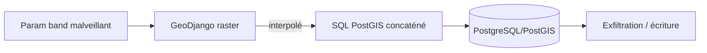
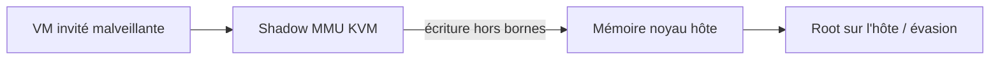
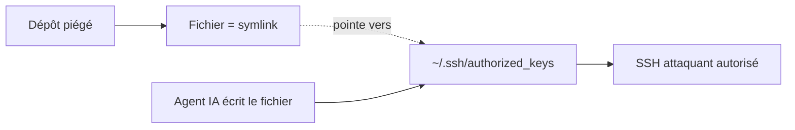

# Tech — Détail du lundi 13 juillet 2026

## 1. Django GeoDjango — SQL injection CVE-2026-1207 (PostGIS) exploitée dans la nature

**Source :** Cyber Security News — https://cybersecuritynews.com/django-sql-injection-vulnerability-exploited/
**Date :** exploitation active confirmée, semaine du 6-12 juillet 2026

### Contexte

**CVE-2026-1207** est une injection SQL dans le module **GeoDjango** de Django, sur les applis adossées à **PostGIS** (l'extension géospatiale de PostgreSQL). Divulguée en février 2026, elle est désormais **exploitée activement**, de façon ciblée. Django a corrigé en 6.0.2, 5.2.11 et 4.2.28. La faille passe par le paramètre `band` d'un champ raster : une valeur fabriquée s'injecte dans le SQL généré.

C'est le rappel classique : même un ORM réputé sûr laisse des angles morts quand un paramètre est concaténé au lieu d'être *bindé*.

### Comment ça marche

GeoDjango traduit tes requêtes géo en SQL PostGIS. Pour les rasters, certaines opérations acceptent un numéro de bande (`band`). Si cette valeur, contrôlée par l'utilisateur, est interpolée dans la chaîne SQL sans passer par un paramètre lié, l'attaquant referme la fonction, ajoute son propre SQL et lit ou modifie ce qu'il veut.



Le vecteur est sournois car il vit dans du code *géospatial*, rarement audité pour l'injection, et derrière un ORM qu'on croit blindé.

### En pratique — exemple de code

Le principe de la faille et le réflexe défensif :

```python
# Avant — DANGER : un paramètre utilisateur concaténé dans du SQL raster
band = request.GET["band"]                       # ex: "1) UNION SELECT password FROM auth_user--"
qs = Raster.objects.filter(rast__band=band)      # valeur interpolée -> injection

# Après — paramétrage + validation stricte du type attendu
band = int(request.GET["band"])                  # force un entier : coupe l'injection
if not 1 <= band <= 4:
    raise SuspiciousOperation("band hors bornes")
qs = Raster.objects.filter(rast__band=band)
```

```bash
# Correctif réel : passer sur une version patchée
pip install "Django>=5.2.11"    # ou 6.0.2 / 4.2.28 selon ta branche
```

Valider le type (`int`) et borner la valeur suffit à neutraliser ce vecteur ; la mise à jour Django ferme la faille à la source.

### Pourquoi ça compte pour toi

Tu fais du PostgreSQL au quotidien. La leçon est transverse à ton stack : Symfony/Doctrine, EF Core ou Django, dès que tu descends en SQL brut ou via une fonction exotique (raster, JSON, full-text), vérifie que **chaque valeur externe est un paramètre lié, jamais concaténée**. Un ORM ne te dispense pas d'auditer les chemins « raw ». Et applique les correctifs : ici l'exploitation est déjà en cours.

---

## 2. Januscape (CVE-2026-53359) — 16 ans de sommeil dans KVM, évasion invité → hôte

**Source :** Cyber Security News — https://cybersecuritynews.com/16-year-old-linux-kvm-vulnerability/
**Date :** divulgation semaine du 6-12 juillet 2026

### Contexte

**Januscape** (CVE-2026-53359) dormait depuis près de **16 ans** dans la logique du *shadow MMU* de **KVM**, l'hyperviseur du noyau Linux. Un invité malveillant peut corrompre la mémoire du noyau **hôte** et viser une **évasion complète invité → hôte avec les droits root**. La faille touche Intel et AMD, et a été exploitée en 0-day dans le **kvmCTF** de Google avant divulgation.

Pour toute infra multi-tenant (cloud, CI mutualisée, VM clients sur un même hôte), c'est le pire scénario : la frontière censée isoler les locataires tombe.

### Comment ça marche

KVM virtualise la mémoire via le *shadow MMU* : il maintient des tables de pages « ombres » qui mappent les adresses physiques *invité* vers les adresses physiques *hôte*. Le bug est une incohérence dans la gestion de ces structures : un invité orchestre des manipulations de pages qui font écrire KVM hors des bornes prévues, dans la mémoire du noyau hôte. De là, corruption ciblée → détournement du flux d'exécution → root sur l'hôte.



Le concept clé : le *shadow MMU* est un composant de confiance qui agit pour le compte de l'invité. Un défaut de validation à cette frontière annule toute l'isolation de la virtualisation.

### En pratique — exemple de code

Pas d'exploit ici, mais le réflexe d'exposition et de mitigation :

```bash
# Suis-je concerné ? (module KVM chargé = hôte de virtualisation)
lsmod | grep -E 'kvm_intel|kvm_amd' && uname -r

# Mitiger : patcher le noyau via ta distro, puis recharger/redémarrer
sudo apt update && sudo apt upgrade linux-image-$(uname -r | sed 's/-generic//')-generic
# Sur un hôte critique : migrer les VM ailleurs AVANT le reboot de patch
```

La seule vraie parade est le noyau à jour : c'est un bug de logique dans KVM, pas un réglage à durcir.

### Pourquoi ça compte pour toi

Si tes environnements de test/prod tournent sur des VM Linux (ou une CI qui *spawn* des VM), l'hôte partagé n'est plus une frontière fiable tant qu'il n'est pas patché. Priorise la mise à jour noyau des hyperviseurs, et sur les workloads sensibles, ne mutualise pas des tenants non fiables sur un hôte non corrigé. Rappel utile : « vieux code » ≠ « code sûr » — 16 ans sans être vu ne veut pas dire absent.

---

## 3. GhostApproval — un lien symbolique qui plante ta clé SSH dans les agents de code

**Source :** Cyber Security News — https://cybersecuritynews.com/ghostapproval-vulnerability/
**Date :** divulgation semaine du 6-12 juillet 2026

### Contexte

Les chercheurs de Wiz ont trouvé **GhostApproval**, une faille de suivi de lien symbolique (**CWE-61**) touchant plusieurs assistants de code IA : **Amazon Q, Claude Code, Augment, Cursor, Google Antigravity, Windsurf**. Un dépôt piégé contourne l'étape d'approbation *human-in-the-loop* et écrit une **clé SSH attaquant** directement dans le `~/.ssh/authorized_keys` du développeur. AWS, Cursor et Google ont patché ; Anthropic a d'abord contesté avant de corriger la résolution des symlinks dans Claude Code.

### Comment ça marche

Ces agents demandent ta validation avant d'écrire un fichier. L'astuce : le dépôt contient un fichier « anodin » (que tu approuves) qui est en réalité un **lien symbolique** pointant vers `~/.ssh/authorized_keys`. L'agent, croyant écrire dans le workspace, suit le symlink et écrit **hors** du répertoire de travail, dans un fichier ultra-sensible. Le garde-fou humain est contourné parce que tu as approuvé un *nom* de fichier, pas sa *cible* réelle.



Une clé dans `authorized_keys` = accès SSH persistant à ta machine, sans mot de passe.

### En pratique — exemple de code

Reproduire l'idée (défensivement) et se protéger :

```bash
# Le piège : dans le dépôt cloné, un "fichier" est en fait un lien vers ta conf SSH
ln -s ~/.ssh/authorized_keys ./config/settings.yaml   # posé par l'attaquant

# Défense 1 : repérer les symlinks sortants avant d'ouvrir un dépôt inconnu
find . -type l -exec ls -l {} \;                       # liste les liens et leurs cibles

# Défense 2 : mettre à jour tes agents (résolution symlink corrigée)
# Défense 3 : faire tourner l'agent dans un conteneur sans accès à $HOME
```

Le correctif éditeur *résout* désormais le lien avant écriture et refuse les cibles hors workspace.

### Pourquoi ça compte pour toi

Tu utilises probablement un de ces agents. Le risque n'est pas théorique : cloner un dépôt tiers et lancer l'agent dessus peut suffire. Mets à jour tes outils, exécute-les dans un environnement isolé (conteneur/devcontainer) sans accès à `~/.ssh`, et méfie-toi des symlinks dans les dépôts que tu n'as pas écrits. L'approbation « humaine » ne vaut que si tu vois la *cible* réelle de l'action, pas juste son étiquette.

### Pour aller plus loin

Même famille de risques cette semaine : *Friendly Fire* et *Ghostcommit* détournent les agents de code par injection de prompt cachée (docs de lib, images). Traite tout contenu de dépôt tiers comme une entrée non fiable, y compris pour ton assistant IA.
