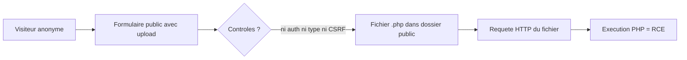
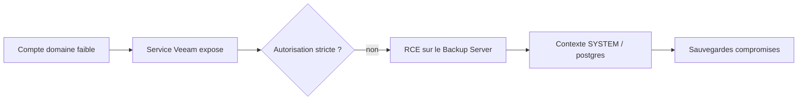

# Tech — Détail du mardi 14 juillet 2026

## 1. Joomla iCagenda & Balbooa Forms — deux zero-days CVSS 10 au CISA KEV

**Source :** The Hacker News — https://thehackernews.com/2026/07/icagenda-and-balbooa-forms-joomla-flaws.html
**Date :** CISA KEV le 10 juillet 2026 — deadline fédérale 13 juillet

### Contexte

La CISA a ajouté **CVE-2026-48939** (extension **iCagenda**) et **CVE-2026-56291** (extension **Balbooa Forms**) à son catalogue **Known Exploited Vulnerabilities**. Les deux sont notées **CVSS 10.0** et sont exploitées comme **zero-days** : iCagenda dans des attaques automatisées depuis le 15 juin, Balbooa découverte le 8 juillet après une attaque en direct. Même racine : un **upload de fichier non authentifié**. C'est la troisième vague d'exploitation d'extensions Joomla en une semaine — le pattern mérite qu'on le comprenne pour le fermer partout.

### Comment ça marche

Le schéma est un classique du RCE web, et il tient en quatre étapes :



Le formulaire front (« Submit an Event » pour iCagenda, une pièce jointe pour Balbooa) accepte un fichier **sans login, sans jeton CSRF, sans validation de type**. L'attaquant dépose un `.php`, puis l'appelle directement par son URL : le serveur l'exécute, c'est un webshell. La défense joue sur trois lignes : **valider** côté serveur (type réel, extension, taille), **isoler** le dossier d'upload (pas d'exécution), **patcher** vite (Balbooa corrigé en 2.4.1).

Le point souvent mal compris : bloquer l'extension `.php` ne suffit pas. Les serveurs interprètent aussi `.phtml`, `.php5`, `.phar`, et parfois des doubles extensions (`photo.php.jpg`) selon la configuration. Une **allow-list** stricte (seuls `.jpg`, `.png`, `.pdf` acceptés) bat toujours une **deny-list** qu'on peut contourner. Et comme l'exploitation est automatisée à grande échelle, un site non patché est touché en heures, pas en semaines — la fenêtre de réaction est courte.

### En pratique — exemple de code

Le durcissement le plus rentable : interdire l'exécution de tout script dans le répertoire d'upload. Un webshell déposé devient inerte.

```nginx
# Nginx — neutralise l'exécution de code dans les dossiers d'upload Joomla.
location ~* /(images|media|tmp)/.*\.(php|phtml|phar|cgi|pl)$ {
    deny all;               # le fichier ne sera jamais interprété
    return 403;
}

# Bonus : ne passe au moteur PHP que les .php hors dossiers d'upload
location ~ \.php$ {
    include fastcgi_params;
    fastcgi_pass unix:/run/php/php-fpm.sock;
}
```

Complète avec une validation applicative : vérifier le **type MIME réel** (magic bytes, pas l'extension déclarée) et **renommer** le fichier stocké.

### Pourquoi ça compte pour toi

Si tu héberges ou hérites un CMS PHP (Joomla, mais le pattern vaut pour tout upload), le répertoire d'upload est ton vecteur RCE numéro un. Deux réflexes : coupe l'exécution de script sur ces dossiers dès aujourd'hui, et automatise l'inventaire des extensions pour patcher en heures, pas en jours. Vérifie tes logs d'accès pour des requêtes vers des `.php` inhabituels dans `/images` ou `/tmp`.

### Pour aller plus loin | Détection

Au-delà du blocage, surveille les signes d'un webshell déjà déposé : fichiers récents dans les dossiers d'upload (`find images/ -name '*.php' -mtime -7`), requêtes `POST` suivies d'un `GET` vers le même chemin inhabituel, ou pics de trafic sortant. La même leçon vaut pour **tes** applis Symfony/.NET : tout endpoint d'upload doit valider le type réel côté serveur, stocker hors de la racine web quand c'est possible, et servir les fichiers via un contrôleur plutôt qu'en accès direct.

---

## 2. Veeam Backup & Replication — RCE par un simple utilisateur de domaine (CVE-2026-44963)

**Source :** The Hacker News — https://thehackernews.com/2026/06/veeam-backup-replication-rce-flaw-lets.html
**Date :** advisory Veeam 2026 (correctif 12.3.2.4854)

### Contexte

**CVE-2026-44963** (**CVSS 9.4**) permet l'exécution de code à distance sur le **Backup Server** Veeam par n'importe quel **utilisateur authentifié du domaine** — donc un compte à privilèges faibles suffit. Le même advisory corrige **CVE-2026-21666** et **CVE-2026-21667** (CVSS 9.9). Sont touchées les versions **12.3.2.4465 et antérieures** de la branche 12 ; la **13.x n'est pas affectée** grâce à des changements d'architecture. Correctif : **12.3.2.4854**. Détail crucial : seuls les serveurs **joints au domaine** sont vulnérables ; en workgroup, tu es hors périmètre.

### Comment ça marche

La chaîne d'attaque exploite la confiance excessive faite à un compte de domaine authentifié :



Un serveur de sauvegarde est une cible de choix pour les rançongiciels : le compromettre, c'est neutraliser ta capacité de restauration **avant** de chiffrer le reste. D'où la gravité : le point d'entrée n'est pas « admin », mais « tout utilisateur du domaine ».

Pourquoi la 13.x échappe-t-elle à la faille ? Veeam a revu l'architecture d'autorisation entre le client de gestion et le service backend : les appels ne s'exécutent plus dans un contexte aussi privilégié, et la surface RPC exposée aux comptes de domaine a été réduite. C'est un rappel utile — beaucoup de RCE « authentifiées » ne sont pas des bugs mémoire exotiques, mais des **défauts d'autorisation** : un service fait confiance à un appelant authentifié pour une opération qui devrait exiger un privilège bien supérieur.

### En pratique — exemple de code

Identifier rapidement tes instances exposées et leur version, pour prioriser le patch.

```powershell
# Repère la version de Veeam B&R et signale les builds vulnérables (< 12.3.2.4854).
$svc = Get-Service -Name "VeeamBackupSvc" -ErrorAction SilentlyContinue
if ($svc) {
    $v = (Get-ItemProperty "HKLM:\SOFTWARE\Veeam\Veeam Backup and Replication").CoreVersion
    Write-Host "Veeam détecté — build $v"
    if ([version]$v -lt [version]"12.3.2.4854") {
        Write-Warning "VULNÉRABLE (CVE-2026-44963) — patcher vers 12.3.2.4854 ou migrer en 13.x"
    }
}
```

### Pourquoi ça compte pour toi

Ton serveur de sauvegarde est le dernier rempart contre un rançongiciel : s'il tombe via un compte de domaine banal, tu perds la restauration. Patche vers 12.3.2.4854 (ou migre en 13.x), et applique le principe du moindre privilège autour de Veeam — sépare le serveur de sauvegarde du domaine de production quand c'est possible. Vérifie aussi que tes sauvegardes ont une copie **immuable** hors ligne.

### Pour aller plus loin | Durcissement

Applique la règle **3-2-1-1-0** : trois copies, deux supports, une hors site, une immuable (`hardened repository` Linux avec immutabilité), zéro erreur de restauration testée. Isole le serveur Veeam sur un segment réseau dédié, restreins l'accès RPC/management aux seules IP d'administration, et audite les comptes de domaine qui ont un droit quelconque sur le serveur. Enfin, teste réellement une restauration : une sauvegarde jamais restaurée est une hypothèse, pas une garantie.
