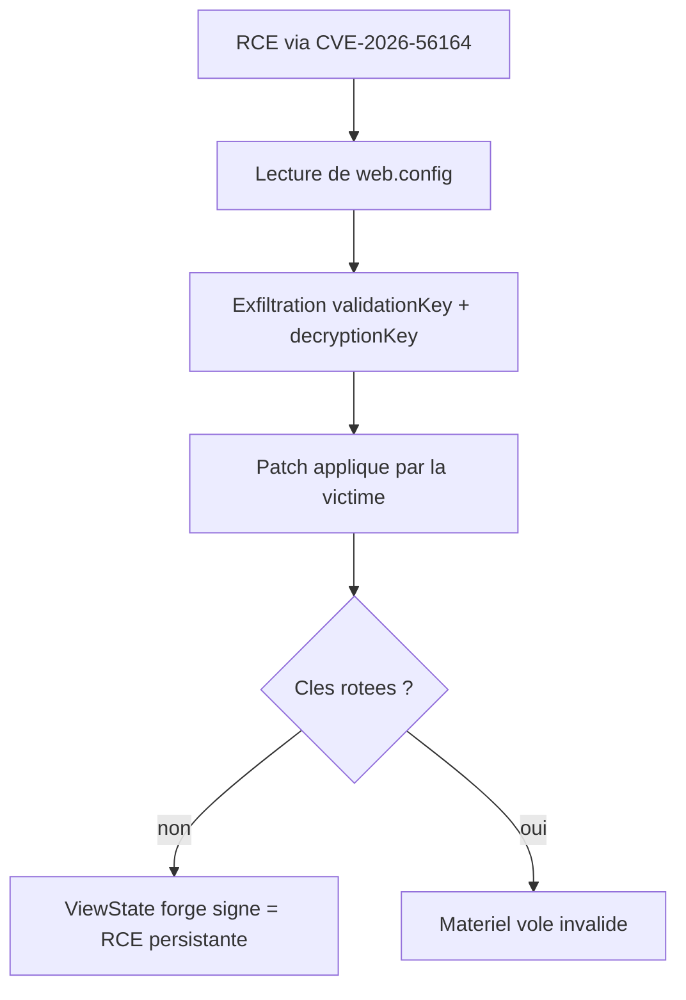
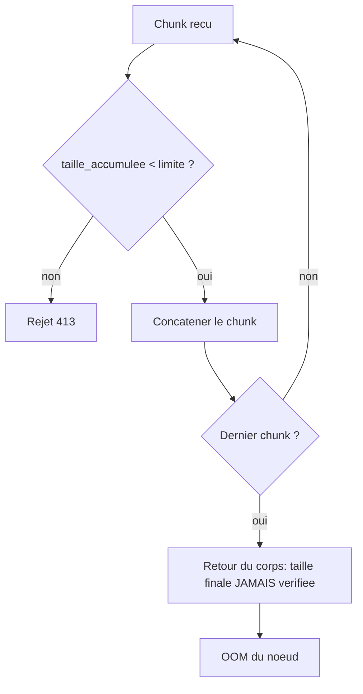
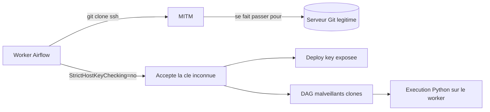

# Tech — Détail du mercredi 15 juillet 2026

## 1. CVE-2026-56164 (SharePoint) — au KEV, et le patch seul ne suffit pas

**Source :** CISA — https://www.cisa.gov/news-events/alerts/2026/07/14/cisa-urges-sharepoint-hardening-after-new-exploitations
**Date :** 14 juillet 2026

### Contexte

CISA a ajouté CVE-2026-56164 à son catalogue Known Exploited Vulnerabilities le 14 juillet 2026 et publié le même jour une alerte de durcissement. La faille touche SharePoint Server on-premises — Subscription Edition, 2019 et 2016. SharePoint Online n'est pas concerné.

Ce n'est pas le premier round : CVE-2026-45659 était entrée au KEV le 3 juillet, déjà pour de la RCE par désérialisation. La lignée remonte à la campagne « ToolShell », qui a fait école en 2025. Le fait que CISA publie une alerte de durcissement séparée, plutôt qu'un simple ajout au catalogue, dit l'essentiel : le comportement post-exploitation observé rend le patch insuffisant.

Le cœur du problème est là. Les attaquants n'utilisent pas la RCE seulement pour déposer un webshell. Ils exfiltrent les **machine keys ASP.NET** de SharePoint. Une fois ces clés dehors, ils n'ont plus besoin de la vulnérabilité — ils fabriquent des données authentifiées valides depuis l'extérieur. Tu patches, ils gardent l'accès.

### Comment ça marche

Il faut comprendre ce qu'est une machine key, parce que c'est directement transférable à tes propres applis ASP.NET.

ASP.NET est sans état côté serveur pour certains objets, et confie des données au client en les protégeant cryptographiquement. Le `ViewState` est l'exemple canonique : l'état d'une page est sérialisé, signé (`validationKey`), parfois chiffré (`decryptionKey`), puis renvoyé au navigateur dans un champ caché. Au postback, le serveur vérifie la signature et **désérialise**.

La sécurité repose entièrement sur un postulat : seul le serveur connaît la `validationKey`. La signature ne dit pas « ces données sont sûres », elle dit « ces données viennent de moi ».

Casse le postulat, et la chaîne se déroule. Un attaquant avec la `validationKey` forge un `ViewState` contenant un gadget de désérialisation — un graphe d'objets .NET dont la reconstruction déclenche l'exécution de code. Il le signe avec la clé volée. Le serveur vérifie la signature : valide. Il désérialise : exécution.

D'où la propriété qui rend cet incident spécial : **la persistance survit au correctif**. Le patch ferme la porte d'entrée initiale. Il ne révoque pas les clés. Sur une ferme SharePoint, la `machineKey` est de surcroît partagée entre tous les serveurs — une clé volée sur un nœud ouvre toute la ferme.



### En pratique — exemple de code

La remédiation tient en deux temps : patcher, puis faire tourner les clés. Le second est celui qu'on oublie.

```powershell
# 1. Constater la clé en place (si elle est statique, elle est exfiltrable)
Get-Content "C:\inetpub\wwwroot\wss\VirtualDirectories\80\web.config" |
  Select-String "machineKey"

# 2. Rotation SharePoint : régénérer la clé et la propager à toute la ferme
Update-SPMachineKey -WebApplication "https://sharepoint.interne"
Restart-Service SPTimerV4
iisreset /noforce   # sur CHAQUE serveur de la ferme

# 3. Vérifier qu'AMSI est actif — l'alerte CISA insiste dessus
Get-SPSecurityAmsiHealthCheck
```

Le principe se transpose à tes applis ASP.NET. La faute est de figer une clé statique en config :

```xml
<!-- Avant — clé statique dans web.config : un leak de fichier = RCE permanente -->
<machineKey
  validationKey="A1B2C3D4E5F6...FIGÉE..."
  decryptionKey="9F8E7D6C..."
  validation="SHA1" decryption="AES" />
```

```xml
<!-- Après — clé auto-générée, jamais écrite en clair.
     En ferme, préférer un key store externe (Key Vault, Data Protection). -->
<machineKey
  validationKey="AutoGenerate,IsolateApps"
  decryptionKey="AutoGenerate,IsolateApps"
  validation="HMACSHA256" decryption="AES" />
```

### Pourquoi ça compte pour toi

Deux choses. Si tu opères du SharePoint on-prem : patcher sans faire tourner les `machineKey` te laisse compromis, et la clé est partagée sur toute la ferme. Si tu écris du .NET : le schéma est générique. Toute clé de signature statique en config est une RCE en puissance dès qu'un attaquant lit un fichier. Regarde tes `web.config` et tes secrets Data Protection aujourd'hui — et vérifie que tu sais les faire tourner sans downtime.

### Pour aller plus loin

Le durcissement complet demandé par CISA va au-delà de la rotation : activer AMSI en mode Full, déployer Defender Antivirus sur les serveurs SharePoint, et surveiller les créations de `.aspx` dans les répertoires LAYOUTS. Sur le plan détection, l'indice le plus fiable n'est pas le webshell — c'est un `ViewState` valide arrivant d'une IP qui n'a jamais authentifié.

---

## 2. RabbitMQ CVE-2026-57212 — quand le contrôle de taille rate le dernier chunk

**Source :** THREATINT — https://cve.threatint.eu/CVE/CVE-2026-57212
**Date :** 10 juillet 2026

### Contexte

CVE-2026-57212 touche le plugin `rabbitmq_management`, celui qui expose l'API HTTP et l'interface d'administration. CVSS 7.1, classée CWE-770 — « Allocation of Resources Without Limits or Throttling ». Versions corrigées : 3.13.14, 4.0.19, 4.1.10 et 4.2.5.

Ce n'est pas une RCE, c'est un déni de service. Mais elle mérite le détour pour ce qu'elle enseigne : le bug est une erreur d'un caractère dans la logique, du genre qui passe toutes les revues de code.

Le contexte d'exposition compte. L'API de management est en théorie réservée aux admins et aux outils de monitoring. En pratique, elle finit exposée bien plus largement qu'on ne le croit — dashboards de supervision, healthchecks Kubernetes, scripts de provisioning, parfois un ingress mal cloisonné.

### Comment ça marche

Le problème vit dans `read_complete_body`, la fonction qui accumule le corps d'une requête HTTP.

HTTP ne livre pas un corps en un bloc. Le serveur lit par morceaux — chunks du transfer-encoding, ou simples segments TCP. Un lecteur de corps ressemble donc à une boucle : lire un chunk, l'ajouter à l'accumulateur, recommencer jusqu'au dernier.

Pour éviter qu'un client n'envoie un corps de 10 Go et fasse exploser la mémoire, on met une limite. La logique naturelle : à chaque tour, vérifier que l'accumulé reste sous le plafond.

Le bug est dans le **placement** du contrôle. La vérification a lieu sur la taille accumulée **avant** le chunk final, jamais sur la taille combinée **après** l'avoir intégré. Autrement dit, le dernier chunk n'est jamais compté.

Le résultat est direct : un client envoie un corps juste sous la limite, puis un dernier chunk énorme. À chaque itération, l'accumulé est conforme — la vérification passe. Le chunk final est concaténé sans contrôle. La mémoire est allouée. Répète en parallèle, et le nœud RabbitMQ part en OOM.

La précision « JSON **valide**, mais surdimensionné » est importante. Aucune malformation à détecter : c'est du JSON bien formé, simplement trop gros. Ni un WAF, ni un parseur strict ne le distingueront d'une requête légitime.



Le fix consiste à vérifier la taille **après** concaténation, pas avant. Une ligne, deux comportements radicalement différents.

### En pratique — exemple de code

La forme du bug, réduite à son squelette :

```erlang
%% Avant — le contrôle précède l'ajout : le dernier chunk échappe à la limite
read_body(Req, Acc, Limit) when byte_size(Acc) < Limit ->
    case cowboy_req:read_body(Req) of
        {ok, Chunk, Req2}   -> {ok, <<Acc/binary, Chunk/binary>>, Req2}; % non vérifié
        {more, Chunk, Req2} -> read_body(Req2, <<Acc/binary, Chunk/binary>>, Limit)
    end.

%% Après — on vérifie la taille APRÈS concaténation, y compris sur le dernier chunk
read_body(Req, Acc, Limit) ->
    case cowboy_req:read_body(Req) of
        {ok, Chunk, Req2} ->
            Total = <<Acc/binary, Chunk/binary>>,
            case byte_size(Total) > Limit of
                true  -> {error, body_too_large};
                false -> {ok, Total, Req2}
            end;
        {more, Chunk, Req2} ->
            Total = <<Acc/binary, Chunk/binary>>,
            case byte_size(Total) > Limit of
                true  -> {error, body_too_large};
                false -> read_body(Req2, Total, Limit)
            end
    end.
```

Vérifier ton exposition :

```bash
# Version installée
rabbitmqctl version
# Corrigé en 3.13.14 / 4.0.19 / 4.1.10 / 4.2.5

# L'API de management est-elle joignable hors du réseau d'admin ?
ss -tlnp | grep 15672
```

### Pourquoi ça compte pour toi

Si tu as du RabbitMQ derrière tes services .NET ou Symfony, le port 15672 n'a rien à faire ailleurs que sur un réseau d'admin. Mais retiens surtout le pattern : ta propre validation `[MaxLength]` ou tes limites de body Kestrel s'appliquent-elles au corps **complet**, ou seulement à ce qui a été lu jusqu'ici ? Le bug est trivial à reproduire dans n'importe quel lecteur de stream écrit à la main.

---

## 3. Airflow CVE-2026-58065 — le provider Git clonait sans vérifier l'hôte

**Source :** THREATINT — https://cve.threatint.eu/CVE/CVE-2026-58065
**Date :** 13 juillet 2026

### Contexte

Le provider Git d'Apache Airflow exécute ses opérations git-over-SSH avec `StrictHostKeyChecking=no` par défaut. Classée CWE-322 — « Key Exchange without Entity Authentication ». Corrigé dans `apache-airflow-providers-git` 0.4.1.

Sont concernés les déploiements qui utilisent le **Git DAG bundle** ou le provider Git pour cloner en SSH avec une deploy key. C'est-à-dire, en pratique, le pattern GitOps standard sur Airflow : les DAG vivent dans un dépôt, les workers clonent au démarrage.

Ce n'est pas la première fois dans cet écosystème. CVE-2026-45361 avait déjà épinglé `ComputeEngineSSHHook` du provider Google pour la même raison. Le pattern se répète parce que `StrictHostKeyChecking=no` est *le* remède universel au message qui bloque un pipeline en CI.

### Comment ça marche

SSH n'a pas d'autorité de certification par défaut. Quand tu te connectes à un serveur, il présente sa clé d'hôte, et le client doit décider s'il y croit. Le mécanisme est **TOFU** — Trust On First Use : la première fois, tu acceptes et la clé va dans `~/.ssh/known_hosts` ; ensuite, toute divergence lève une alerte.

`StrictHostKeyChecking` pilote ce comportement. À `yes`, un hôte inconnu est refusé. À `ask` (le défaut interactif), il te demande. À `no`, il accepte **n'importe quelle clé, silencieusement**, et l'ajoute à `known_hosts`.

Mettre `no` par défaut revient à supprimer l'authentification **du serveur**. Il reste l'authentification du client — ta deploy key — mais elle joue à sens unique. Tu prouves qui tu es à un serveur dont tu n'as pas vérifié l'identité.

Déroule l'attaque. Un adversaire en position d'intercepter le chemin réseau entre le worker et le serveur Git — DNS empoisonné, ARP spoofing, route BGP détournée, ou simplement un service compromis dans le même cluster — se fait passer pour `github.com`. Le worker se connecte. Le serveur présente une clé d'hôte inconnue. Avec `StrictHostKeyChecking=no`, le client accepte sans broncher et **s'authentifie**.

Deux conséquences, et la seconde est la pire.

La première : **capture de la deploy key**. Le client prouve sa possession de clé privée à un serveur hostile. Selon la configuration, la surface va de la fuite d'informations à la réutilisation directe des credentials.

La seconde : **injection de contenu**. Le faux serveur renvoie un dépôt de son choix. Airflow clone des DAG. Un DAG, c'est du Python que le worker **exécute**. Le MITM ne lit pas ton code, il choisit celui que tu vas exécuter — avec les droits du worker, sur toute ton infra d'orchestration.



### En pratique — exemple de code

Le correctif inverse le défaut, mais il faut fournir un `known_hosts` — sinon tu passes d'un risque silencieux à un pipeline cassé.

```bash
# 1. Mettre à jour le provider
pip install -U 'apache-airflow-providers-git>=0.4.1'

# 2. Récolter la clé d'hôte et VÉRIFIER son empreinte contre la doc officielle.
#    Ne jamais faire confiance au réseau pour cette étape.
ssh-keyscan -t ed25519 github.com > /opt/airflow/known_hosts
ssh-keygen -lf /opt/airflow/known_hosts
# Attendu (GitHub) : SHA256:+DiY3wvvV6TuJJhbpZisF/zLDA0zPMSvHdkr4UvCOqU
```

Côté connexion Airflow, le changement est explicite :

```python
# Avant — vulnérable : n'importe quelle clé d'hôte est acceptée
conn_extra = {
    "private_key": "{{ var.value.git_deploy_key }}",
    "strict_host_key_checking": False,          # MITM possible
}

# Après — l'hôte doit prouver son identité contre un known_hosts épinglé
conn_extra = {
    "private_key": "{{ var.value.git_deploy_key }}",
    "strict_host_key_checking": True,
    "known_hosts_file": "/opt/airflow/known_hosts",
}
```

### Pourquoi ça compte pour toi

Le vrai enseignement dépasse Airflow. Cherche `StrictHostKeyChecking=no`, `-o UserKnownHostsFile=/dev/null` et `GIT_SSH_COMMAND` dans tes pipelines et tes Dockerfile — tu vas en trouver, c'est le pansement classique quand un clone bloque en CI. Chaque occurrence est un MITM qui attend son réseau. Le coût de la version propre est un `ssh-keyscan` vérifié une fois, monté en secret. Fais-le sur tes runners avant tes DAG.

### Limites

Cette faille exige une position réseau privilégiée : ce n'est pas exploitable depuis Internet contre un cluster correctement segmenté. Elle devient sérieuse dans les environnements où quelque chose d'autre est déjà compromis — un pod voisin, un DNS interne, un runner CI mutualisé. C'est une faille de défense en profondeur : elle ne fait pas entrer l'attaquant, elle lui donne l'exécution de code une fois qu'il est dans le réseau.
