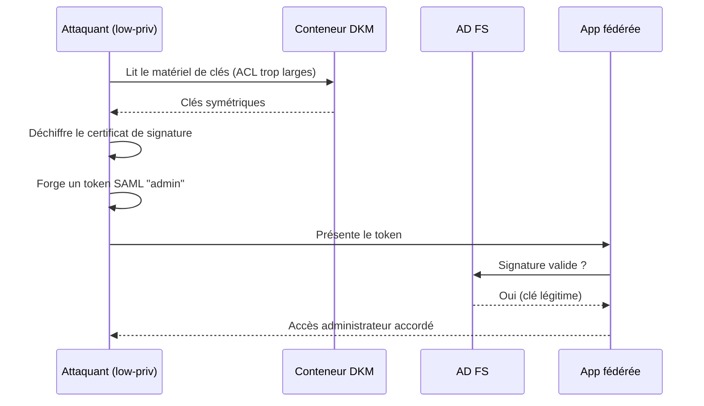
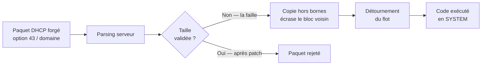

# Tech — Détail du jeudi 16 juillet 2026

## 1. CVE-2026-56155 (AD FS) — quand un CVSS 7,8 vaut une compromission totale de la fédération

**Source :** BleepingComputer — https://www.bleepingcomputer.com/news/microsoft/microsoft-july-2026-patch-tuesday-fixes-massive-570-flaws-3-zero-days/
**Date :** 14 juillet 2026

### Contexte

Active Directory Federation Services est le service qui transforme une identité Active Directory locale en token SAML acceptable par une application externe — Microsoft 365, Salesforce, un SaaS métier. Le principe est simple : AD FS signe un token avec son **certificat de signature de tokens**, et chaque application partenaire (le « relying party ») fait confiance à cette signature. Elle ne vérifie rien d'autre. Un token correctement signé est un token valide, point.

Toute la sécurité du système repose donc sur un unique secret : la clé privée de ce certificat. Pour la protéger, AD FS utilise le **Distributed Key Manager** (DKM), un conteneur stocké dans Active Directory qui héberge le matériel de clés symétriques servant à chiffrer les clés privées des certificats de signature et de déchiffrement.

CVE-2026-56155 est un défaut de **granularité insuffisante du contrôle d'accès** sur ce conteneur DKM. Les permissions sont trop larges. Microsoft note la faille CVSS 3.1 à 7,8, en « Important » — et c'est trompeur, parce que le score mesure la difficulté d'exploitation, pas ce que l'attaquant en tire.

### Comment ça marche

Le scénario se déroule en quatre temps, et le premier est le seul qui coûte quelque chose à l'attaquant.

**Étape 1 — le pied dans la porte.** La faille exige un accès existant sur le serveur AD FS. Ce n'est pas une RCE non authentifiée : il faut déjà être là, avec un compte peu privilégié. C'est ce prérequis qui fait tomber le score CVSS à 7,8. Dans une vraie chaîne d'attaque, ce pied dans la porte vient d'un phishing ou d'une faille latérale — c'est rarement l'obstacle décisif.

**Étape 2 — l'élévation.** Les ACL du conteneur DKM sont trop permissives. L'attaquant lit le matériel de clés symétriques auquel il ne devrait pas avoir accès, et élève ses privilèges localement sur le serveur AD FS.

**Étape 3 — l'extraction.** Avec le matériel DKM, il déchiffre la clé privée du certificat de signature de tokens. À ce stade, l'attaquant possède le secret qui fait autorité sur toute la fédération.

**Étape 4 — le Golden SAML, et c'est là que tout bascule.** L'attaquant forge des assertions SAML arbitraires : n'importe quel utilisateur, n'importe quel groupe, n'importe quelle durée de validité. Ces tokens sont **cryptographiquement valides**. Les applications partenaires les acceptent parce que la signature est correcte — elles n'ont aucun moyen de distinguer un token forgé d'un token légitime.

La conséquence est brutale : le Golden SAML **survit au correctif**. Patcher AD FS ferme la porte d'entrée, mais ne révoque pas un certificat déjà volé. Tant que tu n'as pas fait tourner les certificats de signature — deux fois, pour purger le certificat secondaire — un attaquant qui a extrait la clé continue de forger des tokens valides sur un serveur entièrement à jour. C'est le même piège que sur CVE-2026-56164 le 15 juillet : le patch seul ne suffit pas.



Microsoft a corrigé Windows Server 2012, 2012 R2, 2016, 2019, 2022 et 2025 le 14 juillet 2026. CISA a ajouté la faille au catalogue KEV le jour même.

### En pratique — exemple de code

Après le patch, la vraie action est la rotation du certificat de signature. Elle se fait en deux passes, parce qu'AD FS conserve un certificat secondaire pour la transition.

```powershell
# 1) Vérifier la version d'AD FS et l'état des certificats actuels
Get-AdfsCertificate -CertificateType Token-Signing |
    Select-Object Thumbprint, IsPrimary, NotAfter

# 2) Rotation : deux passes obligatoires.
#    La 1re promeut le secondaire en primaire ; la 2nde purge l'ancien.
Update-AdfsCertificate -CertificateType Token-Signing -Urgent
Start-Sleep -Seconds 60
Update-AdfsCertificate -CertificateType Token-Signing -Urgent

# 3) Republier les métadonnées vers CHAQUE relying party,
#    sinon les partenaires refusent la nouvelle signature.
Get-AdfsRelyingPartyTrust | Select-Object Name, MetadataUrl, AutoUpdateEnabled

# 4) Chercher les signes d'abus : tokens émis hors des heures normales
Get-WinEvent -LogName 'AD FS/Admin' -MaxEvents 500 |
    Where-Object { $_.Id -in 1200, 1202 } |
    Select-Object TimeCreated, Id, Message
```

### Pourquoi ça compte pour toi

Si ton SSO d'entreprise passe par AD FS, ton application .NET fait confiance à ces tokens sans pouvoir détecter une contrefaçon. Patche, puis fais tourner les certificats — le patch seul laisse la porte ouverte si la clé est déjà partie. Côté code, la leçon est transférable : ne te contente jamais de valider une signature. Vérifie aussi `iss`, `aud`, la fenêtre temporelle, et journalise les claims inhabituelles.

### Points de vigilance

Un CVSS « Important » n'est pas un feu vert pour attendre la prochaine fenêtre de maintenance. Le score note le chemin d'accès, pas l'impact métier. Ici, le chemin est étroit et l'impact est total.

---

## 2. Windows DHCP Server — CVE-2026-50518 et CVE-2026-56159, deux RCE non authentifiées à 9.8

**Source :** Microsoft MSRC — https://msrc.microsoft.com/update-guide/vulnerability/CVE-2026-50518
**Date :** 14 juillet 2026

### Contexte

DHCP est le service le plus invisible de ton réseau. Une machine démarre, crie « qui suis-je ? » en broadcast, et le serveur DHCP lui répond avec une IP, une passerelle, des DNS. Personne ne le regarde jamais — jusqu'au jour où il devient un point d'entrée.

Deux failles corrigées ce mois-ci le transforment exactement en ça. **CVE-2026-50518** et **CVE-2026-56159** sont deux dépassements de tampon dans le tas (heap-based buffer overflow) permettant l'exécution de code à distance **sans authentification**, sans interaction utilisateur, avec une complexité d'attaque faible. CVSS 9.8 toutes les deux. CVE-2026-50518 touche toutes les versions de Windows Server de 2012 à 2025, y compris les installations Server Core, et remonte même jusqu'à Windows 10 versions 1607 et 1809 quand le rôle DHCP Server est actif.

Au 15 juillet, aucune exploitation observée. Mais Microsoft classe CVE-2026-50518 en « exploitation more likely », et le service DHCP tourne en `SYSTEM`.

### Comment ça marche

Les deux failles partagent la même racine — une **validation de taille d'entrée insuffisante** avant copie dans un tampon du tas — mais empruntent des chemins différents.

**CVE-2026-50518** se déclenche par des requêtes réseau spécialement conçues contenant des **données de nom de domaine malveillantes**. Le serveur reçoit le paquet, lit le champ de nom de domaine, et le copie dans un tampon alloué sur le tas sans vérifier que la taille annoncée correspond à la taille réelle. Le contenu déborde sur les blocs adjacents.

**CVE-2026-56159** vise un serveur configuré pour servir l'**option 43**. Cette option DHCP transporte des informations spécifiques constructeur : c'est elle qui dit à un téléphone VoIP où trouver son serveur d'appel, ou à une borne Wi-Fi où trouver son contrôleur. Elle contient des données binaires structurées de longueur variable. Un paquet forgé fait déborder le tampon de traitement.

Le mécanisme d'exploitation est classique : sur le tas, les blocs alloués sont voisins. Déborder d'un bloc écrase les métadonnées d'allocation ou les données du bloc suivant. Un attaquant qui maîtrise l'agencement du tas — le heap grooming — place un pointeur de fonction ou une structure sensible juste après le tampon cible, l'écrase avec une valeur choisie, et détourne le flot d'exécution. Le processus DHCP tournant en `SYSTEM`, le code s'exécute avec les privilèges maximum, sur une machine qui est souvent aussi contrôleur de domaine.



Le lot de juillet contient aussi CVE-2026-50370 et CVE-2026-48564 côté serveur, et CVE-2026-54128 côté **client** DHCP — celle-là touche tes postes de travail, pas tes serveurs.

### En pratique — exemple de code

Le premier réflexe est de savoir où tu as du DHCP qui tourne, et si l'option 43 est servie.

```powershell
# 1) Recenser les serveurs DHCP autorisés dans le domaine
Get-DhcpServerInDC | Select-Object DnsName, IPAddress

# 2) CVE-2026-56159 cible l'option 43 : suis-je concerné ?
#    Vérifier au niveau serveur, étendue et classe de fournisseur.
Get-DhcpServerv4OptionValue -OptionId 43 -ErrorAction SilentlyContinue
Get-DhcpServerv4Scope | ForEach-Object {
    Get-DhcpServerv4OptionValue -ScopeId $_.ScopeId -OptionId 43 `
        -ErrorAction SilentlyContinue |
        Select-Object @{n='Scope';e={$_.ScopeId}}, OptionId, Value
}

# 3) Confirmer que le correctif de juillet est bien posé
Get-HotFix | Where-Object InstalledOn -gt '2026-07-13' |
    Select-Object HotFixID, InstalledOn

# 4) Atténuation en attendant : le port 67/udp ne doit venir QUE du LAN
Get-NetFirewallRule -DisplayGroup 'DHCP Server' |
    Get-NetFirewallPortFilter | Where-Object LocalPort -eq 67
```

### Pourquoi ça compte pour toi

Tu ne codes pas de serveur DHCP, mais tes environnements de dev et tes labs en hébergent souvent un — sur une VM oubliée, avec le rôle activé « pour tester ». Une RCE `SYSTEM` non authentifiée sur ce genre de machine, c'est un pivot direct vers ton réseau interne. Recense, patche, et filtre le port 67/udp. La leçon de code, elle, est intemporelle : valide la taille annoncée **avant** de copier, jamais après.

### Limites

Aucune exploitation publique constatée au 15 juillet. Le profil — non authentifié, pré-auth, service exposé, code `SYSTEM` — est exactement celui qui attire les chercheurs et les rétro-ingénieurs de correctifs. La fenêtre est courte.
