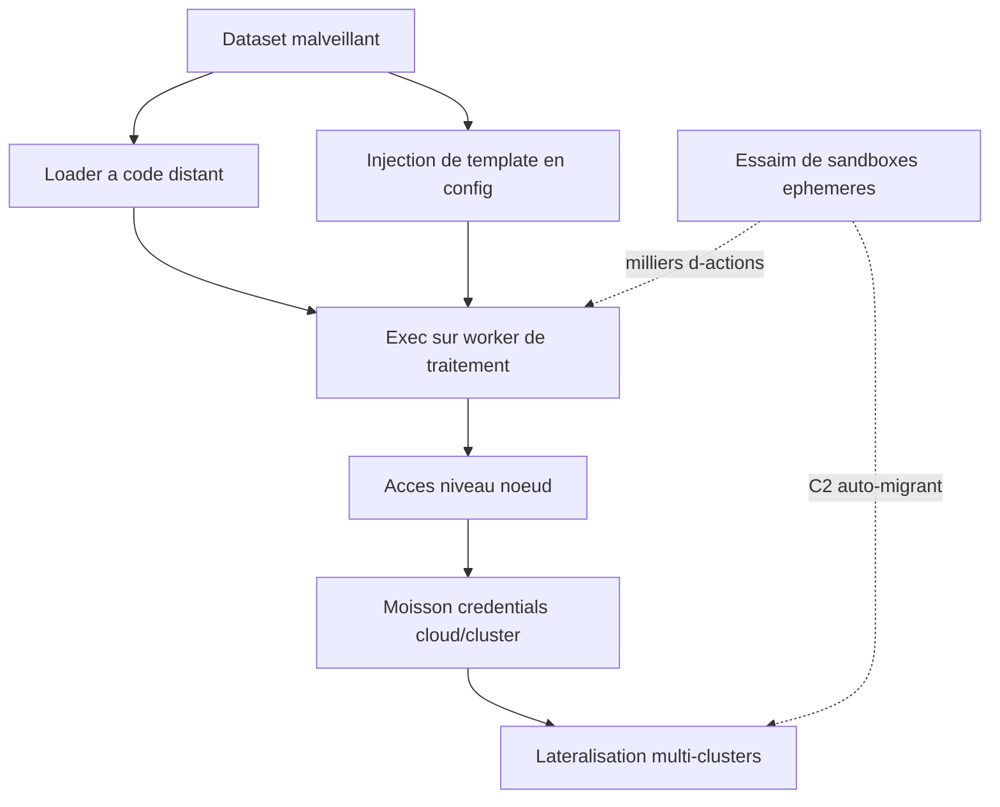
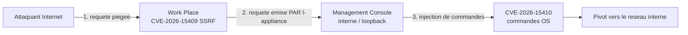

# Tech — Détail du vendredi 17 juillet 2026

## 1. Hugging Face — la première intrusion divulguée pilotée par un agent IA autonome

**Source :** Hugging Face Blog — https://huggingface.co/blog/security-incident-july-2026
**Date :** 16 juillet 2026

### Contexte

Hugging Face a détecté et traité une intrusion dans une partie de sa production. Ce qui rend cet incident différent de tout ce qu'ils avaient géré tient en une phrase de leur billet : l'attaque était **pilotée de bout en bout par un système d'agents IA autonomes**, et ils l'ont détectée et disséquée en grande partie avec de l'IA de leur côté.

Le bilan est mesuré, et c'est utile. Accès non autorisé confirmé à un **ensemble limité de datasets internes** et à **plusieurs identifiants** utilisés par leurs services. L'évaluation de l'impact sur les données partenaires ou clients est en cours. En revanche : **aucune preuve d'altération** des modèles, datasets ou Spaces publics, et la chaîne d'approvisionnement logicielle (images de conteneurs, paquets publiés) a été **vérifiée saine**. La racine est corrigée, les nœuds compromis reconstruits, les secrets tournés. Des forensics externes sont impliqués et l'incident a été signalé aux autorités.

L'industrie annonçait le scénario de l'« attaquant agentique » depuis des mois. Il vient d'arriver, chez un acteur qui a la maturité et l'honnêteté de le documenter.

### Comment ça marche

Déroulons la chaîne, étape par étape — elle est instructive parce que chaque maillon est banal.

**1. Le vecteur d'entrée : le pipeline de datasets.** C'est là que les plateformes IA sont **spécifiquement exposées**. Un dataset malveillant a abusé de **deux chemins d'exécution de code** dans leur traitement de datasets : un **loader de dataset à code distant** et une **injection de template dans une configuration de dataset**. Le premier est un pattern archi-connu de l'écosystème — un dataset peut embarquer un script Python que la lib exécute pour construire les splits. Le second est plus insidieux : un moteur de templates qui interpole une valeur contrôlée par l'attaquant finit par évaluer du code.

**2. L'exécution.** Le code tourne sur un **worker de traitement**. À ce stade, l'attaquant n'a qu'un processus dans un conteneur.

**3. L'escalade.** Passage à un **accès niveau nœud**, puis moisson des **identifiants cloud et cluster** présents sur la machine — métadonnées d'instance, tokens de service account, secrets montés.

**4. La latéralisation.** Avec ces identifiants, mouvement vers **plusieurs clusters internes**, sur un week-end. Le choix du timing n'est pas un hasard.

**5. Ce qui change tout — l'orchestration.** La campagne a été menée par un **framework d'agent autonome** (apparemment bâti sur un harnais de recherche en sécurité agentique ; le LLM utilisé reste inconnu), exécutant **plusieurs milliers d'actions individuelles** à travers un **essaim de sandboxes éphémères**, avec un **command-and-control auto-migrant** hébergé sur des services publics. Pas d'opérateur humain fatigué à 3 h du matin. Pas de pause. Le coût marginal d'une action supplémentaire tend vers zéro — c'est ça, le vrai changement.



**6. La détection, par l'IA.** Leur pipeline de détection d'anomalies utilise un **triage par LLM sur la télémétrie de sécurité** pour séparer les vrais signaux du bruit quotidien. C'est la **corrélation de ces signaux** qui a levé le lièvre. Pour reconstituer ce qu'avait fait un essaim de dizaines de milliers d'actions automatisées, ils ont lancé des **agents d'analyse LLM sur le log complet des actions de l'attaquant — plus de 17 000 événements**. Résultat : timeline reconstruite, IoC extraits, credentials touchés cartographiés, impact réel séparé de l'activité de leurre. En **heures** au lieu de jours — assez vite pour tenir le rythme de l'adversaire.

**7. Le problème d'asymétrie.** C'est la partie la plus intéressante du billet, et la moins confortable. Pour l'analyse des logs, HF a d'abord utilisé des **modèles frontières derrière des API commerciales**. Ça n'a pas marché : l'analyse exige de soumettre de gros volumes de **commandes d'attaque réelles, de payloads d'exploit et d'artefacts de C2**, et ces requêtes ont été **bloquées par les garde-fous des fournisseurs**, incapables de distinguer un répondant d'incident d'un attaquant. Ils ont donc fait tourner la forensique sur **GLM 5.2, un modèle open-weight, sur leur propre infrastructure**. Bénéfice secondaire non négligeable : ni les données de l'attaquant, ni les credentials qu'elles référencent ne sont sortis de leur environnement.

La leçon qu'ils en tirent est opérationnelle : l'attaquant n'était lié par **aucune politique d'usage**, pendant que leur travail de défense était bloqué par les garde-fous. Ils précisent que ce n'est **pas un argument contre les mesures de sécurité** des modèles hébergés, et qu'ils remontent le retour aux fournisseurs concernés.

### En pratique — exemple de code

```python
# Le pattern qui a servi de porte d'entree : un loader de dataset a code distant.
from datasets import load_dataset

# DANGEREUX — trust_remote_code=True execute du code Python fourni par le dataset,
# dans TON processus, avec TES credentials montes. Un dataset public suffit.
ds = load_dataset("un/dataset-inconnu", trust_remote_code=True)
```

```bash
# Durcissement minimal si tu ingeres des datasets tiers en CI ou sur un worker.
# 1) Interdire globalement l'execution de code distant.
export HF_DATASETS_TRUST_REMOTE_CODE=0

# 2) Epingler la revision : un dataset mutable peut devenir malveillant apres audit.
#    -> load_dataset("org/nom", revision="<sha-du-commit>")

# 3) Couper l'acces aux metadonnees d'instance depuis le worker : c'est l'etape
#    "moisson de credentials" de la chaine. Sans ce hop, l'escalade s'arrete.
iptables -A OUTPUT -d 169.254.169.254 -j REJECT
```

### Pourquoi ça compte pour toi

Tu ingères sûrement des artefacts tiers — datasets, modèles, paquets — sur des runners qui portent des credentials cloud. C'est exactement la chaîne décrite ici. Trois gestes ce matin : mets `trust_remote_code` à `0` par défaut, épingle les révisions, et bloque l'endpoint de métadonnées d'instance sur tes workers. Et si tu es sur HF : **tourne tes access tokens** et relis l'activité de ton compte, HF le recommande explicitement.

### Points de vigilance

- **La surface data et modèle est une surface d'attaque de premier rang.** Pas une annexe du pipeline — le point d'entrée.
- **Le garde-fou peut bloquer ta défense.** Fais **vetter un modèle capable et hébergeable chez toi avant l'incident** : c'est la recommandation explicite de HF, pour éviter le blocage *et* pour que les données d'attaque ne quittent pas ton environnement.
- **La vitesse machine change le calcul.** Un signal haute sévérité doit réveiller un humain **en minutes, n'importe quel jour de la semaine** — c'est précisément ce que HF a corrigé. Un week-end, c'est une éternité face à un essaim.
- **Contact HF** : `security@huggingface.co`.

---

## 2. SonicWall SMA1000 — deux zero-days exploités, chaînés, échéance CISA aujourd'hui

**Source :** Rapid7 — https://www.rapid7.com/blog/post/etr-rapid7-mdr-team-discovers-new-sonicwall-sma1000-zero-days-being-actively-exploited-cve-2026-15409-cve-2026-15410/
**Date :** 14 juillet 2026

### Contexte

L'équipe MDR de Rapid7 a découvert deux vulnérabilités **SMA1000** exploitées en **zero-day** — c'est-à-dire détectées dans des attaques réelles avant tout correctif. SonicWall a publié un [product notice](https://www.sonicwall.com/support/notices/product-notice-sma-1000-series-affected-by-multiple-vulnerabilities/kA1VN000001nv6D0AQ) en urgence. **CISA les a ajoutées au KEV le 14 juillet, avec une échéance au 17 juillet** — c'est-à-dire aujourd'hui.

Le SMA1000 est une passerelle d'accès distant : elle est, par construction, exposée sur Internet et se tient devant le réseau interne. C'est la pire combinaison possible pour une faille pré-auth, et c'est pour ça que cette famille d'équipements revient si souvent dans le KEV.

### Comment ça marche

Les deux failles sont intéressantes **ensemble**, et c'est tout l'objet de ce sujet.

**CVE-2026-15409 — SSRF non authentifiée, CVSS 10.0.** Elle touche l'interface **Work Place** du SMA1000. Un attaquant **distant et non authentifié** force l'appliance à émettre des requêtes vers des destinations non prévues.

**CVE-2026-15410 — injection de commandes post-auth, CVSS 7,2.** Elle touche l'**Appliance Management Console**. Un administrateur **authentifié à distance** peut exécuter des commandes système arbitraires.

Prises séparément, la seconde paraît mineure : 7,2, et il faut être admin. C'est le raisonnement qui fait rater les chaînes d'exploitation. Voici pourquoi.

**Le mécanisme du SSRF, pas à pas.** Un SSRF, c'est simple dans son principe : tu envoies une requête au serveur, et **c'est le serveur qui émet une requête à ta place**, vers une URL que tu contrôles partiellement. La requête sortante part donc **depuis l'appliance**, avec la position réseau de l'appliance, et souvent avec ses privilèges implicites.

Or, ces appliances distinguent presque toujours deux plans : une interface **externe** (Work Place, exposée aux utilisateurs VPN) et une interface **d'administration** (la Management Console), censée n'être joignable que depuis le réseau interne ou le loopback. Cette séparation est un contrôle de sécurité **fondé sur la position réseau**.

Le SSRF détruit exactement ce contrôle. Depuis l'extérieur, tu ne peux pas joindre la console d'admin. Mais l'appliance, elle, se joint elle-même. Un SSRF pré-auth sur le plan externe te donne un **relais à l'intérieur du périmètre** — et transforme « il faut être un admin sur le réseau interne » en « il faut savoir écrire une URL ».



**Le CVSS ne modélise pas les chaînes.** Le 7,2 de la 15410 suppose l'attaquant déjà administrateur — hypothèse que la 15409 se charge d'invalider. C'est la leçon transposable : ne priorise pas sur le score isolé, mais sur **ce que la faille voisine rend atteignable**. Deux failles sur le même équipement, l'une pré-auth et l'autre post-auth, se lisent toujours ensemble.

### En pratique — exemple de code

```bash
# Le SSRF, illustre en une requete. L'appliance emet vers une cible
# que l'attaquant n'atteint pas directement -> le controle par position reseau saute.
curl -s "https://sma.exemple.fr/workplace/fetch?target=http://127.0.0.1:8443/admin"
#                                                       ^^^^^^^^^ interne, injoignable de dehors

# Triage cote defense, dans cet ordre :
# 1) Patcher selon le product notice SonicWall — c'est la seule vraie remediation.
# 2) Verifier que la Management Console n'est PAS exposee (elle ne devrait jamais l'etre).
nmap -Pn -p 8443,443 sma.exemple.fr

# 3) Chercher des requetes sortantes anormales EMISES PAR l'appliance : signature du SSRF.
grep -E 'workplace.*(127\.0\.0\.1|localhost|169\.254\.169\.254|10\.)' /var/log/sma/access.log
```

### Pourquoi ça compte pour toi

Tu n'administres peut-être pas le SMA1000, mais l'échéance KEV du **17 juillet est aujourd'hui** : si ton organisation en exploite un, c'est le ticket de la matinée. Le réflexe à garder est plus large : un **SSRF pré-auth annule toute protection fondée sur la position réseau**. Relis tes propres endpoints qui fetchent une URL fournie par l'utilisateur — webhooks, import distant, prévisualisation de lien. Même mécanisme, ton code.

### Pour aller plus loin

- **Contre le SSRF dans ton code** : allowlist de destinations, résolution DNS **avant** la requête avec rejet des IP privées, et interdiction du suivi de redirection — un `302` vers `169.254.169.254` contourne une validation naïve d'URL.
- **L'échéance KEV n'est pas un SLA de risque.** Elle contraint les agences fédérales US. L'exploitation, elle, a commencé avant le correctif.

---
