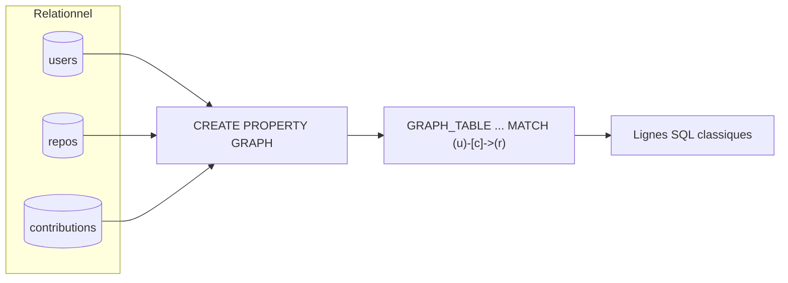
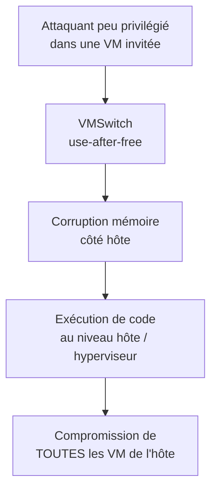
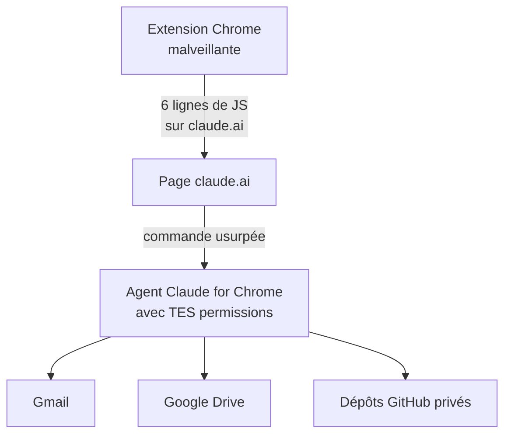

# Tech — Détail du samedi 18 juillet 2026

## 1. PostgreSQL 19 Beta 2 — tables temporelles `FOR PORTION OF` et graphes SQL/PGQ

**Source :** PostgreSQL Global Development Group — https://www.postgresql.org/about/news/postgresql-19-beta-2-released-3350/
**Date :** 16 juillet 2026

### Contexte

La deuxième bêta de PostgreSQL 19 est disponible depuis le 16 juillet ; la GA est visée pour septembre/octobre 2026. Deux fonctionnalités du standard SQL, attendues de longue date, arrivent enfin nativement : les **tables temporelles application-time** (SQL:2011) via `FOR PORTION OF` et `WITHOUT OVERLAPS`, et les **requêtes de graphe de propriété SQL/PGQ** (SQL:2023) via `CREATE PROPERTY GRAPH` et `GRAPH_TABLE`. La bêta 2 corrige d'ailleurs plusieurs bugs sur `FOR PORTION OF` et sur SQL/PGQ. Elle stabilise aussi `REPACK` (réorganisation de table en ligne) et le nouveau paramètre `max_retention_duration`.

### Comment ça marche

**Tables temporelles application-time.** Tu déclares une période nommée sur deux colonnes bornes, par exemple `PERIOD FOR validity (valid_from, valid_to)`. La contrainte `WITHOUT OVERLAPS` sur la clé primaire empêche deux lignes de se chevaucher pour une même entité. La commande `UPDATE … FOR PORTION OF validity FROM a TO b` applique le changement **uniquement** sur la tranche `[a, b)` et découpe automatiquement les lignes qui débordent. Fini le code maison de « split » de périodes et ses cas limites.

**SQL/PGQ.** Tu définis un graphe de propriété par-dessus tes tables relationnelles : les nœuds (vertex tables) et les arêtes (edge tables) sont mappés sur des tables existantes, reliées par clés. Tu interroges ensuite avec `GRAPH_TABLE(g MATCH (a)-[e]->(b) …)` en pattern-matching façon Cypher, **sans quitter SQL** ni ajouter une base graphe séparée. Le résultat est une table SQL classique, composable avec le reste de ta requête.



### En pratique — exemple de code

Le code montre une correction de prix limitée à juillet (Postgres découpe seul la ligne qui déborde), puis une requête de graphe en SQL pur.

```sql
-- 1) Table temporelle "application-time" : un prix par produit, par période
CREATE TABLE prix (
  produit_id int,
  montant    numeric,
  valid_from date,
  valid_to   date,
  PERIOD FOR validity (valid_from, valid_to),
  PRIMARY KEY (produit_id, validity WITHOUT OVERLAPS)   -- pas de chevauchement
);

-- Corrige le prix UNIQUEMENT sur juillet : la ligne qui déborde est découpée
UPDATE prix
  FOR PORTION OF validity FROM DATE '2026-07-01' TO DATE '2026-08-01'
  SET montant = 19.90
  WHERE produit_id = 42;

-- 2) SQL/PGQ : requête de graphe sans base graphe dédiée
CREATE PROPERTY GRAPH ressources
  VERTEX TABLES (users, repos)
  EDGE TABLES (contributions
    SOURCE KEY (user_id) REFERENCES users (id)
    DESTINATION KEY (repo_id) REFERENCES repos (id));

SELECT * FROM GRAPH_TABLE (ressources
  MATCH (u:users)-[:contributions]->(r:repos)
  WHERE r.stars > 1000
  COLUMNS (u.login, r.name));
```

### Pourquoi ça compte pour toi

Tu gères de l'historisation (prix, contrats, droits, versions) ? Les tables application-time suppriment ton code de découpage temporel et ses bugs, et `WITHOUT OVERLAPS` garantit l'intégrité au niveau base. SQL/PGQ t'évite d'ajouter Neo4j pour des requêtes de graphe modérées. Teste dès la bêta sur une copie : la GA arrive à l'automne, et migrer tes requêtes tôt évite la précipitation.

### Points de vigilance

- C'est une **bêta** : ne la mets pas en production ; syntaxe et détails peuvent encore changer d'ici la GA.
- **PostgreSQL 14 est en fin de vie le 12 novembre 2026** — profite de la vague pour planifier tes montées de version.

---

## 2. CVE-2026-57092 — évasion de VM Hyper-V (VMSwitch), vedette d'un Patch Tuesday record

**Source :** Malwarebytes — https://www.malwarebytes.com/blog/bugs/2026/07/july-2026-patch-tuesday-fixes-622-microsoft-cves-including-three-zero-days
**Date :** 15 juillet 2026 (correctif du 14 juillet)

### Contexte

Le Patch Tuesday de juillet 2026 est un record absolu : **622 CVE** (le triple de juin), dont 59 critiques et **3 zero-days** — deux activement exploités (AD FS `CVE-2026-56155`, SharePoint `CVE-2026-56164`) et un divulgué (BitLocker `CVE-2026-50661`). Malwarebytes résume la tendance : « l'ère des petits Patch Tuesday est peut-être révolue, à mesure que la découverte de vulnérabilités assistée par IA monte en puissance. » La faille la plus grave du lot n'est pourtant pas un des zero-days, mais **CVE-2026-57092**, notée **CVSS 9.9**, dans le composant VMSwitch de Hyper-V.

### Comment ça marche

VMSwitch est le **commutateur réseau virtuel** de Hyper-V, implémenté dans le noyau Windows. Il relie les VM entre elles, à l'hôte et au réseau physique — position centrale dans la pile de virtualisation. La faille est un **use-after-free** : un objet mémoire est libéré, puis un pointeur « pendouillant » vers cet objet est réutilisé. Un attaquant **peu privilégié à l'intérieur d'une VM invitée** déclenche cette réutilisation pour corrompre la mémoire **côté hôte** et y exécuter du code. C'est une **évasion invité → hôte** : le franchissement de la frontière d'isolation. En environnement mutualisé, c'est catastrophique — un locataire prend l'hyperviseur, donc toutes les VM. Le correctif du 14 juillet couvre toutes les éditions, jusqu'à Windows 10 1607 et Server 2012.



### En pratique — exemple de code

Aucun code d'exploitation ici : on vérifie l'état de patch. Le script PowerShell ci-dessous contrôle le niveau de correctif d'un hôte et alerte si le rôle Hyper-V est présent.

```powershell
# Vérifie que le correctif de juillet 2026 est bien appliqué (défensif, aucun exploit).
$build = [System.Environment]::OSVersion.Version
Write-Host "Build OS : $build"

# Derniers correctifs de sécurité installés, triés par date
Get-HotFix | Sort-Object InstalledOn -Descending |
  Select-Object HotFixID, Description, InstalledOn -First 5

# Si le rôle Hyper-V est présent, rappelle la criticité
if ((Get-WindowsFeature -Name Hyper-V -ErrorAction SilentlyContinue).Installed) {
  Write-Warning "Hote Hyper-V : CVE-2026-57092 (CVSS 9.9) -> patch de juillet obligatoire."
}
```

### Pourquoi ça compte pour toi

Si tu fais tourner des conteneurs Windows, des VM de CI ou tout hôte Hyper-V mutualisé, une évasion invité → hôte anéantit l'isolation sur laquelle repose ta sécurité. Patche en priorité les **hôtes de virtualisation**, pas seulement les postes. Retiens aussi la tendance : les Patch Tuesday à 600+ CVE deviennent la norme. Automatise l'inventaire et la priorisation par exploitation réelle (CISA KEV) — tu ne suivras plus à la main.

---

## 3. ClaudeBleed — une extension Chrome détourne l'agent Claude for Chrome (toujours pas corrigé)

**Source :** Malwarebytes — https://www.malwarebytes.com/blog/news/2026/07/claude-for-chrome-flaw-could-let-rogue-extensions-access-your-gmail
**Date :** 15 juillet 2026

### Contexte

Claude for Chrome (en bêta) est un agent navigateur qui, avec ta permission, agit dans Gmail, Google Drive ou GitHub. **ClaudeBleed**, signalé en mai par des chercheurs (dont Manifold Security), permet à une extension malveillante de se faire passer pour le site claude.ai et de piloter l'agent à ton insu. Anthropic a accusé réception puis fermé les rapports comme « résolus ». Mais selon les chercheurs, le correctif traite les symptômes : « huit versions plus tard, le contournement tient toujours en six lignes de JavaScript », inchangé dans la dernière version.

### Comment ça marche

Le cœur du problème est une **confusion d'origine et d'agentivité**. L'extension ne peut pas distinguer de façon fiable « l'utilisateur demande » de « un script demande à sa place ». Une extension qui exécute du JavaScript sur claude.ai peut émettre des commandes à l'agent **comme si c'était toi** : lire ton Gmail, cloner un dépôt GitHub privé, envoyer un mail en ton nom — sous ta session authentifiée, sans indice visible à l'écran. Le patch d'allowlist a changé **ce qui** peut être demandé, mais pas **qui** peut le demander : le transfert de privilège reste fragile.



### En pratique — exemple de code

Pas de payload ici : de la mitigation. Une politique Chrome d'entreprise verrouille les extensions à une allowlist stricte, ce qui coupe le vecteur.

```json
// Politique Chrome d'entreprise : bloque toute extension hors allowlist (défensif).
{
  "ExtensionInstallBlocklist": ["*"],                 // bloque tout par défaut
  "ExtensionInstallAllowlist": [
    "aapbdbdomjkkjkaonfhkkikfgjllcleb"                // uniquement les IDs validés
  ],
  "BlockExternalExtensions": true
}
```

En complément : dans Claude for Chrome, désactive **« Act without asking »** (l'agent redemande confirmation avant d'agir), audite et supprime les extensions non essentielles, et limite les comptes sensibles connectés à l'agent.

### Pourquoi ça compte pour toi

Tu utilises des agents navigateur (Claude for Chrome ou autres) sur des comptes pro — mail, Drive, GitHub ? Une extension anodine peut devenir un pilote fantôme de tes permissions. Traite ces agents comme du code privilégié : allowlist stricte d'extensions via policy, « Act without asking » désactivé, comptes sensibles hors de portée tant que le correctif de fond n'est pas livré. Le risque est réel et non corrigé à ce jour.
