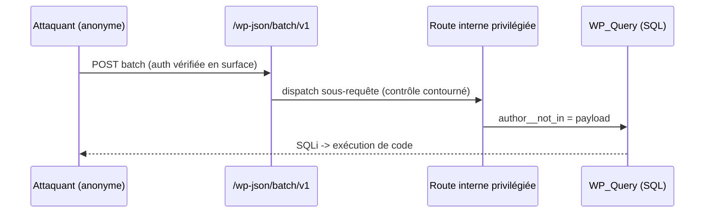
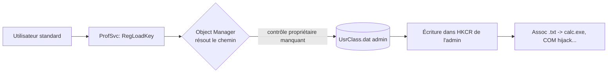
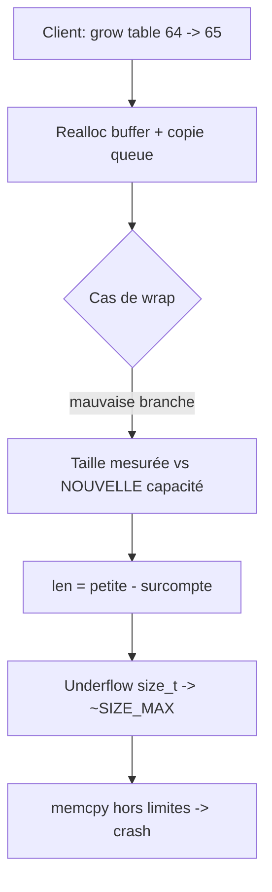

# Tech — Détail du dimanche 19 juillet 2026

## 1. wp2shell (CVE-2026-63030) — RCE pré-auth dans le cœur de WordPress

**Source :** The Hacker News — https://thehackernews.com/2026/07/new-wp2shell-wordpress-core-flaw-lets.html
**Date :** 17 juillet 2026

### Contexte

WordPress a publié en urgence les versions **7.0.2** et **6.9.5** le 17 juillet. Elles corrigent une faille critique baptisée **wp2shell** : une exécution de code à distance (RCE) **pré-authentification** dans le cœur, sans plugin, sur une installation par défaut. Une simple requête HTTP anonyme suffit. Les branches vulnérables sont **6.9.0 → 6.9.4** et **7.0.0 → 7.0.1** ; le code fautif est arrivé avec la 6.9 (décembre 2025). WordPress.org a forcé les mises à jour automatiques et aucune exploitation n'était signalée au 18 juillet, mais un PoC est public.

### Comment ça marche

wp2shell n'est pas un bug unique : c'est une **chaîne de deux failles**. La porte d'entrée est une **confusion de route** dans l'endpoint REST `/wp-json/batch/v1` (**CVE-2026-63030**). Ce endpoint permet d'empaqueter plusieurs appels REST dans une seule requête. La validation d'autorisation se fait sur la requête externe, mais les sous-requêtes sont dispatchées vers leurs routes internes d'une façon qui **court-circuite le contrôle de permission par route**. Un anonyme atteint ainsi une route qui devrait exiger des droits.

De là, le paramètre `author__not_in` de `WP_Query` reçoit une valeur attaquant qui se concatène dans le SQL sans échappement correct : c'est l'**injection SQL CVE-2026-60137**. La SQLi est ensuite exploitée jusqu'à l'exécution de code. Toute la requête reste « légale » côté API.



### En pratique — exemple de code

La forme de l'attaque : un lot REST qui glisse une sous-requête vers la route sensible avec le paramètre piégé.

```bash
# Requête d'attaque (schématique) — un lot REST anonyme
curl -s https://cible.tld/wp-json/batch/v1 \
  -H 'Content-Type: application/json' \
  -d '{
        "requests": [
          { "method": "POST", "path": "/wp/v2/posts",
            "body": { "author__not_in": "0) UNION SELECT ...--" } }
        ]
      }'

# Le seul vrai correctif : passer en 7.0.2 / 6.9.5
wp core update --version=7.0.2       # WP-CLI
# ou laisser l'auto-update forcé s'appliquer, puis vérifier :
wp core version
```

### Pourquoi ça compte pour toi

Une RCE pré-auth dans le cœur, sans plugin, c'est le pire scénario WordPress — et WordPress traîne souvent sur des VPS oubliés. Vérifie **tout** site en 6.9.x/7.0.x que tu héberges ou maintiens, même une vitrine annexe. Le pattern « batch route confusion + SQLi » vise ta logique d'autorisation : côté Symfony/API, contrôle les permissions **par sous-route**, jamais seulement à l'entrée.

### Points de vigilance

Un PoC est public : le délai avant scan de masse se compte en jours. Si tu ne peux pas patcher tout de suite, bloque `/wp-json/batch/v1` au WAF et coupe l'accès REST non authentifié.

---

## 2. LegacyHive — un zero-day Windows (ProfSvc) non corrigé après le Patch Tuesday

**Source :** The Hacker News — https://thehackernews.com/2026/07/researcher-drops-new-windows-zero-day.html
**Date :** 15 juillet 2026

### Contexte

Le chercheur **Chaotic Eclipse** (alias Nightmare-Eclipse) a publié **LegacyHive**, un PoC d'élévation de privilèges visant le **Windows User Profile Service (ProfSvc)**, le composant qui gère les profils utilisateurs. Particularité : il **fonctionne encore après la mise à jour de juillet 2026**, sur toutes les versions supportées, poste et serveur. Kevin Beaumont, Will Dormann et ThreatLocker ont confirmé qu'il marche et n'est pas patché. Microsoft « investigue ». Le chercheur diffuse ses failles avant correctif depuis avril, invoquant une rupture de communication.

### Comment ça marche

La faille est un **chargement de ruche (hive) arbitraire**. Une ruche est un fichier de registre (ici `UsrClass.dat`, la partie « classes » du profil). Normalement, monter la ruche d'un autre utilisateur exige des privilèges. LegacyHive abuse de la **résolution de chemin via l'Object Manager** de Windows : ProfSvc résout un chemin sans vérifier correctement à qui appartient la cible, et **monte la ruche d'un administrateur dans l'espace du compte non privilégié**.

Le PoC public est bridé : il réclame un second identifiant standard et un troisième nom d'utilisateur (qui peut être un admin). L'impact direct n'est pas un shell root : c'est une **primitive puissante** — écrire dans la ruche « classes » d'un admin (associations de fichiers, COM), donc influencer ce que fera l'admin ensuite.



### En pratique — exemple de code

Le principe du montage de ruche (ce que la faille rend possible **sans les droits requis**) :

```powershell
# Concept : monter une ruche "classes" et détourner une association de fichiers.
# Normalement réservé à l'admin ; LegacyHive le permet à un user standard.
reg load "HKU\Victim_Classes" "C:\Users\Admin\AppData\Local\Microsoft\Windows\UsrClass.dat"

# Détourner l'ouverture des .txt vers calc.exe dans le contexte de la victime
reg add "HKU\Victim_Classes\txtfile\shell\open\command" /ve /t REG_SZ /d "calc.exe" /f
reg unload "HKU\Victim_Classes"
```

### Pourquoi ça compte pour toi

Pas de correctif : la seule parade aujourd'hui est la détection. Surveille les `RegLoadKey`/montages de ruche par des comptes non-admin (Sysmon event 12/13, EDR). Sur tes serveurs de build et postes de dev Windows, applique le moindre privilège strict et n'y laisse pas traîner de comptes standard partagés. Un attaquant déjà présent transforme cette primitive en persistance ou en escalade indirecte.

### Limites

Le PoC public exige des identifiants supplémentaires et ne révèle pas de hash ni de code privilégié direct. La version originale du chercheur, elle, n'avait pas ces contraintes.

---

## 3. XRING — un octet de trop dans XQUIC fait tomber n'importe quel serveur HTTP/3

**Source :** The Hacker News — https://thehackernews.com/2026/07/unpatched-xring-flaw-in-xquic-lets.html
**Date :** 8 juillet 2026 (divulgation FoxIO)

### Contexte

Le chercheur **Sébastien Féry** (FoxIO) a divulgué **XRING**, une faille dans **XQUIC**, la bibliothèque QUIC/HTTP-3 open source d'Alibaba. Sans authentification et **sans paquet malformé**, environ **260 octets de trafic QPACK parfaitement légal** suffisent à faire crasher le processus serveur. Toutes les versions jusqu'à la **v1.9.4** (la dernière) sont touchées. Pas de correctif, pas de CVE au 10 juillet. XQUIC équipe **Tengine**, le serveur d'Alibaba basé sur Nginx, en frontal de Taobao et Alipay — et tout serveur tiers qui l'embarque.

### Comment ça marche

HTTP/3 compresse les en-têtes avec **QPACK** : une table dynamique partagée, que le client fait grossir via un flux de contrôle (l'encoder stream). XQUIC stocke cette table dans un **ring buffer** (mémoire circulaire qui « wrappe » de la fin vers le début).

Quand le client demande d'agrandir la table, XQUIC alloue un buffer plus grand et **recopie l'ancien contenu**. Cette copie a quatre cas selon que les données wrappent dans l'ancien buffer, le nouveau, les deux ou aucun. Dans **un** de ces cas, le code mesure la taille des données de queue contre la capacité du **nouveau** buffer (plus grand) au lieu de l'ancien : il **surcompte**. La longueur de copie vaut alors `petite_valeur − surcompte` ; comme c'est un `size_t` **non signé**, elle **underflow** et devient gigantesque → écriture hors limites.



### En pratique — exemple de code

Le cœur du bug, puis la seule parade disponible.

```c
/* Schématique : resize du ring buffer QPACK */
size_t tail = end - cursor;              /* octets de queue à recopier */
/* BUG : capacité mesurée contre le NOUVEAU buffer (plus grand) */
size_t to_move = new_cap - cursor;       /* surcompte -> 70 au lieu de 6 */
size_t len = tail - to_move;             /* 6 - 70 en size_t => ~SIZE_MAX */
memcpy(dst, src, len);                   /* copie hors limites -> abort */
```

```text
# Mitigation opérateur (tant qu'aucun correctif) : désactiver la table dynamique
SETTINGS_QPACK_MAX_TABLE_CAPACITY = 0
# ou couper le support HTTP/3
```

### Pourquoi ça compte pour toi

Si tu exposes du HTTP/3 via XQUIC ou Tengine, un anonyme peut te DoS avec un pavé de 260 octets **conformes** — aucun WAF signature ne le verra. Mets `SETTINGS_QPACK_MAX_TABLE_CAPACITY` à 0, ou désactive HTTP/3 le temps d'un patch. La leçon vaut au-delà : tout calcul de taille sur des entiers **non signés** doit vérifier `a >= b` **avant** la soustraction, sinon l'underflow te transforme un `memcpy` en arme.

### Pour aller plus loin

XRING rejoint une série de crashes distants sur HTTP/2 et HTTP/3 : l'UAF NGINX HTTP/3 (CVE-2026-42530) et le « HTTP/2 Bomb » de juin exploitaient déjà cette même surface de compression d'en-têtes.
