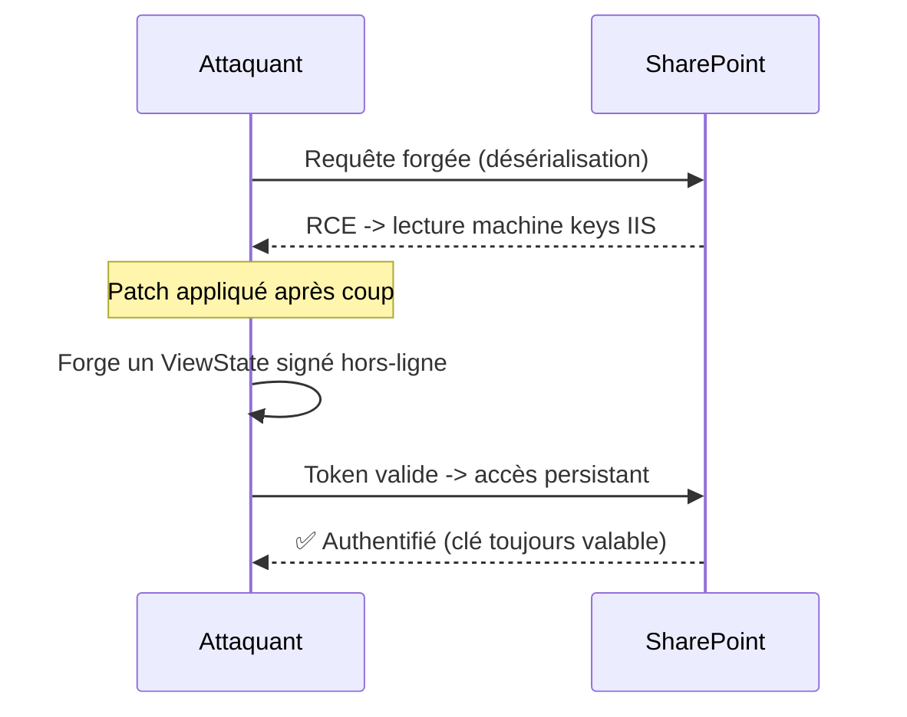
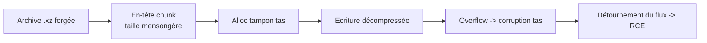

# Tech — Détail du mercredi 22 juillet 2026

## 1. SharePoint CVE-2026-50522 — RCE exploité, vol de machine keys, et pourquoi patcher ne suffit pas

**Source :** BleepingComputer — https://www.bleepingcomputer.com/news/security/critical-sharepoint-rce-flaw-exploited-to-steal-machine-keys/
**Date :** 20 juillet 2026

### Contexte

CVE-2026-50522 est une faille critique (CVSS 9.8) de **désérialisation de données non fiables** dans Microsoft SharePoint Server on-premise, permettant l'exécution de code à distance sur le réseau. Le 20 juillet, WatchTowr identifie un PoC public ; en quelques heures, son réseau de honeypots capture des tentatives d'exploitation réussies. L'équipe qualifie l'impact de « classe ToolShell », en référence à la campagne de l'été 2025 qui avait compromis des centaines de serveurs SharePoint via des groupes ransomware et étatiques.

### Comment ça marche

La désérialisation .NET est le nerf de l'attaque. SharePoint reconstruit des objets à partir de données fournies par le client ; si un flux malveillant est désérialisé sans validation de type, il peut instancier une chaîne de « gadgets » qui aboutit à l'exécution de commandes. Mais l'astuce dévastatrice ici est l'étape suivante : l'attaquant utilise le RCE pour lire les **machine keys** ASP.NET (`ValidationKey` / `DecryptionKey`) stockées dans la configuration IIS. Ces clés signent et chiffrent le `ViewState` et les cookies d'authentification.

Une fois les clés volées, l'attaquant n'a plus besoin de la faille : il **forge hors-ligne** des `ViewState` valides, donc des tokens d'authentification acceptés par le serveur. Il peut se faire passer pour n'importe quel utilisateur — d'où la persistance qui survit au patch.



### En pratique — exemple de code

La remédiation n'est pas qu'un `Update-Module` : il faut **invalider les clés volées** en les faisant tourner.

```powershell
# 1) Appliquer le correctif SharePoint (prérequis, mais insuffisant seul).

# 2) Régénérer les machine keys pour rendre inutiles celles déjà exfiltrées.
#    Sans cette rotation, un ViewState forgé reste accepté malgré le patch.
Update-SPMachineKey -WebApplication https://sharepoint.corp.local
Restart-Service W3SVC   # recharge la config IIS avec les nouvelles clés

# 3) Chasser les web shells déjà déposés (fichiers .aspx récents dans LAYOUTS).
Get-ChildItem -Recurse "C:\Program Files\...\TEMPLATE\LAYOUTS" -Filter *.aspx |
  Where-Object LastWriteTime -gt (Get-Date).AddDays(-14)
```

Le message central : si ton serveur a pu être exposé avant le patch, considère les clés comme compromises et fais-les tourner.

### Pourquoi ça compte pour toi

Même sans SharePoint, retiens le pattern : une RCE qui vole un **secret cryptographique de signature** crée une persistance indépendante de la faille d'origine. Ton réflexe « j'ai patché, c'est réglé » est faux dès qu'un secret a pu fuiter. Inventorie tes clés de signature de session (ASP.NET, JWT, cookies) et prévois une procédure de rotation — c'est elle qui coupe l'accès de l'attaquant, pas le correctif.

### Points de vigilance

CISA a émis une alerte de durcissement SharePoint : segmente l'exposition Internet, active AMSI et audite les `__VIEWSTATE` anormaux. La rotation de clés doit être coordonnée en ferme multi-serveurs pour éviter d'invalider les sessions légitimes de travers.

---

## 2. 7-Zip CVE-2026-14266 — une archive `.xz` piégée exécute du code à l'extraction

**Source :** BleepingComputer — https://www.bleepingcomputer.com/news/security/update-now-7-zip-fixes-rce-flaw-exploitable-with-malicious-archives/
**Date :** 18 juillet 2026 (divulgation ZDI le 15 juillet ; correctif 26.02 du 25 juin)

### Contexte

CVE-2026-14266 est un **débordement de tas** (heap-based buffer overflow) dans la façon dont 7-Zip traite les données XZ « chunkées ». Détaillée par la Zero Day Initiative de Trend Micro le 15 juillet, la faille (sévérité 7.0, High) permet d'exécuter du code en convainquant la victime d'ouvrir une archive spécialement forgée. Le correctif est dans **7-Zip 26.02**, publié le 25 juin. Au 20 juillet, pas de PoC public ni d'exploitation active connue — mais la fenêtre se referme vite pour un utilitaire aussi répandu.

### Comment ça marche

Le format XZ découpe les données compressées en blocs (« chunks ») dont l'en-tête annonce une taille. Le décompresseur alloue un tampon en fonction de cette taille déclarée, puis y écrit les données décompressées. Si la validation entre taille annoncée et taille réelle est incomplète, un chunk malveillant fait écrire au-delà des bornes du tampon sur le tas. En maîtrisant ce qui déborde, un attaquant peut corrompre des structures adjacentes et détourner le flot d'exécution.

Le vecteur d'aggravation, c'est la **logique de repli par signature** de 7-Zip : un fichier avec une extension `.7z`, `.zip` ou `.rar` peut, si les handlers habituels échouent, être routé vers le parseur concerné en se fiant au contenu. Autrement dit, l'extension ne protège pas — un `.zip` innocent peut déclencher le chemin vulnérable.



### En pratique — exemple de code

Pas de code d'exploit — la bonne pratique est défensive : vérifier et forcer la version.

```bash
# Vérifie la version installée ; tout ce qui est < 26.02 est vulnérable.
7z i | head -n 2      # affiche la version du binaire 7-Zip

# Chaîne CI/CD : refuse un build si un runner tourne une version non patchée.
ver=$(7z i | grep -oP '7-Zip \K[0-9]+\.[0-9]+' | head -1)
[ "$(printf '%s\n26.02' "$ver" | sort -V | head -1)" = "26.02" ] \
  || { echo "7-Zip $ver vulnérable (CVE-2026-14266) — mets à jour"; exit 1; }
```

Ce garde-fou empêche un agent de build de manipuler des archives non fiables avec un 7-Zip troué.

### Pourquoi ça compte pour toi

Tu décompresses des archives partout sans y penser : artefacts CI, uploads utilisateurs, dépendances. Un décompresseur est un parseur d'entrée hostile — traite-le comme tel. Épingle la version de 7-Zip (ou `7z`/`p7zip`) dans tes images de build, et n'extrais jamais une archive d'origine externe sur un hôte sensible sans sandbox. Ici, la mise à jour vers 26.02 suffit ; le réflexe d'inventaire, lui, doit rester.

### Limites

La faille exige une interaction (ouvrir/extraire l'archive) et n'est pas encore exploitée dans la nature. Le risque monte dès qu'un PoC circule : ne repousse pas la mise à jour sous prétexte qu'il n'y a « rien d'actif ».
