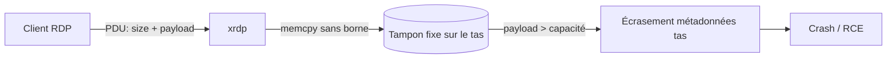
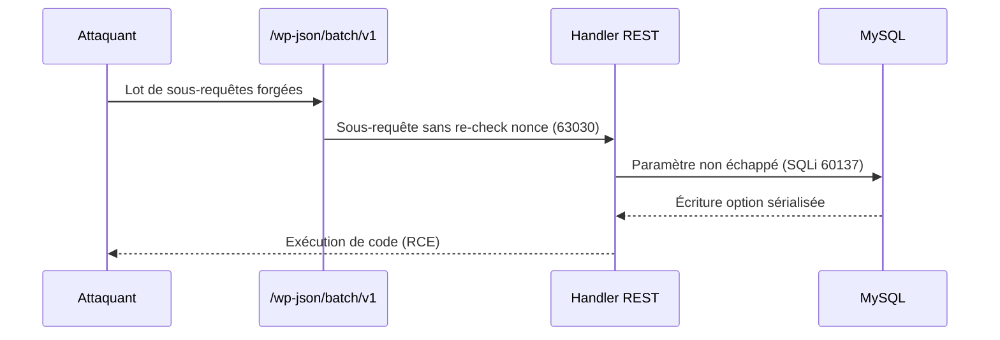

# Tech — Détail du jeudi 23 juillet 2026

## 1. xrdp CVE-2026-44178 & CVE-2026-35512 — deux débordements de tas dans les canaux virtuels

**Source :** neutrinolabs — Advisory GitHub (GHSA-7q2g-6fjr-h6pp) — https://github.com/neutrinolabs/xrdp/security/advisories/GHSA-7q2g-6fjr-h6pp
**Date :** 20 juillet 2026

### Contexte

`xrdp` est le serveur RDP open source qui expose un bureau Linux au protocole de Microsoft. Il écoute sur le port 3389 et sert de passerelle : il parle RDP côté client, puis relaie vers `sesman` et `xorgxrdp`. Beaucoup de VDI Linux, de bastions et de postes de dev distants reposent dessus.

Le 20 juillet, deux débordements de tas (`heap buffer overflow`) ont été publiés. `CVE-2026-44178` touche le mécanisme de *forwarding* des canaux virtuels. `CVE-2026-35512` vise l'implémentation EGFX (le canal graphique dynamique). La seconde est la plus grave : elle est exploitable **avant authentification**.

### Comment ça marche

Un canal virtuel RDP est un tuyau logique multiplexé dans la session : presse-papiers, audio, redirection de lecteur, graphismes EGFX. Le client envoie des **PDU** (unités de données protocolaires) portant un champ de taille et une charge utile. `xrdp` recopie cette charge dans un tampon interne avant de la transmettre au serveur de canal.

Le bug tient en une phrase : le tampon est **de taille fixe**, mais la taille annoncée par le client n'est **jamais bornée**. Un `memcpy` recopie donc plus d'octets que la capacité du tampon, écrasant les métadonnées du tas voisines. Résultat : corruption mémoire, crash (déni de service) ou, en enchaînant avec un contrôle d'allocation, exécution de code avec les privilèges du process `xrdp`.



Pour EGFX (`CVE-2026-35512`), la validation insuffisante d'un paramètre de taille contrôlé par le client provoque une **écriture hors limites** via des PDU forgées, dès la phase de négociation graphique — donc sans compte valide.

### En pratique — exemple de code

Le motif vulnérable et sa correction, en C simplifié :

```c
// AVANT — taille annoncée par le client, jamais vérifiée
void chan_forward(struct stream* s) {
    char buf[8192];                 // tampon fixe sur le tas
    uint32_t len = in_uint32(s);    // len vient du réseau, non borné
    memcpy(buf, s->p, len);         // débordement si len > 8192
}

// APRÈS — on refuse tout ce qui dépasse la capacité
void chan_forward(struct stream* s) {
    char buf[8192];
    uint32_t len = in_uint32(s);
    if (len > sizeof(buf)) return;  // borne stricte avant la copie
    memcpy(buf, s->p, len);
}
```

Côté exploitation opérationnelle, la priorité est de vérifier ta version et de patcher :

```bash
# Version installée (Debian/Ubuntu)
dpkg -l xrdp | grep xrdp
# Vulnérable si <= 0.10.6 — passe en 0.10.7+ dès que le paquet distro est dispo
sudo apt update && sudo apt install --only-upgrade xrdp
# En attendant : ne jamais exposer 3389 sur Internet, filtre au pare-feu / VPN
sudo ufw deny 3389/tcp
```

### Pourquoi ça compte pour toi

Si tu exposes un bureau Linux via `xrdp` — poste de dev distant, VDI, bastion — tu as une RCE pré-auth potentielle sur ton périmètre. Patche en 0.10.7+, et surtout ne laisse **jamais** 3389 ouvert sur Internet : place-le derrière un VPN ou un reverse-proxy authentifié. Le canal EGFX rend l'attaque exploitable sans le moindre identifiant.

### Points de vigilance

Les distributions retardent parfois le paquet corrigé. Vérifie le tracker Debian/Ubuntu, ou compile depuis les tags `v0.10.7`. Coupe EGFX si tu n'en as pas besoin.

---

## 2. wp2shell confirmé exploité (CISA KEV) — la moitié SQLi CVE-2026-60137 de la chaîne

**Source :** Rapid7 — Emergent Threat Response wp2shell — https://www.rapid7.com/blog/post/etr-cve-2026-63030-wp2shell-a-critical-remote-code-execution-vulnerability-in-wordpress-core/
**Date :** 21 juillet 2026 (ajout au CISA KEV)

### Contexte

La RCE pré-auth `CVE-2026-63030` du cœur de WordPress était sortie le 19 juillet. Le 21, la CISA a ajouté **deux** CVE au KEV : `CVE-2026-63030` **et** `CVE-2026-60137`. C'est le signal qu'une exploitation active est confirmée, et ça révèle l'autre moitié de la chaîne — l'injection SQL — qu'on n'avait pas détaillée.

`CVE-2026-60137` est une injection SQL touchant WordPress 6.8+. `CVE-2026-63030` est le défaut logique du *batch processor* de l'API REST, exploitable sans authentification sur 6.9+. Chaînées, elles donnent une RCE non authentifiée sur une installation par défaut.

### Comment ça marche

L'endpoint `/wp-json/batch/v1/` a été conçu pour regrouper plusieurs sous-requêtes REST en un seul appel HTTP — utile pour un éditeur de blocs qui enregistre dix modifications d'un coup. Le défaut logique : une sous-requête peut être traitée dans un contexte où la validation de nonce/permission du lot **n'est pas ré-appliquée** à chaque item. L'attaquant glisse alors une sous-requête qui atteint un chemin normalement protégé.

C'est là qu'intervient la SQLi (`CVE-2026-60137`) : un paramètre mal échappé dans ce chemin permet d'injecter du SQL, donc de lire ou d'écrire en base — jusqu'à planter une option sérialisée qui déclenche l'exécution de code.



### En pratique — exemple de code

Pas de payload d'exploitation ici — seulement la **défense**. Réduis la surface en coupant l'API batch si tu ne t'en sers pas, et vérifie ta version :

```php
<?php
// functions.php — désactive l'endpoint batch de l'API REST si inutile
add_filter( 'rest_endpoints', function ( $endpoints ) {
    unset( $endpoints['/batch/v1'] );   // retire /wp-json/batch/v1
    return $endpoints;
} );
```

```bash
# Vérifie la version WordPress (vulnérable : 6.9+ pour la RCE, 6.8+ pour la SQLi)
wp core version --allow-root
# Mets à jour vers la build corrigée, puis relance un scan
wp core update --allow-root
```

Ajoute une règle WAF bloquant les `POST` non authentifiés vers `/wp-json/batch/v1/` en attendant le patch.

### Pourquoi ça compte pour toi

Si tu héberges WordPress — ton blog, ou des sites clients que tu maintiens — c'est une RCE non authentifiée **activement exploitée** sur des installations par défaut. Patche immédiatement, coupe l'endpoint `batch/v1` si tu ne l'utilises pas, et pose une règle WAF. Le passage au KEV signifie que les scans de masse ont déjà commencé.

### Limites

L'API batch sert au bloc-éditeur Gutenberg ; la désactiver peut casser certains flux d'admin. Teste avant de couper en prod.
