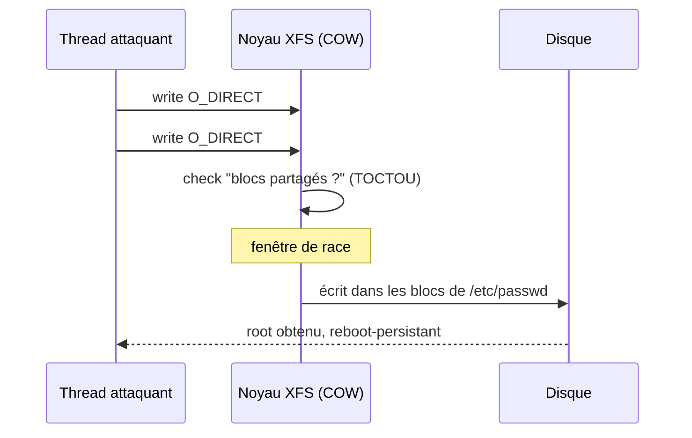

# Tech — Détail du vendredi 24 juillet 2026

## 1. RefluXFS (CVE-2026-64600) — root local via une race copy-on-write dans XFS

**Source :** Qualys Threat Research Unit — https://blog.qualys.com/vulnerabilities-threat-research/2026/07/22/refluxfs-a-linux-kernel-local-privilege-escalation-to-root-in-xfs-cve-2026-64600
**Date :** 22 juillet 2026

### Contexte

XFS est le système de fichiers par défaut sur RHEL et beaucoup de distros serveur. Depuis le noyau **4.11 (avril 2017)**, il supporte le *reflink* : deux fichiers peuvent partager les mêmes blocs disque tant que personne n'écrit, chaque écriture déclenchant un **copy-on-write (COW)**. Qualys a trouvé que ce chemin COW contient une *race condition* exploitable localement. L'impact est massif — l'équipe estime **16,4 millions de systèmes** vulnérables, souvent en configuration par défaut, sans qu'aucune capability, namespace ni matériel spécial ne soit requis.

### Comment ça marche

Le bug se déclenche quand **deux écritures `O_DIRECT` concurrentes** ciblent le même fichier reflinké. `O_DIRECT` contourne le cache de pages et écrit « au plus près » du disque. Le noyau doit alors : (1) constater que les blocs sont partagés, (2) allouer de nouveaux blocs, (3) recopier, (4) rediriger le fichier. Entre l'étape de vérification et l'écriture réelle, une seconde écriture se glisse — un classique **TOCTOU** (time-of-check to time-of-use). Le résultat : l'attaquant fait écrire le noyau **dans des blocs qu'il ne devrait pas posséder**, écrasant un fichier root.



Le PoC vise chirurgicalement `/etc/passwd` ou un binaire **SUID-root** : il modifie le contenu mais laisse propriétaire, permissions, timestamps et bit setuid **intacts**. Un binaire setuid modifié continue donc de tourner en root, et la modification **survit au reboot**.

### En pratique — détecter et corriger

Il n'y a pas d'exploit à écrire ici — le geste est de vérifier ton exposition puis de patcher.

```bash
# 1. Le volume utilise-t-il XFS avec reflink activé (condition nécessaire) ?
xfs_info / | grep -i reflink        # reflink=1 => concerné

# 2. Version du noyau en cours d'exécution (>= 4.11 = potentiellement vulnérable)
uname -r

# 3. Après mise à jour vendeur : IMPÉRATIF de rebooter sur le noyau patché
sudo dnf update kernel && sudo reboot
```

### Pourquoi ça compte pour toi

Tes serveurs PostgreSQL, tes runners CI et tes hôtes de conteneurs tournent presque tous sur XFS + reflink par défaut. Un utilisateur local non privilégié — ou un process compromis dans un conteneur mal isolé — passe root et casse la frontière hôte. Le correctif a été mergé le 16 juillet : applique le noyau vendeur **et redémarre**, sinon l'ancien noyau vulnérable reste chargé. Priorise les hôtes multi-tenant et les bastions.

### Limites

Il faut un accès local (pas d'exploitation distante directe) et un répertoire inscriptible. Ça reste critique en post-exploitation et en évasion de conteneur.

---

## 2. ServiceNow (CVE-2026-6875) — évasion de sandbox de script → RCE pré-auth exploitée

**Source :** Help Net Security — https://www.helpnetsecurity.com/2026/07/20/servicenow-cve-2026-6875-exploited/
**Date :** 20 juillet 2026 (divulgation 13 juillet, PoC Searchlight Cyber)

### Contexte

ServiceNow exécute du JavaScript côté serveur (les *business rules*, scripts d'automatisation) dans un **bac à sable** censé empêcher un script d'atteindre le système hôte. CVE-2026-6875 casse cette garantie : un attaquant **non authentifié** s'échappe du sandbox et exécute du code arbitraire sur l'instance. Découverte par Searchlight Cyber, signalée en avril, corrigée sur le cloud sous 24 h — mais les instances self-hosted traînent, et l'exploitation active a démarré ce week-end.

### Comment ça marche

Le sandbox restreint les API accessibles au script. La faille détourne **`gs.include()`**, la fonction qui charge une bibliothèque serveur. En ciblant une librairie précise, on force le **code d'extension de classe interne de ServiceNow** à appeler le **constructeur `Function`** sur une chaîne contrôlée par l'attaquant. Or `new Function(code)` compile et exécute ce code **hors du sandbox**, avec les privilèges du moteur. À partir de là : lecture/écriture de toutes les tables, création de comptes admin, et commandes vers les **MID Servers** (les proxies qui atteignent le réseau interne) — soit une compromission complète.

```javascript
// Schéma de l'évasion (illustratif — NE PAS utiliser)
// gs.include() atteint la logique d'extension de classe interne...
gs.include("VulnerableLibrary");
// ...qui finit par exécuter:  new Function(attackerControlledString)()
// => le code s'exécute HORS du sandbox, avec les droits du moteur ServiceNow
```

### En pratique — vérifier ton exposition

Le seul bon réflexe est de confirmer la version corrigée et de surveiller le sink exploité.

```bash
# Les attaquants frappent l'endpoint /assessment_thanks.do (sink documenté par le PoC)
# Chercher ce motif dans les logs d'accès de l'instance self-hosted :
grep "assessment_thanks.do" /var/log/servicenow/access.log | grep -iE "POST|Function"
# Puis appliquer le patch vendeur et rotationner les credentials des MID Servers.
```

### Pourquoi ça compte pour toi

Si tu exposes une instance ServiceNow self-hosted, tu es en fenêtre d'exploitation active **maintenant**. Une RCE pré-auth sur un outil qui pilote tes MID Servers, c'est un pivot direct vers ton réseau interne. Applique le correctif de juin, tourne les secrets des MID Servers, et traque `/assessment_thanks.do` dans tes logs. Les instances cloud ServiceNow sont déjà mitigées ; le risque est concentré sur le self-hosted.

### Points de vigilance

Les attaquants observés atteignent le code par une *chaîne de gadgets différente* de celle du PoC public : un WAF calé sur la seule signature Searchlight ne suffit pas. Le patch reste la vraie réponse.
