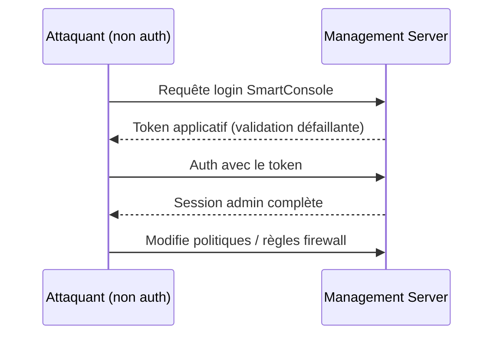
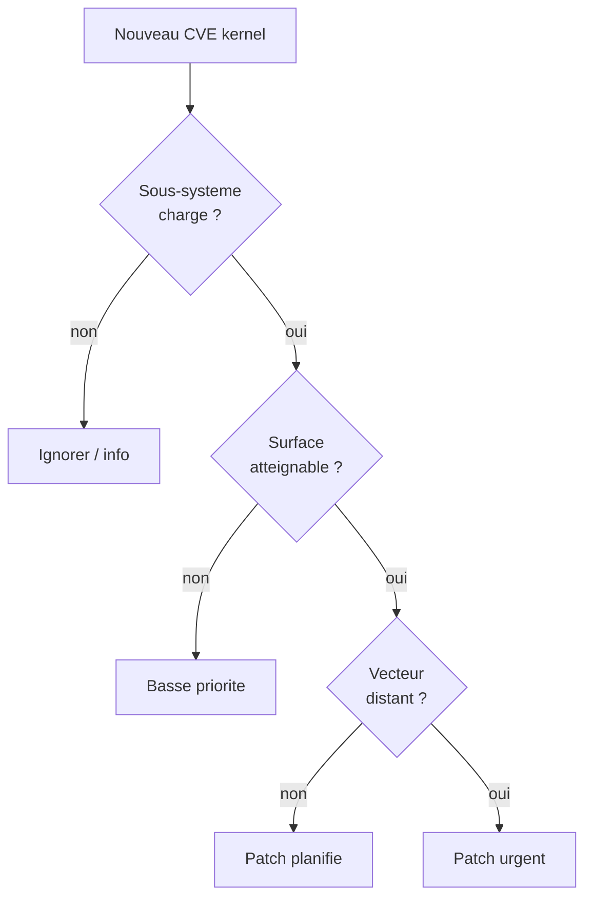

# Tech — Détail du samedi 25 juillet 2026

## 1. Check Point SmartConsole CVE-2026-16232 — un token volé, et l'attaquant est admin du firewall

**Source :** Rapid7 — https://www.rapid7.com/blog/post/etr-cve-2026-16232-critical-check-point-smartconsole-authentication-bypass-exploited-in-the-wild/
**Date :** 23 juillet 2026

### Contexte

**SmartConsole** est la console d'administration des firewalls Check Point : c'est de là qu'on édite les politiques de sécurité, les règles de filtrage et la configuration du **Management Server**. Compromettre cette console, c'est compromettre le firewall lui-même. Check Point a divulgué le 23 juillet **CVE-2026-16232**, un bypass d'authentification (CWE-287, *improper authentication*) noté **CVSS 9.1** (9.3 selon certaines sources), **déjà exploité** contre un petit nombre d'organisations. La faille a été trouvée lors d'une revue interne, mais l'exploitation réelle est confirmée.

### Comment ça marche

Le login SmartConsole s'appuie sur un **token applicatif**. La faille : ce token est **mal validé** pendant le processus de connexion. Un attaquant distant non authentifié, ayant un accès réseau à l'IP du Management Server, peut obtenir un token de login valide et **s'authentifier avec les privilèges administrateur complets** — sans jamais fournir d'identifiants. À partir de là, il modifie les règles, ouvre des accès, désactive des protections : porte grande ouverte au mouvement latéral et à la persistance.

La condition d'exploitation est le point clé de ta défense : il faut un **accès réseau au Management Server** dans un environnement qui **ne restreint pas les *Trusted Clients***. Autrement dit, les cibles sont les déploiements dont l'interface de management est exposée directement à Internet, sans liste blanche d'IP.



### En pratique — durcissement

Il n'y a pas de « code » à exécuter : la réponse est le patch **plus** la restriction des clients de confiance. Le principe côté management :

```bash
# 1. Appliquer le hotfix Check Point (voir sk185169) sur R81.10/R81.20/R82/R82.10

# 2. Ne JAMAIS exposer l'IP du Management Server à Internet.
#    Restreindre les Trusted Clients à un allow-list d'IP d'administration.
#    (exemple de logique de filtrage en amont, pare-feu périmétrique)
iptables -A INPUT -p tcp --dport 19009 -s 10.0.10.0/24 -j ACCEPT   # bastion admin
iptables -A INPUT -p tcp --dport 19009 -j DROP                     # tout le reste
```

Vérifie ensuite les logs d'authentification du management pour toute session admin inattendue depuis une IP externe : l'exploitation ne laisse pas d'erreur de mot de passe, seulement une session qui n'aurait jamais dû exister.

### Pourquoi ça compte pour toi

Même si tu ne gères pas le firewall, tu dépends de lui. Une console de management compromise, c'est ta segmentation réseau qui saute. La leçon transposable : **une interface d'administration ne s'expose jamais à Internet**, et un token d'auth doit être validé côté serveur à chaque étape. Applique la même règle à tes propres back-offices, panels et endpoints d'admin.

---

## 2. Linux — ~440 CVE kernel publiées en 24 h : trier plutôt que paniquer

**Source :** Cyber Security News — https://cybersecuritynews.com/linux-patches-400-kernel-vulnerabilities/
**Date :** 19-20 juillet 2026

### Contexte

Les 19 et 20 juillet, l'équipe kernel Linux a diffusé via `linux-cve-announce` une vague de **~440 avis CVE en moins de 24 h**, couvrant réseau, Bluetooth, stockage, mémoire, virtualisation, graphismes, drivers… Ce volume impressionne, mais reflète surtout le fonctionnement du kernel depuis qu'il est **CNA** (autorité de numérotation CVE) : il assigne un CVE à **tout** correctif de bug potentiellement lié à la sécurité, avec une aide croissante d'outils de détection automatisés pour classer les commits.

### Comment ça marche

La clé pour un ops : **un CVE kernel ≠ une faille exploitable à distance**. Beaucoup sont des défauts de stabilité ou de correction qui exigent des conditions précises — matériel spécifique, utilisateur local privilégié, module chargé, sous-système réellement atteignable. Dans le lot du 19-20 juillet, on trouve par exemple un *use-after-free* dans le driver réseau Qualcomm RMNET (**CVE-2026-64188**), un UAF dans le driver mlx5e (**CVE-2026-64122**), une écriture *out-of-bounds* dans `statmount`, et une faille TCP permettant la prédiction du numéro de séquence initial (ISN).

Ta priorisation se fait en trois questions : le sous-système est-il **compilé et chargé** chez toi ? La surface est-elle **atteignable** (réseau exposé vs driver Wi-Fi absent d'un serveur) ? Le vecteur est-il **local ou distant** ? Un UAF dans un driver Bluetooth ne concerne pas ton serveur headless ; une faille TCP, si.



### En pratique — trier et corriger

Reste sur une politique de mises à jour régulières plutôt que de courir après chaque CVE :

```bash
# Ta version de kernel et les modules réellement chargés
uname -r
lsmod | grep -E 'rmnet|mlx5|bluetooth'   # présent ? sinon le CVE associé ne te concerne pas

# Debian/Ubuntu : appliquer les correctifs kernel de sécurité
sudo apt update && sudo apt upgrade -y
# Idéal : livepatch pour éviter le reboot sur les serveurs critiques
sudo pro enable livepatch   # Ubuntu Pro
```

Automatise le tout avec `unattended-upgrades` restreint aux dépôts de sécurité, et planifie les reboots kernel.

### Pourquoi ça compte pour toi

Tu administres des serveurs Linux (Postgres, .NET, Symfony). Face à un flot de 440 CVE, la panique fait perdre du temps : la bonne réflexe est un **inventaire** (versions, modules chargés, surfaces exposées) plus une **cadence de patch** régulière. Concentre l'urgence sur le distant-non-authentifié atteignable chez toi ; le reste suit le cycle normal. Livepatch t'évite les reboots sur les machines sensibles.
