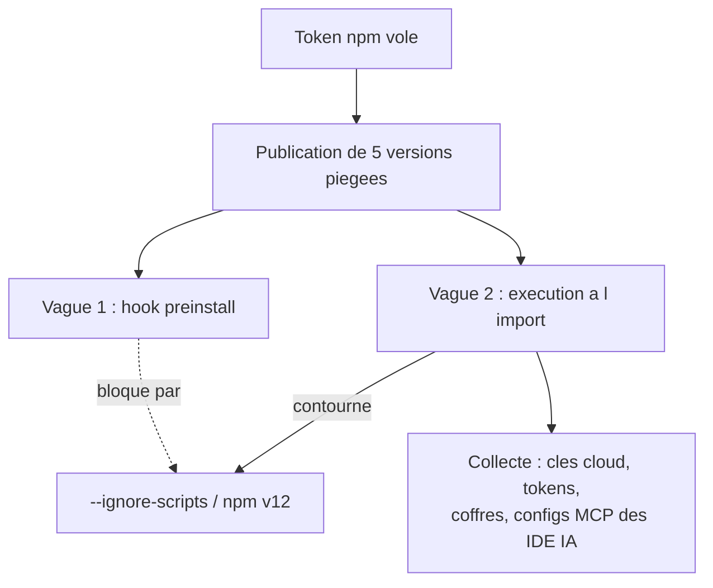

# Tech — Détail du dimanche 26 juillet 2026

## 1. jscrambler compromis — IronWorm, l'infostealer Rust qui vise les configs de tes assistants IA

**Source :** The Hacker News — https://thehackernews.com/2026/07/compromised-jscrambler-8140-npm-release.html
**Date :** 11 juillet 2026 (analyse consolidée le 22 juillet)

### Contexte

Le 11 juillet, un attaquant disposant d'identifiants de publication npm volés a poussé cinq versions malveillantes de `jscrambler` — 8.14.0, 8.16.0, 8.17.0, 8.18.0, 8.20.0 — ainsi que des versions piégées de ses plugins webpack, gulp, grunt et metro. jscrambler est un outil d'obfuscation JavaScript, donc typiquement présent dans une chaîne de build front. L'ironie est complète : un éditeur de sécurité devient le vecteur.

JFrog identifie la charge comme **IronWorm**, un infostealer écrit en Rust, apparenté à la lignée Shai-Hulud. La même famille avait déjà été vue début juin, planquée dans 36 paquets npm derrière un rootkit noyau eBPF. La version de juillet est une évolution : recompilée pour Linux, Windows et macOS, et capable d'automatiser sa propre propagation npm.

### Comment ça marche

La chaîne se lit en quatre temps, et le troisième est celui qui doit t'intéresser.

**Un — l'accès initial.** Pas de faille technique : un token de publication npm volé. Aucun contrôle côté registre ne distingue un mainteneur légitime d'un attaquant qui détient sa clé.

**Deux — la première vague.** Les versions initiales embarquent un hook `preinstall` qui dépose et lance un binaire natif. C'est le vecteur classique, celui que `--ignore-scripts` bloque, celui que npm v12 a désactivé par défaut le 8 juillet.

**Trois — le pivot.** L'attaquant retire ensuite le hook d'installation. Les versions suivantes déclenchent la charge **au moment de l'`import` du module ou de l'exécution de la CLI**. C'est le point pédagogique : `--ignore-scripts` n'empêche pas du code d'être exécuté quand tu l'appelles volontairement. Un paquet dont c'est le métier d'être exécuté au build n'a besoin d'aucun hook pour agir. Le durcissement d'npm v12 réduit la surface, il ne la supprime pas.

**Quatre — la collecte.** IronWorm ratisse bien plus large que les clés cloud habituelles : identifiants AWS, Azure et GCP ; tokens npm et GitHub ; sessions navigateur ; portefeuilles crypto ; coffres Bitwarden et trousseaux du système d'exploitation. Et surtout les **fichiers de configuration des assistants de code** — Claude Desktop, Cursor, Windsurf, VS Code, Zed — qui contiennent aujourd'hui des clés d'API de modèles et des credentials de serveurs MCP. C'est une catégorie de secrets qui n'existait pas il y a deux ans et qui n'est presque jamais dans un inventaire.

La détection a été rapide — Socket, StepSecurity, SafeDep et JFrog en quelques minutes. jscrambler a déprécié les versions et publié une 8.22.0 propre le jour même. L'avis officiel compte 1 479 téléchargements avant retrait.



### En pratique — exemple de code

Vérifier si tu as ingéré une version piégée, puis verrouiller ce qui peut l'être.

```bash
# 1. Est-ce qu'une version compromise est resolue quelque part dans l'arbre ?
npm ls jscrambler --all 2>/dev/null | grep -E '8\.(14|16|17|18|20)\.0' && echo "EXPOSE"

# 2. Meme controle dans le lockfile, y compris en dependance transitive
grep -nE '"jscrambler".*"8\.(14|16|17|18|20)\.0"' package-lock.json

# 3. Remediation : version saine et reinstallation propre
npm i -D jscrambler@8.22.0
rm -rf node_modules && npm ci

# 4. Verrouiller les scripts d'installation par defaut (utile, pas suffisant)
npm config set ignore-scripts true
```

```json
// .npmrc du projet — n'accepte pas de version anterieure au correctif
{
  "overrides": {
    "jscrambler": ">=8.22.0"
  }
}
```

### Pourquoi ça compte pour toi

Ajoute les configs de tes assistants de code à ton inventaire de secrets, au même titre que `~/.aws/credentials`. Ces fichiers contiennent des clés de modèles et des credentials MCP, et ils sont désormais explicitement ciblés. Et retiens que `--ignore-scripts` ne couvre que l'installation : un paquet de build s'exécute de toute façon. La vraie ligne de défense reste la rotation rapide et des tokens à portée réduite.

---

## 2. Provenance Sigstore et SLSA — pourquoi une attestation valide n'a pas arrêté le backdoor AsyncAPI

**Source :** GitGuardian Blog — https://blog.gitguardian.com/shai-hulud-npm-pypi-supply-chain-attacks/
**Date :** 22 juillet 2026

### Contexte

Depuis deux ans, la réponse standard aux attaques de supply chain est la **provenance** : signer les artefacts et attester de leur origine avec Sigstore et le framework SLSA. L'idée est saine — savoir quel pipeline, quel commit et quelle identité ont produit un paquet.

Le compromis d'AsyncAPI du 14 juillet met le doigt sur la limite exacte de cette promesse. Quatre paquets — `@asyncapi/generator`, `generator-helpers`, `generator-components` et `specs`, plus de 2,25 millions de téléchargements hebdomadaires cumulés — ont été publiés backdoorés **avec une provenance Sigstore et SLSA parfaitement valide**. Rien n'a été forgé. Chainguard l'a souligné sans détour.

### Comment ça marche

Il faut décomposer ce que la provenance certifie réellement.

**Ce qu'une attestation SLSA affirme.** Un artefact `X` a été produit par le workflow `W`, dans le dépôt `R`, à partir du commit `C`, par une identité CI `I`. La signature Sigstore lie ces faits à une identité OIDC éphémère, enregistrée dans un log de transparence. C'est vérifiable et infalsifiable.

**Ce qu'elle n'affirme pas.** Que le commit `C` contenait du code sain. Que l'identité `I` était contrôlée par un mainteneur légitime au moment du build. La provenance est une déclaration sur le **processus**, jamais sur le **contenu**.

**Le chemin de l'attaque.** L'attaquant ouvre 37 pull requests sur le dépôt du générateur. La quasi-totalité est du bruit — une fausse page de dons. L'une exploite un workflow `pull_request_target`, qui a la particularité de s'exécuter avec les secrets du dépôt **tout en checkoutant le code de la PR**. C'est le « pwn request » : du code non fiable tourne avec des droits fiables. L'attaquant vole le token à privilèges élevés `asyncapi-bot`.

Avec ce token, il pousse des commits malveillants dans deux dépôts. Le workflow de release maison fait ensuite son travail normalement et publie via l'intégration OIDC trusted publisher d'npm. **Le pipeline signe honnêtement du malware.** Les attestations sont exactes : elles pointent vers le bon dépôt, le bon workflow, le bon commit — un commit que l'attaquant contrôlait.

Le workflow vulnérable était connu. Un contributeur l'avait signalé et proposé un correctif **58 jours plus tôt**, jamais mergé. C'est la même classe de faille que l'incident `tj-actions/changed-files` de mars 2025.

Sur la charge elle-même : elle se déclenche au `require()`, tire un RAT multi-étages depuis IPFS, persiste via un service systemd, et tient des canaux de commande sur HTTP, Nostr, un smart contract Ethereum et un maillage pair-à-pair. Les versions sont restées en ligne environ quatre heures, entre 07:10 et 11:18 UTC. Les lockfiles générés dans cette fenêtre peuvent encore résoudre vers elles.

### En pratique — exemple de code

Vérifier une provenance, puis fermer le trou côté CI.

```bash
# La provenance se verifie — mais elle ne dit que "d'ou", pas "sain"
npm audit signatures
npm view @asyncapi/generator --json | jq '.dist.attestations'

# Ce que tu dois faire en plus : borner la fenetre temporelle
npm i --before 2026-07-14   # resout comme avant la publication piegee
```

```yaml
# .github/workflows/pr.yml — le durcissement qui manquait a AsyncAPI
name: PR checks
on:
  pull_request_target:      # a n'utiliser que si tu as VRAIMENT besoin des secrets
    types: [opened, synchronize]

permissions:
  contents: read            # jamais write sur un pull_request_target

jobs:
  build:
    runs-on: ubuntu-latest
    # Barriere humaine : le job attend une approbation avant de tourner
    environment: pr-review
    steps:
      # NE JAMAIS checkouter le HEAD de la PR ici : ce serait du code non fiable
      # execute avec les secrets du depot — c'est exactement le "pwn request"
      - uses: actions/checkout@v7        # defauts plus surs depuis juin 2026
        with:
          persist-credentials: false     # pas de token laisse dans .git/config
```

### Pourquoi ça compte pour toi

La provenance reste utile, mais ne la traite pas comme un feu vert. Sur tes propres dépôts, audite chaque `pull_request_target` : c'est la faille qui a coûté un token à AsyncAPI, et elle a survécu 58 jours après signalement. Passe `actions/checkout` en v7, mets `permissions: contents: read` par défaut, et refuse tout checkout du HEAD d'une PR dans un workflow qui voit les secrets.

### Limites

Épingler par date (`--before`) protège d'une fenêtre connue, pas d'un compromis non encore découvert. C'est un outil de réponse à incident, pas une politique permanente.
