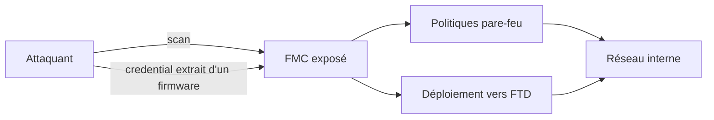
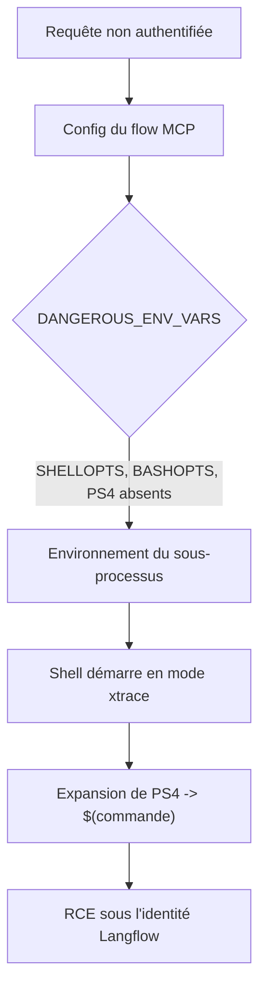
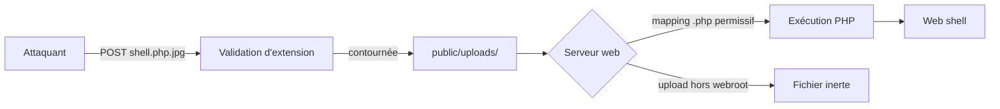

# Tech — Détail du samedi 1er août 2026

## 1. CVE-2026-20316 — un mot de passe codé en dur dans Cisco Secure Firewall Management Center

**Source :** CVE Brief — https://cvebrief.com/
**Date :** ajoutée au CISA KEV le 29 juillet 2026

### Contexte

Le Firewall Management Center est la console centrale de Cisco : c'est depuis là qu'on écrit les politiques, qu'on pousse les règles et qu'on collecte les événements de tous les pare-feux d'un parc. Un attaquant qui contrôle le FMC ne contourne pas ton pare-feu, il **le reconfigure**.

CVE-2026-20316 est un identifiant statique présent dans le produit lui-même — CWE-798, « use of hard-coded credentials ». Le vecteur est réseau, sans privilège préalable et sans interaction utilisateur, pour un CVSS de 9,5. La CISA l'a inscrite au catalogue des vulnérabilités activement exploitées le 29 juillet, ce qui signifie qu'elle est déjà utilisée dans la nature.

### Comment ça marche

Un mot de passe codé en dur, c'est une valeur d'authentification écrite dans le binaire, un script d'installation ou une base embarquée, identique sur **toutes** les installations. Sa nature en fait un cas particulièrement mauvais.

Il ne peut pas être changé par l'administrateur, puisqu'il ne figure dans aucune interface de configuration. Il n'apparaît dans aucun audit de comptes, puisqu'il n'est pas un compte au sens du produit. Et il ne se révoque pas : la seule remédiation est un correctif éditeur.

Surtout, il est **découvrable une fois pour toutes**. Un attaquant extrait le firmware d'un exemplaire, retrouve la chaîne, et l'utilise ensuite sur chaque instance exposée qu'il découvre par balayage. Le coût de l'attaque n'augmente pas avec le nombre de cibles — c'est ce qui explique la vitesse de propagation typique de ces failles.



Le chemin d'impact ne s'arrête pas au FMC. Il pilote les appliances Firepower Threat Defense : altérer une politique au niveau du management se propage à l'ensemble du parc au prochain déploiement.

### En pratique — exemple de code

```bash
# 1. Inventorier les FMC joignables et leur version, depuis ton réseau d'admin.
nmap -p 443 --script ssl-cert 10.20.0.0/24 -oG - | grep -i "firepower\|fmc"

# 2. Détection : chercher des authentifications réussies hors plages d'admin.
#    Le compte codé en dur n'apparaît pas dans la liste des utilisateurs locaux.
grep -E "Login Success" /var/log/fmc/audit.log \
  | awk '{print $1, $NF}' \
  | grep -vFf /etc/allowed-admin-subnets.txt

# 3. Vérifier qu'aucun FMC ne répond depuis Internet.
#    Un plan de management ne doit jamais être exposé publiquement.
curl -s -o /dev/null -w "%{http_code}\n" --max-time 5 https://fmc.exemple.com/
```

### Pourquoi ça compte pour toi

Ton plan de management est ta surface la plus critique et souvent la moins surveillée. Applique le correctif Cisco, puis vérifie une règle simple : aucune console d'administration — FMC, vCenter, Langflow, ton runner CI — ne doit être joignable depuis Internet. Ensuite, relis tes journaux d'authentification sur les trente derniers jours, pas seulement depuis le patch.

### Points de vigilance

Patcher ne suffit pas si l'exploitation a déjà eu lieu. Compare tes politiques déployées à ta référence en gestion de configuration, et fais tourner les secrets que le FMC détenait.

---

## 2. CVE-2026-12940 — IBM Langflow : injection de variables d'environnement dans le lanceur MCP stdio

**Source :** TheHackerWire — https://www.thehackerwire.com/ibm-langflow-oss-unauthenticated-rce-via-environment-variable-injection-cve-2026-12940/
**Date :** 30 juillet 2026

### Contexte

Langflow est un atelier visuel de construction de workflows LLM. Une de ses briques permet de connecter un **serveur MCP en transport stdio** : Langflow lance un sous-processus et dialogue avec lui par entrée et sortie standard. Lancer un sous-processus implique de lui construire un environnement, et cet environnement est en partie contrôlé par la configuration du flow.

Les développeurs avaient anticipé le risque : `src/lfx/src/lfx/base/mcp/util.py` contient une blocklist `DANGEROUS_ENV_VARS` censée filtrer les variables dangereuses. Elle était incomplète. `SHELLOPTS`, `BASHOPTS` et `PS4` manquaient. CVSS 9,8, sans authentification, versions 1.0.0 à 1.10.1.

### Comment ça marche

Le point clé est que **certaines variables d'environnement font exécuter du code par le shell**, avant même que ta commande démarre.

`PS4` définit le préfixe affiché par Bash quand le mode trace est actif. Ce préfixe est une chaîne soumise à **expansion**, donc une substitution de commande `$(...)` qu'elle contient est **évaluée**. Normalement le mode trace n'est pas actif — c'est là que `SHELLOPTS` intervient : cette variable, si elle est exportée dans l'environnement, active des options de shell au démarrage. Poser `SHELLOPTS=xtrace` active la trace. `BASHOPTS` joue le même rôle pour un autre jeu d'options.

L'enchaînement se lit en trois marches.

1. L'attaquant fait passer `SHELLOPTS=xtrace` et `PS4='$(commande)'` dans l'environnement du lanceur MCP.
2. Langflow lance le sous-processus MCP via un shell. Le shell démarre en mode trace parce que `SHELLOPTS` le lui dit.
3. À la première ligne tracée, le shell développe `PS4` et exécute la substitution de commande. Le code de l'attaquant tourne, avec les droits du service Langflow.



La leçon dépasse Langflow : une **blocklist de variables d'environnement est structurellement fragile**. Il en existe des dizaines qui influencent le chargement d'un processus — `LD_PRELOAD`, `LD_LIBRARY_PATH`, `PYTHONSTARTUP`, `BASH_ENV`, `IFS`, et ces trois-là. Il faut une allowlist.

### En pratique — exemple de code

```python
# Avant — blocklist : on énumère l'interdit, on en oublie toujours.
DANGEROUS_ENV_VARS = {"LD_PRELOAD", "LD_LIBRARY_PATH", "PYTHONPATH"}
env = {k: v for k, v in user_env.items() if k not in DANGEROUS_ENV_VARS}
subprocess.Popen(cmd, env=env, shell=True)   # SHELLOPTS/PS4 passent

# Après — allowlist + pas de shell : on énumère l'autorisé.
ALLOWED_ENV_VARS = {"MCP_SERVER_TOKEN", "MCP_SERVER_URL", "HOME", "PATH"}
env = {k: v for k, v in user_env.items() if k in ALLOWED_ENV_VARS}
subprocess.Popen(
    cmd if isinstance(cmd, list) else shlex.split(cmd),  # argv, jamais une chaîne
    env=env,
    shell=False,       # supprime l'interpréteur, donc PS4 et SHELLOPTS
)
```

### Pourquoi ça compte pour toi

Tu lances probablement des sous-processus depuis du code .NET ou PHP : hooks, jobs, serveurs MCP locaux. Applique les deux mêmes règles. Construis l'environnement en allowlist, et lance en `argv` sans passer par un shell — `ProcessStartInfo.ArgumentList` côté .NET, jamais une chaîne concaténée. C'est ce qui neutralise toute cette famille d'attaques d'un coup.

### Pour aller plus loin

Langflow cumule les avis critiques : CVE-2026-12946 et CVE-2026-13435 (CVSS 9,9), injection de code authentifiée et évasion du bac à sable `PythonREPL`. Si tu exposes une instance, mets-la derrière une authentification réseau et coupe l'accès Internet direct.

---

## 3. CVE-2026-63223 — CodeIgniter4 : validation d'extension défaillante à l'upload

**Source :** CVE Brief — https://cvebrief.com/
**Date :** 31 juillet 2026

### Contexte

CodeIgniter4 est un framework PHP largement déployé, souvent sur des applications métier internes que personne ne suit de près. La faille touche la validation des extensions de fichier à l'upload, dans toutes les versions antérieures à **4.7.4**. Réseau, sans privilège, sans interaction utilisateur : CVSS 9,8, exécution de code distante.

Le motif est ancien mais reste efficace, parce que le mécanisme qui le rend exploitable ne dépend pas seulement du framework : il dépend de l'accord entre ta validation applicative et la façon dont ton serveur web décide qu'un fichier est du PHP.

### Comment ça marche

Trois maillons doivent s'aligner pour qu'un upload devienne une RCE.

**Maillon 1 — la validation partielle.** Le code vérifie l'extension du fichier envoyé. Si ce contrôle regarde la première extension, ou une extension quelconque dans le nom, un fichier `facture.php.jpg` ou `facture.jpg.php` peut le franchir selon le sens de lecture.

**Maillon 2 — la destination servie.** Le fichier atterrit dans un répertoire accessible par HTTP, typiquement `public/uploads/`. Beaucoup d'applications y stockent les pièces jointes pour les servir directement.

**Maillon 3 — le mapping du serveur.** Apache avec `AddHandler` ou `mod_php` mal configuré, ou PHP-FPM avec un `SCRIPT_FILENAME` trop permissif, peuvent exécuter tout fichier **contenant** `.php`, pas seulement celui qui **se termine** par `.php`. C'est ce maillon qui transforme un fichier déposé en web shell.



Le correctif de CodeIgniter réparera le maillon 1. Mais les deux autres t'appartiennent, et casser un seul suffit à neutraliser la chaîne.

### En pratique — exemple de code

```php
// Avant — on fait confiance au nom fourni par le client.
$file = $this->request->getFile('document');
$name = $file->getName();                     // "facture.php.jpg"
if (!str_ends_with($name, '.jpg')) { return; }
$file->move(FCPATH . 'uploads');              // dans le webroot : dangereux

// Après — extension déduite du contenu, nom régénéré, hors webroot.
$file = $this->request->getFile('document');
$ext  = $file->guessExtension();              // depuis le type MIME réel
if (!in_array($ext, ['jpg', 'png', 'pdf'], true)) { return; }

$safeName = bin2hex(random_bytes(16)) . '.' . $ext;   // aucun nom client conservé
$file->move(WRITEPATH . 'uploads', $safeName);        // hors de la racine web
// Le fichier est ensuite servi par un contrôleur qui contrôle les droits.
```

```nginx
# Ceinture et bretelles côté serveur : rien ne s'exécute dans les uploads.
location ^~ /uploads/ {
    location ~ \.php$ { deny all; }
    default_type application/octet-stream;
    add_header X-Content-Type-Options nosniff;
}
```

### Pourquoi ça compte pour toi

Passe en 4.7.4 sur tes projets CodeIgniter. Puis applique la règle générale, valable en PHP comme en .NET : le **stockage des uploads ne doit jamais être servi directement**. Écris hors racine web, régénère le nom, déduis l'extension du contenu, et sers par un contrôleur qui applique tes droits.

### Limites

`guessExtension()` s'appuie sur le type MIME détecté, qui reste faillible sur des formats polyglottes. C'est une couche, pas une garantie — c'est la sortie du webroot qui fait le vrai travail.
